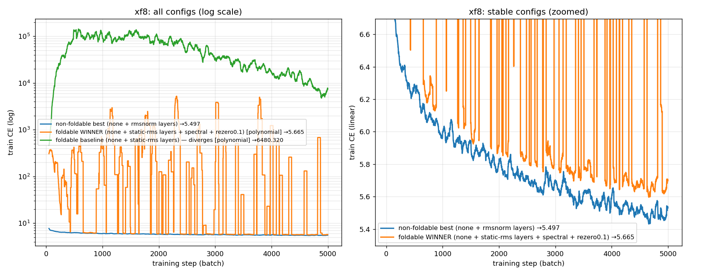

# tensor_language

Training tensor-network transformers of various sizes on language & toy languages.

Every architecture here stays a **tensor network** (polynomial / foldable) so it can be
contracted after training. The goal: build a clean ladder of models — from a 0-layer
bigram up to a 2-layer bilinear transformer — confirm that **adding components lowers
loss**, then find the datapoints each setting learns best.

## Architecture

```
tokens ─▶ Embed ─▶ [ bilinear-attn (+ bilinear-MLP) ] × n_layers ─▶ final_norm ─▶ Unembed
```

| Component | Form | Tensor-network status |
|---|---|---|
| Embed / Unembed | linear | ✅ |
| RoPE | fixed per-position rotation | ✅ |
| Bilinear attention | `(Q₁x·K₁x)(Q₂x·K₂x)/d_h²`, causal | ✅ degree-4 polynomial |
| BatchNorm on Q/K | per-channel affine at inference | ✅ folds into Q/K weights |
| Bilinear MLP | `D(Lx ⊙ Rx)` | ✅ degree-2 polynomial |
| Per-layer pre-norm (`--layer-norm`) | `rmsnorm` per block (depth stabilizer) | ❌ per-sample (use `static-rms` to fold) |
| ReZero scalar (`--rezero-init`) | learnable `α` in `x + α·branch(x)` | ✅ folds into `o`/`D` |
| `final_norm=layernorm` | `1/√var(x)` (per-sample) | ❌ does **not** fold |
| `final_norm=static-rms` | `/ running_rms` (fixed scalar) | ✅ folds into Unembed |
| `final_norm=none` | identity | ✅ |

`d_head` is fixed at 32, so `n_head = d_model // 32`.

## Sweep (`train_sweep.py`)

Variants (components added left→right — loss should fall monotonically):

| variant | layers | components |
|---|---|---|
| `embed_unembed` | 0 | Embed→norm→Unembed (**bigram** floor — predicts next token from current) |
| `attn1` / `attn2` | 1 / 2 | bilinear attention |
| `xf1` / `xf2` | 1 / 2 | bilinear attention + bilinear MLP |

Swept over `--widths` (d_model) and `--norms` (`layernorm,static-rms,none`).

```bash
python train_sweep.py --smoke                       # tiny wiring check, cached data, ~seconds
python train_sweep.py --data cached --steps 1500 --lr 3e-3 --no-compile   # overfit ordering demo
python train_sweep.py --steps 6000 --widths 128 --norms layernorm,static-rms,none   # real Pile sweep
python train_sweep.py --data pile --steps 6000 --top-tokens 10 --save-checkpoints    # + interp outputs
```

- `--layer-norm {none,rmsnorm,static-rms,layernorm}` — **per-layer pre-norm on every block**
  (depth stabilizer). Deep stacks (`attn4`/`xf4`) **diverge to NaN without it** even with a
  LayerNorm *final* — the degree-4 attention compounds across layers. `rmsnorm` (per-sample) is
  the effective fix; the **final** norm (`--norms`) remains the ablation. ⚠ per-layer `rmsnorm` is
  per-sample → not foldable on its own (use `static-rms` per-layer for a foldable stack).
- `--diagnostics` — logs per-layer activation RMS + per-matrix weight norms (Frobenius + top
  singular value) over training to `runs/<ts>_sweep/diag/<tag>.jsonl`, and prints a one-line
  "where did it blow up" summary. Localizes finite failures to a layer / weight.
- `--top-tokens N` logs, per config, the N `(seq, pos)` datapoints with the lowest next-token CE
  (what each setting learns best) into `runs/<ts>_sweep/sweep.jsonl`.
- `--save-checkpoints` writes per-config `state_dict`s (torch.compile-unwrapped) to
  `runs/<ts>_sweep/checkpoints/<variant>_d<width>_<norm>.pt` for later mech-interp.

- Optimizer defaults to **AdamW** (`--muon` opt-in; `muon` pkg not installed). Pure-AdamW
  needs a higher lr than the legacy scripts' `3e-4` (that was the AdamW *aux* rate while
  Muon drove attention at `0.02`). Use `--lr 1e-3`–`3e-3`.
- `--data cached` trains on the 500-seq Pile val tensor itself (wiring/overfit checks only).
  `--data pile` streams DSIR-filtered Pile (needs `datasets`+`transformers`+network).

## Status (2026-06-02)

Wiring **verified correct** on cached data, and the loss ordering is now **confirmed on real
streaming Pile** (every streamed batch is fresh → already a held-out/generalization measure;
eval is on the fixed `dsir_pile_val_ctx512.pt` tensor).

**A TN-pure (foldable) stack trains and is monotonic.** 6k-step sweep, `d=128`, `n_ctx=128`,
`lr=3e-3` (streaming Pile, eval on held-out cached val):

| final norm | foldable? | embed_unembed | attn1 | attn2 | xf1 | xf2 |
|---|---|---|---|---|---|---|
| `layernorm` (reference) | ❌ | 5.914 | 5.649 | 5.588 | 5.570 | **5.497** |
| `none` (purest TN) | ✅ | 6.034 | 5.838 | 5.782 | 5.758 | **5.694** |
| `static-rms` | ✅ | 5.915 | 5.673 | 5.639 | 5.666 | **5.873** ⚠ |
| `static-rms --rezero-init 0.25` | ✅ | — | — | — | — | **5.725** |

Reproduce: `python train_sweep.py --data pile --steps 6000 --widths 128 --n-ctx 128 --norms layernorm,static-rms,none`

### Resolved — the `static-rms` "instability" was a cached-overfit artifact
The earlier report (`static-rms` collapses to the uniform floor with attention) only happens
on the **cached-overfit** task. That task rewards *memorization*: driving loss → 0 needs extreme
per-token output confidence, which **only per-token LayerNorm** can supply — a foldable global
scalar divides every token by one value dominated by the few exploding tokens, washing the rest
to uniform logits. It is impossible to match LayerNorm there *by construction*, and irrelevant:
on fresh streaming data (no memorization) `static-rms` is monotonic and within **~0.07 CE** of
LayerNorm. **Don't judge foldable norms on the cached set — use streaming Pile.**

### Depth needs per-layer normalization — and that relocates the foldability problem
The above is 1–2 layers. Pushing to **4 layers** (`xf4`) exposed the real structural issue: at
`lr=3e-3`, `xf4` **diverges to NaN with no per-layer norm — even with a LayerNorm final**. The
fix is a **per-layer pre-norm** (`--layer-norm`) on every block. With per-layer `rmsnorm` the full
ladder is monotonic through 4 layers for *every* final norm (8k-step streaming Pile, d=128), and
**`none` final is best — no final norm is needed once per-layer normalization does the work**:

| final norm | embed | attn2 | xf2 | xf4 |
|---|---|---|---|---|
| `layernorm` | 5.903 | 5.776 | 5.554 | 5.487 |
| `none` | 6.010 | 5.737 | 5.566 | **5.480** |
| `static-rms` | 5.902 | 5.636 | 5.605 | 5.575 |

**A fully-foldable deep stack *does* train** — the per-layer × final norm grid at `xf4`:

| per-layer ↓ / final → | `static-rms` | `none` |
|---|---|---|
| `static-rms` (foldable) | 6.408 💥 | **5.616 ✅** |
| `rmsnorm` (per-sample) | 5.575 | 5.480 |

Per-layer `static-rms` + final `none` (both fold) is stable & monotonic-ish through 4 layers,
trailing per-sample `rmsnorm` by ~0.13. (💥 only when you *stack* two running-scalar norms.)

**Deep + foldable scales to 8 layers** (see `project_summary.md` §5.5). The plain foldable `xf8`
diverges (bilinear-MLP `L/R/D` weights blow to σ≈8; QK are a BatchNormed red herring), but it's
fixable with foldable knobs — **ReZero ≈0.1 (`--rezero-init 0.1`) + spectral norm
(`--spectral-norm`)**:

| `xf8` (5k steps, identical data) | foldable? | train CE |
|---|---|---|
| non-foldable best (`rmsnorm` layers) | ❌ | 5.497 |
| **foldable (static-rms + spectral + ReZero 0.1)** | ✅ | **5.665** (stable, ~0.17 back) |
| foldable baseline (static-rms only) | ✅ | 6480 💥 |



So a **fully-polynomial 8-layer stack trains** ~0.17 behind the non-foldable best (gap closing with
steps), though its loss curve is spikier — it sits closer to the stability edge.

### Next steps
1. ~~Fix `StaticRMSNorm`~~ / ~~Pile run~~ / ~~`most_learned_tokens`~~ / ~~checkpoints~~ /
   ~~per-layer norm~~ / ~~diagnostics~~ / ~~deep+foldable (spectral+ReZero)~~ — **done**.
2. Longer/wider run of the foldable `xf8` winner — how much of the ~0.17 gap closes?
3. Scale width (`256,512`) toward the d=512 reference val of 4.72.
4. Mech-interp pass using the saved checkpoints + `--top-tokens`.

## Provenance
Consolidated from `tensor-mars/workspaces/logan/`: self-contained bilinear+BatchNorm attention
(`train_bilinear_bn_nobias_ctx512_d512.py`, the only full-5B Pile run, val 4.72) + `BilinearMLP`
(`train_2layer_transformer.py`). `cached_tokens/dsir_pile_val_ctx512.pt` copied from there.
