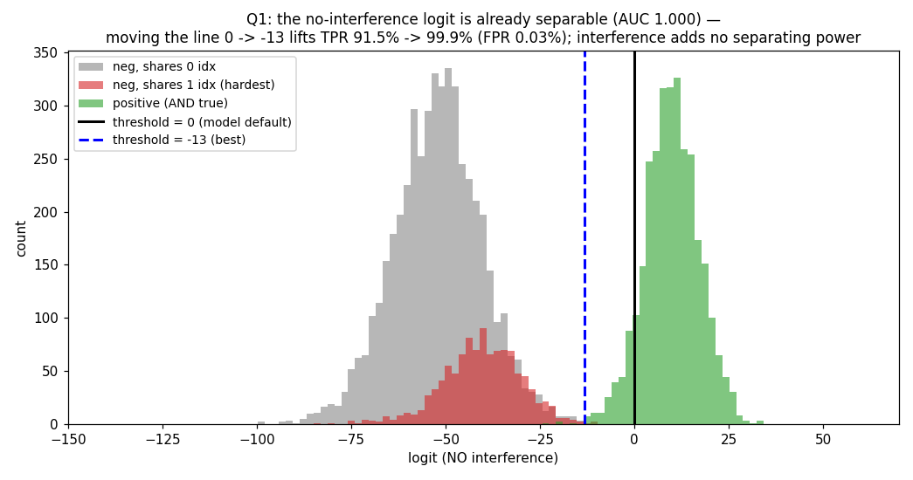
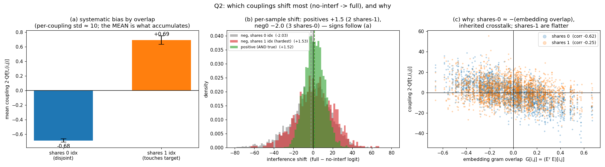
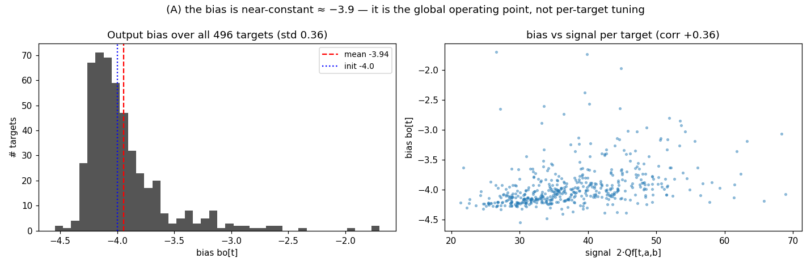

# Is the interference "help" real? + which couplings shift, and why

Two follow-ups to the interference ablations in [`factorize.md`](./factorize.md)
§3. Regenerate with `python couplings.py` (writes the two figures here and prints
the numbers below). Single-layer Universal-AND, seed 2.

Recall the puzzle: at the model's threshold (logit > 0), dropping interference
costs true positives (TPR 99.9% → 91.5%) while FPR stays 0%. That looked like
"interference mildly helps positives." Q1 shows that reading is wrong.

---

## Q1 — if we keep no interference but just move the decision line?

Sweep the threshold on the **no-interference** logit instead of fixing it at 0:

| logit used | threshold | TPR | FPR |
|---|---|---|---|
| no interference | 0 (model default) | 91.5% | 0.00% |
| no interference | **−13.1 (best balanced)** | **99.9%** | 0.03% |
| no interference | −9.9 (first FPR=0) | 99.3% | 0.00% |
| full interference | 0 | 99.9% | 0.00% |

**The no-interference logit is already (essentially) perfectly separable — AUC ≈
1.000.** The positives sit in a tight bump around +10 and the hardest negatives
around −35, with a clean gap near −13. The only reason threshold-0 lost 8.4% of
positives is that **the bias `bo` is calibrated assuming interference is present**:
on a positive, interference adds a mean **+1.5** (see Q2), so removing it slides
the positive bump left, and its lower tail dips under the *fixed* zero line.

So **interference adds no discriminative power.** Moving the line from 0 to ≈ −13
(or, equivalently, adding ~+13 to every logit, i.e. shifting the bias) recovers
TPR 99.9% at FPR 0.03% — matching the full model. The earlier "interference helps
positives" was a *calibration/operating-point* effect, not extra signal. This is
the per-decision counterpart of §4's geometric finding (signal lives outside the
interference subspace): the interference simply doesn't carry class information.

> Caveat: this re-centering is a single global shift that is fine *here* because
> every input is exactly 3-hot, so the inhibition term `Σ diag` is nearly constant
> across inputs. With variable sparsity that per-input offset would vary and a
> single threshold move would not suffice.

---

## Q2 — which couplings shift the most going no-interf → full, and why?

Two layers to the answer: **magnitude** (which couplings are biggest) and
**sign/structure** (which way they push each case).

Classify every coupling `2·Qf[t,(i,j)]` by how the pair `(i,j)` overlaps the
target `t = (a,b)`:

| coupling class | count | mean | std | corr with gram `G[i,j]` |
|---|---|---|---|---|
| **shares 1** index with target (e.g. `(a,c)`) | 29 760 | **+0.69** | 10.2 | −0.25 |
| **shares 0** indices (disjoint) | 215 760 | **−0.68** | 11.3 | **−0.62** |

And the resulting per-sample shift (`full − no-interf logit`):

| case | off-target pairs | mean shift |
|---|---|---|
| positive `{a,b,c}` | `(a,c),(b,c)` → 2× shares-1 | **+1.52** |
| neg, shares 1 | 2× shares-1 + 1× shares-0 | +1.53 |
| neg, shares 0 `{c,d,e}` | 3× shares-0 | **−2.03** |

**Magnitude (panel c).** The largest couplings are the **shares-0** ones, and
they track the embedding geometry: `corr(coupling, G[i,j]) = −0.62`, i.e. a
coupling between target `t` and a disjoint pair `(i,j)` is ≈ −(the embedding inner
product of features `i` and `j`). These are the bulk of the matrix (216k vs 30k)
and are exactly the **inherited non-orthogonal-embedding crosstalk** that forms
the dominant SVD mode in §4 — *not learned*, just a consequence of packing 32
features into 16 dims. So "which couplings shifted most" by raw size: the
disjoint pairs whose two features happen to be embedded most non-orthogonally.

**Sign/structure (panels a, b).** Overlaid on that zero-mean geometric noise is a
small but systematic bias: **shares-1 couplings are positive (+0.69), shares-0
negative (−0.68).** Those signs exactly reproduce the per-case shifts — a positive
sees two shares-1 couplings (→ +1.5), an easy negative sees three shares-0 (→
−2.0). This bias is what `bo` is compensating for in Q1.

**Why is shares-1 positive?** A positive for `AND(a,b)` is always 3-hot, so it
*always* carries a third active feature `c`, making the couplings `(a,c)` and
`(b,c)` reliably present whenever the target fires. The optimizer can therefore
bank a little extra positive evidence on "target index + any co-active feature"
(shares-1), and a little inhibition on fully-disjoint pairs (shares-0). It is
weakly embedding-related (corr −0.25), so it is mostly *learned* structure rather
than inherited geometry. But per Q1 it changes only the operating point, not the
separability — the network leans on it because the fixed bias makes it free, not
because it needs it to compute the AND.

---

## (A) The bias

Since Q1 says the *bias* is what sets the operating point, here it is directly:

`bo` is **near-constant: mean −3.94, std 0.36** (min −4.55, max −1.70), barely
moved from its init of −4.0. It is essentially a single global threshold shared
across all 496 targets, not per-target tuning — consistent with Q1, where a single
global threshold move (0 → −13) sufficed to re-separate the no-interference logits.
There is a weak positive `bias ↔ signal` correlation (+0.36): targets with a
stronger signal term carry a slightly less-negative bias. (Note the operating
point is set by `bo` *plus* the near-constant inhibition offset `Σ diag` ≈ −24 on
3-hot inputs; `bo ≈ −4` is the smaller, explicit piece.)
