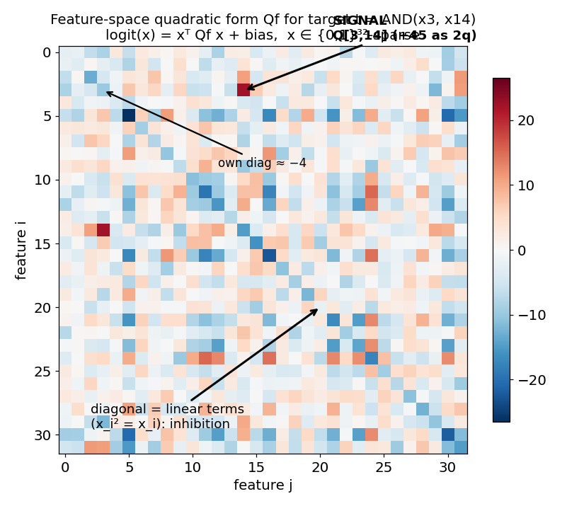
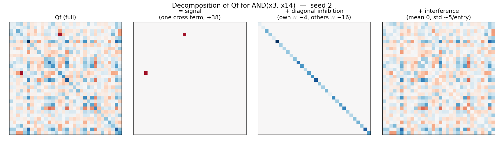
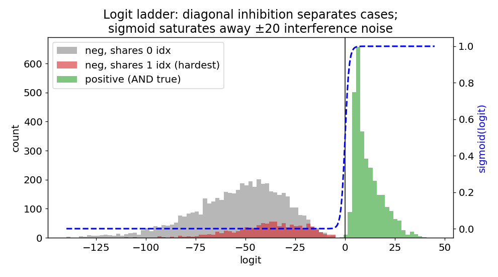
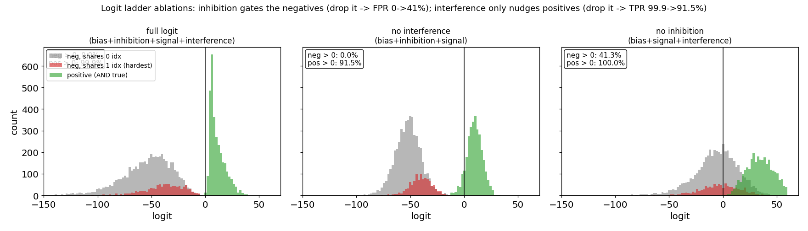
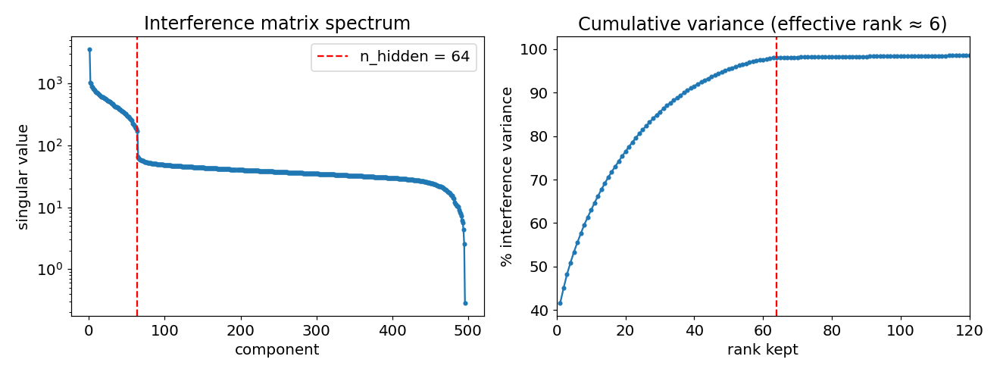

# `factorize.py` — anatomy of a single bilinear Universal-AND layer

Regenerate with `python factorize.py` (writes the four PNGs in this folder and
prints the interference-factorization numbers quoted below). All results are for
**seed 2** of the single-layer Universal-AND net: `m = 32` boolean features,
3-hot inputs embedded in `d0 = 16` dims, `n_hidden = 64`, `T = C(32,2) = 496`
AND targets, sigmoid + BCE head.

Each output `t = AND(x_a, x_b)` is, after pulling the embedding into the weights,
an **exact quadratic form** in the 32-dim feature basis:

```
logit_t(x) = xᵀ Qf_t x + bias_t ,    x ∈ {0,1}³² (3-hot)
```

`factorize.py` takes those forms (`Qf`, computed in `pullback.py`) and asks: what
is each `Qf_t` actually made of, and where does the cross-target structure come
from?

### Architecture (condensed from `train_uand.py`)

```python
# ---- sizes ----
m, d0, n_hid = 32, 16, 64            # 32 features, 16-dim embedding, 64 hidden units
pairs = list(itertools.combinations(range(m), 2))
T = len(pairs)                       # 496 = C(32,2) AND targets
pair_idx = np.array(pairs)           # (T, 2)

# ---- parameters ----
E  = rng.normal(size=(d0, m)); E /= np.linalg.norm(E, axis=0, keepdims=True)  # (16,32) FROZEN embedding
W1 = rng.normal(size=(n_hid, d0)) / np.sqrt(d0)     # (64, 16)
W2 = rng.normal(size=(n_hid, d0)) / np.sqrt(d0)     # (64, 16)
Wo = rng.normal(size=(T, n_hid))  / np.sqrt(n_hid)  # (496, 64)
bo = np.full(T, -4.0)                # bias init ~ log(p/(1-p)), p ~ 3/496
params = [W1, W2, Wo, bo]            # trained via manual Adam; E is NOT trained

# ---- one batch of 3-hot boolean inputs ----
R = rng.random((n, m)); idx = np.argpartition(R, 3, axis=1)[:, :3]
F = np.zeros((n, m)); np.put_along_axis(F, idx, 1.0, axis=1)   # exactly 3 of 32 active
Y = F[:, pair_idx[:, 0]] * F[:, pair_idx[:, 1]]               # (n, 496); exactly 3 positives/row

# ---- forward pass ----
X  = F @ E.T                         # (B, 16)  embed -> features in superposition (32 > 16)
A  = X @ W1.T;  Bv = X @ W2.T        # (B, 64)  two linear maps
H  = A * Bv                          # (B, 64)  bilinear: elementwise product (biasless)
Z  = H @ Wo.T + bo                   # (B, 496) readout logits
P  = 1 / (1 + np.exp(-Z))            # 496 INDEPENDENT sigmoids (per-output BCE, not softmax)
```

Sizes at a glance: input `m=32` (3-hot) → frozen embedding `E` (16×32) → bilinear
hidden `n_hid=64` → readout to `T=496` AND targets. ~34k trained parameters
(`W1,W2,Wo,bo`). Two superpositions are baked in on purpose: **feature**
superposition (32 features in 16 dims, so `E` is non-orthogonal — the origin of
the dominant interference mode in §4) and **computation** superposition (496
targets through 64 hidden units, ≈8 gates/neuron). The head is multi-label:
every 3-hot input has exactly `C(3,2)=3` positive targets, all firing at once.

---

## 1. The quadratic form of one target



A single target's `Qf_t` (here `AND(x3, x14)`). Three things coexist in this one
32×32 matrix:

- **Signal** — the one bright `(a,b)` cross term (`Qf[3,14]`). On 3-hot inputs the
  relevant contribution is `2·Qf[a,b]`, ≈ **+45** for this target (mean across all
  targets is **+38**). This is the genuine `x_a x_b` detector.
- **Diagonal** — because `x_i² = x_i` on booleans, the diagonal acts as a *linear*
  term, not a quadratic one. It is uniformly negative: ≈ **−4** at the target's own
  two indices, ≈ **−16** everywhere else. This is structured **inhibition**.
- **Everything else** — dense off-diagonal **interference**, mean ≈ 0, large
  variance, with no obvious per-target structure by eye.

## 2. The three-part decomposition



The same matrix split additively into `Qf = signal ⊕ diagonal inhibition ⊕
interference`:

| piece | what it is | scale |
|---|---|---|
| **signal** | one `(a,b)` cross-term | `2·Qf[a,b]` ≈ +38 (mean) |
| **diagonal inhibition** | effective linear term (`x_i²=x_i`) | own ≈ −4, others ≈ −16 |
| **interference** | all other off-diagonal entries | mean 0, ≈ ±5 per `Qf` entry (≈ ±11 as `2·Qf`) |

The striking part: by squared mass, **interference carries most of the matrix**,
yet the network classifies correctly. So interference is *tolerated*, not
cancelled — which the next figure explains.

## 3. The logit ladder — why interference is survivable



Distribution of the logit over inputs, split by case:

- **positive** (the AND is true) — pushed to the right of 0 by the +38 signal.
- **hardest negative** (input shares **1** of the target's 2 indices) — gets the
  signal's partial activation but is dragged negative by the inhibition.
- **easy negative** (shares **0** indices) — driven far negative by the full
  inhibition ladder.

The diagonal inhibition is what *separates the three populations* along the logit
axis; the ±20-ish interference is mostly noise riding on top. Because the sigmoid
(dashed) saturates hard away from 0, that interference noise almost never flips a
decision. This is the core "the computation lives below a thresholded readout"
point: a linear/ridge probe sees the messy interface and reports ~no signal,
while the thresholded output is essentially exact.

### Ablation: which term is load-bearing?

To see *which* mechanism does the separating, re-add only subsets of the logit's
four components (`bias`, `inhibition`, `signal`, `interference`):



| variant | TPR (pos > 0) | FPR (neg > 0) |
|---|---|---|
| **full** (bias+inhibition+signal+interference) | 99.9% | **0.0%** |
| **no interference** (bias+inhibition+signal) | 91.5% | **0.0%** |
| **no inhibition** (bias+signal+interference) | 100.0% | **41.3%** |

- **Drop interference (middle panel):** the negatives stay perfectly on the
  negative side — **FPR is still 0%**. So interference, despite carrying most of
  the matrix's squared mass, does *not* threaten the decision boundary; the
  sigmoid absorbs it. It is genuinely tolerated. (It is not pure noise, though:
  TPR dips 99.9% → 91.5%, because for a *positive* the two off-target active pairs
  both share one index with the target, and that "shares-1" interference has a
  small **positive** mean — see §3's structure note, +0.64 — so it nudges
  borderline positives up. Interference mildly helps positives, never hurts
  negatives.)
- **Drop inhibition (right panel):** catastrophe — **41.3% of negatives cross
  zero** into false positives. The negative populations collapse from far-left
  back toward the bias (≈ −4), where the ±20 interference spread now straddles 0.

So the diagonal **inhibition is the load-bearing mechanism**: it alone drives the
0% FPR by pushing negatives tens of logits below zero. Interference is the part
the network *tolerates* (and even mildly exploits for positives), not the part it
relies on to classify.

## 4. Interference factorization — where the off-diagonal comes from

Stack the off-diagonal coefficients into a `T×T` matrix `C = 2·Qf[:, i<j]`
(`C[t,t]` is target `t`'s own signal); zero the diagonal to get the pure
interference matrix `X`, and take its SVD.



Printed results (seed 2):

```
C = Wo @ Mcross exact?                       True       # exact neuron factorization
participation ratio (effective rank):        5.5
  top- 1 components:  41.5% of interference variance
  top- 2 components:  45.0%
  top-16 components:  71.8%
  top-64 components:  98.1%        # knee at n_hidden = 64 (red line)
cross-target corr after removing top- 1:    -0.010  (was +0.41)
signal energy inside top-64 interference subspace:  13.2%
```

What this says:

- **One dominant mode.** Despite full numerical rank (496), the interference has
  effective rank ≈ 5.5 and a **single component explains 41.5%** of it. The
  singular-value spectrum has a sharp knee at exactly `n_hidden = 64` (the weights
  can only produce a rank-64 family of forms; the tail past 64 is the
  diagonal-zeroing residual).
- **The shared mode IS the cross-target correlation.** Different targets' inter­
  ference patterns correlate at +0.41; **removing just the top-1 mode collapses
  that to ≈ 0**. So the "shared structure" across targets is essentially this one
  direction. (Per `CONTEXT.md`, that mode is identified as **embedding crosstalk**:
  its pair-side vector tracks the embedding Gram overlaps `G = EᵀE` and its
  target-side vector is ~constant — i.e. the dominant interference is *inherited
  from the non-orthogonal embedding `E`, not learned*.)
- **Signal lives outside the interference subspace.** Only **13.2%** of the signal
  energy falls inside even the top-64 interference directions. Signal and inter­
  ference are nearly orthogonal — which is exactly why the layer can tolerate the
  interference instead of having to cancel it.

---

## Takeaways

1. Each Universal-AND output is `signal ⊕ inhibitory diagonal ⊕ rank-≈1
   embedding-geometry crosstalk ⊕ small residual`.
2. The diagonal is **linear inhibition** (boolean idempotence), and it — not
   cancellation — is the network's learned defense; it separates positives from
   the hardest negatives on the logit axis.
3. The dominant interference is **not learned**: it is geometric crosstalk
   inherited from the non-orthogonal embedding, captured by a single SVD mode.
4. A linear/ridge probe measures the interference-laden interface (high FVU); the
   thresholded readout measures the actual, nearly-exact computation. The whole
   point of the decomposition is to recover the latter.

> Follow-on (`hollow.py`): pushing the diagonal into an explicit linear vector
> ("hollowing") is exact on booleans but does **not** make the signal edge surface
> in the per-target eigenspectrum — the off-diagonal embedding crosstalk analyzed
> here still dominates. See `../CONTEXT.md` open threads #1/#5.
