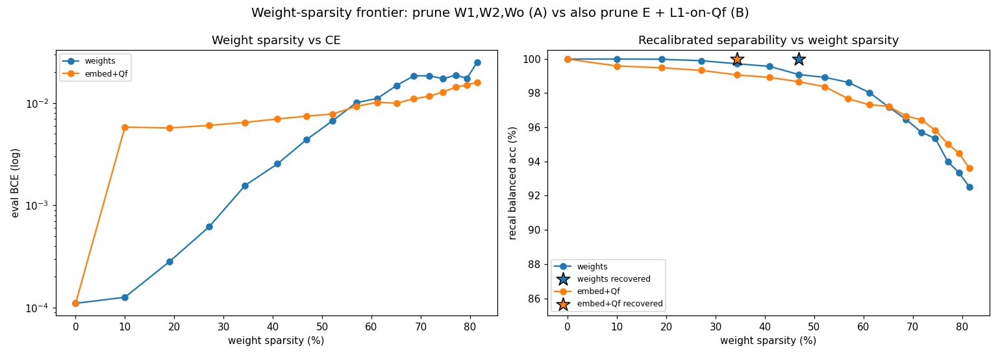
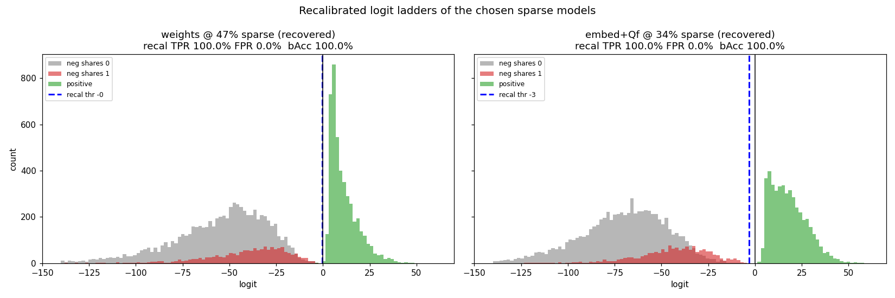
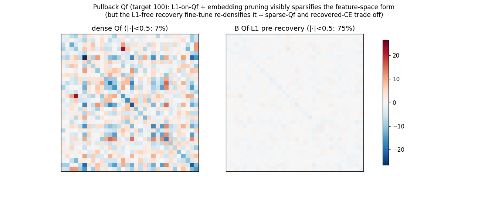
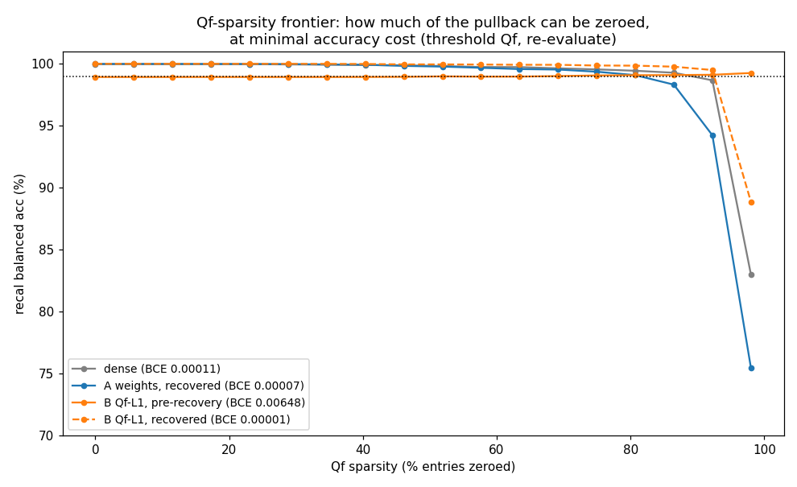

# Sparse Universal-AND: weights, embedding, and the pullback Qf

`python factorized_sparsity.py` (~20 min). Two iterative-magnitude-pruning runs
from the trained dense seed-2 model, compared side by side:

- **A "weights"** — prune `W1, W2, Wo` (embedding `E` frozen), weight-L1 only.
- **B "embed+Qf"** — also prune `E`, and add an **L1 penalty on the pullback `Qf`
  matrix itself** (to drive feature-space / representation sparsity).

Each round: fine-tune 500 steps on `CE + λ‖W‖₁ (+ λ‖Qf‖₁ for B)`, then prune the
smallest 10% of still-active weights (persistent mask; pruned weights *and* their
Adam moments re-zeroed every step). At the chosen sparsity we then run an
**L1-free recovery fine-tune** (mask frozen, no penalty) to claw back CE. All
accuracy is the **recalibrated** metric (AUC / best-threshold balanced accuracy),
because — as [`couplings.md`](./couplings.md) Q1 showed — a fixed threshold
understates a still-separable model.

---

## 1. Weight sparsity + L1-free recovery

During pruning, config B carries a higher CE floor (the Qf-L1 penalty + embedding
pruning cost), but recalibrated separability stays high for both. The decisive
step is the **recovery fine-tune**:

| run | chosen sparsity | BCE (pruned → recovered) | TPR@0 (pruned → recovered) | recal-bAcc → |
|---|---|---|---|---|
| **A weights** | **47%** | 0.00439 → **0.00007** | 0.883 → **1.000** | 0.991 → **1.000** |
| **B embed+Qf** | **34%** | 0.00648 → **0.00001** | 0.699 → **1.000** | 0.991 → **1.000** |

Both recover to **dense-level CE (even better) and TPR 1.000** after a short L1-free
fine-tune. So ~half the weights (47%, config A) are removable essentially for free.
Config B selects a lower sparsity (34%) because pruning the small, critical
embedding `E` plus the Qf-L1 penalty degrade recalibrated accuracy a bit faster —
but it too recovers perfectly. (Recall the pruned-but-not-recovered TPR collapse is
the Q1 calibration effect: L1 shrinks the signal, positives slide under the fixed
threshold while **TNR stays ≈ 1.0**.)

## 2. Recalibrated logit ladders of the recovered models

Both recovered sparse models separate the three case populations cleanly — **recal
TPR 100%, FPR 0%, balanced acc 100%** — with the recalibrated threshold sitting
near 0 (recovery restored calibration as well as accuracy).

## 3. Can the pullback `Qf` itself be made sparse?

The previous (weights-only) finding was that weight sparsity leaves `Qf` dense,
because `Qf = Wo·(W1E)·(W2E)` and the frozen embedding re-mixes everything. Two
new levers — pruning `E` and the **L1-on-Qf penalty** — change that.

**(a) L1-on-Qf does sparsify the pullback.** With Qf-L1 active (config B, before
recovery), the feature-space form goes from **7% to 75% near-zero entries**:

**(b) But how much can you zero at minimal accuracy cost?** Threshold the trained
`Qf` by magnitude and re-evaluate (logit = `xᵀQf x + bo`, exact):

The surprise here: **`Qf` is ~85% compressible for free, even in the dense model** —
you can zero ~85% of its entries by magnitude and keep recal balanced-acc > 99%.
So although `Qf` has 0% *exact* zeros, it is strongly *approximately* sparse (the
signal is one entry, inhibition is the diagonal, and most off-diagonal interference
is small and tolerated). The **Qf-L1 model extends the extreme tail**: at 92%
Qf-sparsity it holds ~99.5% vs ~98.6% (dense) and ~94% (weights-only), and at 98%
it holds ~89% vs ~83% (dense) / ~75% (weights). That advantage **survives the
recovery fine-tune** (the pre- and post-recovery B curves nearly coincide), even
though recovery re-grows small entries so the fixed-`|·|<0.5` count returns to ~7%.

## Takeaways

1. **~half the weights are removable for free** with an L1-free recovery
   fine-tune: 47% sparse → BCE 0.00007, TPR 1.000 (better than the dense 0.00011).
2. **Sparse-Qf and recovered-CE trade off.** L1-on-Qf drives the pullback to 75%
   near-zero, but the L1-free recovery (needed for CE) re-densifies it. You can
   have a sparse feature-space form *or* fully-recovered CE from this recipe, not
   both simultaneously.
3. **The pullback is approximately sparse anyway.** ~85% of `Qf` is zeroable at
   <1% accuracy cost with no special training; Qf-L1 + embedding pruning push that
   to ~92–98% at the extreme tail. This is the representation-sparsity result the
   weights-only run couldn't reach, and it connects to the non-orthogonal /
   sparse-pursuit thread (#3) in `../CONTEXT.md`.

The recovered 34%-sparse config-B model is saved to `uand_seed2_sparse.npz`.
