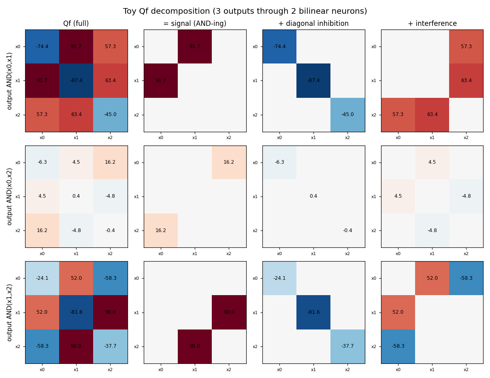
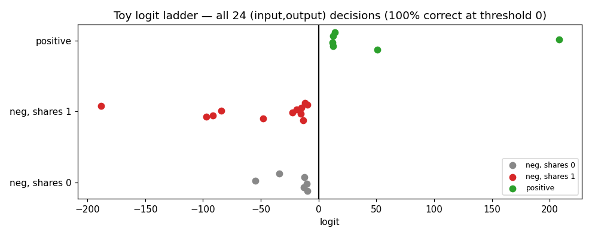
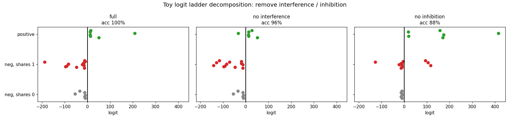

# Toy Universal-AND: 3 inputs, h=2, 3 pairwise ANDs

`python toy_and.py`. The smallest non-trivial bilinear superposition: one layer,
3 boolean inputs, **2 hidden bilinear units**, 3 outputs = the 3 pairwise ANDs
(`AND(x0,x1), AND(x0,x2), AND(x1,x2)`). No embedding, no residual.

    h = (W1 x) ⊙ (W2 x)      W1,W2 : 2×3
    logit = Wo h + bo        Wo : 3×2,  bo : 3

Trained on the full 8-input truth table (BCE, full batch).

## Does h=2 suffice for 3 ANDs? Yes.

**12/12 random seeds reach 100%** on all 24 (input, output) decisions (best BCE
≈ 0). Two bilinear neurons span only a 2-D subspace of quadratic forms, yet the
three independent AND targets are all realized — because the boolean threshold
(sigmoid) only needs the *sign* right, and the diagonal (which acts linear on
booleans) plus the bias give the extra slack. The truth table is separated with
room to spare:

```
  x0x1x2 | AND(0,1) | AND(0,2) | AND(1,2)
  110    |  +11.9*  |   -9.8   |  -11.7
  101    |  -14.6   |  +12.7*  | -188.3
  011    |  -15.3   |  -22.5   |  +50.6*
  111    | +208.2*  |  +12.5*  |  +14.1*     (* = AND true)
```

## (1) Qf decomposition



Each output's 3×3 feature-space form `Qf` splits into the same three pieces as the
big model: **signal** (the single `(a,b)` cross term = the AND-ing), **diagonal
inhibition** (negative, linear on booleans), and **off-diagonal interference**.
With only 2 shared neurons the magnitudes are very uneven — `AND(x0,x2)` is built
from tiny weights (signal +16) while `AND(x0,x1)` and `AND(x1,x2)` use large ones
(signal ~+90) — a direct picture of the two neurons being divided unevenly among
the three outputs.

## (2) Logit ladder



All 24 decisions, by case (positive / negative sharing 1 target bit / sharing 0):
positives sit right of 0, all negatives left — **100% at threshold 0**.

## (3) Logit ladder decomposition



| variant | accuracy |
|---|---|
| full | **100%** |
| no interference | 96% |
| no inhibition | 88% |

Same qualitative story as the full Universal-AND net, but tighter: **inhibition is
load-bearing** (removing it drops to 88% — negatives drift across 0), and at this
packed scale **interference is also used** (removing it costs the last 4%), rather
than being pure tolerated noise. With only 2 neurons for 3 targets the model has
no slack to waste, so every component does real work.
