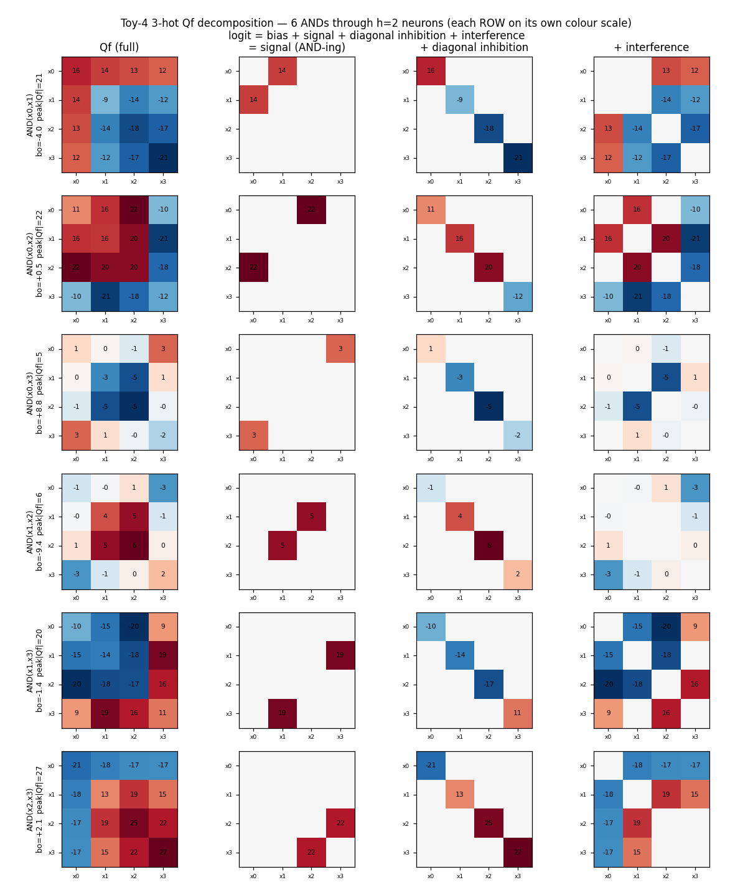
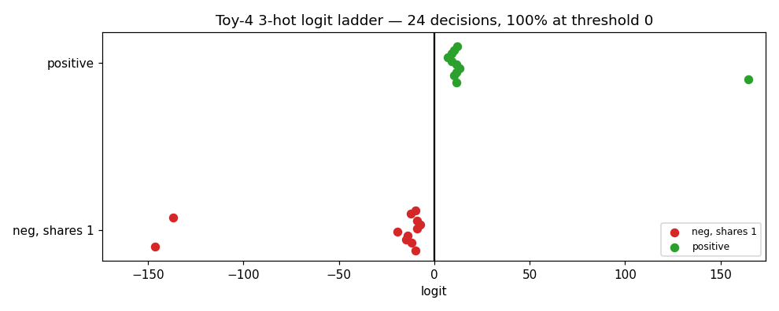
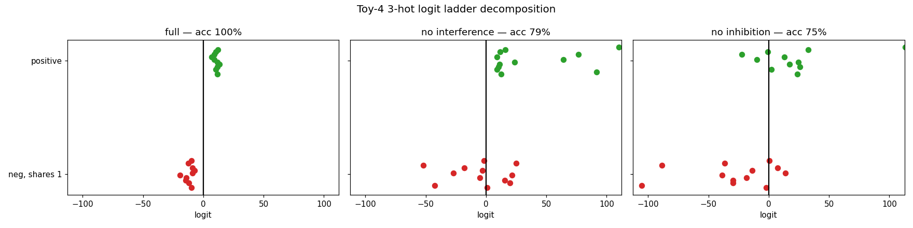
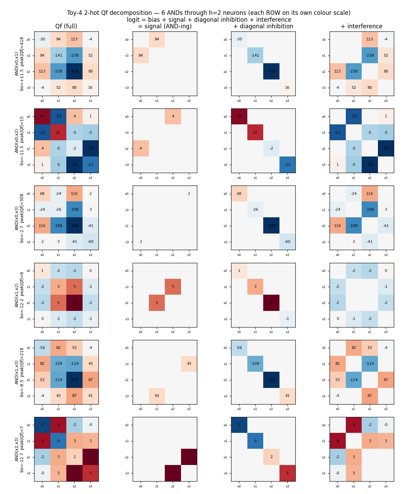
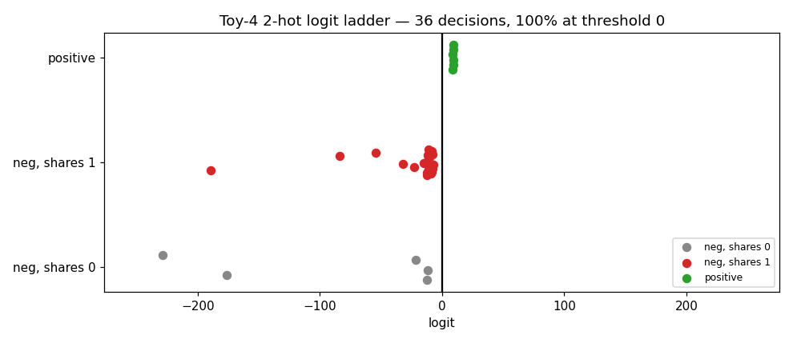
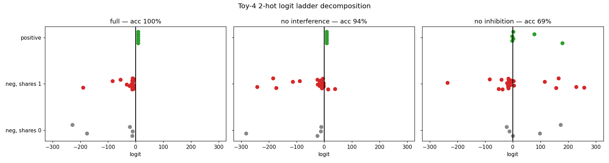

# Toy Universal-AND on 4 features: 3-hot and 2-hot inputs, 6 pairwise ANDs

`python toy_and4.py`. One bilinear layer, 4 features, **6 pairwise-AND outputs**
(`C(4,2)`), `h = (W1 x)⊙(W2 x)`, `logit = Wo h + bo` (W1,W2 biasless). Run for two
input distributions, with a sweep over the hidden width `h`.

| input regime | # inputs | structure of the 6 outputs | min `h` for 100% | `h=1` |
|---|---|---|---|---|
| **3-hot** (3 active) | `C(4,3)=4` | each input → 3 positives; 6 ANDs = 3 complementary pairs | **2** | 83% |
| **2-hot** (2 active) | `C(4,2)=6` | each input → **exactly 1** positive (one-hot: "which pair is active") | **2** | 89% |

**Two bilinear neurons compute all 6 ANDs in both regimes** (h=1 falls short).

## 3-hot

Inputs are the 4 ways to leave one feature off, so a pairwise `AND(i,j)` is true iff
the off-feature isn't `i` or `j`. The 6 outputs form **3 complementary pairs**
(`AND(0,1) = ¬AND(2,3)`, …) — i.e. the three 2/2 partitions of the 4 inputs, one of
which is the XOR ("diagonal") split. Naively that looks like a 2-D obstruction, but
the network just places the 4 hidden states in **non-convex position** (one inside
the triangle of the others), which makes all three partitions linearly separable —
so `h=2` already works.

Note there are **no "shares-0" negatives** — with one feature off, every pair has at
least one active member, so all negatives are the hardest "shares-1" kind. Ablation:
full 100%, **no-interference 79%, no-inhibition 75%** — with only 2 neurons for 6
tightly-packed outputs, both signal-shaping pieces do real work (and several outputs
lean on the **bias**: e.g. `AND(0,3)` has bo=+8.8 with a near-zero `Qf`).

## 2-hot

Inputs are the 6 two-hot patterns, and `AND(i,j)` is true iff the active pair *is*
`{i,j}` — so each input fires **exactly one** output. This is one-hot detection
("which of the 6 pairs is active").

Here the positives sit just above 0 while the 5 non-matching negatives per output are
driven far negative — so **inhibition does almost all the work**: ablation is full
100%, no-interference 94%, but **no-inhibition only 69%** (remove the diagonal and the
many negatives flood across 0). The contrast with 3-hot is the point: the same 2-neuron
bilinear layer reallocates between signal / inhibition / interference depending on the
task's combinatorics.

**The "signal" cell is *not* where the AND lives here.** e.g. `AND(x0,x3)` has a tiny
signal `Qf[0,3]=2` yet a huge `Qf[0,2]=116` — which looks wrong but is correct (every
output fires on exactly its pattern; the detection-check in the script confirms it). In
this one-hot regime the model detects `{0,3}` not via the `(0,3)` cross term but by
tuning the whole form so the sum over the active pair is positive only for `{0,3}`:

    input {0,3} (true) : bo + Qf00 + Qf33 + 2·Qf03 = −2.7 + 68 − 60 + 4  = +9.3  ✓
    input {0,2} (false): bo + Qf00 + Qf22 + 2·Qf02 = −2.7 + 68 − 308 + 232 = −10.7 ✓

So the computation is **distributed across the diagonal and interference**, not the
signal cell — a tiny illustration of the project's central point (the computation isn't
where a naive "signal" readout looks). The `signal/inhibition/interference` split is a
lens borrowed from the big sparse UAND (where the signal cross-term dominates); it adds
up exactly here too, but in this regime the labels don't carry the computation.

> Figure note: in both decompositions each **row is on its own colour scale**
> (`peak|Qf|` is shown per output), so small-magnitude outputs stay legible next to the
> large ones — the colour shows structure *within* a row; the annotated numbers carry
> the absolute magnitudes.
