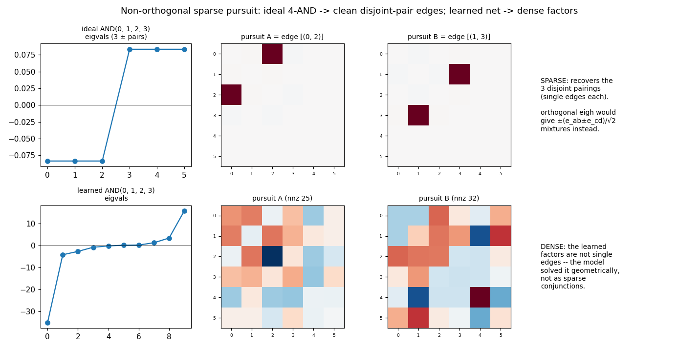

# Non-orthogonal sparse pursuit for a symmetric quartic

`python sparse_pursuit.py`. A method for decomposing a degree-4 form (a 2-layer
bilinear output, folded to a symmetric tensor `T4`) into **product-of-quadratics**
factors `(xᵀ A x)(xᵀ B x)` whose factors `A, B` are *sparse* (edge-aligned), where
the standard orthogonal eigendecomposition cannot. This is the concrete version of
the "non-orthogonal / sparse pursuit" direction (`../CONTEXT.md` thread #3).

## Why orthogonal eigendecomposition fails

A 2-layer bilinear unit computes `g_p = (xᵀ A_p x)(xᵀ B_p x)`, so each output's
quartic is a sum of such products. Matricise the symmetric tensor to
`M[(ij),(kl)] = T4[i,j,k,l]` — an `m²×m²` symmetric matrix. A single product
`(xᵀ A x)(xᵀ B x)` matricises to

    M = ½ ( vec(A) vec(B)ᵀ + vec(B) vec(A)ᵀ )

a **rank-2** symmetric matrix. Its eigenvectors are not `A` and `B` — they are the
**±45° mixtures**

    v₊ = (Â + B̂)/√2   with eigenvalue +½|A||B|
    v₋ = (Â − B̂)/√2   with eigenvalue −½|A||B|        (Â = vec(A)/|A|, etc.)

So an *orthogonal* basis (`eigh`) is forced to report `(Â ± B̂)/√2` and can never
return the bare factors. For a 4-AND `x_a x_b x_c x_d` this is exactly the pathology
`decomp_exact.py` shows: the three disjoint pairings entangle into six eigenvectors
`±(e_ab ± e_cd)/√2` of equal magnitude — `eigh` mixes the pairings and cannot pick
one.

## The de-mixing

Invert the rotation. Given a `±` eigenvalue pair `(v₊, v₋)` of equal magnitude `w`,
the product it came from is recovered (up to scale) by **adding and subtracting**:

    A ∝ v₊ + v₋  (= √2 · Â),   B ∝ v₊ − v₋  (= √2 · B̂),   |A||B| = 2w

i.e. a 45° rotation of the eigen-pair back onto the factor axes. If the underlying
factors are sparse (single edges `e_ab`), the recovered `A, B` come out sparse.

## Matching + the disjoint-support tie-break

When the quartic is a sum of `K` products, `eigh` returns `K` positive and `K`
negative eigenvectors, and we must decide **which `v₊` pairs with which `v₋`**. Any
pairing yields *some* `A, B`, but only the right one yields sparse factors. So we
search over matchings and keep the one that **minimises total support** (the
disjoint-support / sparsity tie-break) — brute force for small `K`, a linear
assignment for larger. For a single 4-AND all three pairings are equally valid and
disjoint, so the pursuit returns **all three** `{ab}{cd}` splits — that 3-fold
symmetry is the genuine non-uniqueness, not a failure.

## What it shows

- **Ideal 4-AND `x0x1x2x3`** (top): `eigh` gives 3 equal `±` pairs (mixed); the
  pursuit de-mixes them into the **3 disjoint pairings as single edges** —
  `{02}{13}`, `{23}{01}`, `{12}{03}` (nnz 4 each). The method does what orthogonal
  canonicalisation can't.
- **A learned net's quartic** (bottom, the 4-hot toy): the spectrum is *un*balanced
  (no clean `±` pairs) and the recovered factors are **dense** (nnz ≈ 25–32, ~11
  edges each), not single edges. The learned solution is **irreducibly distributed**
  — it solved the task geometrically (a 2-D convex embedding), not as a few sparse
  conjunctions, so there is no sparse structure for the pursuit to find.

## Caveats

- The de-mixing assumes a `±` pair of *equal* magnitude (a genuine product). A
  general learned quartic need not be a clean sum of products (its spectrum is
  unbalanced), so the recovery is approximate and the truncation (top-`K` pairs)
  loses mass.
- The matching is combinatorial and the sparsity tie-break is a heuristic — no
  guarantee of the globally sparsest decomposition.
- There is still a **bond gauge** at the factor level (scale / swap `A↔B`,
  re-mixing within a degenerate eigenspace); a full canonical form is the
  ODT-style problem in `../CONTEXT.md` thread #4. The pursuit here is the practical
  first cut: *if* a sparse product structure exists, this surfaces it; if (as in our
  trained nets) it doesn't, the dense output is itself the answer.
