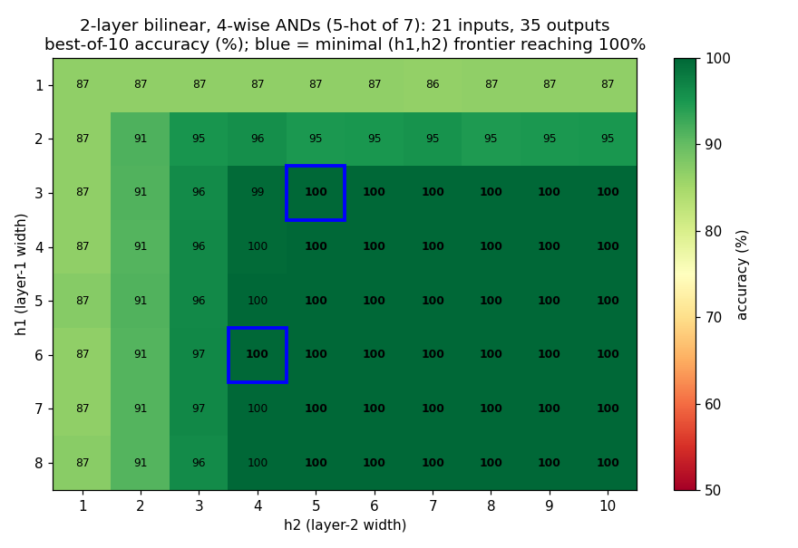
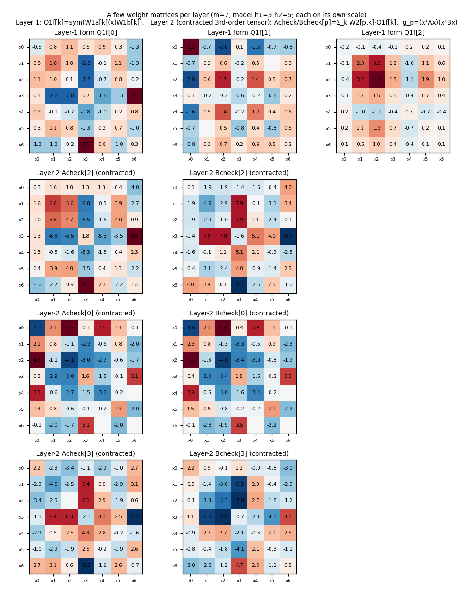
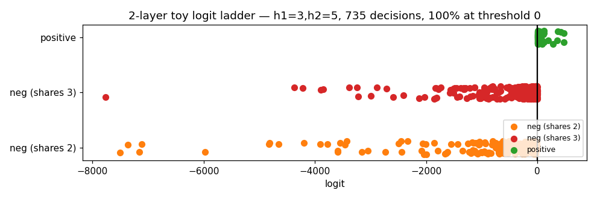
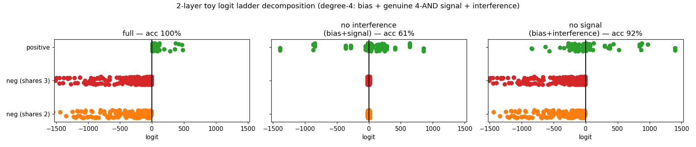

# Toy 2-layer bilinear: 4-wise ANDs in superposition

`python toy_2layer.py`. **Two stacked bilinear layers, no residual / no const**,
computing 4-wise ANDs:

    h = (W1a x) ⊙ (W1b x)     layer 1: degree 2, width h1
    g = (W2a h) ⊙ (W2b h)     layer 2: degree 4 in x, width h2
    logit = Wo g + bo

**Inputs**: 5-hot over m=7 (`C(7,5)=21` inputs, each = "which 2 features are off").
**Outputs**: the `C(7,4)=35` four-ANDs. 5-hot is the minimum that lets outputs
co-activate (two 4-subsets sharing 3 features have union 5), so each input has
`C(5,4)=5` co-active ANDs — output superposition.

We use 21 inputs (not the earlier 6) on purpose: the minimal net below has **~282
parameters fitting 21×35 = 735 decisions** — *fewer parameters than decisions* — so
it cannot be memorizing; it has to actually compute the conjunctions in
superposition. (At m=6, with 6 inputs/15 outputs, params > decisions, so that
smaller version was potentially just memorization.)

## What hidden widths are needed?

Sweep of `(h1, h2)`, best of 10 seeds:

The 100% region has an **L-shaped frontier with two minimal corners: `(h1=3, h2=5)`
and `(h1=6, h2=4)`** — a real trade-off between layer-1 and layer-2 width (you can
buy a narrower layer 2 with a wider layer 1, or vice-versa). Floors: `h1=1` caps at
87%, `h1=2` at ≤96%, `h2≤3` never reaches 100%. So **35 outputs are computed by
hidden widths as small as 3 and 5** — strong superposition (3, 5 ≪ 35). The folded
exact degree-4 tensor reproduces the forward pass to 1e-11.

For comparison, the degenerate 6-input version (15 outputs) needed `(3, 4)`; going
to 21 inputs / 35 outputs only nudges the widths to `(3, 5)` while more than doubling
the outputs — the hallmark of superposition (capacity grows far slower than #features).

## The weight matrices of each layer

- **Layer 1** — each of the `h1=3` neurons is a quadratic form `Q1f[k] =
  sym(W1a[k] ⊗ W1b[k])`, an `m×m` matrix of **rank 2** (a symmetrised outer
  product). These are the degree-2 building blocks.
- **Layer 2** — the *contracted 3rd-order tensor* `Acheck/Bcheck[p] = Σ_k W2[p,k]·
  Q1f[k]` (shape `h2×m×m`); each slice is an `m×m` matrix and is denser, being a
  learned mix of the three layer-1 forms. Layer-2 neuron `p` computes
  `g_p = (xᵀ Acheck[p] x)(xᵀ Bcheck[p] x)` — degree 4. (Shown for the 3 most-used
  neurons; each panel on its own colour scale.)

All 35 four-ANDs are built from just these few matrices — 3 rank-2 layer-1 forms
feeding 5 layer-2 quartic units.

## Logit ladder

Three case classes now: **positive** (`off ∩ target = ∅`, all 4 active), **neg
shares-3** (one off-feature in the target), **neg shares-2** (both off-features in
the target). Separated at threshold 0 (100%).

## Ladder decomposition — the genuine 4-AND term barely matters

Split each logit into `bias + signal + interference`, where **signal** is the genuine
top-degree monomial contribution (`24·T4[a,b,c,d]·x_a x_b x_c x_d`, the coefficient of
the actual 4-AND) and **interference** is everything else (the lower-degree / cross
structure the fold produces):

| variant | accuracy |
|---|---|
| full | **100%** |
| no interference (bias + signal) | **61%** |
| no signal (bias + interference) | **92%** |

The point, and it survives the larger input set: **removing the genuine 4-AND signal
barely hurts (→92%), while keeping only the signal collapses to 61%.** The detector is
almost entirely in the *interference* — the distributed lower-degree structure — not in
the top-degree monomial that "is" the AND. This is the degree-4, 2-layer version of the
project's recurring theme (the computation isn't where a naive top-order readout looks),
now on a non-degenerate 21-input task where the net genuinely computes rather than
memorizes.
