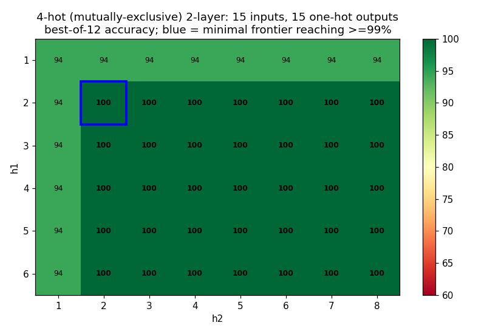
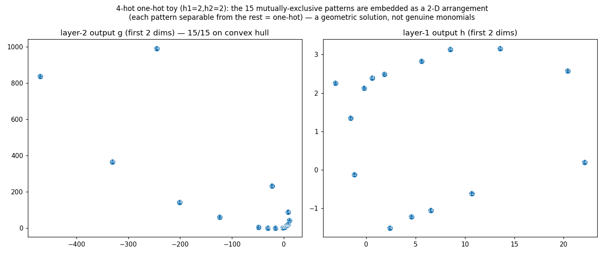
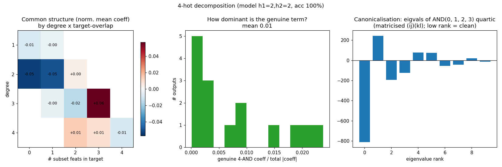

# 4-hot (mutually-exclusive) 2-layer toy + a canonicalisation attempt

`python toy_2layer_4hot.py`. Same 2-layer bilinear net, but inputs are exactly
**4-hot over m=6** → `C(6,4)=15` inputs = 15 outputs, and each input lights
**exactly one** output (the 4-AND whose 4 features are the active set). So the
outputs are **mutually exclusive / one-hot** ("which 4-subset is active?").

## Sweep (target ≥99%)

Minimal widths: **`(h1=2, h2=2)`** already gets 100% (h1=1 or h2=1 caps at 94%).
So **2+2 hidden units suffice for 15 one-hot outputs** — extreme superposition.

## What solution does it find? (Not the clean one)

Naively, on 4-hot inputs the genuine monomial `x_a x_b x_c x_d` is a *perfect*
one-hot detector, so one might hope each output collapses to its own monomial. It
**doesn't**: in the minimal model the genuine 4-AND coefficient is only **~1% of
the output's coefficient mass** (rank ≈32 of 56) — *more* distributed than 5-hot.

Instead the mechanism is **geometric**: with `g` only 2-dimensional, the net embeds
the 15 patterns as a 2-D arrangement with **all 15 on the convex hull**, so each is
linearly separable from the other 14 (one-hot):

The shared polynomial structure (normalised, by degree × target-overlap) is the same
overlap gradient as before, but the "signal" sits at **degree 3** (aligned 3-subsets,
≈ +0.06), not at the genuine degree-4 term:

## Canonicalisation — structure does *not* pop out

I canonicalised each output's quartic by the orthogonal route (matricise to
`(ij)(kl)`, `eigh`). It is **not** low-rank: the spectrum is spread with the same
**± pairing-mix pathology** `decomp_exact.py` predicts (an orthogonal basis is forced
into mixtures of complementary pairings). So the genuine `{a,b,c,d}` structure does
**not** surface from the orthogonal canonicalisation, even for a clean one-hot
detector.

**Takeaway.** Mutual exclusivity did *not* make the computation clean — with a tiny
2-D bottleneck the net solves it as a geometric convex embedding, the genuine
conjunction is negligible, and orthogonal canonicalisation only reproduces the
pairing-mix. Getting interpretable factors out would need the **non-orthogonal /
sparse pursuit** route (`../CONTEXT.md` thread #3) rather than an orthogonal
eigendecomposition — and/or giving the net enough width that it can afford the
genuine-monomial solution instead of the geometric shortcut.
