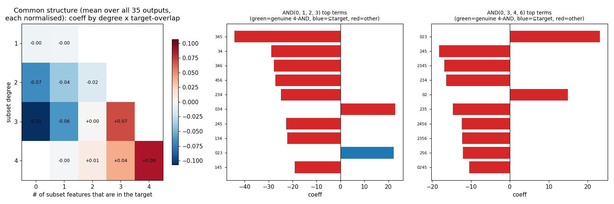
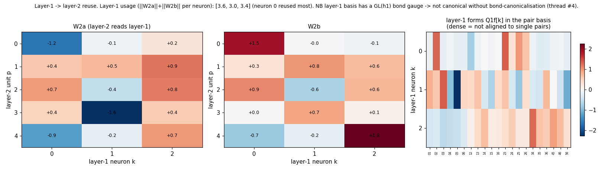

# Decomposing the 2-layer toy: polynomials, common structure, layer reuse

`python toy_2layer_decomp.py`. Folds each of the 35 four-AND outputs of the
2-layer toy to its exact degree-4 tensor, square-free-reduces it to a multilinear
polynomial (exact on the boolean inputs, ~2e-13), and looks for shared structure
and layer-1 reuse.

**Regularisation matters.** The default toy (`toy_2layer.py`, tiny weight decay)
finds a high-norm solution whose polynomials have huge *cancelling* coefficients
(±300–800; max|logit| ≈ 3700) — uninterpretable. This script trains the **lowest-
norm 100% solution** (strong weight decay, L1 weight norm ≈ 117); the structure
below only emerges in that low-norm model.

## Each output independently → rescale to compare

The readout is **35 independent sigmoid+BCE heads (no softmax across outputs)**, so
each output's logit scale is arbitrary. We therefore **normalise each output's
coefficient vector to unit L2** before comparing — that is what makes a common
structure visible.

## Common structure across all 35 outputs

Left panel — mean normalised coefficient by **(subset degree × how many of the
subset's features are in the target)**, averaged over all 35 outputs:

| degree | ov0 | ov1 | ov2 | ov3 | ov4 |
|---|---|---|---|---|---|
| 1 | −0.00 | −0.00 | | | |
| 2 | −0.07 | −0.04 | −0.02 | | |
| 3 | **−0.11** | −0.06 | +0.00 | +0.07 | |
| 4 | | −0.00 | +0.01 | +0.04 | **+0.09** |

Every output, regardless of *which* 4 features it targets, shares the same shape: a
**monotone overlap gradient** — a subset's coefficient rises with how much it
overlaps the target. Subsets *misaligned* with the target are **inhibitory**
(degree-3 disjoint = −0.11, all of degree-2 negative); subsets *aligned* with it
are positive, peaking at the **genuine 4-AND term (+0.09)**. This is the degree-4
generalisation of the 1-layer "signal + self-inhibition": the genuine conjunction
*is* the most positive coefficient on average, surrounded by inhibition of partial /
off-target configurations.

But **per output** (right two panels) the genuine 4-AND is *not* the biggest term —
the largest coefficients are inhibitory off-target degree-3/4 terms. The computation
is genuinely superposed/distributed (matching the ladder result: no-interference
61%, no-signal 92%); the clean signal only appears once you average the normalised
outputs together.

## Layer-1 → layer-2 reuse

- `W2a, W2b` (5×3) show **every layer-2 unit reads all 3 layer-1 neurons** — reuse is
  total, and usage is roughly even (`||W2|| per neuron ≈ [3.6, 3.0, 3.4]`), no single
  dominant factor.
- The 3 layer-1 forms `Q1f[k]` are **dense in the pair basis** (right panel) — *not*
  aligned to single pairs like "compute a∧b once." With only 3 layer-1 forms for
  `C(7,2)=21` possible pairs they have to be superposed combinations, so there is no
  basis-aligned "a∧b reused" to read off by default.
- And the layer-1 representation has a **GL(h1) bond gauge** (rotate the layer-1 basis,
  compensate in `W2`), so the individual forms aren't even canonical — finding
  interpretable reused factors would need bond-canonicalisation (`../CONTEXT.md`
  thread #4), and even then 3 < 21 caps how clean it can get.

**Summary.** Rescaling per output (valid because the heads are independent) reveals a
clean shared "aligned-positive / misaligned-inhibitory" polynomial structure with the
genuine 4-AND on top — but only in the low-norm model, and only in aggregate; per
output and per layer-1 factor the computation is irreducibly superposed.
