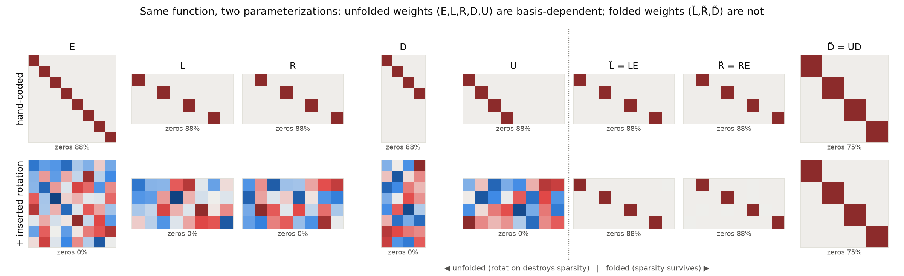
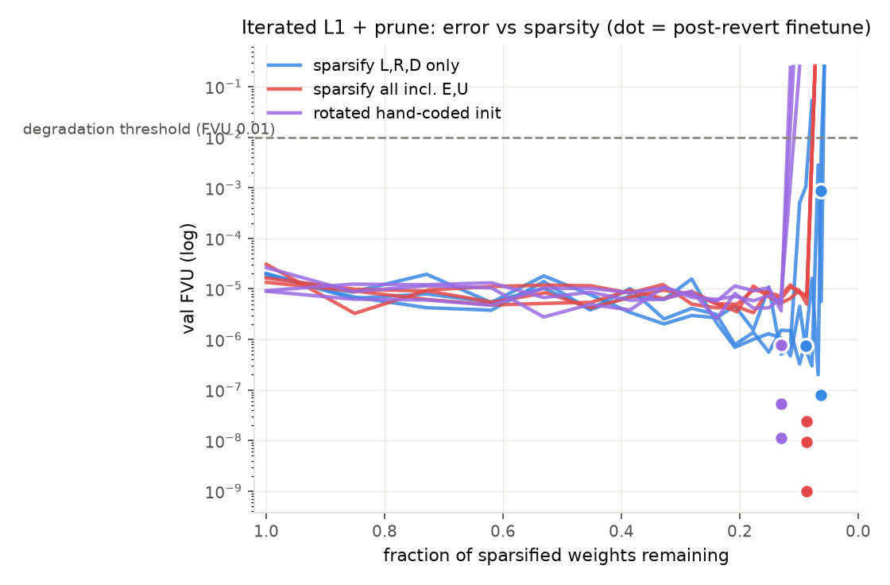
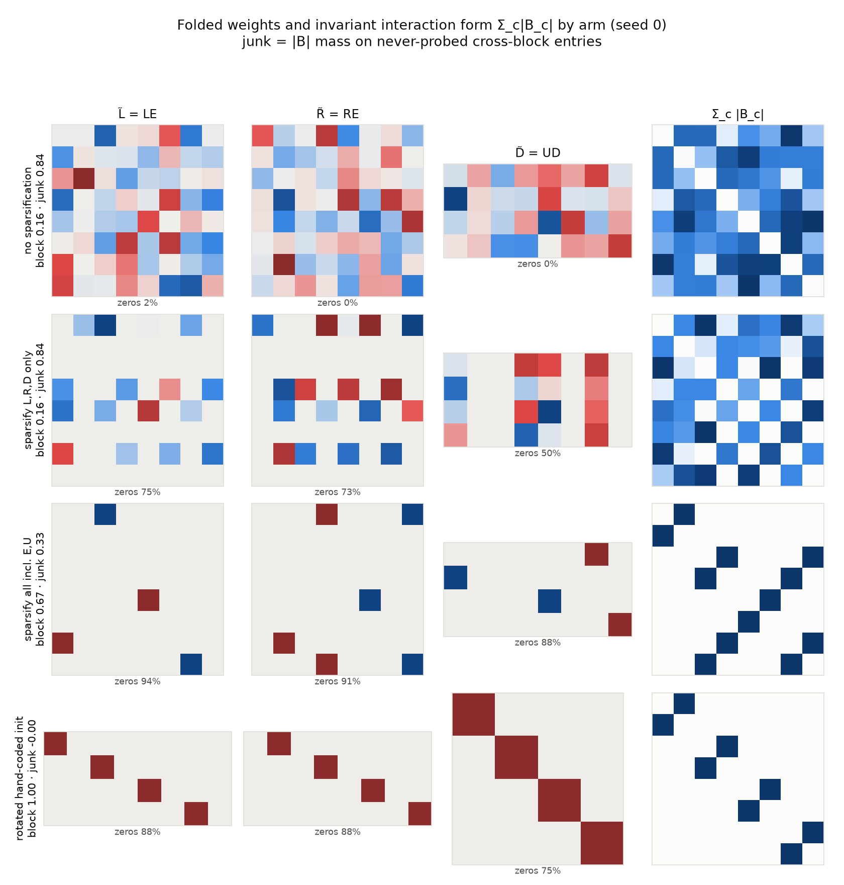
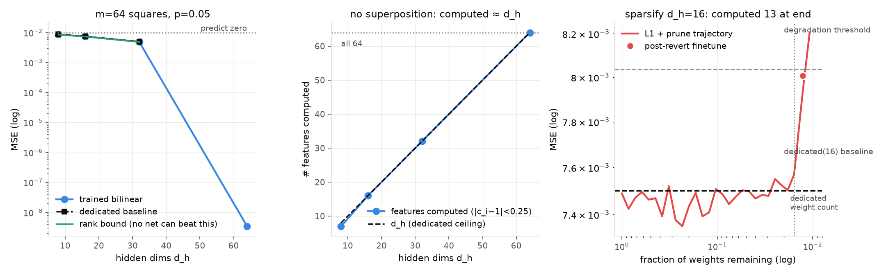
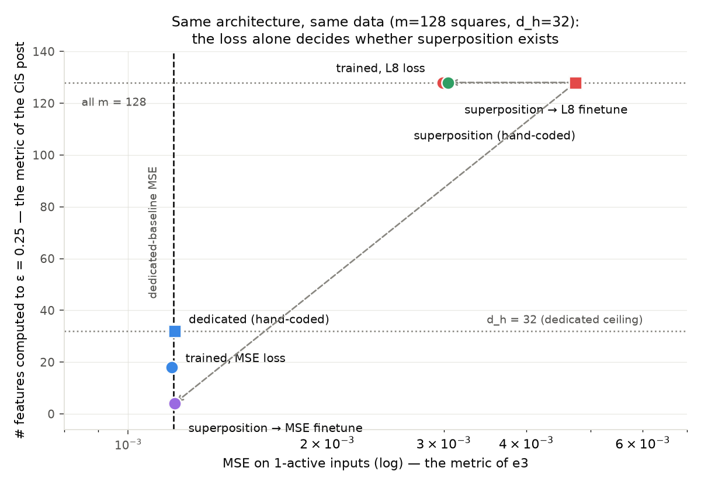
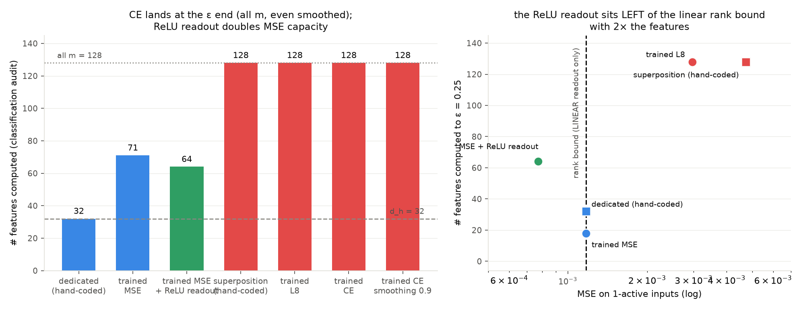
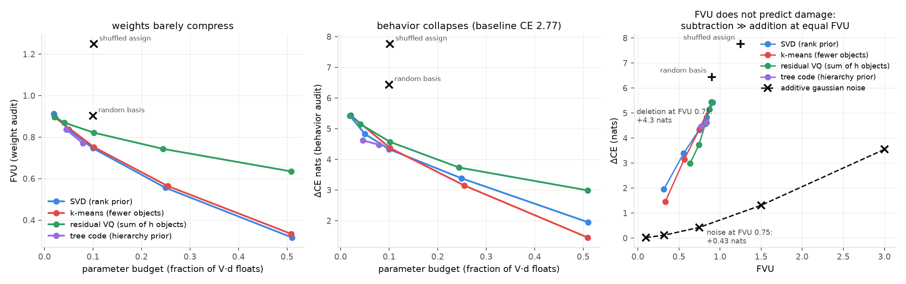

# Results — basis-aligned bilinear networks

Program spec: [PLAN.md](PLAN.md). Shared machinery: `common.py` (fold, interaction form,
Hoyer/zero-frac, the iterated L1→prune→revert→finetune protocol).

Setting (threads 1): `y = U·D·((L·E·x) ⊙ (R·E·x))`, folded to `y = D̃((L̃x)⊙(R̃x))` with
`L̃=LE, R̃=RE, D̃=UD`. The invariant object is the per-class interaction form
`B_c = sym(Σ_k D̃[c,k] L̃[k]ᵀR̃[k])`, with `y_c = xᵀB_c x`.

Block task: 8 inputs in 4 fixed pairs, one pair active per sample, `y_c = x_{2c}·x_{2c+1}`.
Ground truth: `B_c` has mass only on class c's own 2×2 block.

---

## FINDING 1 (e1) — weight sparsity is a basis artifact; folding removes the artifact

Hand-coded exact solution, then insert a random rotation Q at the embedding interface
(`E→QE, L→LQᵀ, R→RQᵀ`) and another Q₂ at the unembedding interface (`D→Q₂D, U→UQ₂ᵀ`):

- function identical (max diff 4.8e-6 fp32, on full-support inputs, i.e. also off-distribution)
- folded weights bit-identical (2.4e-7); block score of B stays 1.000
- **unfolded weights go from 87.5% zeros to 0% zeros** (Hoyer 0.79 → 0.16–0.28)



So "the bilinear layer's input basis" is not a thing you may read weights in — the folded
input/output bases are.

## FINDING 2 (e2) — on-distribution training fills the function with invisible junk

The task only ever activates one block at a time, so cross-block entries of `B_c`
(feature i and j in different blocks) are **never probed by any training sample**. Trained
dense models (3 seeds) solve the task to FVU 1e-4–1e-10 while:

- **84–87% of |B| mass sits on those never-probed cross-block entries**
- block score 0.13–0.16 (ground truth = 1.0)
- FVU on full-support inputs vs the natural extension `y_c=x_{2c}x_{2c+1}`: **2.0–5.3**

Same moral as the tensor-sim backdoor result, now in the simplest possible setting: the
on-distribution loss says nothing about most of the function.

## FINDING 3 (e2) — sparsifying only L,R,D is cosmetic; sparsifying through E,U is functional; and the protocol can undo the rotation exactly

Iterated protocol (per user spec): L1-train → prune bottom 15% of remaining → repeat;
on degradation (FVU > 0.01) revert one step and finetune without L1. 3 seeds each:

| arm | weights remaining | unfolded L zeros | folded L̃ zeros | block score | cross-junk | OOD FVU |
|---|---|---|---|---|---|---|
| no sparsification | 100% | ~0% | ~0% | 0.13–0.16 | 0.84–0.87 | 2.0–5.3 |
| sparsify **L,R,D only** | 6–9% | **91–94%** | 58–75% | 0.16–0.20 | 0.80–0.84 | 2.6–3.0 |
| sparsify **all incl. E,U** | 8.7% | 94% | 88–94% | 0.44–0.67 | 0.33–0.56 | 0.50–1.24 |
| rotated hand-coded init, sparsify all | 13.0% | 88% | 88% | **1.000** | **0.000** | **~1e-7** |

- **L,R,D-only:** the middle matrices look extremely sparse (94% zeros) while the folded
  weights and the function are unchanged junk — L1 just reparameterizes, pushing the
  rotation into the free E,U. Weight sparsity in a non-privileged basis means nothing.
- **All matrices:** near-minimal weight count (8.7% remaining ≈ the 8.3% an exact solution
  needs at d_h=8) and folded sparsity is real, junk drops ~2×, OOD improves ~4× — but from
  a scratch-trained junky solution it does **not** recover the ground-truth blocks. There
  exist near-minimal-weight solutions that are still functionally wrong off-distribution.
- **Rotated hand-coded init:** the protocol **exactly undoes the inserted rotation** —
  block score 1.000, zero junk, OOD FVU ~1e-7, and it stops at 13.0% remaining, right at
  the hand-coded solution's 12.5% weight count. When a zero-junk solution is reachable,
  weight-sparsity optimization finds the privileged basis on its own.




## FINDING 4 (e3) — NO computation in superposition for a bilinear layer with linear readout, and a closed-form rank bound that trained nets actually reach

Task: m=64 features, each active w.p. p=0.05 with value U(−1,1), target `y = x²`
elementwise; net `ŷ = D((Lx)⊙(Rx))`, no embed/unembed. Since there are no linear terms,
`x=v·e_i ⇒ ŷ_i = c_i v²` with `c_i = D[i]·(L[:,i]⊙R[:,i])` read directly off the weights —
"feature computed" = `|c_i−1| < 0.25`.

The hoped-for Vaintrob/Mendel-style superposition (more squares than hidden dims) is
**impossible here**: all m outputs live in the span of the d_h hidden functions, so total
MSE ≥ the target-Gram eigenvalues beyond the top d_h. With
`G = (p/5 − p²/9)I + (p²/9)𝟙𝟙ᵀ` this gives

```
MSE ≥ (m − d_h)(p/5 − p²/9)/m   =  dedicated baseline − shared-mean component
```

(closed form verified against a 2M-sample Monte-Carlo Gram to <0.7%). The only thing a
"distributed" solution can add over d_h dedicated squares is the shared mean `E[x_i²]` —
a ~3% improvement, not more features. ~~Their construction gains from a nonlinear readout
that denoises interference; a purely quadratic network has none.~~ **RETRACTED — see
FINDING 5:** their quadratic U-AND is itself a bilinear layer + linear readout; the real
discriminator is the error metric (MSE vs ε-accuracy), which the rank bound respects and
their construction deliberately does not optimize.

Trained networks confirm, landing essentially ON the bound with computed ≈ d_h:

| d_h | trained MSE | dedicated | rank bound | gap to bound | #computed (of 64) |
|---|---|---|---|---|---|
| 8 | 8.73e-3 | 8.75e-3 | 8.51e-3 | +2.6% | 7 |
| 16 | 7.41e-3 | 7.50e-3 | 7.29e-3 | +1.6% | 16 |
| 32 | 4.95e-3 | 5.00e-3 | 4.86e-3 | +1.9% | 32 |
| 64 | 2.8e-9 | 0 | 0 | — | 64 |

(Also a nice check that the hidden functions being *rank-1* quadratic forms costs almost
nothing: the bound allows arbitrary quadratics, and training gets within ~2%.)

**Part B — sparsifying the d_h=16 model recovers the dedicated solution, literally.**
The protocol (degrade threshold = trained + 25% of the gap to predict-zero) prunes from
100% → **1.3% of weights** with almost no loss until the very end (MSE flat at ~7.4e-3
through 27 pruning rounds). The endpoint is exactly the dedicated solution: 13 surviving
hidden units, **each reading exactly one input feature** (L has one nonzero per live row;
3 units died), computed = 13, and MSE 8.0e-3 ≈ dedicated(13) = 7.97e-3. The ~2%
shared-mean advantage of the distributed optimum is precisely what weight sparsity trades
away — here "as sparse as possible without degradation" and "dedicated basis-aligned
circuit" are the same thing.



## FINDING 5 (e4) — no contradiction with Vaintrob/Mendel/Hänni: the METRIC alone decides whether superposition exists

Logan asked whether their quadratic U-AND construction (post §1.5) has a mistake, since it
computes far more ANDs than hidden dims with the same architecture the rank bound covers.
**It does not.** Their §1.5 construction is literally a bilinear layer + linear readoff —
so the "nonlinear readout" explanation in FINDING 4 was wrong (retracted). Both results
hold; they use different success criteria, and the post itself flags exactly this (§2:
*"ε-accuracy permits much more superposition than minimising the MSE, because it penalises
interference less"*):

- **Under MSE**, a sparse target worth 1 when active is only worth ~its activation
  probability in the loss; predict-zero nearly nails it, and superposition interference is
  paid on essentially every input. Running the rank bound on *their* task (ANDs of
  Bernoulli(p) features): the target Gram is `(p(1−p))²·I + low-rank`, so per-AND MSE ≥
  ~p²(1−p)² ≈ the predict-zero level — and their construction's per-target MSE
  (~ℓ²·log m / r from interference) sits far ABOVE that for m ≫ r. It doesn't beat the
  bound; it isn't trying to minimize MSE at all.
- **Under ε-accuracy**, the signal is worth 1 whenever present and interference just has
  to stay below a constant on each individual sparse input (s active features cost
  ~s·coherence, not m·p·coherence² summed). Almost-orthogonal readoffs then give
  m = exp(O(ε²·d_h)) computed features.

**Verified on the identical e3 task and architecture** (m=128 squares, d_h=32, criterion:
worst error of output i over all 1-active inputs ≤ 0.25), `e4_metric_superposition.py`:

| arm | # computed (of 128) | worst 1-active err (med/max) | MSE 1-active | MSE p-sparse |
|---|---|---|---|---|
| dedicated hand-coded | 32 | 1.00 / 1.00 | **1.18e-3** | 7.5e-3 |
| **superposition hand-coded** (L⊙R cols = low-coherence vᵢ, D=Vᵀ) | **128** | 0.19 / 0.20 | 4.8e-3 | **1.2e-1 (12× worse than predict-zero!)** |
| trained, MSE loss | 18 | 0.90 / 1.00 | 1.16e-3 (= dedicated baseline 1.17e-3) | 1.2e-2 |
| trained, **L8 loss** (their §2 ε-surrogate), same data | **128** | 0.22 / 0.23 | 3.0e-3 | 8.9e-2 |
| superposition → MSE finetune | **4** (destroyed) | 0.81 / 0.99 | 1.17e-3 | 1.2e-2 |
| superposition → L8 finetune | 128 (preserved) | 0.21 / 0.21 | 3.0e-3 | 7.8e-2 |

Same architecture, same 1-active data distribution, and swapping MSE ↔ L8 flips
superposition on/off **in both directions** — training discovers the all-128 solution
under L8 and the ~dedicated solution under MSE, and MSE-finetuning actively destroys a
hand-coded superposition solution that L8-finetuning preserves. The all-128 solution's
p-sparse MSE is 12× worse than predicting zero: an MSE lens would call it garbage while
it ε-computes every feature. (Caveat: this is the ℓ=1 version of their construction;
worst 2-active errors are ~0.9–1.2 here — their full r²-neuron construction is what
controls higher compositeness, and they note constants are bad at small width.)

Same moral as tensor-sim FINDING 13 and e2's FVU-vs-junk gap: **which computation
"exists" in a network is decided by the metric you audit it with.**



## FINDING 6 (e5) — CE sits at the ε end of the axis; a ReLU readout breaks the linear rank bound under MSE

Motivation (Logan): how would we know whether normal CE-loss LLM training gives more or less
superposition? Two routes to interference-tolerance were hypothesized: (a) a threshold-like
*metric* (CE-through-softmax barely prices logit noise on losing tokens), and (b) a
*nonlinear readout* that clips sub-threshold interference even under a quadratic loss (the
TMS mechanism — a linear autoencoder gives PCA/no superposition; TMS's output ReLU is what
rescues it). e5 tests both on the e4 toy (m=128, d_h=32, 1-active inputs). New audit that
applies to every arm: feature j is *computed* iff its output strictly wins the argmax on
all 1-active inputs with |v| ∈ [0.5,1].

| arm | # computed (cls-audit) | # computed (ε-audit) | MSE 1-active |
|---|---|---|---|
| dedicated hand-coded | 32 | 32 | 1.17e-3 |
| trained, MSE, linear readout | 71 | 18 | 1.17e-3 (= rank bound) |
| **trained, MSE, ReLU(Dh+b) readout** | **64** | **64** | **7.7e-4 — BELOW the linear rank bound** |
| superposition hand-coded | 128 | 128 | 4.7e-3 |
| trained, L8 | 128 | 128 | 3.0e-3 |
| **trained, CE (softmax, predict-the-feature)** | **128** (100% acc) | — | — |
| trained, CE + label smoothing 0.9 | 128 (100% acc) | — | — |

- **CE behaves like the ε-accuracy family, not like MSE**: all 128 features computed with
  d_h=32. Bilinear logits for x = v·e_j are v²·(D vⱼ) — scale-free argmax — so CE only
  needs columnwise diagonal dominance of a rank-d_h matrix, a threshold criterion. Label
  smoothing 0.9 (nearly flat targets) shrinks the logit margins ~90× (median 57 → 0.65)
  but does not change *which* features are computed: peakedness sets the margin, not the set.
- **The nonlinear readout genuinely escapes the rank bound**: MSE 7.7e-4 < the 1.17e-3
  floor that binds every linear readout, while computing 64 = 2·d_h features to ~zero
  worst error. Structure check *refuted* my first guess (sign-pairing: only 2/32 hidden
  units pair opposite signs; a feature's dominant hidden unit carries only ~9% of its
  mass) — it is a *distributed* superposition denoised by ReLU + learned negative bias
  (median −0.06): interference is clipped to exactly zero, the 64 supported features are
  computed perfectly, the other 64 are dropped entirely (output pinned at 0).
- So MSE + nonlinearity buys extra capacity but still *selects* a subset (denoise-what-you-
  keep, drop-the-rest), whereas ε-flavored objectives (L8, CE) compute everything at
  nonzero interference. An LLM has both mechanisms at once — CE/softmax at the output and
  ReLU/GELU + attention softmax downstream — so the toy's prediction for real models is
  heavy superposition, graded by feature frequency (CE remains frequency-weighted).



## FINDING 7 (e6, thread 3 tick 1) — pythia-410m's embedding has few spare "objects", and FVU wildly mispredicts behavioral damage

Setup: E = pythia-410m `embed_in` (50304×1024). Compress under Logan's class-1 and class-3
formalisms at matched float budgets — truncated SVD (rank prior), k-means (n objects, one
per token), residual VQ (sum of h shared codewords), hierarchical tree code (Park-et-al-
style hierarchy prior) — and audit each twice: **FVU** on the weights and **ΔCE** of the
actual model on pile-10k with the compressed E swapped in (baseline CE 2.768).

**(a) The "50k tokens → fewer objects" reduction mostly fails on raw weights.** At 51% of
the original float budget the best arm still has FVU 0.32–0.33, and behavior is badly hurt:
k-means with 25.6k centroids (half the vocab!) costs **+1.45 nats**; rank-512 costs +1.95.
At interp-relevant budgets (≤10%) every class sits at FVU ≥ 0.74 and ΔCE ≥ +4.3. Token
identity in this model is essentially token-specific: **the tokens are the objects.**
(Clusters that do form are morphologically clean — a 'check/Check/checked/checking' cluster,
number clusters — but a large fraction of k-means clusters are singletons.)

**(b) FVU does not predict behavioral damage — subtraction ≫ addition.** Additive isotropic
noise at FVU 0.75 costs **+0.43** nats; SVD *deletion* at the same FVU 0.75 costs **+4.33**
(10×). At FVU 0.32 the gap is 18× (+0.11 vs +1.95). You must inject noise equal to **3× the
embedding's total variance** (+3.55) to match what deleting to FVU 0.68 does. Controls
confirm the direction-structure story: keeping a random 100-dim subspace instead of the top
principal one is +2.1 nats worse at *equal* budget and *lower* FVU; shuffling k-means
assignments is +3.4 worse. The model reads token distinctions spread across essentially the
whole 1024-dim space (near-orthogonal noise is cheap; killed subspaces are unrecoverable).

**(c) Within compressions, the class ranking is metric- and budget-dependent, mildly.**
At 51% budget, k-means beats SVD on behavior (+1.45 vs +1.95) despite *worse* FVU — vocab
coarsening keeps tokens on-manifold while rank truncation corrupts every token. At 2% the
ranking flips. The hierarchy priors (RQ, tree) *underperform* at matched budget on both
audits — hierarchical structure exists in E (Park et al.) but does not carry the bulk of
the mass.

Implication for the program: raw-weight reconstruction is the wrong objective for "fewer
objects" — exactly the e4/e5 lesson one level up. Next tick options: (i) train the codebook
*under CE* (fixed assignments, centroids optimized behaviorally) to see how much of the
+1.45 is metric-mismatch rather than genuine incompressibility; (ii) the unembedding side
(class 2 / softmax bottleneck); (iii) TT-rank under semantic vs random token ordering
(class 4); (iv) learned top-k/matryoshka dictionary arm.



---

## Protocol notes / caveats

- Degradation thresholds must be set against the trivial-predictor baseline: on e3 a
  "1.3× trained MSE" threshold sat *above* predict-zero and let pruning run to 0.3% of
  weights (first run, discarded). Fixed to trained + 25% of the gap to predict-zero.
- Block score & junk are computed on the rotation-invariant `B_c`, so they can't be gamed
  by reparameterization; folded zero-fracs can shift under the hidden-index
  permutation×scale gauge but their sparsity pattern (up to permutation) cannot.
- e2 arms share pretrained checkpoints per seed (protocol arms start from the same dense
  model), so arm differences are attributable to the sparsification target set.

## Thread 3 (real LLM embedding structure) — not started

Awaiting details from Logan (reduce the vocab→d_model linear map to fewer "objects").
