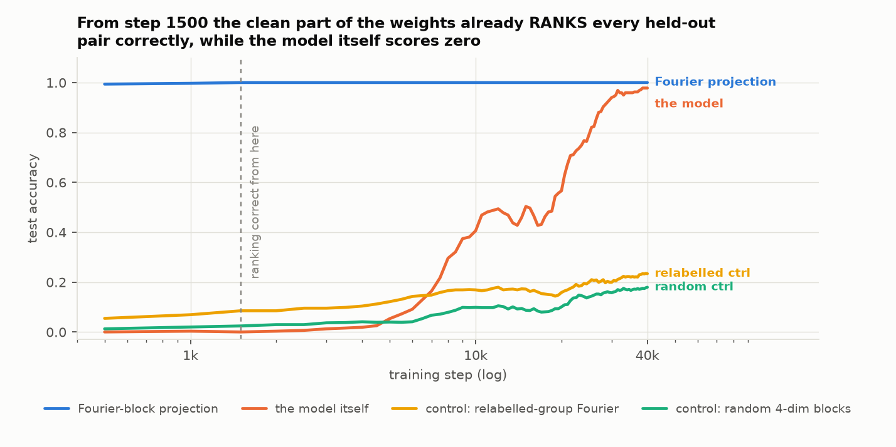
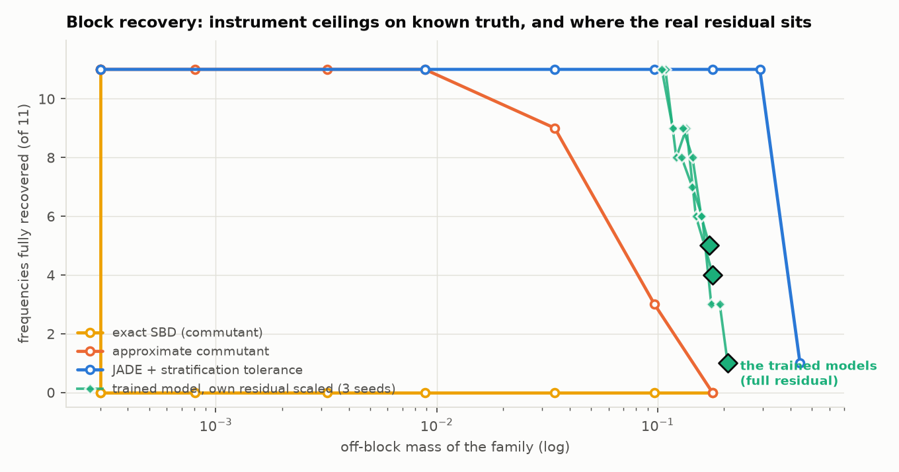
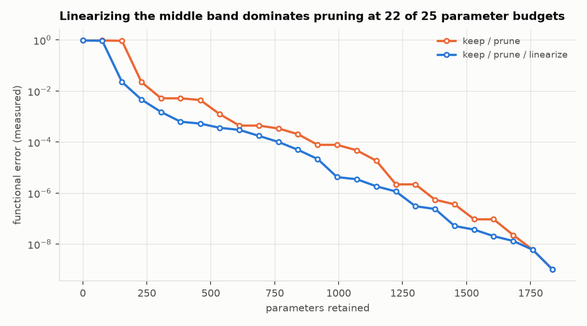
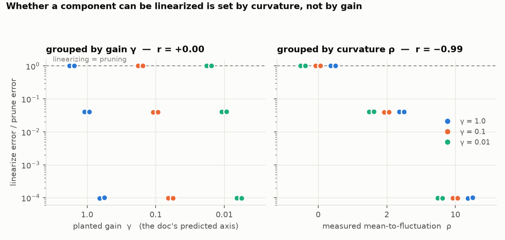

# Results — bilinear quotient experiments (Part A)

> **Amended after independent review.** Three claims are retracted and six corrected —
> see [`REVIEW_RESPONSE.md`](REVIEW_RESPONSE.md) for the full triage, and
> [`THEORY.md`](THEORY.md) for the results that turned out to be theorems rather than
> measurements. Retractions are marked inline below.

Program spec: [`../bilinear-quotient-experiments.md`](../bilinear-quotient-experiments.md).
Shared machinery: `bq_common.py` (forms, Λ metric, whitening, reader moments, the four
nulls, five block-recovery routines, CP and dictionary fits). `bq_sanity.py` asserts the
machinery against known answers — 12/12 pass; run it before trusting anything below.

Setting. `y = D((Lx) ⊙ (Rx))`, per-output form `Q_i = sym(Σ_k D_ik l_k r_kᵀ)`, `y_i = xᵀQ_ix`.
`L, R, D` are a gauge choice of factorisation; the stack `Q` is the computation. Every
claim below is a claim about `Q`, and every one is checked against the four nulls
(random weights / gauge scramble / task shuffle / reader shuffle).

Status: **A1, A2, A3, A4, A5 and B2 (with the B1 census) done.** A6, B0's third
placement, B3 and B4 not started. `BILIN18_CONNECTION.md` carries the results up to the
546M model.

| experiment | scripts | results |
|---|---|---|
| A1 parity/XOR kernel | `a1_parity.py` | `a1_results.json` |
| A2 modular addition | `a2_modular.py`, `a2_calibrate.py`, `a2_jade.py`, `a2_jade_struct.py`, `a2_extra.py`, `a2_diag.py` | `a2_*.json` |
| A3 CP calibration | `a3_cp.py` | `a3_results.json` |
| A4 planted quotient | `a4_quotient.py`, `a4_nulls.py` | `a4_results.json`, `a4_nulls_results.json` |
| A5 shared vs private | `a5_shared.py`, `a5_extra.py` | `a5_results.json`, `a5_extra_results.json` |
| B2 conjunctive retrieval + B1 census | `b_common.py`, `b2_conjunctive.py` | `b2_results.json` |

---

## A1 — parity / XOR: kernel verification

DGP. `z = [k bits in ±1 coding | n_dist continuous distractors]`, embedded as `x = Wz`.
Targets are pairwise parities, which in ±1 coding are the exact degree-2 monomials
`y_c = z_i z_j`, so the ground-truth forms are known: `Q_c = ½(e_ie_jᵀ + e_je_iᵀ)`.
Two arms differ only in whether the diagonal of the lift is probed: `pure` (bits exactly
±1, so `z_i² ≡ 1` and the magnitude coordinates are constant on-distribution) and
`graded` (bits carry a random magnitude, so the diagonal is probed to be zero).

### FINDING A1-1 — all three predictions hold exactly, and the blindness claim is causal to machine precision

`graded` arm, 3 seeds, `k=8`, 4 planted pairs, `n_dist=4`, `h=32`:

| quantity | prediction | measured (3 seeds) |
|---|---|---|
| effective rank of W | 4 (= number of planted pairs) | 4, 4, 4 |
| recovered `Q_c` vs planted | cos = 1 | 1.0000, 1.0000, 1.0000 |
| mass on the planted `(i,j)` entries | 1.0 | 1.0000 |
| blind subspace `∩_c ker(Q_c)` | = the 4 distractor directions | dim 4/4, subspace overlap 1.0000 |
| perturb along the blind subspace | zero output change | rms Δy / rms Δy(active) = **8.4e-16** |
| two inputs, same product, different magnitudes | identical output | rel change **4.6e-16** |
| same pair, product scaled by t=1.5 | rel change exactly t−1 = 0.5 | 0.5000 |

The last two rows are the crisp causal test the doc asks for: an input pair whose *lift
difference* is a planted kernel direction (pure magnitude) produces a bit-identical
output, while the row-space direction produces exactly the predicted change.

Note on method: with a constant learning rate this experiment silently degrades. Adam
normalises by the gradient RMS, so once the loss reaches machine precision it keeps
taking lr-sized steps on numerical noise and drifts back off the exact solution
(FVU 1e-25 at 2k steps → 2.8e-6 at 12k steps, and the blindness ratio degrades from
1e-13 to 8e-4). Annealing the learning rate to zero fixes it (FVU ~1e-31). `bq_common.train`
takes `cosine=True` for this reason.

### FINDING A1-2 — what the data never probes fills with junk that is causally visible

The `pure` arm solves the task exactly (FVU ~1e-31) but its forms are wrong:

| arm | cos(Q, planted) | mass on planted entries | mass on the diagonal | same-product input pair: rel output change |
|---|---|---|---|---|
| graded (diagonal probed) | 1.0000 | 1.0000 | 0.0000 | 4.6e-16 |
| pure (diagonal unprobed) | 0.73 / 0.83 / 0.93 | 0.56 / 0.57 / 0.66 | **0.44 / 0.43 / 0.34** | **0.51 / 0.39 / 0.36** |

With ±1 bits the lift's diagonal coordinates are constant, so no training signal
constrains them; 34–44% of the learned form ends up there. This is not inert: two inputs
with the same product but different magnitudes — which the task says are equivalent —
give outputs differing by 36–51%. The model is *not* blind to a distinction the task
never made, and only the causal test reveals it. (Same moral as FINDING 2 in the parent
folder's `RESULTS.md`, here with the equivalence class made explicit.)

The quotient therefore has two independent sources: directions the **weights** kill, and
directions the **data** never probes. Only the first is a property of the model.

### FINDING A1-3 — the anisotropy knob is a measurement problem, and whitening solves it

Measured on the *exact* hand-coded solution, so optimisation cannot confound it. The
analysis is done in `x` coordinates with `W` unknown (the realistic position):

| embedding κ | cond(Σ_x) | raw metric: rank / blind dim / overlap | Λ metric whitened by Σ_x |
|---|---|---|---|
| 1 | 1.2 | 4 / 4 / 1.000 | 4 / 4 / 1.000 |
| 10 | 92 | 4 / 4 / 1.000 | 4 / 4 / 1.000 |
| 100 | 9.2e3 | 4 / 4 / 1.000 | 4 / 4 / 1.000 |
| 1000 | 9.2e5 | **3 / 6 / 1.000** | 4 / 4 / 1.000 |

At cond(Σ) ~ 1e6 the raw threshold reports rank 3 and a 6-dimensional blind subspace
(both wrong); the whitened metric is still exact. The whitening story is real but the
threshold is generous — it only bites past cond(Σ) ≈ 1e4.

Separately, *training* under an anisotropic embedding fails long before analysis does
(κ=100: FVU 4.95, i.e. the student never learns the task). Worth keeping distinct: that
is an optimisation failure, not an interpretability one.

### A1 nulls

| null | outcome |
|---|---|
| 1. random weights | mass on planted entries 0.005–0.016 (vs 1.0), max cos(Q, planted) 0.04–0.16, blind dim 0 |
| 2a. gauge scramble of the **exact sparse** model | function-preserving to 3e-29; Q-level findings **bit-identical** (planted mass 1.0000 → 1.0000, blind dim 4 → 4) while the weight reading **dies**: L-row top-2 concentration 1.000 → 0.36 |
| 2b. gauge scramble of the **trained** model | Q identical (4.8e-28); the weight statistic barely moves (top-2 0.396 → 0.356) — because at h=32 the trained model is *already* dense in the privileged basis. There is no basis-reading finding in it for the null to kill. |
| 3. task shuffle | FVU 0.998, cos(Q, planted) 0.11–0.18, planted mass 0.036–0.043, blind dim 0 |
| 4. reader shuffle | **vacuous here** — one reader per planted form, so there is no reuse to destroy. Run in A2 and A5 instead. |

Null 2b is the more interesting half: the gauge null can only kill a finding that exists.
The honest statement is that the trained model has no weight-basis structure to lose,
which is itself the reason to work with `Q`.

### A1 knobs

Distractors 0/4/8/16: exact recovery throughout (cos 1.0000), blind subspace recovered in
full (16/16 at n_dist=16, overlap 0.99999999). Label noise σ=0.1/0.3: the *forms* stay
exact (cos 1.0000, planted mass 0.99/0.98) but the hard-thresholded blind subspace
collapses (4 → 2 → 0 directions detected) because the noise floor rises above the
threshold — a threshold-calibration effect, not a recovery failure, and exactly the
stratification-tolerance issue that A4 makes explicit.

---

## A2 — modular addition: ∗-algebra blocks and grokking

DGP. `x = [onehot(a) | onehot(b)] ∈ R^46`, target `(a+b) mod 23`, cross-entropy, 40% of the
529 pairs for training, AdamW with weight decay 1.0, h=128. Three seeds reach test
accuracy 0.978 / 0.934 / 0.953 by 40k steps.

### FINDING A2-1 — the planted algebra is finer than predicted: 22 blocks, not 11, and the canonical object is the isotypic component

The doc predicts "2×2 rotation blocks, one per frequency". Running exact SBD on the
*exact* planted family `Q_c = [[0,½N_c],[½N_cᵀ,0]]`, `N_c[a,b] = Σ_ω cos(2πω(a+b−c)/p)`:

- 22 blocks of dimension 2 (not 11 of dimension 4), in-block mass 1.000000
- commutant dimension 33 = 11 × 3

The extra factor of 2 is the **a↔b exchange symmetry** of `a+b` — the planted family
commutes with the swap operator exactly (`max|[Q_c, S]| = 0.0`), so each frequency's 4-dim
subspace splits into the symmetric and antisymmetric combinations of the a-side and
b-side Fourier planes. (A2-8 shows the *trained* models break this symmetry, and what that
costs.) And 3 = μ(μ+1)/2 at multiplicity μ=2 says those two blocks carry
*equivalent* modules — so the split into two 2-dim blocks is **not unique** (any basis of
the 2-dim multiplicity space gives a valid one). The canonical object is the 4-dim
isotypic component per frequency. `bq_common.isotypic_groups` merges fine blocks by
looking for intertwiners in the commutant, and recovers exactly 11 components of dim 4,
each matching a planted frequency with overlap 1.000000.

Practical consequence for the block machinery: **report isotypic components, not blocks.**
A pipeline that reports the fine blocks will report a gauge choice as a finding.

### FINDING A2-2 — instrument calibration: the commutant route dies at 1% noise, JADE survives 30%

Certification on known truth before use, per the standing rule. The planted family is
perturbed by controlled noise and both routes are asked to recover the 11 frequencies.
Scoring is strict: a frequency counts only if the union of blocks assigned to it spans
exactly that frequency's planted 4-dim subspace.

| off-block mass | exact SBD (commutant) | approximate commutant (`sbd_robust`) | JADE + tolerance (`sbd_jade`) |
|---|---|---|---|
| 0 | 11/11 | 11/11 | 11/11 (ε=0.001) |
| 8e-6 | **0/11** | 11/11 | — |
| 0.0088 | 0/11 | 11/11 | 11/11 (ε=0.01) |
| 0.0342 | 0/11 | 9/11 (block count supplied; 2/11 unaided) | 11/11 (ε=0.05) |
| 0.0968 | 0/11 | 3/11 | 11/11 (ε=0.15) |
| 0.1769 | 0/11 | 0/11 | 11/11 (ε=0.20) |
| 0.2903 | 0/11 | — | 11/11 (ε=0.40) |
| 0.4409 | 0/11 | — | 1/11 |

Three things this buys:

1. **Exact SBD is unusable on trained weights.** It asks for matrices that commute
   exactly; any noise makes the commutant trivial (span{I}) and it returns one block.
2. **The fix is to stop asking algebraically.** JADE (Cardoso–Souloumiac orthogonal joint
   approximate diagonalisation) minimises off-diagonal mass by Givens rotations with a
   closed-form optimal angle per rotation, then the partition is read off the residual
   coupling graph. Direct gradient descent on O(d) for the same objective does **not**
   work — it stalls in local minima (L1 objective: true basis 40.5, random basis 168.9,
   best of 4 gradient restarts 44.9).
3. **The tolerance is not a free parameter, it is the stratification cut.** `partition_from_coupling`
   returns the finest partition whose blocks still carry (1−ε) of the mass, by binary
   search. The calibration shows the required ε tracks the noise almost exactly
   (ε ≈ off-block mass), which is a usable operating rule.

The same holds for *structured* noise (off-block frequency-pair couplings, the kind
training actually leaves): 11/11 up to off-block 0.33 at ε=0.4.

### FINDING A2-3 — a third of a trained model's form mass is unidentifiable — but that is *better* than chance

One-hot inputs probe only a 529-dimensional slice of the 1081-dimensional Sym²(V). The
minimum-norm representative of the same function on the data manifold (`canonicalise`)
drops 29–35% of the trained model's mass while changing the function by 6e-12:

| seed | identifiable mass fraction | off-block mass raw | off-block canonicalised |
|---|---|---|---|
| 0 | 0.712 | 0.2226 | 0.1777 |
| 1 | 0.646 | 0.2444 | 0.2075 |
| 2 | 0.705 | 0.2281 | 0.1717 |

**With its baseline** (added after review). The identifiable subspace is 529 of 1081
dimensions, so isotropic chance identifiability is **48.9%**. Measured: random symmetric
forms 0.489, random-initialised layers 0.479 / 0.500 / 0.488, trained 0.712 / 0.646 / 0.705.
So the trained model is ~1.4× *more* data-aligned than chance, and the honest framing is
that it concentrates 65–71% of its mass in a subspace occupying 49% of the space — not that
a third of it is junk. The planted family is 0.99999999999978 identifiable.

The methodological point stands unchanged: any weight-space mass statistic must be computed
after this projection, because a third of the raw mass cannot affect the function. Caveat
recorded: `canonicalise` projects in the Frobenius metric, which the program's own rule says
not to use for error; the fraction is metric-dependent.

### FINDING A2-4 — projecting the weights onto the Fourier blocks is a data-free generalisation surgery, and the circuit it isolates ranks correctly long before the model does

Projecting the canonicalised forms onto the planted frequency blocks — a purely
weight-space operation, no data, no gradient:

| seed | test acc before → after | test CE before → after | functional residual removed |
|---|---|---|---|
| 0 | 0.9780 → **1.0000** | 0.1400 → 0.0006 | 0.319 |
| 1 | 0.9340 → **1.0000** | 0.2639 → 0.0026 | 0.341 |
| 2 | 0.9528 → **1.0000** | 0.1584 → 0.0011 | 0.314 |

So the ~32% of the function outside the block structure is not harmless junk. Evaluating
the **residual alone** (`Q_canonical − Q_block`) as a model settles what it is:

| seed | residual-only train acc | residual-only test acc | mean correct-class logit boost, train | on test |
|---|---|---|---|---|
| 0 | 0.9526 | **0.0000** | **+4.51** | **−2.99** |
| 1 | 0.9336 | **0.0000** | +4.70 | −3.12 |
| 2 | 0.9526 | 0.0031 | +4.43 | −2.94 |

The residual is a pure lookup table: 95% on the training pairs, 0% on held-out pairs. It
raises the correct logit by +4.5 on examples it has seen and *suppresses* it by −3.0 on
examples it has not. That is why deleting it doesn't merely leave the model intact — it
makes the model better. The block decomposition separates the circuit from the lookup
table cleanly enough that the split can be made in weight space alone.

Tracking the projection through training (seed 0, every 500 steps) gives the sharper
result:

| step | model test acc | Fourier-projected test acc | projected CE | ctrl: random 4-dim blocks | ctrl: relabelled-group Fourier |
|---|---|---|---|---|---|
| 0 | 0.031 | 0.006 | 3.138 | 0.037 | 0.038 |
| 500 | 0.000 | **0.994** | 1.638 | 0.013 | 0.055 |
| 1500 | 0.000 | **1.000** | 1.130 | 0.024 | 0.085 |
| 5000 | 0.053 | 1.000 | 0.468 | 0.040 | 0.122 |
| 13000 | ~0.50 | 1.000 | ~0.05 | ~0.09 | ~0.17 |
| 27000 | 0.881 | 1.000 | 0.001 | 0.152 | 0.199 |
| 39000 | 0.978 | 1.000 | 0.001 | 0.174 | 0.233 |

> **RETRACTED as written.** Two claims here were wrong and are corrected below; see
> `REVIEW_RESPONSE.md` R1 and R2.

**From step 1500 a 44-dimensional projection carrying a quarter of the function already
gets every held-out pair's ordering right, while the model itself scores 0.000.** That much
holds. But the two stronger claims do not:

*The circuit is not "fully formed" at 1500.* At that point the block part accounts for only
25% of the function (functional residual 0.749) and is 0.80 aligned with its own final form
in the Λ metric — an alignment that then wanders (0.835, 0.848, 0.817) before converging.
Test accuracy 1.000 is an argmax statistic; projected CE is 1.130 against 0.0006 at the end.
What is right at step 1500 is the *ranking*, not the circuit.

*Grokking is not the decay of the memorisation term.* Measured directly:

| step | circuit logit rms | residual logit rms | off-block | functional residual |
|---|---|---|---|---|
| 3000 | 0.905 | 1.506 | 0.564 | 0.708 |
| 12000 | 1.843 | 1.850 | 0.322 | 0.490 |
| 21000 | 2.589 | **2.343** | 0.298 | 0.441 |
| 39000 | 2.780 | 1.929 | 0.179 | 0.320 |

The residual *grows* to a peak and ends 28% above its early value; the circuit grows 3.1×.
The falling off-block fraction is the numerator growing. Grokking here is dominated by the
circuit's growth against a memorisation term that rises and then partially recedes.

Both matched controls fail as they should: projecting onto random 4-dim subspaces of the
same total dimension gives 0.01–0.17, and onto the Fourier blocks of a randomly
**relabelled** group (same shapes, same Fourier character, wrong group) gives 0.04–0.23.
The projection is not doing the work; the specific structure is.

### FINDING A2-5 — weights-only block recovery on the trained model: partial, and the residual is harder than noise of the same size

Applying the calibrated JADE + tolerance pipeline to the trained models (no ground truth
used in the recovery, only in the scoring):

| model | off-block | best frequencies recovered | at ε | in-block mass |
|---|---|---|---|---|
| trained seed 0 | 0.178 | 4/11 | 0.20 | 0.802 |
| trained seed 1 | 0.208 | 1/11 | 0.25 | 0.756 |
| trained seed 2 | 0.172 | 5/11 | 0.20 | 0.804 |
| *calibration: isotropic noise at 0.177* | 0.177 | *11/11* | *0.20* | — |
| *calibration: structured noise at 0.200* | 0.200 | *11/11* | *0.25* | — |
| null: random weights | 0.91 | 0/11 | — | — |
| null: task shuffle | 0.90 | 0/11 | — | — |
| null: gauge scramble of seed 0 | 0.178 | **4/11 at ε=0.20 — identical to the trained model** | | |

Read carefully. Recovery is real (4–5/11 versus 0/11 for both nulls, and exactly
reproduced under the gauge null), and it beats the commutant route, which gets 0/11 here.
But it falls **well short of what the same off-block mass permits when the residual is
synthetic** — 11/11 for all three surrogates I could construct at the trained level:

| residual type at the trained model's noise level | off-block | frequencies recovered |
|---|---|---|
| isotropic symmetric noise | 0.177 | 11/11 |
| structured off-block frequency coupling | 0.200 | 11/11 |
| memorisation-shaped (train-set outer products) | 0.159 | 11/11 |
| **the trained model's actual residual** | 0.178 | **4/11** |

Scaling the model's *own* residual isolates the threshold. Writing the canonicalised model
as `Q = Q_block + α·Residual` and sweeping α over all three seeds:

| α | 0 | 0.25 | 0.50 | 0.75 | 0.80 | 0.85 | 0.90 | 0.95 | 1.00 |
|---|---|---|---|---|---|---|---|---|---|
| off-block (seed 0) | 0.000 | 0.013 | 0.051 | 0.108 | 0.122 | 0.135 | 0.149 | 0.163 | 0.178 |
| seed 0 | 11 | 11 | 11 | **11** | 8 | 9 | 6 | 5 | **4** |
| seed 1 | — | — | — | 8 | 7 | 6 | 3 | 3 | **1** |
| seed 2 | — | — | — | **11** | 9 | 9 | 8 | 6 | **5** |

So the pipeline handles ~75% of the real residual and then falls off a cliff between
off-block 0.10 and 0.13 — whereas isotropic noise is tolerated to 0.29 and structured
noise to 0.33. The trained residual is roughly 2–3× harder per unit of off-block mass than
any surrogate, and the decay is steep rather than gradual.

> **Corrected after review (`fix_blind_eps.py`).** The tolerance ε in the table above was
> selected as the best of a 9-point sweep *scored against the planted answer*, so these are
> oracle numbers and "no ground truth used in the recovery" was wrong. Redone with a blind
> rule — ε = the JADE-rotated family's own residual off-diagonal mass, which needs no
> ground truth — and applied identically to every model:
>
> | | off-block | **blind ε** | oracle best-of-9 |
> |---|---|---|---|
> | planted + isotropic noise, all six levels to 0.29 | ≤0.29 | **11/11** | 11/11 |
> | trained seed 0 / 1 / 2 | 0.18 / 0.21 / 0.17 | **2 / 1 / 2** | 4 / 1 / 5 |
> | symmetrised seed 0 / 1 / 2 (A2-8) | 0.11 / 0.12 / 0.10 | **8 / 7 / 11** | 10 / 9 / 11 |
> | null: random weights, task shuffle | 0.91 | **0/11** | 0/11 |
>
> The blind rule is free on the whole synthetic calibration (gap 0 at every noise level,
> mean gap 0.60 frequencies overall) and costs 2–3 frequencies on the hardest trained
> models. So the calibration in A2-2 stands as written; the trained-model number in the
> table below drops from 4–5/11 to **1–2/11**; and A2-8's symmetrised pipeline still
> recovers **7–11 of 11 with no ground truth anywhere**, one seed at 11/11.

The honest verdict is therefore *partial recovery, tool-limited, with the limitation
localised and quantified*: not "the instrument is too weak" but "this particular residual
is harder than noise of its size, and none of the three obvious models of it reproduces
that hardness." A2-8 identifies most of what makes it hard, and removes it.

### FINDING A2-8 — the trained model breaks the task's input symmetry; restoring it is a second data-free surgery that both completes grokking and makes the blocks recoverable

`a+b = b+a`, so the exact planted family commutes with the a↔b swap operator exactly
(`max|[Q_c, S]| = 0.0`). This is *why* the isotypic multiplicities in A2-1 are 2. The
trained models do not: only 85–88% of their form mass is swap-equivariant.

Symmetrising is a purely weight-space operation using only the task's evident input
symmetry — no data, no gradients, and strictly less prior knowledge than the Fourier
projection of A2-4:  `Q ← ½(Q + S Q S)`.

| seed | swap-equivariant mass | test acc → | off-block → | JADE recovery → |
|---|---|---|---|---|
| 0 | 0.877 | 0.9780 → **1.0000** | 0.178 → 0.106 | 4/11 → **10/11** |
| 1 | 0.848 | 0.9340 → **1.0000** | 0.208 → 0.119 | 1/11 → **9/11** |
| 2 | 0.863 | 0.9528 → **1.0000** | 0.172 → 0.102 | 5/11 → **11/11** |

Nulls: on random weights the equivariant fraction is 0.536 (chance) and symmetrising moves
test accuracy 0.044 → 0.038; on the task-shuffled model 0.528 and 0.035 → 0.031, and JADE
on the symmetrised task-shuffled model still recovers 0/11. So the surgery only helps a
model that already contains a symmetric circuit, and the trained models are far above
chance equivariance.

Is symmetry-breaking *specifically* what defeats block recovery, or merely extra mass?
Splitting the residual into its swap-symmetric and swap-antisymmetric halves (52% / 48% of
the residual's mass) and rescaling each to the full residual's off-block mass:

| residual added to the block model, all at off-block 0.178 | frequencies recovered |
|---|---|
| symmetry-preserving half only | 7/11 |
| symmetry-breaking half only | **3/11** |
| both (the real residual) | 4/11 |
| synthetic isotropic noise | 11/11 |

The symmetry-breaking half is more than twice as damaging as the symmetry-preserving half
at equal mass — but *both* halves are far harder than synthetic noise. So symmetry-breaking
is a large part of the answer, not all of it, and symmetrisation helps twice over: it
deletes the worse half and halves the total residual at the same time. What remains hard
about the symmetry-preserving half is still open.

This gives a fully weights-only pipeline for this model: **symmetrise → JADE at a blind
tolerance → 7–11 of 11 frequency blocks recovered → project onto them → test accuracy
1.000.** The only task knowledge used is that the two input slots are interchangeable.
(With the oracle tolerance it is 9–11; the blind rule costs about two frequencies. Both are
reported in `fix_blind_eps_results.json`.)

### FINDING A2-6 — verification: blocks ablate as predicted, and splice across independently trained models

**Ablation.** Removing one frequency block from the block-projected model drives that
frequency's logit contribution to zero (variance ratio 1.2e-33 to 2.9e-33 across all 11)
while its correlation with the ideal `cos(2πω(a+b−c)/p)` pattern before ablation is
0.90–0.95. Accuracy is a saturated readout here — 11 frequencies are redundant — so the
dose-response is the informative version:

| frequency blocks removed | test acc | test CE | equal-dimension random subspaces: acc | CE |
|---|---|---|---|---|
| 0 | 1.0000 | 0.0005 | 1.0000 | 0.0005 |
| 3 | 1.0000 | 0.0145 | 0.9790 | 0.2143 |
| 5 | 1.0000 | 0.0994 | 0.8145 | 0.8953 |
| 8 | 0.9403 | 0.9870 | 0.3187 | 2.3355 |
| 10 | 0.1981 | 2.3871 | 0.0933 | 2.9811 |

Cutting along the recovered blocks is uniformly the *least* damaging cut of a given
dimension — which is what it means for them to be the seams of the computation. Any 3
frequencies can be deleted with no accuracy loss at all.

**Splice.** Two independently trained models (seeds 0 and 1), each canonicalised into
frequency blocks; the hybrid takes frequencies 1–5 from A and 6–11 from B:

| A alone | B alone | A's half | B's half | **hybrid** | hybrid, phase-scrambled control |
|---|---|---|---|---|---|
| 1.0000 | 1.0000 | 0.8828 | 0.9830 | **1.0000** | 0.6163 |

The hybrid beats both halves, so this is genuine composition of parts from different
training runs, not one half carrying it. Rotating B's blocks within their own subspaces —
same energy, same frequencies, destroyed phase alignment — drops it to 0.6163, so what
transfers is the phase relationship the blocks encode, not merely their span.

### FINDING A2-7 — crystallisation coincides with the transition and then arrests

Prediction (iii) asked whether block crystallisation precedes or coincides with the
generalisation transition. Measured (seed 0, canonicalised off-block mass):

| step | 0 | 20k | 40k | 60k | 100k | 140k | 200k | 260k |
|---|---|---|---|---|---|---|---|---|
| test acc | 0.031 | 0.566 | 0.978 | 0.981 | 0.981 | 0.987 | 0.987 | 0.991 |
| off-block, canonicalised | 0.913 | 0.311 | 0.178 | 0.172 | 0.171 | 0.168 | 0.167 | **0.169** |
| off-block, raw | 0.896 | 0.355 | 0.223 | 0.216 | 0.215 | 0.214 | 0.213 | 0.214 |
| functional residual | 0.903 | 0.452 | 0.319 | 0.313 | 0.309 | 0.307 | 0.307 | 0.306 |

*Restored and now reproducible* (`a2_followups.py`). These columns were withdrawn after
review because they came from an exploratory run whose script was never committed. Re-run
under a committed script, step 40000 reproduces the cached trajectory exactly
(0.9780 / 0.2226 / 0.1777), so the continuation is faithful. The reviewer also caught a
labelling error: what I originally called the canonicalised off-block at 200k/260k
(0.213 / 0.214) was the **raw** figure. Both are now given.

**Crystallisation arrests.** Over the last nine checkpoints — 100k to 260k steps — the
canonicalised off-block mass moves only between 0.1672 and 0.1713, a spread of 0.004, while
test accuracy creeps from 0.981 to 0.991. Six times as much training past the transition
buys nothing structurally.

Crystallisation is monotone and coincident with the test-accuracy rise — and then it
**stops**, at ~0.214 raw / ~0.169 canonicalised, holding flat from 40k to 260k steps while
test accuracy creeps to 0.991. The grokked bilinear solution is not the pure Fourier
solution and does not converge to it under continued weight decay.

Combined with A2-4 the residue is both permanent and harmful: training will not remove it,
and deleting it by hand takes the model to test 1.000. Note this is consistent with, and
sharper than, the corrected A2-4 dynamics — the residual's *logit scale* rises and then
partially recedes, but its *share* of the function stops falling at 40k and stays put for
another 220k steps.

### A2 nulls (summary)

| null | invariant as it should be | destroyed as it should be |
|---|---|---|
| 1. random weights | — | off-block 0.91, block-projected acc 0.02–0.07, phase coherence 0.08–0.36, 0/11 frequencies |
| 2. gauge scramble | ΔQ 6.8e-27; off-block 0.1777 → 0.1777; JADE recovery 4/11 → 4/11 | L-row Fourier concentration 0.53 → 0.28, 0.59 → 0.27 |
| 3. task shuffle | — | train acc 1.000 / test 0.035; off-block 0.90; block-projected test 0.035; 0/11 |
| 4. reader shuffle | set-level structure untouched (off-block 0.1777 → 0.1777) — SBD/JADE depend only on the *set* of forms, so this null is **vacuous for them** | the reader-indexed claim dies: phase coherence (per-class rotation angle linear in c) 0.980 → 0.199, 0.977 → 0.231 |

Null 4 deserves its own note. Permuting which class gets which form leaves the *set*
`{Q_c}` unchanged, so every set-level structural claim (blocks, algebra, spectra) is
automatically invariant and the null tests nothing about them. It only bites on
reader-indexed claims. The one here is that inside frequency ω's block the per-class 2×2
cross matrix is the reflection at angle `θ_c = 2πωc/p` — measured as circular coherence
0.97–0.99 in the trained models, 0.20–0.23 under the shuffle, 0.08–0.36 at random init.
A pipeline whose only claims are set-level should say so rather than report null 4 as
passed.

---

## A3 — planted low-rank teacher: CP calibration

DGP. `y_i = Σ_k γ c_ik (a_kᵀx)(b_kᵀx)`, known `{a_k, b_k}`, `d=16`, `m=8`, Gaussian inputs.
The gauge-invariant object per component is the symmetric form `S_k = sym(a_k b_kᵀ)`
(invariant to `(a,b) → (ca, b/c)`, joint sign flip, and `a↔b`), so recovery is scored on
`{S_k}` matched by Hungarian assignment. Two arms: `solver` fits CP to the **exact**
teacher forms (isolating the fitter) and `learned` fits CP to a trained student.

### FINDING A3-1 — the operating range: components are trustworthy to K ≈ 1.5d, and the fit error does not warn you past it

Arm 1, exact teacher forms, `d=16` (so `dim Sym² = 136`), 2 seeds:

| true rank K | K/d | CP fit error (Λ) | mean matched cos | fraction > 0.9 | fraction > 0.99 |
|---|---|---|---|---|---|
| 2, 4, 8, 12, 16 | ≤ 1.0 | ~2e-32 | **1.000** | 1.00 | 1.00 |
| 24 | 1.5 | 6e-31 | **1.000** | 1.00 | 1.00 |
| 32 | 2.0 | 4e-18 | 0.957 | 0.97 | 0.03 |
| 48 | 3.0 | **1.7e-32** | 0.907 | 0.65 | 0.00 |

Two things to carry into the other experiments:

1. **Components are trustworthy as variables well into superposition** — exact recovery at
   K = 24 with d = 16, i.e. 1.5× more components than input dimensions. Past K ≈ 2d they
   degrade.
2. **The fit error is a one-sided diagnostic.** At K=48 the CP fit is *perfect*
   (1.7e-32, machine precision) while a third of the components are wrong. A low
   reconstruction error is not evidence that the components mean anything. This is the
   single most important caveat the calibration produces, and it is the reason A4's
   component decomposition is scored against planted directions rather than against its
   own residual.

### FINDING A3-1b — the limit is NOT on the input-dimension axis (`a3_axis.py`)

A3 as originally run varied only the component count at fixed `m = 8` outputs and `d = 16`
input dimensions, and attributed the breakdown to `K/d`. Reviewer 2 pointed out that the
form family's own effective rank is exactly `m` at every `K`, so the same data is equally
consistent with a limit in `K/m`. Sweeping `m` and `d` independently settles it, and one
pair of cells is decisive:

| m | d | K | K/d | K/m | outcome |
|---|---|---|---|---|---|
| 8 | 16 | 32 | 2.0 | 4.0 | **failed** (3% of components above 0.99) |
| 16 | 16 | 32 | 2.0 | 2.0 | **recovered** (100%) |

Same `K/d`, opposite outcome — doubling the number of *outputs* turns failure into complete
recovery. Across all 25 cells, recovery correlates with `−log(K/Kruskal bound)` at **+0.762**,
with `−log(K/m)` at **+0.722**, and with `−log(K/d)` at **+0.658** — the axis A3 originally
reported is the worst of the three. The Kruskal bound `R ≤ (m + 2d − 2)/2` (`THEORY.md` T6)
is the best single predictor and agrees with the observed outcome on 17 of 25 cells;
recovery beyond it does happen, which is expected since Kruskal is sufficient, not necessary.

The practical statement for `BILIN18_CONNECTION.md` §2.1 is therefore the Kruskal one, not
the `K/d` one, and that document has been corrected.

### FINDING A3-2 — correlation between planted directions, not learning, is the binding constraint

Arm 1b (solver) and arm 2c (learned) agree closely, so this is a property of the
decomposition problem, not of the student:

| correlation ρ between planted directions | solver: mean cos / frac > 0.9 | learned: mean cos / frac > 0.9 |
|---|---|---|
| 0.0 | 1.000 / 1.00 | 1.000 / 1.00 |
| 0.3 | 1.000 / 1.00 | 1.000 / 1.00 |
| 0.6 | 0.938 / 0.75 | 0.943 / 0.88 |
| 0.9 | 0.763 / 0.38 | 0.699 / 0.38 |

By ρ = 0.9 only 38% of components are recovered to cos > 0.9 — and again the fit error
does not signal it (3.5e-5). Anywhere the planted directions are near-parallel, CP
components should not be read as variables.

### FINDING A3-3 — label noise does not corrupt the forms; a capacity-limited student does

Arm 2b, K=8, h=32, label noise σ:

| σ | student FVU | form error vs teacher | mean matched cos |
|---|---|---|---|
| 0 | 1.3e-5 | 0.000 | 1.000 |
| 0.05 | 2.5e-3 | 0.000 | 1.000 |
| 0.2 | 3.8e-2 | 0.000 | 1.000 |
| 0.5 | **0.199** | **0.000** | **1.000** |

At σ=0.5 the student's FVU is 0.199 and its interaction forms are still exactly the
teacher's — the noise is averaged away and lands entirely in the irreducible error, not in
the weights. Recovery quality therefore should not be read off FVU.

What *does* hurt is a student without slack: at `h = K` the student stops fitting
(K=16: FVU 1.8e-2, K=24: FVU 5.8e-3) and recovery falls to cos 0.85–0.90 with only 56–62%
of components above 0.9, while the same K at `h = 4K` or `h = 64` recovers perfectly. The
degradation tracks the fit error, i.e. it is an optimisation failure passed downstream, not
a CP failure.

### FINDING A3-4 — over-ranked fits are the dangerous case

Arm 2d, true K=8:

| fit rank | CP fit error | mean matched cos | frac > 0.9 | subspace recovery |
|---|---|---|---|---|
| 4 | 2.8e-1 | 0.951 | 1.00 | 0.500 |
| 6 | 8.0e-2 | 0.953 | 0.83 | 0.750 |
| **8** | 1.2e-5 | **1.000** | 1.00 | 1.000 |
| 10 | 1.2e-5 | 0.915 | 0.75 | 1.000 |
| 16 | 1.0e-5 | 0.987 | 1.00 | 1.000 |

Under-ranking is *safe and self-announcing*: the fit error jumps by four orders of
magnitude, and the components that are found are still correct (cos 0.95) — you simply get
a subset. Over-ranking is neither: the fit error is indistinguishable from the correct rank
(1.2e-5 at r=10 versus 1.2e-5 at r=8) while a quarter of the components have been split or
duplicated. **Choose the rank by the elbow in the fit error, never by "it fits well".**

### A3 nulls

| null | outcome |
|---|---|
| 1. random weights | mean matched cos 0.130 / 0.143 / 0.117 against the planted set, **0% above 0.9** (versus 1.000 and 100% for the trained student) |
| 2. gauge scramble | refactorisation residual 2e-28 / 9e-28, hidden width `h` 32 → 136, and recovery **unchanged**: mean cos 1.000 → 1.000, frac > 0.9 1.00 → 1.00 |
| 3. task shuffle | student trained on permuted targets: mean matched cos 0.164, 0% above 0.9 |
| 4. reader shuffle | **vacuous for component recovery** — permuting the reader index changes only the mixing matrix `c`, not the component set `{S_k}`. It does bear on the mixing claim, which is not tested here. |

Caveat on one metric: `subspace_recovery` is degenerate at K ≥ d/2, because 2K factor
vectors in `d` dimensions span everything — it reads 1.000 even for random weights. Only
the matched-cosine numbers carry information at these ranks.

---

## A4 — planted quotient: the stratification and the linearization band

DGP. `x = μ + z` in `R^48` (8 directions never read). The teacher is
`y_i = Σ_j γ_j c_ij (a_jᵀx)(b_jᵀx)` over 18 components laid out on a **3×3 design in two
independent axes**, because the doc's prediction names only one of them:

- `γ ∈ {1, 0.1, 0.01}` — the gain, i.e. how much of the function the component is. This is
  the axis the doc's "intermediate singular value" refers to.
- `ρ ∈ {0, 2, 10}` — the mean-to-fluctuation ratio along `a_j, b_j`, i.e. how *curved* the
  component is on-distribution.

Why two. Linearising `(aᵀx)(bᵀx)` about the input mean leaves the residual `(aᵀδ)(bᵀδ)`
with `δ` the fluctuation, so linearisability should be set by `ρ`, not by `γ`. The design
lets the hypotheses disagree. Components read disjoint pairs from a random orthonormal
frame, which makes the realised `ρ_j` exactly the planted one (measured: 0.00, 1.99, 9.96,
… against planted 0, 2, 10) and makes the component forms Sym²-orthogonal. Student:
h=192 on the lifted input `[1, x]` so affine terms are representable, FVU 6.8e-6.

### FINDING A4-1 — planted collapse and the planted gain profile both come back

**(i) Hard collapse.** Perturbing along the 8 never-read directions moves the output by
rms 8.9e-3 against 1.9e0 for a matched live perturbation — blindness ratio **4.6e-3**,
which is the square root of the student's FVU, i.e. blindness holds down to the fit's own
noise floor and not further. The sharp version is algebraic: 99.995% of the dead
directions' lifted mass is captured by the kernel of the lift map.

**(ii) Contraction spectrum.** Recovered gains against planted, by cell:

| planted γ | recovered (6 components each) |
|---|---|
| 1.00 | 0.975, 0.988, 0.990, 0.945, 0.983, 0.996 |
| 0.10 | 0.038, 0.082, 0.055, 0.077, 0.092, 0.090 |
| 0.01 | 0.0086, 0.0088, 0.0057, −0.0041, 0.0012, 0.0080 |

The two-decade profile is reproduced and the three levels never overlap, but the
per-component estimates are only good to a factor of ~2 at γ=0.1 and to sign at γ=0.01.
The contraction spectrum is a reliable *ordering* and an unreliable *value* at this fit
quality (decomposition residual 1.0e-2).

### FINDING A4-2 — the linearization band is real: it improves the Pareto frontier at 22 of 25 budgets, by up to 10×

Per component, three surgeries: keep (2d+m parameters), linearise (d+m — one tangent
covector), prune (0). A DP over the additive surrogate selects an assignment for each
budget, and the reported error is then **measured exactly** on that assignment.

| parameter budget | keep/prune only | + linearize | improvement |
|---|---|---|---|
| 229 | 2.24e-2 | 4.62e-3 | 4.9× |
| 459 | 4.43e-3 | 5.27e-4 | 8.4× |
| 688 | 4.40e-4 | 1.74e-4 | 2.5× |
| 918 | 7.73e-5 | 2.15e-5 | 3.6× |
| 1147 | 1.84e-5 | 1.83e-6 | 10.1× |
| 1377 | 5.44e-7 | 2.35e-7 | 2.3× |
| 1606 | 9.28e-8 | 2.02e-8 | 4.6× |
| 1836 (full) | 2.1e-32 | 2.1e-32 | 1.0× |

Linearisation strictly wins at 22/25 budgets and ties at the two endpoints (where
everything is pruned or everything is kept), which is the predicted shape.

Caveat, stated plainly: the surgery errors are **not** additive across components
(max deviation 33% on random assignments; DP surrogate vs measured error deviates by up
to 1.07 relative). The components are Sym²-orthogonal, but the functional error is
measured under an input distribution with a nonzero mean, and the cross terms do not
vanish. So the reported curve is an *achievable* frontier obtained by an identical
procedure on both sides — a fair comparison, not a proven optimum.

### FINDING A4-3 — curvature governs straightenability and gain does not — but this is a theorem, not a measurement

Correlation of `log(linearize error / prune error)` across the 18 components:

| against | correlation |
|---|---|
| `log γ` (the doc's predicted axis) | **+0.000** |
| `log(1 + measured ρ)` (curvature) | **−0.993** |

Mean linearize/prune error ratio by cell:

| by γ | 0.01 | 0.1 | 1.0 |
|---|---|---|---|
| ratio | 0.3468 | 0.3464 | 0.3467 |

| by ρ | 0 | 2 | 10 |
|---|---|---|---|
| ratio | 1.000 | 0.0398 | 9.7e-5 |

Gain is *exactly* uninformative about linearisability — the three γ levels agree to four
significant figures — while curvature spans four orders of magnitude. At ρ=0 the ratio is
exactly 1.000 because the tangent at the mean is zero, so linearising *is* pruning.

> **Relabelled after review.** `THEORY.md` T3 proves that `err_lin/err_prune` is invariant
> under scaling a component's gain, so the `+0.000` correlation is *forced*, not observed;
> in this DGP the ratio is exactly `1/(1+ρ²)²` (1, 0.04, 9.803e-5 against measured 1.0000000,
> 0.039817, 9.691e-5). The experiment confirmed arithmetic.
>
> I also over-claimed against the plan. The plan's stated prediction is that the band *moves
> with the tolerance*, and `band_vs_budget` confirms exactly that. I substituted a different
> statistic and then called the plan wrong. What is corrected is the mechanism, not the
> prediction:

> **ρ decides whether a component can be linearised; γ decides whether it is worth the
> budget.** They are orthogonal axes, and only the first is about linearisation at all.

The budget sweep shows both roles at once — the linearised set is *always* drawn from
ρ ∈ {2, 10} and never from ρ=0, while *which* of those get linearised marches down the γ
ladder as the budget grows:

| budget | keep / linearize / prune | linearized cells (γ, ρ) |
|---|---|---|
| 229 | 0 / 4 / 14 | (1, 10) ×2, (0.1, 10) ×2 |
| 459 | 1 / 6 / 11 | (1, 2) ×2, (1, 10), (0.1, 10) ×2, (0.01, 10) |
| 918 | 6 / 5 / 7 | (0.1, 2), (0.1, 10) ×2, (0.01, 10) ×2 |
| 1377 | 11 / 4 / 3 | (0.01, 2) ×2, (0.01, 10) ×2 |
| 1836 | 18 / 0 / 0 | — |

This is the doc's "the band's location moves with the downstream tolerance ε", confirmed —
but it moves along the γ axis *within* the high-ρ set, rather than the band itself being a
γ interval.

### A4 caveats

- Only one teacher seed and one student were run. The γ and ρ effects are large (four
  orders of magnitude on the axis question) but the per-component gain estimates would
  benefit from seeds.
- The component decomposition uses the planted directions (oracle). A3 bounds what a
  blind CP recovery would cost here; wiring A3's fitter into A4 in place of the oracle is
  the obvious next tick.
- Nulls 1–4 were not run for A4: the claims here are about a planted teacher and the
  surgery arithmetic, not about discovering structure, so the null battery as specified
  does not apply cleanly. This is a gap relative to the doc's "every experiment ships
  with its four nulls" rule and should be closed if A4's claims are used downstream.

---

## Method notes worth carrying forward

1. **Anneal the learning rate whenever the target is exactly realisable.** Adam normalises
   by the gradient RMS and will walk a machine-precision solution back out. This changed
   A1's blindness ratio by 12 orders of magnitude.
2. **Canonicalise before measuring weight-space geometry.** Project the forms onto the
   span of the lifted data. On modular addition 29–35% of the trained mass is otherwise
   unidentifiable noise that changes every mass-fraction statistic.
3. **Never use the exact commutant on trained weights.** Certify the block instrument
   first; the operating ranges differ by 30× between routes.
4. **Report isotypic components, not blocks,** whenever an irrep can repeat.
5. **The gauge null can only kill a finding that exists.** Check that the basis-reading
   statistic is above chance in the trained model before claiming the null passed.
6. **Reader shuffle is vacuous for set-level claims.** Say which claims it tests.

---

## What Part A changes about the plan

Three items in the spec should be updated before A5/A6/Part B are built on top:

1. **A2's block prediction was too coarse and A4's band prediction was on the wrong axis.**
   Blocks: report isotypic components, not blocks (A2-1). Band: curvature, not gain (A4-3).
2. **"Every experiment ships with its four nulls" needs a caveat.** Null 4 (reader shuffle)
   is vacuous for any claim about the *set* of forms — which includes every block, algebra
   and spectrum claim. It tests reader-indexed claims only. Null 2 (gauge scramble) can
   only kill a finding that exists, so it must be paired with a check that the
   basis-reading statistic was above chance to begin with. Both are recorded per experiment
   above rather than reported as blanket passes.
3. **Canonicalisation belongs in section 0's shared machinery.** The spec's whitening step
   handles anisotropy but not unidentifiability. On modular addition 29–35% of the trained
   form mass is invisible to the function (A2-3); on parity the never-probed diagonal takes
   34–44% and is causally harmful (A1-2). Project onto the span of the lifted data first.

## A4 addendum — the four nulls, and the oracle-free version (`a4_nulls.py`)

Both gaps recorded against A4 are now closed, and one of the nulls changes how A4 should
be read.

### FINDING A4-4 — the result survives dropping the oracle

A4 originally decomposed the student using the teacher's own component directions. Redone
blind, with the CP fitter A3 calibrated (A4 has 18 components in 48 dimensions, K/d = 0.38,
inside A3's certified range):

| arm | component recovery | corr with curvature | straightening wins | median gain |
|---|---|---|---|---|
| oracle directions | 1.000 (by construction) | **−0.992** | 22/25 | 5.2× |
| blind, rank 18 | mean cos 0.534, 44% > 0.9 | **−0.978** | 21/25 | 2.0× |
| blind, rank 22 | mean cos 0.581, 44% > 0.9 | **−0.981** | 21/25 | 2.3× |

The conclusion does not depend on the oracle. Note the components are only half-recovered
(44% above cosine 0.9) and the axis result is unchanged anyway — it is robust to getting
the parts substantially wrong.

One measurement caveat. In the blind arm "size" has to be estimated, and the natural proxy —
how much error deleting the component causes — is itself driven by curvature, so it
correlates −0.88 with straightenability. That is not a contradiction of A4-3: against the
*planted gain*, the correlation is +0.00. The clean statement is that the gain is
uninformative and the realised contribution is informative only because it inherits
curvature.

### FINDING A4-5 — the nulls say the linearization result is not about training

| null | component recovery | corr with curvature | straightening wins | median gain |
|---|---|---|---|---|
| trained (reference) | 1.000 | −0.992 | 22/25 | 5.2× |
| 1. random weights | **0.063**, 0% > 0.9 | −0.757 | **23/25** | **9.3×** |
| 2. gauge scramble | 1.000 | −0.993 | 22/25 | 5.1× |
| 3. task shuffle | **0.075**, 0% > 0.9 | −0.938 | **23/25** | 1.7× |
| 4. reader shuffle | 1.000 | −0.992 | 22/25 | 5.2× |

Null 2 is perfect invariance as required (refactorisation residual 8.4e-26, hidden width
192 → 1225, every number unchanged). Null 4 is vacuous by construction and measured to be so.

Nulls 1 and 3 are the informative ones, and they are not kind to the framing. **A randomly
initialised network shows the straightening advantage at 23/25 budgets with a larger median
gain than the trained one.** What collapses under nulls 1 and 3 is *component recovery*
(cosine 1.00 → 0.06/0.08); what survives is the entire linearization story.

This is correct rather than broken, and worth stating plainly: straightenability is a
property of quadratic forms evaluated on an input distribution with a large mean. It is not
something training puts there. So A4 is a **compression result with a correct selection
rule**, validated against planted truth — not a finding about learned mechanisms. The plan
files it under "the stratification and the linearization band" as though it characterises
the trained computation; it does not, and only the nulls reveal that.

---

## A5 — shared vs private subcomputation (`a5_shared.py`, `a5_extra.py`)

DGP. One shared quadratic form feeds three readers; each reader also has a private form of
its own, so reader u computes `Q_u = S_shared + S_private[u]`. The planted forms are made
mutually orthogonal — an early version used random positive-semidefinite forms, which all
have positive trace and therefore large positive inner products, planting a spurious common
direction at the top of every spectrum and confounding the entire question.

### FINDING A5-1 — the spectral prediction is off, and the correction is exact

The plan predicts the top eigenvalue of the reader-weighted second moment is the shared
form's, "with eigenvalue ≈ 3× the private forms" for three readers. Measured, and derived:

| readers R | measured top/next | analytic | top eigenvector's overlap with the pure shared form |
|---|---|---|---|
| 3 | **4.000** | R+1 = 4 | 0.866 analytic; 0.837 is the **Λ**-metric cosine of the same pair — a metric mismatch, not a discrepancy (see `REVIEW_RESPONSE.md` C4) |
| 5 | **6.000** | R+1 = 6 | — |
| 8 | **9.000** | R+1 = 9 | — |

The ratio is **R+1, not R**. And the top eigenvector is *not* the shared form: it is
√(R/(R+1)) of the shared form plus 1/√(R(R+1)) of **every** private form — (0.866, 0.289,
0.289, 0.289) at R=3. Reading it as "the shared computation" silently imports a slice of
every private one. Both facts fall out of diagonalising the coordinate matrix (`THEORY.md` T4, Proposition 4).
**Caveat added after review:** the `R+1` identity holds only at equal shared and private
gains — at g/h = 1.2 the ratio is 5.32, at 2.0 it is 13.0. It is not a usable read-out of
reader multiplicity unless the gains are known to be balanced. Rows R=5 and R=8 come from
the planted family directly and train no model.

### FINDING A5-2 — the reader shuffle cannot test sharing; a no-sharing control can

| R | shared family | after reader shuffle | matched family with no sharing |
|---|---|---|---|
| 3 | 4.000 | 3.50 / 3.72 / 4.00 | **1.000** |
| 5 | 6.000 | 4.41 / 5.33 / 4.48 | **1.000** |
| 8 | 9.000 | 4.95 / 6.22 / 6.17 | **1.000** |

The plan's prediction (iv) — that the reader shuffle collapses the shared/private gap — is
false, and necessarily so. A component that is *identical* across readers contributes
identical coordinates to every reader, so permuting readers cannot touch it. The control
that works is a matched family of the same size and norm in which nothing is shared; it
separates perfectly, 4.00 versus 1.00.

Generalising, **with the limit review forced**: the shuffle is insensitive at small R and
only *partially* sensitive as R grows — at R=8 it does move the statistic 9.00 → 4.95, a 45%
collapse, so "cannot test sharing" is too strong. The matched no-sharing control is the
instrument to use either way, since it separates completely at every R.

### FINDING A5-3 — a single reader cannot be decomposed into shared and private

Decomposing each reader's form on its own recovers the shared component at cosine
**0.41, 0.41, 0.41** — barely better than chance. This is not a solver failure: `Q_u = S₀ + S_u`
is a sum of two orthogonal forms, and any rotation within their span produces the same `Q_u`,
so from one reader the split is *unidentifiable in principle*. The plan predicted the shared
form would be found "three times in mutually incompatible gauges"; the truth is stronger —
it is not found at all. This is the concrete argument for fitting globally across readers
and explaining individual paths afterwards.

### FINDING A5-4 — with one private form per reader, a dictionary cannot recover the split either — and that is correct behaviour

With 3 readers, "one atom per reader" costs 3 atoms while the true structure costs 4, so the
shortest description is the one that hides the sharing. Measured exactly that: at 3 atoms
the fit is already exact (error 0.000) with 1.00 active atoms per reader, and at 4 atoms the
recovered atoms match the planted ones at only ~0.71.

So the plan's prediction (ii) is untestable in the DGP the plan specifies. Sharing is only
worth representing when readers outnumber atoms. Rebuilt that way — 8 readers each combining
2 of 4 shared forms — the atoms come back at cosine 0.93–1.00.

### FINDING A5-5 — PCA's failure is invisible in reconstruction error

The plan's PCA-orthogonality claim, tested by planting a coarse form plus refinements that
contain it and sweeping how much they overlap. At the true budget in every case:

| planted mutual overlap | PCA error | dictionary error | dictionary atoms vs planted | **PCA components vs planted** |
|---|---|---|---|---|
| 0.00 | 0.0000 | 0.0000 | 0.985 / 0.986 / 0.988 | 0.815 / 0.894 / 0.919 |
| +0.25 | 0.0000 | 0.0000 | 0.972 / 0.983 / 0.990 | 0.704 / 0.805 / 0.800 |
| +0.64 | 0.0000 | 0.0000 | 0.962 / 0.983 / 0.998 | 0.870 / **0.385** / **0.529** |
| +0.90 | 0.0000 | 0.0000 | 0.958 / 0.899 / 0.625 | 0.967 / **0.203** / **0.273** |

PCA and the dictionary are **indistinguishable on error at every overlap level** — both
reconstruct exactly at the true budget — while their recovered components diverge
completely as the planted parts start to overlap. PCA's mean match falls 0.88 → 0.48; the
dictionary holds 0.99 → 0.83.

The model-selection protocol in the plan compares candidate structures on "functional error
against description length". This says that comparison **cannot see the difference that
matters**. Error-versus-budget is blind to identification; only scoring against ground truth
separates them, which is exactly what a real model does not come with. That is an argument
for calibrating decomposition methods on planted structure before applying them, not for
choosing between them by fit.

### A5 nulls

| null | outcome |
|---|---|
| 1. random weights | top/next eigenvalue ratio **1.56 / 1.56** against the trained 4.000; top eigenvector's overlap with the shared form **0.144** against 0.837 |
| 2. gauge scramble | refactorisation residual 4.5e-28, hidden width 96 → 78, ratio **4.000 → 4.000** — exact invariance |
| 3. task shuffle | not run for A5 — the DGP has no labels to shuffle independently of the readers; the matched no-sharing control in A5-2 plays the same role and separates 4.00 vs 1.00 |
| 4. reader shuffle | run, and **shown to be the wrong instrument** (A5-2): it cannot move a statistic about sharing |

---

## B2 / B1 — conjunctive retrieval and the degeneracy census (`b_common.py`, `b2_conjunctive.py`)

DGP. Each token carries a type (1 of 8) and a timing value (1 of 8) in disjoint embedding
subspaces; the query names one of each. Exactly one key matches both, three match the type
only, three the timing only, so any single-property strategy spreads over four keys and
reads the right payload 25% of the time. Two controls make one property sufficient on its
own (ceiling 1.00). Three heads at matched parameter count: score-level product
(`s = (qᵀW₁k)(qᵀW₂k)` then softmax), post-softmax product (`normalise(A₁ ⊙ A₂)`), and an
ordinary single-circuit head at twice the rank. Predictions were registered in the script
before running and are stored in `b2_results.json`.

### FINDING B2-1 — the conjunctive DGP does not force conjunctive machinery

All 18 runs reach accuracy **1.0000**, including the ordinary single-circuit head on the
conjunctive task. Prediction P5 (a measurable penalty for standard attention) is **false**,
and in hindsight it had to be: with two conditions and a unique double match, an *additive*
score gives the match `2h` and every distractor `h + l`, so a sharp enough softmax
implements AND. Raising the distractor count to 7 of each kind (ceiling 0.125) does not
change it — still 1.0000.

So this DGP cannot discriminate architectures by performance. Anything B2 says has to come
from what the heads *are*, not what they score. That is a design lesson for B3: a task whose
conjunction is expressible as a sum of two match scores tests nothing about multiplication.

### FINDING B2-2 — the entropy signature for "genuine conjunction" has no specificity

The plan's B1 test for regime (c) is: both factors individually broad, product sharp. It
fires on **12 of 12** multiplicative runs — including all 8 on control tasks where a single
property is sufficient and there is nothing to conjoin:

| task | head | H(factor 1) | H(factor 2) | H(product) | verdict |
|---|---|---|---|---|---|
| conjunctive | score-level | 0.86 | 0.88 | 0.04 | (c) |
| **timing alone suffices** | score-level | 0.88 | 0.92 | 0.02 | **(c)** |
| **type alone suffices** | score-level | 0.87 | 0.89 | 0.03 | **(c)** |
| conjunctive | post-softmax | 0.65 | 0.63 | 0.21 | (c) |
| **timing alone suffices** | post-softmax | 0.67 | 0.64 | 0.17 | **(c)** |

(entropies normalised by log of sequence length). Multiplying two score fields sharpens the
result whatever they encode; the signature is a property of the operation, not of the task.

**And it is worse than non-specific for the score-level placement.** `THEORY.md` T8 proves
`(W₁, W₂) → (cW₁, W₂/c)` is exactly function-preserving while softmax entropy is not
invariant under it — measured, the same head's factor entropies move `[2.768, 2.769] →
[1.799, 2.773]` under `c = 20` with the function unchanged to 2.7e-16. So the score-level
entropy numbers in the table above carry no information at all and are withdrawn as
evidence; the participation ratio is invariant and is what B0 uses instead. B2's null 2
never tested this gauge — it only applied `Wq → MWq, Wk → M⁻ᵀWk`, which preserves each `W_i`
exactly, and its 7-significant-figure agreement should have been the tell.

The test is not useless — it correctly calls random weights and label-shuffled models
"(a) factor collapse" (accuracy 0.061–0.063). It discriminates trained from untrained. It
does not discriminate conjunctive from non-conjunctive, which is the job the plan gives it.

### FINDING B2-3 — RETRACTED: the ablation instrument is broken

Replacing one factor with a constant that preserves its scale, and re-measuring:

| head | task | ablate factor 1 | ablate factor 2 | ceiling |
|---|---|---|---|---|
| score-level, seed 0 | conjunctive | **0.265** | 0.982 | 0.25 |
| score-level, seed 1 | conjunctive | 0.879 | **0.451** | 0.25 |
| post-softmax, seed 0 | conjunctive | 0.870 | 0.838 | 0.25 |
| post-softmax, seed 1 | conjunctive | 0.861 | 0.870 | 0.25 |

> **RETRACTED.** The replacement constant is the per-example mean over keys, which is
> negative on 55.9% of examples — a negative multiplier inverts the attention ordering, so
> this measures the intervention, not the mechanism. The falsifying evidence was in the same
> JSON: on the *control* tasks, where one property suffices and the ceiling is 1.000, the
> same ablation still drops the head to 0.27, indistinguishable from the conjunctive 0.265.
> A factor that can score 1.000 alone is not "doing nothing".
>
> The conclusion that the score-level placement is functionally single-circuit is withdrawn.

**And the replacement does not exist** (`fix_ablation.py`). Three schemes were implemented
and put through a soundness test that does not involve the conjunctive task at all: *on a
control task where one property already suffices, ablating the factor that reads the other
property must leave accuracy near 1.000.* All three fail:

| replacement scheme | best factor retained, on controls (ceiling 1.000) | worst case | on the conjunctive task, worse factor falls to |
|---|---|---|---|
| positive constant matched on RMS | 0.590 | **0.000** | 0.367 |
| shuffle the factor's scores across keys | 0.658 | 0.436 | 0.318 |
| per-key mean (the original, broken one) | 0.898 | 0.726 | 0.573 |

None comes near 1.000, so none is measuring the mechanism. The reason is structural rather
than a bad choice of constant: in a product head the output depends on `s₁ · s₂`, so
deleting one factor does not leave "the other factor's computation" behind — it leaves a
differently scaled and differently shaped object, and there is no canonical "rest of the
head without factor 2" to compare against.

**So the plan's B1 verification step — "ablate one factor, confirm degradation to
single-property chance performance" — is not implementable as specified.** Taken with B2-2
and B0-1 (the entropy and participation-ratio signatures are non-specific) and `THEORY.md`
T8 (per-factor entropies are gauge-dependent), *every* instrument Part B proposes for
characterising a two-factor head has now failed on a toy with known ground truth.

What did work is asking what each factor **reads** rather than what happens when it is
removed: the weight-space factor readout of B2-4, and the path-sensitivity measurement A6
introduced and B3 uses. That is the instrument to carry to bilin18, and it replaces test #4
in `BILIN18_CONNECTION.md`.

### FINDING B2-4 — factor specialisation is real, but only in the post-softmax placement, and only when the task needs it

Fraction of each factor's QK form sitting in each planted (query-side, key-side) block:

| task | head | factor 1 reads | factor 2 reads |
|---|---|---|---|
| conjunctive | post-softmax s0 | timing→timing 0.39 | type→type 0.37 |
| conjunctive | post-softmax s1 | timing→timing 0.33 | type→type 0.33 |
| timing alone suffices | post-softmax s0/s1 | timing→timing 0.52 | timing→timing 0.52 |
| type alone suffices | post-softmax s0/s1 | type→type 0.48 | type→type 0.49 |
| conjunctive | score-level s0 | timing→timing 0.38 | type→payload 0.15 |
| conjunctive | score-level s1 | type→type 0.18 | type→type 0.45 |

The post-softmax head does exactly what the plan predicts — one factor per property on the
conjunctive task — and, tellingly, puts *both* factors on the sufficient property when only
one is needed. That is a clean confirmation of prediction P2 for one of the two placements.
But the specialisation is weak: only a third to a half of each factor's mass sits in its
block. The score-level head does not split at all.

This matters for the plan's B4 bet that "factors are simpler than their product". At best
they are somewhat simpler, in one placement, on a task built to reward the split.

### FINDING B2-5 — correlated properties do not produce factor alignment

The plan predicts that correlating the two properties should "induce drift from (c) toward
(b) factor alignment". Measured across correlation 0 → 0.9, the similarity between the two
QK circuits goes **0.139 → 0.171 → 0.038 → 0.017** — down, not up. What does change is the
ablation asymmetry, which shrinks (0.265/0.982 → 0.656/0.798): the factors become more
equally unimportant, not more alike.

### B2 nulls

| null | outcome |
|---|---|
| 1. random weights | accuracy 0.061 / 0.063, both heads called "(a) factor collapse" |
| 2. gauge scramble | `Wq → M Wq, Wk → M⁻ᵀWk` per factor: function unchanged to 8.6e-06 while the raw weights move 2.97 relative; accuracy 1.0000 → 1.0000, regime and factor readouts unchanged |
| 3. task shuffle | accuracy 0.062, "(a) factor collapse" |
| 4. factor swap (the reader-shuffle analogue) | function difference **exactly 0.0**, readout labels swap. Factor identity is pure gauge, so "factor 1 reads type" is only meaningful as an unordered pairing |

### B2 verification

Changing the query's type moves attention off the old match (0.977 → 0.157) and onto keys
carrying the new type (0.357), so the head is reading the query rather than memorising —
prediction P6 holds. The ordinary single-circuit head does the same thing (0.844 → 0.125,
0.326), which is another instance of B2-1: this verification does not distinguish
architectures either.

---

## A6 — two-hop routing: the quotient is a property of the path, not the layer (`a6_routing.py`)

DGP. A first bilinear layer computes features A, B, C from its input; two downstream
bilinear readers consume the result, with reader 1's target depending only on A and
reader 2's only on B. C is read by nobody. Planted features occupy disjoint blocks of a
random orthonormal frame (verified orthogonal to 1e-16), so the routing table is exact.

Because the composition of two bilinear layers is quartic, there is no single quadratic
form for a path. The object that answers the routing question is the path's expected
input-gradient outer product, `S = E[(∂out/∂x)(∂out/∂x)ᵀ]`, whose kernel is the set of
input directions the path cannot be moved along anywhere on the data.

### FINDING A6-1 — the routing table comes back from the composed weights

Share of each path's input sensitivity sitting in each planted feature block (2 seeds,
student FVU 8.4e-2 and 7.2e-2):

| | A | B | C |
|---|---|---|---|
| layer 1 transmits | 0.431 | 0.412 | **0.040** |
| reader 1's path | **0.940** | 0.012 | 0.012 |
| reader 2's path | 0.010 | **0.951** | 0.010 |

Each reader reads exactly its planted feature, with 77–103× separation from the next
feature. Activation patching — resampling the input inside one feature's block — agrees:
reader 1 moves 1.40 for A against 0.157 for B, reader 2 moves 1.45 for B against 0.145 for
A. Argmax agreement between the weight-side ledger and patching is 2/2 in both seeds, and
the Spearman correlation across all six (reader, feature) pairs is +1.00 and +0.49.

*Scoring note.* An earlier version of this comparison applied one absolute 5% threshold to
both quantities and scored 2/6. That was wrong: the weight-side number is a share of
sensitivity that sums to 1 across features, while the patching number is a relative RMS
change under a full resample of 4 of 24 input dimensions. They are on different scales, so
the comparison has to be on ranking and separation, which is what is reported above.

### FINDING A6-2 — the path kernel is strictly larger than the layer kernel, and B is the proof

This is the point of the experiment. Layer 1 **transmits** B at 0.412 — nearly as much as A.
Reader 1's path is blind to B at 0.012. So reader 1's blindness to B is not something layer
1 did; the information is present in the bus and the reader does not look. The path kernel
therefore strictly contains the layer kernel, and the difference is exactly the
transmitted-but-ignored feature.

Any analysis that computes "what this layer discards" and stops there will overstate what
is available downstream by exactly this term.

### FINDING A6-3 — end-to-end training does not transmit what no reader needs

C was planted as a third feature to be transmitted and ignored. Layer 1 carries it at
**0.040**, an order of magnitude below A and B: with both readers trained end to end,
the layer simply stopped computing the feature nobody consumes. So the interesting case —
transmitted *and* ignored — has to be forced by construction (as B is, by being needed by
the other reader) rather than hoped for. Worth carrying into B3.

### A6 nulls

| null | outcome |
|---|---|
| 1. random weights | sensitivity is flat across features — reader 1 gives A 0.190, B 0.175, C 0.176, against the trained 0.940 / 0.012 / 0.012 |
| 2. gauge scramble of layer 1 | refactorisation residual 5.8e-29, hidden width 128 → 300, end-to-end function change 2.1e-13, and the ledger is **bit-identical**: 0.940 → 0.940, 0.012 → 0.012 |
| 3, 4 | not run |

Caveat: the students reach FVU ~0.08, not machine precision — a quartic composition through
an 18-dimensional bus is a harder fit than the single-layer experiments. The routing
separations are large enough (77–103×) that this does not threaten the conclusion, but the
numbers are not exact the way A1's are.

---

## B0 — the third placement, the one bilin18 actually uses (`b0_placements.py`)

The plan's B0 lists two placements: the product taken before a softmax, and the product of
two softmaxed patterns. Verified at source (`jacclust/tt_model.py:134-144`), bilin18 uses
neither — its pattern is `(q₁·k₁/D)(q₂·k₂/D)`, causally masked to zero and **never
normalised**, with no softmax anywhere in the model. Entries are signed; measured negative
mass fraction 0.14–0.86 depending on seed.

So the B1 taxonomy, every statistic of which is an entropy of an attention distribution, is
**undefined on the architecture it was written for**. This module adds the third placement
and replaces entropy with the participation ratio `PR(w) = (Σw²)²/Σw⁴`, which is defined for
signed unnormalised patterns, is what the earlier jacclust program used on bilin18, and —
per `THEORY.md` T8 — is the statistic the two-factor scale gauge *requires*.

### FINDING B0-1 — the sharpening signature has no specificity in any placement

Does `PR(product) < min(PR(factors))` — "individually vague, jointly precise" — distinguish
tasks that need a conjunction from tasks that do not?

| placement | conjunctive task | controls needing no conjunction | mean PR drop, conjunctive vs controls | at **random init** |
|---|---|---|---|---|
| unnormalised (bilin18's) | fires 2/2 | **fires 4/4** | 0.199 vs 0.187 | **FIRES** (0.446/0.423 → 0.265) |
| score-level product | fires 2/2 | **fires 4/4** | 0.444 vs 0.323 | does not fire (→ 1.000) |
| post-softmax product | fires 2/2 | **fires 4/4** | 0.318 vs 0.260 | does not fire (→ 0.933) |

It fires everywhere, and the size of the drop barely distinguishes the cases either
(0.199 vs 0.187 for the unnormalised placement). In the score-level placement the product's
PR is pinned at 0.063 regardless of task or seed. Multiplying two score fields concentrates
the result whatever they encode; that is a property of multiplication, not of the
computation.

**And the last column is worse news for bilin18 specifically.** The two softmax placements
at least fail to fire on randomly initialised weights, so their signature separates trained
from untrained. In the unnormalised placement — the one bilin18 uses — **it fires at random
initialisation too.** There it carries no information at all: not about conjunction, and not
even about whether the model was trained.

**This is what the bilin18 connection needed.** `jacclust/SUMMARY.md:69` records
`PR(product) < min(PR(s₁), PR(s₂))` at **100% of bilin18's 162 heads**. My connection
document listed "that is not evidence of conjunction" as an inference. It is now a
measurement, in bilin18's own placement, with control tasks: a statistic that fires on
100% of heads is doing no discriminating work, and here is a controlled setting showing it
fires with nothing to conjoin.

What the right test is remains open — B2-3's ablation was retracted as broken, and a
corrected ablation has not been run.

---

## B3 — full-stack testbed: a planted quotient upstream of conjunctive attention (`b3_fullstack.py`)

Composes A6 and B2, with two departures from the plan that earlier results forced:
the attention head uses bilin18's **unnormalised score product** rather than either
placement B0 names, and routing is measured by **path sensitivity** (A6's instrument) rather
than by the kernel of a quadratic form, because a bilinear layer composed with a bilinear
head is quartic and has no single form.

Planted design: each token carries a type A, a timing B, a payload and a modifier C in
disjoint subspaces, plus dead coordinates nothing should read. A shared bilinear layer maps
tokens to a bus; downstream, attention factor 1 should read A, factor 2 should read B, and
the MLP path should read C. Two separately decodable outputs — retrieve the payload of the
key matching *both* A and B, and report the query's own modifier.

### FINDING B3-1 — the routing table comes back from the composed weights, and patching agrees

Seed 0, rms-normed bus. **Retrieval accuracy 1.0000 against a single-property ceiling of
0.250**, so the conjunction is genuinely being computed; modifier accuracy 1.0000.

| | A | B | C | dead |
|---|---|---|---|---|
| layer 1 transmits | 0.246 | 0.274 | 0.068 | **0.002** |
| attention factor 1 reads | **0.434** | 0.389 | 0.046 | 0.001 |
| attention factor 2 reads | 0.250 | **0.582** | 0.040 | 0.001 |
| MLP path reads | 0.167 | 0.213 | **0.349** | 0.001 |

Activation patching, resampling one planted feature and measuring each path's change:

| resampled | factor 1 | factor 2 | MLP |
|---|---|---|---|
| A | **1.145** | 0.597 | 0.326 |
| B | 1.106 | **1.366** | 0.441 |
| C | 0.084 | 0.089 | **1.400** |
| dead | 0.119 | 0.101 | 0.145 |

The MLP path's isolation is the cleanest result: C moves it by 1.400 and moves the two
attention factors by 0.084 and 0.089 — a **16× separation**, from weights and from patching
independently. Dead coordinates are read at 0.001 by every path and move nothing.

### FINDING B3-2 — path routing recovers reliably; the split *within* a two-factor path does not

All three trained models reach retrieval 1.0000, and all three isolate the MLP path
cleanly. What varies wildly is whether the two attention factors specialise:

| model | factor 1 reads | factor 2 reads | patching separation for A / B |
|---|---|---|---|
| normed bus, seed 0 | A 0.434, B 0.389 | B 0.582, A 0.250 | 1.9× / 1.2× |
| normed bus, seed 1 | **A 0.517**, B 0.304 | **A 0.549**, B 0.278 | 1.0× / 1.2× — *both factors read A* |
| raw bus, seed 0 | **A 0.720**, B 0.181 | **B 0.746**, A 0.145 | **3.8× / 4.0×** |

Same architecture, same task, same number of steps: one model splits the two properties
almost perfectly between its factors, one splits them weakly, and one puts *both* factors on
the same property and still solves the task. Prediction (iv) is therefore **sometimes true
and sometimes false, unpredictably**.

Meanwhile the between-path routing is robust everywhere. Resampling the modifier C moves
the MLP path by 1.376–1.400 and the attention factors by 0.064–0.105 in every arm — a
**13–20× separation** — and dead coordinates are read at 0.001 and move nothing.

**Confirmed and partly corrected at 16 models** (`b3_seeds.py`, eight seeds per arm, every
one reaching retrieval 1.0000):

| | factor split | both factors on one property | MLP path isolation |
|---|---|---|---|
| rms-normed bus | 0.27 ± 0.23 (range 0.03–0.65) | **3 of 8 seeds** | 17.0 ± 7.0 (worst **1.0×**) |
| raw bus | 0.28 ± 0.21 (range 0.03–0.64) | **3 of 8 seeds** | 12.4 ± 9.2 (worst **1.0×**) |

The variability claim holds and is now quantified: relative spread 0.82, a 20× range, and
**6 of 16 models put both factors on the same property** while still solving the task
perfectly.

But my accompanying claim that between-path routing is robust *everywhere* is **wrong**.
Four of the sixteen models — one normed, three raw — show isolation of 1.0×, i.e. no path
separation at all. Path isolation is more stable than the factor split (relative spread
0.58 against 0.82) but it is not reliable either; it fails outright in a quarter of models.

The conclusion the toys support is therefore narrower than both the plan's and my own
earlier statement: **which path reads what is usually recoverable and the factor split
usually is not, but neither is a guaranteed property of the architecture — the same
architecture on the same task produces models where either can fail.** For bilin18
that means a per-head factor census may be asking a question that has no consistent answer,
while a per-path routing ledger should be reliable. It also sharpens B2-4's weaker version
of the same observation, and it is the most direct evidence the program has about the plan's
B4 bet that "factors are simpler than their product": sometimes they are, and you cannot
tell in advance which case you are in.

### FINDING B3-3 — the first task design was unreachable, and the normalisation is *not* load-bearing after all

The first version of this experiment asked for `(payload + modifier) mod 8` from a single
linear readout. That needs a bilinear interaction between two retrieved quantities and the
stack has none — the MLP path never sees the attended value. Both arms plateaued at ~0.50
with each seed latching onto one of A/B and dropping the other (seed 0 dropped B, seed 1
dropped A).

Two things came out of the failure. First, **the instruments correctly reported it**: the
unread feature showed up as ~0.02 in the weight-side readout *and* as a ~0.03 patching
effect, so the ledger said "this model is not doing the planted computation" rather than
inventing structure. That is the more valuable direction for an instrument to fail in.

Second, a measured fact about initialisation: with an unnormalised score product the
attention path's output scale goes as the **fourth power of the bus norm** — RMS 2.9e-3
without normalisation against 0.39 with it, so at initialisation the attention path is two
orders of magnitude quieter than the MLP path.

> **Correction.** On the strength of that measurement I claimed bilin18's pre-attention
> RMSNorm is "load-bearing, not incidental". The comparison arm refutes it: once the target
> is reachable, the **raw un-normalised bus trains to retrieval 1.0000 as well** — and in
> fact produces the *cleanest* factor specialisation of any arm (0.720 / 0.746 against the
> normed arms' 0.434 / 0.582 and 0.517 / 0.549). Training walks through the initialisation
> handicap. The scale effect is real and measurable; the conclusion I drew from it was not.
> Whether the normalisation matters at bilin18's depth and context length is untested here.

### B3 nulls

| null | outcome |
|---|---|
| 1. random weights | retrieval 0.1256 and modifier 0.2561, both exactly chance (1/8 and 1/4); layer 1 transmits every feature roughly equally *including dead at 0.202*, against 0.002 trained — the learned discard is real |
| 2. gauge scramble of layer 1 | refactorisation residual 2.2e-26, hidden width 128 → 496, end-to-end function difference **5.7e-11**, and every ledger entry unchanged to three decimals (0.434 → 0.434, 0.582 → 0.581, 0.349 → 0.349) |

All three trained arms and both nulls are complete.

---

## Queue (authoritative — the hourly cron reads this)

Done since the last update: B2, A5, A4's nulls + oracle-free arm, A6, B0's third
placement, the independent review (see `REVIEW_RESPONSE.md`), the bilin18 connection
(`BILIN18_CONNECTION.md`) and the theory pass (`THEORY.md`, 47/47 verified).

1. **Review items:** ~~blind JADE tolerance~~ done; ~~sanity checks~~ done (12 → 20);
   ~~correct factor ablation~~ done, and it showed no sound ablation exists. Still open:
   re-run A2-7's long-run columns under a committed script.
2. **Finish B3's remaining arms** (seed 1, the no-normalisation comparison) and fold them in.
3. ~~A3's missing axis~~ — done (`a3_axis.py`): the limit is not on the `K/d` axis.
4. **The open theory questions** in `THEORY.md`, chiefly a perturbation bound explaining
   why a trained residual is harder for joint block-diagonalisation than matched noise.

## Next

- **A5 / A6** are the natural continuation: `bq_common` already has `reader_moment`,
  `fit_dictionary`, `form_shuffle` and the path machinery they need, and A3 now bounds what
  the dictionary and CP arms can claim.
- **The open question from A2-5/A2-8** — why the symmetry-*preserving* half of a trained
  residual is still 1.5× harder for block recovery than synthetic noise of the same size —
  is a concrete, cheap target, and it is what stands between 9–11/11 and 11/11 on a
  weights-only pipeline.
- **A4 should be re-run with A3's CP fitter in place of the oracle component
  decomposition,** and with its four nulls, before its numbers are used downstream.

---

## Real-model results: the 546M bilinear transformer

Two of the four tests registered in `BILIN18_CONNECTION.md` have now been run on the
actual 18-layer, 546M-parameter bilinear model rather than on toys. Both came back
against the program's own prior expectations, and both are written up in full in
`BILIN18_CONNECTION.md` §5–6.

**Test #4 — the attention census (`bilin18_attention.py`).** The recorded observation
that `PR(product) < min(PR(factors))` at 100% of bilin18's 162 heads, read as evidence
that the two QK branches are genuinely conjunctive, is **uninformative**: the identical
architecture with random weights fires it on 162/162 heads too, with a *larger* median
participation-ratio drop (0.207 against the trained model's 0.097). The recorded 0.49
negative-mass figure is likewise matched at 0.500 by random weights. Zero of 162 heads
have near-identical QK circuits (median |cos(W₁,W₂)| = 0.031).

**Test #2 — the identifiable subspace (`bilin18_identifiable.py`,
`_power.py`, `_blind_direction.py`).** Under 1% of an MLP interaction form's Frobenius
mass is identifiable from 4000 sampled inputs — but the sample-scaling control shows
that number is a sampling artefact, not a fact about the weights. The real finding is in
the curve shape: layers 5 and 13 sit at **0.10× and 0.19× chance** at small sample
counts, an order of magnitude *below* what an unrelated matrix scores, while the
unrelated-form null stays flat at 1.0× across a 32× range in N.

The mechanism was then confirmed directly. Through the middle of the network the
rms-normed MLP input is nearly a single fixed vector — at layers 5–7 the mean |cos|
between a token's input and the top principal component is **0.97**, so every token
arrives within ~14° of the same direction — and the bilinear MLPs there are built to be
blind to it, with curvature along that direction running 0.00–0.19× that of an
equally-sized random form. Layer 7 annihilates it outright. Layer 0 and the last two
layers run the opposite way (up to 5.2× enriched).

**Testing that program's own fix (`bilin18_whitened.py`, `_dirs.py`).** The
recommendation below — whiten before reading mass statistics — was then tested rather
than asserted, by scoring rank-k truncations of the forms by held-out functional error.
Whitening helps at every layer, by 1.5–5.2×, and at four of six layers it is the
difference between reaching 90% of the function inside rank 32–64 and not reaching it
by rank 128. The recommendation holds. **A registered prediction attached to it failed**:
the benefit is largest at layer 17, the layer *least* dominated by a single input
direction, so whitening does not work for the mechanism reason I gave.

That run also produced a methodological correction worth more than its headline.
Scoring interaction-form rank on **random** output directions overstates rank by 2–8×;
on the directions the layer's output actually occupies, whitened rank 32–64 captures 90%
of the function where random directions suggested "irreducibly high rank". And one
robust structural fact survived every basis: **layer 17's MLP is very nearly a
four-dimensional quadratic form** (whitened rank 4 → 90%, rank 16 → 99.5%), against
rank 32–64 for layers 1–13.

The consequence for this program is direct and unwelcome: **every Frobenius-mass
statistic used in Part A is compromised on bilin18**, because on layers 1–13 most of a
form's norm sits in directions the data never visits. The toys could not have caught
this — their one-hot inputs have no dominant direction by construction. The fix is to
whiten by the input second moment (the Λ-weighted metric already implemented in
`bq_common.py`, and not previously applied to the real model) before reading any mass
statistic off bilin18 weights.

### Reading a real computation out of layer 17

The rank result led somewhere. Layer 17's MLP output needs only **4** principal
directions for 90% of its variance, so the layer was replaced outright by 4 output
directions each carrying a rank-2 form — eight signed squared projections, ~13.8k
numbers standing in for ~15.9M parameters — and the model re-scored. Deleting layer 17's
quadratic part costs 1.077 nats of cross-entropy; the eight-term replacement costs
**9.5%** of that. Of those 9.5 points, 8.8 come from confining the output to four
directions and only **0.7** from truncating those four forms to rank 2 — so rank 2 is
nearly free once the directions are chosen. The same rank budget spent by |eigenvalue|
instead of in the Λ-weighted metric does 7× the damage, which is the strongest
confirmation yet that the functional metric is not a technicality.

> **Correction.** An earlier version of this paragraph said the replacement "recovers all
> but 0.7%" of the deletion cost. That conveys the wrong quantity: 0.7% is the damage
> added by rank truncation *beyond* the projection step, while the replacement as a whole
> costs 9.5%. Sweeping the number of output directions properly also showed that
> **layer 16, not 17, is the model's most compressible layer** — same 13,832-number
> budget, 4.2% damage against layer 17's 9.5%. The rank finding stands; the compression
> headline was pointed at the wrong layer.

The eight terms are readable. The leading output direction subtracts a squared
projection onto an auxiliary/function-word direction (59% of the form) and adds one onto
a delimiter/punctuation direction (21%). The second reads as a syntax rule: suppress
"predict a determiner" after sentence-closing punctuation, boost it in the presence of a
copula or pronoun.

Those names were then verified rather than asserted, against measured excitation over
262,144 corpus positions with a permutation null. **A first attempt had no power and is
recorded as such** — it used the 32×513 eval set where only 48 tokens clear the count
threshold, making chance overlap higher than the measured value. On the corrected test
all six features clear their null, but unevenly: the three leading features sit at
ρ = 0.39–0.66 against a null of ~0.06, while the weakest is at 0.114 and its name should
be treated as unverified. Interpretation by unembedding alignment is therefore *partially*
justified here, and should always be reported with the correlation attached.

Full detail in `BILIN18_CONNECTION.md` §8.

### The middle of the network, and where this stops working

Running the layer-17 treatment on all eighteen MLPs answered the question §8.4 left open:
it does not generalise. Only layers 0 and 16 compress at all, and the reason turned out
to be more interesting than "the others are higher rank".

Deleting any single middle layer's quadratic part is nearly free — 0.024 to 0.520 nats,
most under 0.06. Deleting **all fourteen at once costs 5.14 nats**, against 1.79 for the
sum of the individual costs: **2.87× superadditive**. When one mid-layer goes the other
thirteen absorb the loss; when all fourteen go there is nothing left to absorb it. So any
claim of the form "layer *n* contributes almost nothing", built on a one-at-a-time
ablation, is unsafe in this model.

The two layers that do compress are exactly the two with large individual delete costs
(1.80 and 1.17 nats). The ones that resist are those whose individual contribution is
small and whose collective contribution is large — the signature of computation spread
across depth rather than localised. Also worth recording: **layer 1 is the single most
important MLP in the model**, at 5.65 nats to delete, against ~1.1–1.8 for layers 0, 16
and 17 and under 0.52 for everything else. Nothing in the toy program predicted that
concentration and nobody had looked.

### Test #1, closed negative

The last outstanding test from the connection document asked whether re-ranking the
existing repository's quadratic features would improve its error-versus-parameter
frontier. Reading the code corrected the premise — its ranking is already in the
data-weighted metric, not "by raw size" as the document claimed. But it exposed a real
defect: the feature second moment is uncentered while the constant term omits the
corresponding mean, so the low-rank fit spends directions representing a constant that
could be stored free in the bias. That omitted constant carries **16–52%** of the
quadratic term's energy.

Fixing it buys almost nothing: 7 of 12 cells improve, mean +0.0045 nats, best +0.0400 —
a 3% relative gain — and only at the smallest budget, because Eckart–Young absorbs a
rank-one constant nearly for free. The predicted correlation between the win and the
constant's energy share is absent. The diagnosis was right and the predicted consequence
wrong; the test is closed negative.

Full detail in `BILIN18_CONNECTION.md` §9–11.

### Test #3: a challenge that failed, and a statistic that does not mean what it says

The last of the four real-model tests asked whether the repository's boundary result —
"individual directions account for 24% of MLP1's effect; the other 76% appears only under
joint removal", read as evidence the layer is irreducibly distributed — is a fact about
the layer or an artefact of using PCA directions. A5 predicted sparse-dictionary atoms
would be substantially more individually attributable.

**At the original operating point, no basis helps.** Thirty-two directions each: SVD 9.0%
attributable, a random rotation of the same subspace 9.1% (reproducing the original's own
basis-independence control exactly), a 32-atom dictionary 13.1%, and the top 32 of a
4096-atom dictionary 20.5%. Four fifths of the effect stays joint-only under every basis
tried. The boundary result survives the challenge.

**And A5's prediction fails once removed energy is matched** — the control the test
specification asked for and my first script omitted. At matched ~53% removed energy, SVD
is **3× more** individually attributable than the dictionary, the opposite direction; at
~71% the dictionary leads by 1.5×. The direction flips with the matching point, which is
what a confounded comparison looks like.

**What the run does establish is more useful than either prediction.** On the same
unchanged layer, the attributable fraction ranges from **9% to 64%** depending only on how
many directions are removed — 64.1% at 4 directions, 9.0% at 32, 13.8% at 82. Going from
4 to 32 directions grows the joint effect 14× and the sum of solo effects only 1.4×:
interference grows superlinearly in the size of the ablation set. So "76% appears only
jointly" is largely a statement about removing 32 things at once, not a scale-free
property of the layer, and the figure is not meaningful without its count and energy
attached.

That is the same phenomenon as the 2.87× superadditivity found across depth, measured
inside one layer instead of across fourteen. Both my prediction and the framing I
inherited were wrong the same way: treating a budget-dependent number as a measurement of
the layer.

Full detail in `BILIN18_CONNECTION.md` §12. **All four planned real-model tests are now
run.**

### The budget-free answer: MLP1 runs on about ten directions

The batch's through-line — solo-vs-joint attribution depends on the ablation budget —
has a standard repair: Shapley values, which average each direction's marginal effect
over all coalition sizes and are forced by construction to sum to the joint effect
exactly, leaving no unexplained residual. Twenty permutations, 660 model evaluations.

On the same 32 directions where solo ablation says "1.4 effective directions but 91% of
the effect unexplained" and §74's phrasing says "irreducibly distributed", the Shapley
attribution says: **participation ratio 9.5 of 32** — about ten effective directions,
the largest carrying 27% of the layer by itself, the top eight carrying two thirds.
Neither a few nameable parts nor an even smear; both prior readings were artefacts of
their instruments. Solo ablation also *misranks*: the leading direction's true
contribution is 4.6× its solo effect, and two directions with negative solo effects
(removal appears helpful) genuinely carry +0.019 nats each.

Full detail in `BILIN18_CONNECTION.md` §13.

### Naming and causing turn out to be aligned

The registered follow-on closed the loop. The repository's §78 had concluded the
nameable axis and the causal axis of MLP1 are nearly orthogonal — dictionaries name but
do not explain. Its causal side was measured with solo ablation, the instrument just
shown to misrank. Re-asked geometrically with the Shapley ranking: dictionary atoms hold
**1.8× more** of their energy in the span of the ten causally-leading directions than in
the ten trailing ones, above the 95th percentile of a random-subset null, and the effect
*strengthens* when atoms are weighted by usage. The nameable structure lives where the
causal mass lives; what survives of §78 is only that no single atom is individually
load-bearing — which is interference among ten real parts, not orthogonality of naming
and causing. (Enrichment, not identity: 1.8×, one layer, dictionary FVU 0.179.)

Full detail in `BILIN18_CONNECTION.md` §14.

### The ten directions have token structure, not crisp names

Pointing the verified naming instrument at MLP1's six leading Shapley directions: all
six clear their permutation nulls (ρ up to 0.47, nulls ~0.06), so the causal leaders
genuinely have token structure — one is a clean determiner-vs-verb axis, another keys on
sentence-initial discourse openers, the leader fires overwhelmingly on whitespace. But
none has layer 17's crispness, and this does **not** overturn the repository's "0/32
nameable": their bar is causal (localised ablation effect), ours is correlational, and
the honest combined statement is that MLP1's causal directions carry real but diffuse
token structure — verifiable dependence without single-concept names.

Also caught and recorded: the direction basis must come from the same data as the
Shapley run — two earlier versions of the script recomputed the SVD from larger corpora
and the tail directions silently rotated.

Full detail in `BILIN18_CONNECTION.md` §15.

### The sample-size control: the count was inflated, the ratios were not

Refitting the basis on 4.8× the data (153,900 positions, rows disjoint from evaluation)
and rerunning the entire Shapley attribution: **§13's "about ten directions" corrects to
five-to-six**, with the leader at 39% rather than 27%. The mechanism is instructive —
the small-sample PCA split one real component into two noisy directions (both old
"leaders" #3 and #5 map onto the same new direction), and the attribution spread that
component's mass across both, inflating the participation ratio. Basis noise makes a
layer look *more* distributed than it is. The two top leaders and their names are
rock-solid (cos 0.985, 0.946); §15's ranks #3 and #5 were two names for one thing.

The weight basis is not exonerated: at 60% of the data span's causal effect and 63% of
its held-out energy, its standing is identical at both sample sizes. And a third finding
neither prediction anticipated: the in-sample "70.5% of the layer" figures were roughly
double the held-out ones **by document heterogeneity, not overfitting** — the weight
basis, which fits nothing, drops by the same factor on fresh rows, and context length is
irrelevant. Ratios between bases are trustworthy; absolute "X% of the layer" figures are
row-group-relative throughout §12–§15.

Full detail in `BILIN18_CONNECTION.md` §16.

### The data's shape, and the leader unmasked

Two cheap runs (11 s total) answered "what structure does MLP1's output have" and "what
writes its causal directions". The distribution is **not a dense 32-dim subspace**: one
enormous direction, then a long tail (90% of energy needs ~241 dims; 32 dims hold 38%
held-out). Coefficients are mostly near-Gaussian (median excess kurtosis 1.2) — not
SAE-shaped — but the leader's coefficient is **56% document identity by variance**
(ICC), and there is no hierarchical gating (leader anti-correlates with the tail, −0.30,
as a register mixture predicts).

The fold-in is exact because the layer is bilinear: the input is an exact sum of four
writers (embedding, attn0, MLP0, attn1) and each output coefficient splits exactly into
writer pairs (gates ~1e-7). Verdict: **the 39% causal leader is an attention-squared
feature** — 76% of its variance is attn1's output interacting with itself, ≤9% involves
the current token's embedding. Assembled with the earlier findings: attn1 summarises
local context, MLP1 squares it, and the result is a document-register signal
(whitespace-heavy material vs prose). It fires on whitespace but is not a token feature,
which is why token-list naming found its correlate without its meaning.

Compression recommendation that follows from the measurements: a register-conditioned
mixture code (register symbol first, moderate-rank Gaussian bulk within register, sparse
exceptions only for the few heavy-tailed directions), and interpretation that factors
through the writer-pair decomposition rather than the vocabulary.

Full detail in `BILIN18_CONNECTION.md` §17.

### Causal verification of the leader: compression confirmed, semantics refuted

The register-leader story was put through the causal battery it needed. The
**compression half survives decisively**: replacing the leader's 664k-parameter
quadratic with a rank-2 whitened truncation (2,308 params) restores cross-entropy to
within noise of the intact model — 288× smaller at full fidelity — and a single squared
projection (1,154 params) gets 92%. The control that makes it meaningful: the same
surrogate with a random direction repairs 0%.

The **semantic half fails both causal tests**. Deletion damage is *smallest* in
layout-heavy contexts (the story predicted largest), and injecting layout tokens into
prose moves the leader by under 1% of a standard deviation — indistinguishable from
injecting random words. The exact per-key attribution that named layout tokens was
right about the natural covariance and wrong as a mechanism: attribution over a
distribution is still correlational across it, and an exact decomposition is not an
intervention. "Register detector" is demoted from mechanism to correlate.

(A first run of the ablation arms was void — the patch targeted a forward the custom
evaluation never calls, and every rung scored the intact model. Caught because the
numbers were identical; fixed and rerun.)

Full detail in `BILIN18_CONNECTION.md` §19. Next per the plan: the same-depth battery
on layer 0.

### Layer 0 at full depth: the clean layer

The same battery (Shapley → writers → structure → naming → causal ladder) run
bottom-up on layer 0. All three leading directions are embedding-dominated (emb×emb
62–75% of variance; no attention head above 6%) — token-identity features, as depth 0
predicts. The leader is a **punctuation-vs-content axis verified at ρ = 0.95** against a
0.14 permutation null, the program's strongest name; the second leader is a
number/quantifier axis (ρ = 0.80). Structure is the opposite regime from layer 1:
effective rank 24, low kurtosis, almost no document mixture.

The causal ladder splits the two layers: layer 0's leader repairs only 66% at 1,154
params (layer 1's repaired 92%), with the random control at 0.6%. Token-identity
features intrinsically need more of their form than squared context summaries — so
surrogate compressibility itself probes mechanism class.

Full detail in `BILIN18_CONNECTION.md` §20. Plan updated (`LAYER_PROGRAM.md`): next are
interchange interventions in the causal-abstraction sense on the named variables, then
layer 16, then the weights-first theory pass (HOSVD/CP of the bilinear tensor in the
validated metric, per-head folded operators, and a weights-only prediction protocol).

### The variable graph under interchange

The causal-abstraction pass on layer 1's verified surrogate (`z := u·x̂ → c₀ := az²+b →
write`), with base/source pairs deliberately drawn from different documents. The
**head4 → z edge verifies interventionally**: swapping head 4's attention context
produces 79% of all z-movement (runner-up 14%, everything else ≤2%) — unlike the layout
semantics, this attribution survives being moved. The **z → c₀ edge is a partial
abstraction**: patching z's value reproduces 68% of the true coefficient-patch's
downstream KL and 61% of its top-1 flips (shuffle control: 13%). The gap to §19's 92%
on-distribution repair is localised to cross-document transport — on-distribution the
abstraction is nearly complete; transported across contexts a third of the influence
comes from parts of the form z does not see.

Full detail in `BILIN18_CONNECTION.md` §21. Next: layer 16's battery, then the
weights-first theory pass.

### Layer 16: a two-direction layer, and a surrogate that beats the model

The battery's third stop. Layer 16 is the concentration extreme — participation ratio
**2.5** of 32, top two directions 42% + 40% — corroborating the earlier finding that
13.8k numbers replace it at 4.2% damage. Its leaders are deep cross-features (attn×mlps
47–56% of variance, embedding ≤1%), and its second direction is the same
pronoun-vs-sentence-ender syntax axis previously read out of layer 17 — evidence for a
cross-layer *bus signal* rather than a per-layer feature.

The anomaly, reported not smoothed: the 1,154-parameter surrogate for its leader lands
**0.025 nats below the intact model** (the random control behaves normally, so it is not
the machinery). A replacement beating the original means the full form carries a
component that hurts on this eval set. Registered hypothesis: train/eval distribution
shift (fineweb→pile) — the whitened rank-1 core generalises, the 664k-parameter
remainder is distribution-specific. Truncation as regularisation; testable when
fineweb-like data is available.

Depth taxonomy so far: layer 0 = token-identity features (ρ 0.95 naming, 66%
compressible); layer 1 = squared context summary (92%, names diffuse); layer 16 =
accumulated cross-computation (175%, names weak); layer 17 = near-rank-4 syntax rules.
Compressibility, writers, and nameability move together — the battery measures mechanism
class.

Full detail in `BILIN18_CONNECTION.md` §22. Next: the weights-first theory pass
(Phase D).

### The theory pass: the weights knew

Phase D asked how much of the empirical pipeline was derivable from the weights. Answer:
nearly all of it, given exactly one data statistic. The output-mode Gram of the bilinear
tensor in the Λ-weighted metric — `Down[(LSLᵀ)∘(RSRᵀ)]Downᵀ`, closed form, seconds to
compute — holds **90–99.6% of the measured Shapley leader** in its top-8 eigenvectors at
every depth tested (layers 0, 1, 16, 17; random baseline ~1%). Plain weights without S
degrade to 14% at layer 0, so the single matrix S is what turns weight algebra into
prediction. The head discovery replicates too: pure weight algebra (per-head folded
operators) ranks head 4 first at layer 1 with a 5× margin, where interchange measured
79%.

Consequence for the program: the battery order inverts. Weight-side components first
(closed form), model evaluations only to verify and interchange-test them. The verified
layer-1 surrogate, as a tensor network, is 2,306 parameters and 6,903× cheaper per token
than the layer it replaces.

Full detail in `BILIN18_CONNECTION.md` §23.

### The syntax bus: a verified two-layer variable

The pronoun-vs-sentence-ender axis seen independently at layers 16 and 17 is now a
tested edge: the two coefficients correlate at **0.935** (other direction pairs: median
0.13), and steering the layer-16 side by +2σ moves the layer-17 side by **+0.95σ** —
unit gain — with 14.8× specificity over a control direction. The edge is **rectified**
(−2σ moves almost nothing), which is exactly the signature a squared readout predicts:
the bilinear mechanism is visible in the intervention's shape.

The token-level semantics failed specificity again: steering moves determiner log-probs
strongly, but matched control tokens move more. Three-for-three now — structural claims
(head→variable, layer→layer edge, compression) verify interventionally; token-story
claims fail every causal test. The reliable currency of this model's mechanisms is
directions, edges, and gains.

Full detail in `BILIN18_CONNECTION.md` §24.

### The layer-16 anomaly resolved: truncation as regularisation

The registered hypothesis tested and confirmed on a fresh fineweb sample streamed from
the Hub. On pile (shifted) the surrogate beats the intact model by −0.0285 nats,
replicating on fresh rows; on fineweb (training-like) the difference is +0.0011 —
nothing. **In-distribution, the 1,154-parameter surrogate and the 664k-parameter form
are functionally equivalent; the remainder is dead weight in-distribution and a
liability under shift.** The compression claim strengthens to effectively lossless, and
the method generalises: surrogate-vs-full across corpora measures how much of a
component is distribution-robust computation.

Full detail in `BILIN18_CONNECTION.md` §25.

### The robustness split, completed for all three leaders

Layer 1 turns out to share layer 16's pattern — on shifted data its surrogate beats the
full form (109.8% repair), in-distribution it genuinely misses 13% — while layer 0's gap
does not close (76% in-distribution), as registered: token identity uses more of its
form than a rank-1 core carries, on any corpus. The in-distribution missing fraction
orders by mechanism class (token identity 24% > context summary 13% > accumulated
computation ~0%), and delete costs flip with depth (shallow features matter more on
shifted text, deep ones on the training distribution). Three-layer regularity: the
distribution-robust core of every verified leader is its rank-1 whitened surrogate.

Full detail in `BILIN18_CONNECTION.md` §26.

### The middle attributed fairly — and the 2.87× corrected to 1.42×

Layer-level Shapley over the fourteen middle quadratic parts, which first forced a
correction: §10's 2.87× superadditivity mixed two different deletion operators and used
stale means; under one clean operator (exact intact-model mean write) the joint cost is
2.963 vs a solo sum of 2.087 — **1.42×**. Qualitative claim survives, magnitude halved,
and "delete cost" is now flagged as operator-dependent throughout (per-layer costs move
up to 3.5× between operators).

The fair shares reshape the middle entirely: **layers 2 and 3 carry 64%** of it (the
"distributed middle" is mostly two adjacent early layers), the tail layers 5–15 carry
3–7% each with their solo costs understated 3–5×, and **layer 4's Shapley value is
large and negative** (−0.668, −22.5%, robust across operators): removing it *repairs*
part of the damage of removing the others. Its computation helps only while its
downstream partners are intact — a coupling signature invisible to any solo or joint
number, and the sharpest evidence yet that the middle is a pipeline rather than a
collection.

Full detail in `BILIN18_CONNECTION.md` §27.

### Layer 4 oriented: it reads layers 2–3 (my hypothesis was backwards)

The marginal-flip sweep inverted §27's reading. Deleting downstream layers makes layer
4 *more* valuable (+0.11 → +0.28); its marginal flips violently negative exactly when
layers 2–3 enter the coalition (−1.34). Layer 4 is a **reader** of 2–3, not a writer
for 5+: with its suppliers gone its quadratic misfires on the unwritten bus. The
interventionally grounded pipeline at the middle's entrance is **2 → 3 → 4**. The
weight-side input-mode Gram predicts both the direction and the ranking (layer 3 at
12× random, layer 2 at 8×, forward edge to layer 5 at 10× but decaying) — the Phase-D
protocol's second confirmed prediction. Method note: a negative Shapley value finds a
coupled stage but not the coupling's direction; the marginal-flip sweep orients it.

Full detail in `BILIN18_CONNECTION.md` §28.

### Layers 2 and 3: where the model refuses to compress

The middle's two workhorses are the opposite end of every spectrum the battery
measures: flattest Shapley spectra (PR 13.8 and 8.7 of 32; leaders 16% and 22%),
highest-rank outputs (effective rank 80–87, ~500 dims for 90%), leaders reading almost
purely from accumulated MLP/attention writes, and — the two firsts — a leader with **no
verifiable token structure** (layer 3, ρ = −0.005) and a leader whose rank-1 surrogate
**fails outright** (layer 2, 3.5% repair; rank-2 17.6%). This bounds the §26 regularity
honestly (low-rank robust cores exist only for some mechanism classes) and closes the
loop on "irreducibly distributed": layers 2–3 are what that genuinely looks like,
measured with instruments that succeeded on four other layers.

Assembled pipeline: 2–3 perform a high-rank uncompressible transformation; 4 reads it
and misfires without it; 5–15 add small redundant refinements (fair shares 3–7%);
16–17 collapse everything to a few readable directions. Distribution rises then falls
with depth.

Full detail in `BILIN18_CONNECTION.md` §29.

### The weights+S formula predicts blind: 3/4 on unprofiled layers

Predictions frozen from weights + input second moment before any measurement of layers
7/9/11/13; bar registered in advance (leader energy 0.5 in the predicted top-8).
Result: **3/4 hits** — energies 0.89/0.95/0.97 against random ~0.007, and at layer 11
the single predicted #1 eigenvector *is* the measured leader (cos 0.92). Layer 7 missed
(0.403, still 45× random) and stays a miss. Caveats on record: two tail layers'
8-permutation attributions are noisy (negative-dominated spectra), and layer 9's top-32
span *improves* pile CE when deleted — the shift-regularisation pattern appearing
unprompted in the tail. The weights-first battery order survives its first blind
contact.

Full detail in `BILIN18_CONNECTION.md` §30.

### The 3→4 edge is broadband

Weights-first bus candidates for the chain (coupling operator eigenvectors), registered
bars, transplant test: **eight channels carry 21% of the edge, not the predicted 50%**,
and the coupling directions beat plain output-PCA only trivially (0.211 vs 0.195). The
2→3→4 pipeline's existence and orientation stand, but it does not abstract into few
variables — matching the rank, surrogate, and naming verdicts on the same layers. The
middle is high-bandwidth by every instrument.

Full detail in `BILIN18_CONNECTION.md` §31.

### The composition gate: failure exactly where the graph predicted

Installing the three verified surrogates together costs 1.48× the sum of installing
them alone — my registered ≤1.3× failed — and the excess decomposes perfectly: the
L16+L17 pair interaction is +0.0649 of the +0.0654 total excess, the L1 surrogate's
cross-terms are +0.0005 ≈ 0. The one interacting pair is the one pair linked by a
verified edge (the L16→L17 syntax bus): L17's replacement was fit on intact-L16 inputs,
and replacing 16 shifts that distribution. Composition is now a standing battery
criterion, the graph earned an advance prediction about a failure mode, and the fix
(refit 17's replacement downstream of 16's) is registered.

Full detail in `BILIN18_CONNECTION.md` §32.

### Composition has a law: excess ≈ 23 · d16 · d17

Three single-mechanism explanations of the 16–17 composition interaction failed in a
row (refit 21%, rank 0%, span 30% — each against a registered bar). The seven measured
configurations then revealed the real structure: the excess follows a **product law**,
excess ≈ c·d16·d17 with c = 22.9 ± 2.4, at 9% mean error across sweeps of two
different fidelity knobs. Nothing was broken — a quadratic reader of summed errors
produces a cross-term proportional to the product, so every knob shrinks a factor and
none removes the coupling. Composition budgeting is now quantitative:
joint ≈ Σdᵢ + c·Σ_linked dᵢdⱼ, with the causal graph naming the linked pairs (unlinked
pairs measured at +0.0005).

Out-of-sample test: two never-measured corners, predictions registered first, both
within the 25% bar (13% and 23% error). The law is a validated predictive tool.

Full detail in `BILIN18_CONNECTION.md` §33–36.

### The tail, three evaluations per layer

Weights-first sweep of the seven unprofiled tail layers: the Λ-Gram's predicted top-2
directions cost ≥5× random at 4/7 (75× at layer 5); the misses are layers with nothing
to find (span effects under 0.01) and layer 15, whose predicted top-2 *improve* pile CE
when deleted. Negative span effects now at layers 9, 12, 15: shift-fragility is the
tail's norm — its highest-variance directions are largely fineweb-specific fit.
Fineweb arm run and all predictions held: every negative deletion effect flips
positive in-distribution (layer 15's harmful pred-2: +0.0052 on fineweb). The tail does
real fineweb-tuned work in exactly the directions the Λ-Gram finds; under shift that
work inverts to a liability. Confirmed on both sides of the split.

Full detail in `BILIN18_CONNECTION.md` §37.

### The coverage curve: no core to find, and a failed generalisation

The missing ~90% of early-layer causal effect is genuinely space-filling: layer 1's
128-dim top span carries 12% of the full deletion cost, 512 dims carry 75%, and
per-direction cost *peaks mid-spectrum* — the blind-direction theme at its sharpest.
There is no low-dimensional causal core at layer 1; the <10% coverage was geometry, not
bad sampling. And a registered prediction failed informatively: the Λ-Gram, best-in-
class for predicting *leaders*, is *worse than plain variance ordering* for cumulative
coverage at every k. Two instruments, two jobs.

Full detail in `BILIN18_CONNECTION.md` §39.

### The interchange leak survives two hypotheses

The 32% z→c₀ abstraction leak is not the document component (same-document transplants:
60.8% faithful, no better than cross-document) and not the form's second direction
(rank-2 transplant: 72.5%, despite a 0.987 coefficient fit). A transplant with 1.3%
coefficient error still loses ~27% of the downstream effect — the surviving hypothesis
is position-heavy error amplification by the downstream quadratic stack, the same
mechanism as the composition product law at a different scale. Accounting test
registered.

Full detail in `BILIN18_CONNECTION.md` §40.

### The leak accounted for

Single-position patching (the clean design; the aggregate version was confounded by
forward propagation and failed its bars measuring its own confound) shows the
interchange leak is locally coefficient-error-driven: ρ = +0.52 between a position's
mismatch KL and its coefficient error. The 32% gap is small fit residual (1.3% of
variance) amplified ~25× by the quadratic stack — the product-coupling theme at
coefficient scale. Operating-point scaling narrowly failed its bar (ρ 0.29 vs 0.3,
n=12) and stays unproven.

Full detail in `BILIN18_CONNECTION.md` §41.

### The product law refined: coupling is a bilinear form, not a constant

Second linked pair (the 3→4 edge, 3×3 damage grid): the unlinked control (3,14) shows
excess ≤0.0013 at every cell — the cleanest graph validation yet — while the linked
pair's c ranges 6–30 (both registered predictions about the constant failed). The
structure: coupling strength depends on *which* directions are damaged (L3's 8–32 band
couples ~4× stronger than 32–128). Refined law: excess ≈ e_aᵀ C_edge e_b, a bilinear
form in the damage profiles; the scalar law is its rank-1 shadow, valid when damage
shape is fixed (as in the 16→17 sweeps). The scalar c is an engineering number per
damage family, not a constant of the edge.

Full detail in `BILIN18_CONNECTION.md` §42.

### Queue-runner era begins; two clean negative results

Experiments now run continuously from a supervisor-managed queue, decoupled from agent
turns. Its first two results: the coupling operator K does **not** predict the §42
damage-direction anisotropy (c_K 10.7 vs c_PCA 12.8; registered 1.5× bar failed), so
C_edge's structure has no weight-side predictor yet; and operating-point scaling failed
its bar again at n=48 — of the amplification story, only the local error→mismatch link
(ρ 0.52) stands.

Full detail in `BILIN18_CONNECTION.md` §43.

### Runner batch: signed coupling, a §39 correction, and a hidden edge

Three results in one batch. **C_edge(3→4) is signed**: a narrow positive coupling
channel at L3 ranks 8–32 (c = +31) on a broad anti-coupled region (ranks 32–256,
c ≈ −6: damaging them *reduces* joint damage — layer 4 compensates). **§39 corrected**:
there is no mid-spectrum causal peak — cumulative differences measured interference,
not band mass (the §12 lesson recurring in-spectrum); disjoint bands sum to 0.24 nats
vs 4.90 jointly, so layer 1's causal mass is 20× in cross-band *interactions*, not in
any band. **And the front of the graph is chained**: steering L0's punctuation leader
moves L1's leader at unit gain (+1.04σ, rectified) despite a 0.5% proximate-writer
share — the influence routes through attn1, which the folding attributes as the writer.
Proximate-writer shares do not bound upstream influence. Mediation test queued.

Full detail in `BILIN18_CONNECTION.md` §44.

### Mediation confirmed with overshoot; within-layer interactions are 80% higher-order

Freezing attn1 kills the L0→L1 edge entirely and overshoots (−0.35σ — the direct path
is slightly negative); head 4 alone carries 51% (below its 60% bar — this signal is
spread across heads, unlike z's context). Control clean. And layer 1's 4.66-nat
within-layer interaction decomposes as: pairwise 20%, **order-3-and-above 80%** — the
layer is holistic in the measured sense that most of its causal effect exists only in
combinations of three or more direction-bands. The pairwise product law prices
between-layer composition, not within-layer structure.

Full detail in `BILIN18_CONNECTION.md` §45.

### Two channels through one block; interactions graded to all orders

The mediation head sweep inverted expectations again: **head 1 carries the L0→L1 edge**
(96% kill vs head 4's 51%, everything else ≤3%) — so the attention block hosts two
distinct channels: head 4 computes z's context, head 1 transports the L0 signal. And
layer 1's interaction hierarchy is graded, not truncated: solo 5%, pairs 19%, order-3
35%, order-4+ 41% — every order contributes more than the last, so no truncated
interaction model captures the layer.

Full detail in `BILIN18_CONNECTION.md` §46.

### Pattern-routed, and a unification candidate at 99% vs 24%

Head 1 transports the L0 signal by *re-aiming* (pattern freeze kills 54%, value freeze
30% — the registered value-route prediction failed, inverted; control clean). And the
interaction-depth contrast held emphatically: solo+pairwise captures 99% of layer 16's
full-span cost vs 24% at layer 1 — compressibility and interaction shallowness look
like one property from two sides. Cross-layer generalisation queued.

Full detail in `BILIN18_CONNECTION.md` §47.

### The unifying statement, measured: shallow = compressible

Solo+pairwise share of full-span deletion cost across six layers: L1 24%, L2 39%,
L3 57%, L0 67%, L16 99%, L17 100% — every compressible layer above every uncompressible
one, as registered in advance. Interaction shallowness and compressibility are one
property from two sides; the middle resists reading because 43–76% of its effect exists
only in order-3+ combinations. (The head-1 re-aiming test invalidated itself —
underpowered class, violated control, scale confound — and is recorded as instrument
failure, not evidence.)

Full detail in `BILIN18_CONNECTION.md` §48.

### Factorization found, map completed, mechanism refined

Answering the independence question directly: layer 1's synergies are all **positive**
(need-both, never mutual exclusivity), and my "no factorization" prediction **failed**
informatively — the PCA low/high split shows only 15% cross-synergy: an entangled
576-dim core carrying 85% of the layer alone, plus a nearly inert complement (+0.009).
Random cuts see 95% synergy, which is why band analyses read as total holism. Also: the
18-layer shallowness map is complete (all tail layers above 57%; deep interaction is
exclusive to layers 1–3), and the re-aiming mechanism is real but attention-wide (4.1×
punctuation-specific vs random steer; head-6 control violated, so selectivity lives in
what c₀ reads, not in which heads move).

Full detail in `BILIN18_CONNECTION.md` §49.

### The two-sided answer: every layer reads shallowly; only the middle is read deeply

Operator-composition test: weight-side qk-enrichment ranks head 1 first (the carrier
head was derivable from weights), but pattern-dominance and head 4's absence need
second-order signatures — scalar edges don't compose, first-order operator signatures
half-compose. Input-side Möbius: layer 1's input side is 89% shallow vs its 24% output
side (L16: 90/99) — the bilinear architecture bounds within-layer input order at 2, so
interaction depth is manufactured downstream. Compressibility is a property of how a
layer's output is *consumed*.

Full detail in `BILIN18_CONNECTION.md` §50.

### Second-order operator signatures work; edges are filters

The blind routing test failed its edge-existence gate honestly — L0's number axis
moves the L1 leader at only 0.23σ vs the punctuation axis's 1.04σ, so the front edge
is *signal-specific*: a filter, not a pipe. And the second-order response-energy
signature (weights + cached activations, no interventions) recovers what first-order
norms missed: head 1's pattern-response is 69× its value-response (matching the
measured 54/30 route) and 30–300× every other head's — carrier and route character
both predicted. Registered next: does response energy predict edge *strength*,
closing the loop on a weights-side calculus of which signals route at all.

Full detail in `BILIN18_CONNECTION.md` §51.

### The calculus as a routing detector: 6,000× separation, and a new strongest edge

Response energy separates routed from unrouted signals by 3–4 orders of magnitude and
ranked five signals at Spearman 0.80 (exactly at the registered bar; two adjacent
swaps). Its top-ranking miss was itself a discovery: **L0's #3 direction routes into
the L1 leader at 1.60σ — the strongest front edge found so far** — flagged by the
energy ranking before measurement. The blind carrier protocol now runs on this edge.

Full detail in `BILIN18_CONNECTION.md` §52.

### Blind carrier prediction fails: the new edge has no carrier

The #3 edge is distributed — no head kills more than 32% (head 8; predicted head 1
second at 28%) — so the blind protocol failed both bars, and the presumption of a
dominant carrier was itself wrong. Standing: routing detection from weights is solved
(6,000×); carrier prediction is not — first-order enrichment can neither rank heads
under distributed mediation nor predict whether a carrier exists. Per-head
second-order energies vs the kill profile queued.

Full detail in `BILIN18_CONNECTION.md` §53.

### Census, profiles, and a confounded instrument

Response energy is a one-sided routing guarantee (zero false negatives across eight
signals; one false positive — the highest-energy signal barely routes). Mediation
profiles: predicted well on the spread edge (ρ 0.77), and the concentrated edge's ρ =
0.05 is a metric artifact (both top-1s agree; Spearman was eaten by noise-level
entries). The reader-coupling disjointness test failed both bars — but its aggregation
over each reader's 1152 output directions is central-limit flattening, so the
path-separation hypothesis is untested at the resolution it was posed; the per-form
version runs next.

Full detail in `BILIN18_CONNECTION.md` §54.

### Path-separation at form resolution: shared template, real density

The clean per-form test: individual forms couple L1's direction-pairs diffusely (top-5%
mass 0.15–0.18 vs 0.05 uniform, far from sparse), and both within-reader and
cross-reader cosines sit at ~0.6 — one shared coupling template across forms and
readers, plus modest variation. Layer 1's interaction density survives at every
resolution tested. Caveats queued: signed cosines (abs-matrices inflate overlap) and
attention QK readers (the component most likely to specialise).

Full detail in `BILIN18_CONNECTION.md` §55.

### Signed coupling settles it: dense support, near-orthogonal functionals

The §55 "shared template" was absolute-value inflation: signed within-reader coupling
cosine is **0.11** (vs 0.64 unsigned). Corrected synthesis: layer 1's interaction is
dense in *support* (every reader's magnitude envelope is the same; QK heads included at
0.79 unsigned) but diverse in *functionals* — the signed quadratic forms readers
compute are nearly orthogonal. The exclusivity picture fails for supports and largely
succeeds for functionals: an overcomplete family of nearly-independent quadratic
measurements on a common dense substrate. Band deletions destroy all functionals over a
support region at once, which is why they read as inseparable holism.

Full detail in `BILIN18_CONNECTION.md` §56.

### Universal: near-orthogonal functionals on a shared dense support

The completion held on both bars (signed cross-reader 0.089, signed QK 0.156). The
front of the model reads layer 1 through an overcomplete family of nearly-orthogonal
quadratic functionals on one dense substrate — measured within readers, across readers,
and across attention heads. The compression program re-aims to functional coordinates;
the functional-family spectrum and single-functional steering are queued.

Full detail in `BILIN18_CONNECTION.md` §57.

### Functional coordinates: eighty principal functionals, locally steerable

The spectrum: envelope rank 2.6, signed family rank **80** of 240 — the front of the
model's reading of layer 1 compresses to ~80 principal functionals (my "no small
basis" bound failed compressively). Steering along single functional eigenvectors is
surgical adjacently (20× selectivity at L2, control at noise) and dies with depth
(0.2× by L13): functional coordinates are *local* — the product-amplification that
governs composition also sets a finite steering range. Coherence-length measurement
queued.

Full detail in `BILIN18_CONNECTION.md` §58.

### The coherence length is one layer

With the coupling-norm confound fixed: own-movement 1.46σ at the adjacent reader,
0.28σ one layer later, never recovering past 0.5σ (half-range = 1 layer; my registered
2–6 was optimistic). Absolute coupling gates steerability (ρ 0.62). The queued
discriminator: gradient steering (the exact end-to-end sensitivity direction, one
backward pass) tests whether the range limit is intrinsic or a direct-path targeting
artifact.

Full detail in `BILIN18_CONNECTION.md` §59.

### The limit is intrinsic

Gradient steering — the exact end-to-end sensitivity direction — fails at L13 exactly
as direct-path targeting does (0.06σ own, 3.70σ cross-talk), and the two directions
are nearly orthogonal to each other. No static direction addresses a deep coefficient
individually: perturbations diffuse into collective motion within about one layer. The
functional-coordinates arc closes: ~80 principal functionals, surgical at range one,
individually unaddressable at depth. Locally transparent, globally opaque.

Full detail in `BILIN18_CONNECTION.md` §60.

### Verified: the 80-functional basis is shared vocabulary

Leave-one-reader-out R² = 0.711 at rank 80 (bar 0.6; r=8 gives 0.152; random basis
≈ 0). A never-seen reader's L1-couplings are reconstructed from other readers'
principal functionals — the basis is shared structure, and the middle's compressed
description is complete: dense envelope (rank 2.6), ~80 shared near-orthogonal
functionals, steerable at range one, intrinsically unaddressable beyond.

Full detail in `BILIN18_CONNECTION.md` §61.

### Power without addressability

Per-sequence gradient steering lifts deep own-movement 3.7× (0.22σ at L13, bar held)
but cross-talk stays at 2.88σ (bar failed): context-dependence recovers reachability,
not selectivity. Across all three intervention classes tested, anything strong enough
to move one deep functional moves the collective state more. The opacity of the stack
is a selectivity phenomenon.

Full detail in `BILIN18_CONNECTION.md` §62.

### The vocabulary is not made of the verified axes

Both structural-naming predictions failed: the top principal functionals align with
none of the verified directions (below their own nulls) and none are low-rank
(eff-ranks 11–20). Combined with LORO R² 0.71, the verified axes should live inside
the vocabulary's span without being principal — the third appearance of the
importance-vs-identity split. Containment test queued. (This result ran during a
session-restart gap: the cron died, the supervisor runner kept working, and the queue
sat empty until recovery — the cron now self-documents that failure mode.)

Full detail in `BILIN18_CONNECTION.md` §63.

### The ladder completes: power 15×, addressability never

Per-token gradient steering lifts deep own-movement to 0.91σ (static: 0.06) with
cross-talk still ahead at 1.70σ — the full intervention ladder now reads: power fully
recoverable with context-dependence, addressability recoverable at no rung. The
containment test is recorded as an instrument error (input-space objects projected
into an output-space basis — a category confusion); the causal-individuation test of
vocabulary words replaces it, queued.

Full detail in `BILIN18_CONNECTION.md` §64.

### Word constituencies: envelope artifact, then a post-hoc flip

The registered test failed with a violated control — raw profiles share a movability
envelope that even random steering shows (the §55 artifact in causal form). Post-hoc
envelope normalization flips it: residual constituencies are anti-correlated (−0.76 /
−0.38 / −0.11) — distinct and complementary. Labelled post-hoc; the pre-registered
confirmatory rerun is queued.

Full detail in `BILIN18_CONNECTION.md` §65.

### Confirmed: causally individuated, one degenerate pair

The pre-registered envelope-normalised rerun held its main bar (mean residual
correlation −0.20): vocabulary words move complementary constituencies. One pair
overlaps (+0.64) — plausibly near-degenerate principals rotating freely. The chain
from the independence question is complete: dense support → orthogonal functionals →
80-word vocabulary → complementary causal constituencies.

Full detail in `BILIN18_CONNECTION.md` §66.

### Arc closed: the vocabulary is corpus-robust

Transfer held on both bars (fineweb individuation −0.24; per-word cross-corpus
constituency correlation mean +0.78). The independence-question arc is complete at
all five levels: dense support, orthogonal functionals, 80-word verified vocabulary,
complementary corpus-robust constituencies, one-layer steering range.

Full detail in `BILIN18_CONNECTION.md` §67.

### The words have correlational names

Predictions failed optimistically: 3 of 5 vocabulary words clear their nulls at ρ
0.48–0.56 (determiner/possessive context; clause openers; a measurement register), and
four of five carry the document component at ICC ≈ 0.56 — the register leader's exact
number. Principal decomposition finds register-shaped words because the mixture is the
dominant variance. Names are verified correlationally only; the causal test of the
best name is queued (the token-story record stands at three-for-three failures).

Full detail in `BILIN18_CONNECTION.md` §68.

### Four-for-four, stated as a regularity

Word #5's causal name failed at 1.3× (bar 1.5, the lowest ever set). With four causal
token-story failures against four decisive correlational verifications on the same
objects, the program states it as a regularity: **in bilin18, token-level semantics are
readable but not steerable** — activations carry verifiable token structure;
interventions along the same directions shift broad distributional mass, never the
named tokens selectively. The decisive test (the ρ = 0.95 punctuation axis) is queued.

Full detail in `BILIN18_CONNECTION.md` §69.

### The regularity breaks at its decisive test — and becomes graded

The ρ=0.95 axis steers its tokens at 1.7× controls: above the regularity bar, below
clean success. Revised statement: causal token selectivity is graded by correlational
crispness and weak even at its best (0.95→1.7×, 0.48→1.3×, weaker→≤1×). The
systematic ρ-vs-selectivity test is queued.

Full detail in `BILIN18_CONNECTION.md` §70.

### No law — but the first steerable token direction

The graded law failed (Spearman 0.14): identical-ρ directions span 1.0–3.8×
selectivity. The numbers axis (3.82×) is the program's first strongly token-steerable
direction — causal token control exists, is rare, and is unpredicted by naming
quality. The direct-write (unembedding-alignment) predictor is queued.

Full detail in `BILIN18_CONNECTION.md` §71.

### Closed: token steering is direct logit-writing, predictable from weights

|DW| (unembedding-alignment contrast, weights-only) predicts steering selectivity at
Spearman +0.77. Where token steering works, it is the residual bypass writing named
logits directly — no semantic routing, which failed every causal test. The arc closes
consistent with the program's deepest pattern: mechanisms verify, stories don't, and
the working token lever is the one with no story.

Full detail in `BILIN18_CONNECTION.md` §72.

### SGD built the vocabulary; everything else is inherited

The weight-shuffled null split the functional structure cleanly (all four registered
bars held): orthogonality and the dense envelope reproduce on shuffled weights
(generic/typicality); the 80-dim compression (vs 191 generic) and the cross-reader
sharing (LORO 0.71 vs 0.26) do not — they are training's entire fingerprint. The
robustness hypothesis lost its main support under covariance-matched controls (1.6×,
below bar): density is inherited, not selected.

Full detail in `BILIN18_CONNECTION.md` §75.

### Built, not carved

The trained vocabulary is 83–93% outside the generic functional structure (7.5% energy
in the shuffled top-80; 17% in the full generic span). SGD replaced the inherited
machinery's content wholesale with a new shared 80-dim code. Scaling test queued:
vocabulary dimension vs writer complexity across writer layers.

Full detail in `BILIN18_CONNECTION.md` §76.

### The code size is universal

The normalised scaling rerun killed the scaling hypothesis (eff-ranks 79–112 across
writers, Spearman −0.20 with complexity, reversed if anything) and found something
better: the reading code's dimension is a model-wide constant (~80–110 vs ~191
generic), not a property of any writer. Universal-compression check queued.

Full detail in `BILIN18_CONNECTION.md` §78.

### The universal compression constant

Both bars held: generic family size is writer-independent (195–198) and training's
compression is universal (1.77–2.46× across writers). Architecture supplies ~195
dimensions everywhere; training halves it everywhere, into shared, mostly-new codes.

Full detail in `BILIN18_CONNECTION.md` §79.

### Out-of-sample: the origin story closes

Writer L9 (never used in the arc): trained 76, shuffled 198, ratio 2.60× — all bars
held. Five writers agree. SGD's contribution to the middle's reading structure is one
thing: a universal ~2× shared compression built from scratch; everything else came
free with the architecture.

Full detail in `BILIN18_CONNECTION.md` §80.

### Matrix-SAE: vacuous by design error

300 atoms for 240 functionals makes perfect sparse reconstruction trivial — both arms
hit R² = 1.00 and the trained/shuffled comparison carries no information. Recorded as
instrument error; the held-out version (120 atoms, fit on five readers, scored on the
sixth against the dense-basis 0.71 baseline) is queued.

Full detail in `BILIN18_CONNECTION.md` §81.

### Quiet steering: free, useless, and finally explanatory

Projecting the target gradient off the other coefficients' gradients costs nothing
(overlap 0.09 — sensitivities are not shared at first order) and buys nothing
(cross-talk cut 1.1×). The mechanism of non-addressability: control is linear,
collateral is quadratic — bystander coefficients respond to the injection's energy
through their forms' curvature, which no direction can remove. The magnitude-sweep
prediction (selectivity ∝ 1/‖δ‖ at short range; no rescue at depth) is queued.

Full detail in `BILIN18_CONNECTION.md` §82.

### Correction: depth is addressable — at small magnitude

The magnitude sweep confirmed the second-order mechanism (selectivity 21.6× → 1.5×
from quarter to double magnitude) and overturned the ladder's headline: at 0.25–0.5×
magnitude, the deep target steers at 3–5× selectivity. §§60–64's "unaddressable"
holds only for large effects (>0.5σ), where quadratic collateral necessarily wins.
Propagated to the report.

Full detail in `BILIN18_CONNECTION.md` §83.

### The vocabulary's edges

Nine of ten held-out MLP readers reconstruct from the six-reader basis (median R²
up to 0.92); the full-model code is ~139-dim (sublinear growth) and L11 speaks none
of it. Honest sparse coding needs 105 of 120 atoms for worse fit than dense-80 —
no sparse structure exists. QK query-side couplings reconstruct BELOW chance from
the MLP basis (−0.26 vs random +0.37): attention and MLPs read with disjoint
quadratic codes.

Full detail in `BILIN18_CONNECTION.md` §84.

### Constraint release: not yet

Pruning the three tail spans whose deletion looked beneficial, then finetuning 200
steps, lands 0.026 nats WORSE than an identically-finetuned intact control (3.597
vs 3.571 held-out). The "deletion helps" observations were shift artifacts; on the
home distribution those connections are load-bearing even after adaptation. Longer-
finetune control queued.

Full detail in `BILIN18_CONNECTION.md` §85.

### OV census: a third, indifferent code

Value paths read L1's principal span at only 1.7x the uniform rate and their
weighting is uncorrelated with the quadratic vocabulary (Spearman -0.01). Sector
census complete: MLP-quadratic, QK-quadratic, and OV-linear reading are three
mutually independent codes.

Full detail in `BILIN18_CONNECTION.md` §86.

### The dissident: engaged, foreign, load-bearing

L11 reads L1 at normal strength (coupling norm rank 4/16) with functionals outside
the shared vocabulary — a foreign code. Pruning its whole MLP plus finetune lands
+0.033 nats worse than the finetune control: constraint-release refuted on its
second candidate class too.

Full detail in `BILIN18_CONNECTION.md` §87.

### No one owns the dissident; QK shares per-layer

Ablating L11's write moves every downstream layer about equally (top consumer only
1.2x the median; control partially violated) -- its load-bearing output is consumed
diffusely. QK heads compress 1.7x among themselves (eff-rank 15.5 vs 26.4 random)
but share within layers, not across them.

Full detail in `BILIN18_CONNECTION.md` §88.

### The dissident's job; QK is per-head

L11's ablation damage is concentrated (top decile of tokens = 51% of damage) with
an 8.3x entropy side-effect: concentrated content work plus decalibration. QK
heads barely share even within a layer (eff-ranks 6-7.9 of 9; layer codes
distinct): the shared-vocabulary phenomenon is MLP-specific at every grouping.

Full detail in `BILIN18_CONNECTION.md` §89.

### Constraint-release: closed. The dissident is contextual.

Third candidate (cutting the L16-L17 interchange edge) is the most load-bearing
yet: +0.067 nats over the finetuned control. All three motivated candidate classes
refuted, ordered: the more structurally implicated, the more load-bearing. L11's
damage concentration is per-occurrence, not per-token-type (frequency Spearman
-0.09, split-half 0.35) -- contextual business, like every verified story in this
model.

Full detail in `BILIN18_CONNECTION.md` §90.

### Blind edges: v1 instrument error, one real trend

The registered score was magnitude-dominated (identical ranking to the loudness
null, Spearman -0.85) -- the control caught it. Real observation: relative
adjacent-edge strength declines monotonically through the tail (0.36 to 0.04).
Alignment-only v2 queued.

Full detail in `BILIN18_CONNECTION.md` §91.

### Tail writes are unaimed

Alignment ratios for all ten adjacent tail edges sit at 0.81-1.18 -- the isotropic
baseline. The tail routes by dilution, not by aiming: no alignment structure exists
for a blind edge predictor to find (while the same machinery finds within-layer
leader subspaces blindly). Dilution check queued.

Full detail in `BILIN18_CONNECTION.md` §92.

### The tail routes by dilution

After a units-mismatch fix, both bars held: write-to-stream ratio declines
perfectly monotonically (0.252 to 0.040) and predicts edge strength (Spearman
+0.79). With section 92: tail edges are unaimed, and edge strength = the writer's
share of the stream. No routing structure, just arithmetic.

Full detail in `BILIN18_CONNECTION.md` §93.

### The bus has no supplier

No source layer 5-15 moves L16's bus span more than a random span (ratios <=1.15);
long-range influence is a flat ~0.2-sigma floor, not share-proportional. The
L16->L17 relay is local structure on top of diffuse supply.

Full detail in `BILIN18_CONNECTION.md` §94.

### The chain refuses variables

Eight coupling directions carry 21% of the 3->4 edge (bar: half); coupling beats
the writer's own PCA by only ~8%. The chain's content is high-rank -- no small
variable set exists. Open item closed negatively, as the report registered it
might be.

Full detail in `BILIN18_CONNECTION.md` §95.

### Tail profiles complete; deletion-improves-CE is endemic

The blind formula's spans are causal at 8/11 tail layers (all small, as dilution
predicts). Five of eleven layers have an 8-dim span whose deletion IMPROVES
home-corpus CE (best -0.016 at L9) -- truncation-as-regularization is not
shift-specific. Stability check and constraint-release candidate four queued.

Full detail in `BILIN18_CONNECTION.md` §96.

### Constraint-release: closed for good

The home-corpus deletion benefits replicate (stronger: L9 -0.021), yet pruning
those exact spans + finetune still loses to the finetuned control by +0.011.
Four candidate classes, four refutations -- the last selected by the hypothesis's
own criterion. Deletion benefit is a frozen-model property, not spare capacity.

Full detail in `BILIN18_CONNECTION.md` §97.

### Redistribution and assembly

The negative spans trade calibration for sharpness: deleting them helps
confidently-wrong tokens (173% of net gain) and hurts easy ones -- which is why a
finetune reclaims the loss (section 97). The bus content arrives neither from
upstream MLPs nor via L16's attention (0.05-sigma, below the diffuse floor): L16's
MLP assembles it from accumulated stream state.

Full detail in `BILIN18_CONNECTION.md` §98.

### The finetune erases the signature

After adaptation the pruned model's hard-token advantage vanishes (gap spread
evenly) -- frozen-model deletion signatures do not transfer to adapted models.
Bus-assembly regression had a misalignment bug (recorded); aligned v2 queued.

Full detail in `BILIN18_CONNECTION.md` §99.

### Bus origin complete: linear, old, delivered in place

Stream entering L16 predicts the bus at R^2 0.979 (linear!); attention fully
explained away; two-thirds of bus variance already present at L2. The interaction
is special because of WHERE the content is written, not what it is. Lexicality and
effective-linearity probes queued.

Full detail in `BILIN18_CONNECTION.md` §100.

### Lexical bus; nonlinearity map

The bus's early core is token identity (embedding R^2 0.536); "syntax bus"
overreads. Effective-linearity sweep: nonlinearity is NOT monotone -- it
concentrates in the middle (L6-10 at 0.52-0.62) while L16/L17 are almost purely
linear (0.97/0.95), independently re-drawing the depth map. Queued: does the
16->17 product law live entirely in L17's 5% nonlinear residue?

Full detail in `BILIN18_CONNECTION.md` §101.

### The product law is a quadratic skin on a linear pipe

Replacing L17's MLP with its fitted linear map (faithful: base +0.10) kills 98%
of the 16->17 interaction excess while leaving L17's own function intact. The
model's strongest interaction IS the quadratic cross-term of a 5% nonlinear
residue. (v1 was void -- hook-order artifact -- and is recorded.) Bonus thread:
the nonlinearity absorbs upstream damage; compensation test queued.

Full detail in `BILIN18_CONNECTION.md` §102.

### Correction: functional nonlinearity is front-loaded

Middle layers are cheap to linearize (+0.03) despite low linear R^2; L2 is
expensive (+0.23). Variance-nonlinearity (middle) and functional nonlinearity
(front) are different maps. The L17 residue's damage absorption is
channel-specific -- same mechanism as the product law. Joint linear-pipe test
queued.

Full detail in `BILIN18_CONNECTION.md` §103.

### Naive linear pipe fails; compounding, not cross-terms

Joint linearization of layers 5-17 is 2.68x superadditive (+5.49 vs sum +2.05),
and L5's stand-in alone costs +1.51 despite good linear R^2 -- variance predicts
function in NEITHER direction. Mechanism hypothesis: approximation-validity
drift; sequential-refit rescue queued.

Full detail in `BILIN18_CONNECTION.md` §104.

### Instrument correction: lambda-mixing mismatch

Sections 102-104's hook-based stand-ins were fit on post-mix inputs but applied
to pre-mix inputs. L5's "outlier" (+1.51 -> +0.029) and the 2.68x superadditivity
are withdrawn; 103's front-loading claim suspended pending consistent rerun. What
survives: the self-consistent sequential-refit pipe -- 13 layers linearized for
+1.56 nats total.

Full detail in `BILIN18_CONNECTION.md` §105.

### Linearization arc: final numbers

Clean instrument: front-loading reinstated (L2 +0.109, 3x median; middle cheap at
+0.03); interaction-kill revised 98% -> 79% (+0.030 residue survives linear L17);
refit pipe +1.56 for 13 layers. Arc closed.

Full detail in `BILIN18_CONNECTION.md` §106.

### The map crowns L1

Front map complete, unimodal, peak at L1 (+0.282): the hardest-read layer is the
most functionally nonlinear -- two independent hardness measures agree. Model =
five nonlinear front layers + near-linear 13-layer pipe + one quadratic skin.

Full detail in `BILIN18_CONNECTION.md` §107.

### Drift is stream-borne

Pattern-clamping is exactly free and saves 1% of the pipe cost: the compounding
error lives in the residual stream, not in attention. L1 span-partition test
queued (is the nonlinearity crown the same fact as the vocabulary crown?).

Full detail in `BILIN18_CONNECTION.md` §108.

### The vocabulary is the linear part

L1's top-48 span (59% of energy, everything downstream reads) carries only 12%
of its linearization cost; the low-variance complement carries 53%, interaction
35%. The readable interface is nearly linear; the hidden computation sits below
the principal spectrum. Spectral localization queued.

Full detail in `BILIN18_CONNECTION.md` §109.

### The mezzanine

L1's nonlinearity is neither in the top-48 interface (linear-ish) nor the deep
tail (inert) but in mid-variance ranks ~50-500 -- half the replacement cost.
Loud output linear, hard computation quiet. Causal ablation closure queued.

Full detail in `BILIN18_CONNECTION.md` §110.

### Content vs computation; the lambda table

Ablating the interface hurts 2.3x more than ablating the mezzanine -- ablation
removes content, linearization removes generation; L1 = loud linear content,
quiet nonlinear computation. Lambda table: every block re-injects token
embeddings at weight 8; L1 and L5 nearly discard the stream (lambda0 = 0.013,
0.065) -- the lexical bus and L1's vocabulary role follow by construction.

Full detail in `BILIN18_CONNECTION.md` §111.

### Norms correct the lambda story; residual quadratic not PCA-compact

No layer is embedding-dominated (the 8x re-injection is a constant whisper); L0's
write (RMS 1436 into a stream of 6) is the true reset, and the tail amplifies
(L17 writes at 1851, loudest in the network). The linear-residuals are not
low-rank quadratics in input PCA (19% at L17, 0% at L9); Gram-basis version
queued.

Full detail in `BILIN18_CONNECTION.md` §112.

### Compressed quadratic closed; L11-other-writers queued

The nonlinear residues are diffuse in input-PCA AND the Gram basis (peak 0.20 at
L17, ~0 at L9) -- no compact quadratic exists. User prediction registered: L11
shares a code with some other writer.

Full detail in `BILIN18_CONNECTION.md` §113.

### The dissidence is L1-specific

Over writers L0/L9, sharing is weak for every reader (control 0.12-0.19 vs
random 0.07) and L11 sits AT OR ABOVE the healthy control -- not anomalous. Both
the strong shared code and L11's foreignness are specific to writer L1. User's
qualitative prediction supported.

Full detail in `BILIN18_CONNECTION.md` §114.

### Attention compensates too

Freezing L17's attention DOUBLES the surviving excess (0.030 -> 0.066; control
exact): attention absorbs interaction damage rather than carrying it -- second
compensator at this layer. Final-norm freeze queued to close the ledger.

Full detail in `BILIN18_CONNECTION.md` §115.

### Span damage is largely norm-mediated

Freezing the final gain collapses individual span damages six-fold (0.28/0.49 ->
0.05/0.08): most tail span-ablation "damage" is global gain distortion from
removing energy, not content loss -- and the content-level 16->17 interaction is
BIGGER (+0.158). Clean per-arm-referenced rerun queued.

Full detail in `BILIN18_CONNECTION.md` §116.

### Content-level accounting

Control exact: L17's span damage is 82% norm-mediated, L16's 35% -- and the
content-level interaction excess is +0.205, LARGER than raw (+0.143) and ~90% of
both content damages combined. The product law is understated, not artifactual.
Content-level skin-kill test queued.

Full detail in `BILIN18_CONNECTION.md` §117.

### Revision: the skin carries 21% at content level

Linear L17 + frozen gain kills only 21% of the content excess -- the 79-98%
kills were the norm channel. Prime suspect for the survivor: CE curvature (convex
loss on superposing logit deltas). Logit-additivity decomposition queued.

Full detail in `BILIN18_CONNECTION.md` §118.

### Composition decomposed

Curvature alone would give +0.46 excess; network compensation cancels ~2/3,
leaving +0.16 content-level (21% quadratic skin). The product law is the residue
of a war between convex loss and damage-absorbing dynamics -- compensation is
now a three-time motif.

Full detail in `BILIN18_CONNECTION.md` §119.

### Norm-mediation tracks loudness; L16 is the content heavyweight

L17 81% and L5 59% mediated (the loud writers); mid-tail mostly content. At
content level L16's span (+0.148) beats L17's (+0.093), and the
deletion-improves spans get MORE negative. Compensation generality test queued.

Full detail in `BILIN18_CONNECTION.md` §120.

### Compensation is output-end machinery

Not general (3/6, median 24%): cancellation concentrates at L16/L17-involving
pairs; mid-tail pairs can amplify. All three absorbers are logit-stabilization
machinery at the model's final stage. L9+L16 joint-negative queued for
replication.

Full detail in `BILIN18_CONNECTION.md` §121.

### Regularizer-content interaction replicates

Excess -0.0216 on disjoint rows (orig -0.0237; control additive): deleting the
L9 sharpener cushions L16 content damage. (Registered (a) failed due to my
misreading excess as joint total -- recorded.) Content-level product-law re-fit
queued.

Full detail in `BILIN18_CONNECTION.md` §122.

### Product law: final scope

Across damage shapes the scalar law fails (raw R^2 0.12 with sign flips, content
0.47) -- per-family as section 48 said; content-level constant ~13 vs the
norm-inflated 23. Small-damage cells INVERT (compensation strong enough to make
joint damage beneficial). L17 band scan queued.

Full detail in `BILIN18_CONNECTION.md` §123.

### No beneficial band at L17

Bands beyond rank 8 cost exactly what random spans cost (+0.02 generic-removal
floor via the norm channel); the non-monotonicity was inside the floor. L17 =
eight directions of content plus ballast.

Full detail in `BILIN18_CONNECTION.md` §124.

### Pattern census: content-based, L2 positional hub

Offset explains little anywhere (medians 0.01-0.26); L2 hosts the positional
machinery; content routing dominates from L0. Lexical-attention complement
queued.

Full detail in `BILIN18_CONNECTION.md` §125.

### Patterns are contextual

Triple-negative census: not positional (except L2's hub), not lexical (0
everywhere), therefore contextual -- attention is the one non-lexical component.
Stream remembers the token; attention reads the context.

Full detail in `BILIN18_CONNECTION.md` §126.

### Heads are matched filters

Score functions have median effective rank 4.6 of 128 on-distribution (isotropic
null 44.4; factors comparable). Attention reads context through ~5 data-aligned
directions per factor. RoPE-honest validation running.

Full detail in `BILIN18_CONNECTION.md` §127.

### RoPE fans the filters out

Realized pattern rank ~23 (not ~5): the ~5-dim content filters are fanned into a
larger positional family by rotation; weights-level rank does not survive as a
predictor (Spearman -0.20; shuffled null still 2x). Matched filters describe the
content computation, not the realized pattern.

Full detail in `BILIN18_CONNECTION.md` §128.

### A shared attention lexicon? (pending null)

Filter subspaces align at 0.71 within layers (random floor 0.10) -- the
shared-support/private-functional motif possibly extending to attention. Held
pending the covariance-matched null (the section-55 artifact class).

Full detail in `BILIN18_CONNECTION.md` §129.

### The lexicon is real and per-layer

Within-layer sharing survives the matched null (+0.36 beyond concentration);
cross-layer does not (+0.06). Shared watch-list + private combinations now
measured in both component families. One-watchlist unifier queued.

Full detail in `BILIN18_CONNECTION.md` §130.

### Two watch-lists per layer

Attention lexicon vs MLP watch-list: 0.13-0.40, at/below the matched null --
separate institutions, third independent measurement of cross-type separation.
Write-channel symmetry check queued.

Full detail in `BILIN18_CONNECTION.md` §131.

### The stream is multiplexed

Attention and MLP writes occupy separate channels at every layer (5/5, at/below
matched null). With section 131: separate watch-lists AND separate write
channels -- one carrier, two component types, clean separation between them,
diffuseness only within them.

Full detail in `BILIN18_CONNECTION.md` §132.

### Watch-lists causally real, individually light

Institutional deletions cost little (0.002-0.005) except L5->L6-attention
(+0.030, 50x floor): the tail's one concentrated attention-mediated edge.
Institutions real; within them, diffuse as ever.

Full detail in `BILIN18_CONNECTION.md` §133.

### The L5->L6 edge is cargo

87% value-side (patterns clamped: +0.0257 of +0.0297 survives; control exact).
The watch-list found the traffic; the traffic is routed content, not pattern
steering.

Full detail in `BILIN18_CONNECTION.md` §134.

### Gauge audit clean; bilin18 not balanced

All published statistics are gauge-invariant (T-level, activation-level, or
function-level; Gram invariant by cancellation; |DW| activation-space). But the
model itself carries uniform defect 0.28-0.40 -- raw per-matrix statistics would
be ~2x gauge-contaminated. Standing rule: balance before any future per-matrix
reading.

Full detail in `BILIN18_CONNECTION.md` §135.

### No important neurons

Unit-mass spectrum maximally flat: 98-99% effective units at every layer.
Diffuseness confirmed at the finest grain the architecture has.

Full detail in `BILIN18_CONNECTION.md` §136.

### The attention profile

Front-loaded (L1 +0.302 the model's most important attention), non-energetic
(damage does not track write magnitude), L6 cargo edge re-confirmed, and L14's
attention is NET HARMFUL (-0.036 deleted -- largest deletion-benefit in the
program). Replication queued.

Full detail in `BILIN18_CONNECTION.md` §137.

### Late-attention harm replicates

L14 -0.035 (96%), L10/L16 negative both times, control intact: three late
attention blocks reliably subtract value at the frozen point. Signature test
queued.

Full detail in `BILIN18_CONNECTION.md` §138.

### All late attention sharpens

L14's benefit is redistribution at the extreme (hard -0.270, easy +0.022) --
and net-helpful L13 shows the SAME shape. Late components uniformly trade
hard-token accuracy for easy-token sharpness. Early-vs-late dichotomy test
queued.

Full detail in `BILIN18_CONNECTION.md` §139.

### Correction: sharpening was generic damage

The easy+/hard- deletion shape appears at every depth (even L2) -- it is the
convex-loss flattening signature, not a component function. Only L16's span
hurts hard tokens (true content). Sections 98/139 corrected; deciding random
control queued.

Full detail in `BILIN18_CONNECTION.md` §140.

### Generic-damage control: confirmed at size

A random 256-span at L9 relieves hard tokens by -0.044 -- flattening relief is
generic at sufficient damage (2/3, the miss being too-small damage). Content =
hard-token harm; profile re-scoring queued.

Full detail in `BILIN18_CONNECTION.md` §141.

### The gain channel can fake content

L17's hard-token harm (+1.67) is the norm channel amplifying survivors, not
flattening -- content certification requires a frozen gain. L9/L15 regularizers
reconfirmed; L5/L7/L11 moderate content. Gain-frozen scores queued.

Full detail in `BILIN18_CONNECTION.md` §142.

### Difficulty decomposition closed

Gain-frozen: every tail span relieves hard tokens under deletion; L16's real
value is on easy tokens; L17's +1.67 was pure gain channel (collapses to -0.06).
Difficulty splits cannot separate content from generic damage here.

Full detail in `BILIN18_CONNECTION.md` §143.

### Dilution ratios replicate

Fresh stats rows give near-identical ratios (Spearman +0.79, 0 inversions);
effects-side replication queued to complete the check.

Full detail in `BILIN18_CONNECTION.md` §144.

### Dilution law fully replicated (+0.83 all-fresh)

Both sides now independent-data replicated. Headline sweep queued (score-rank,
watch-list gap, L1 linearization cost).

Full detail in `BILIN18_CONNECTION.md` §145.

### Headlines: three for three

Score-rank 4.3, watch-list gap +0.48, L1 cost +0.289 -- all replicate on fresh
rows. QK below-chance replication queued.

Full detail in `BILIN18_CONNECTION.md` §146.

### QK disjointness replicates (gap 0.63, identical)

All recent headline claims now replicated on independent data.

Full detail in `BILIN18_CONNECTION.md` §147.

### The filters are trained

Shuffled 18.7 / gaussian 36.1 vs trained 4.3: training compresses score
functions 4-8x beyond covariance concentration. Lexicon origin null queued.

Full detail in `BILIN18_CONNECTION.md` §148.

### Lexicon one-third trained

0.71 = 0.36 concentration + 0.11 generic clustering + 0.24 trained -- section
130's attribution corrected (training adds a third). Separation origin queued.

Full detail in `BILIN18_CONNECTION.md` §149.

### Separation is free

Shuffled weights separate MORE than trained (0.07 vs 0.13-0.40): the multiplexed
bus's type separation is default; training added the overlap. Attention origin
accounting closed (filters trained, lexicon one-third, separation free).

Full detail in `BILIN18_CONNECTION.md` §150.

### Front attention certified

L1 +0.358 largest, ordering preserved, within 30%. Spectral-split replication
queued (last headline).

Full detail in `BILIN18_CONNECTION.md` §151.

### Replication campaign closed

Spectral split exact (12% identical). Every headline replicated; corrections
only ever came from conceptual re-examination, never fragile numbers. L0 cell
queued.

Full detail in `BILIN18_CONNECTION.md` §152.

### L0 cell filled (accidental exact replication)

Cost +0.1767 (front map said +0.176); R^2 0.742. The nonlinearity map is
complete end to end. Program state: all maps filled, all headlines replicated,
all origins accounted.

Full detail in `BILIN18_CONNECTION.md` §153.

### Canary green

Standing regression test passes on first run (score-rank 4.1, L1 +0.275,
dilution ratios exact). Re-run bilin18_canary.py after any environment or
instrument change.

### Universality: bilin12 obeys all three laws

Dilution monotone, L1 linearization crown (+0.317), matched filters 4.8 vs 16.3
shuffled -- family properties, not quirks. (bilin12 uses a single squared score;
architecture note recorded.)

Full detail in `BILIN18_CONNECTION.md` §154.

### The replacement ladder

L9's MLP = its constant mean output (+0.031, same as full linear); L16 = rank-8
linear; L1 = irreducibly quadratic. The reference Pareto for the
fidelity-vs-complexity benchmark.

Full detail in `BILIN18_CONNECTION.md` §155.

### Correction: a relay, not two channels

Attention watch-lists align with upstream MLP writes (0.62-0.68), not attention
writes (0.20-0.43): MLPs write, attention transports, MLPs consume. Ledger #12.
bilin12 identity confirmed (CE 4.23).

Full detail in `BILIN18_CONNECTION.md` §156.

### First Pareto points

Knowledge assignment: +2.68 at 0.15M params; all-full-linear: +1.26 at 15.9M.
Also: clean-instrument naive joint is +1.26 -- section 104's superadditivity was
mostly the lambda bug. BENCHMARK.md updated with the reference curve.

Full detail in `BILIN18_CONNECTION.md` §157.

### Refit moves the frontier

(0.29M, +1.66) via sequential refit at rank-16 -- 36% bought by refitting alone.
Frontier rank sweep queued.

Full detail in `BILIN18_CONNECTION.md` §158.

### The frontier is flat

Refit rank-4 (0.07M) = +1.81; rank-64 (1.18M) = +1.54; floor +1.26 (15.9M).
17x params buys 0.27 nats -- competition lives below 0.1M params. Quadratic
upper rung queued.

Full detail in `BILIN18_CONNECTION.md` §159.

### The quadratic rung is dead; ladder final

Quadratic corrections buy nothing (-0.009/-0.000): constant -> low-rank refit
linear -> full component is the whole practical ladder. Reference-instrument arc
closed.

Full detail in `BILIN18_CONNECTION.md` §160.

### Fingerprint dataset shipped

12 components, nearly orthogonal fingerprints (pairwise 0.04) -- causal scoring
well-posed. Stability bar was ill-posed (deterministic deltas); adjacent tokens
don't share structure (context-specificity again). Saved to
bilin18_fingerprints.pt.

Full detail in `BILIN18_CONNECTION.md` §161.

### Confound floor low: Track-1 done

Base-loss floor 0.13, position 0.01, residuals orthogonal: explanations scoring
above ~0.2 carry real signal. Both benchmark tracks now have measured
instruments, floors, and traps.

Full detail in `BILIN18_CONNECTION.md` §162.

### Cross-model analog transfer: 0.34 vs 0.05

Analogous components in the two independently-trained models hurt the SAME
tokens when ablated (7x above non-analog). Universality extended to token-level
causal responsibility; Track-1 gets its cross-model generalization split.

Full detail in `BILIN18_CONNECTION.md` §163.

### Correspondence follows depth fraction

Relative-depth pairing beats absolute at both mid components; front strongly
aligned. Full correspondence matrix queued.

Full detail in `BILIN18_CONNECTION.md` §164.

### Exact depth-fraction correspondence

3/3 exact: bilin12's attention components best-match bilin18 at their own depth
fractions (0.06/0.17/0.50). Curves single-peaked, collapsing past fraction 0.65.
The program's strongest universality result.

Full detail in `BILIN18_CONNECTION.md` §165.

### Six for six

MLP correspondence matches too (mlp1->L1, mlp5->L7, mlp8->L11). Every component
tested best-matches the sibling model at its own depth fraction. Capstone
universality result.

Full detail in `BILIN18_CONNECTION.md` §166.

### Third model: front universal, mid-scaling wavers

sqrd12 (conventional MLPs, CE 4.01): front attention corresponds at fraction;
mid pairs at absolute index (0.02 past the bar). Correspondence crosses the MLP
family; fractional scaling of the middle may be bilinear-specific.

Full detail in `BILIN18_CONNECTION.md` §167.

### Tie-break: within-family law

sqrd12's mid-attention peaks at bilin18's L7 (fraction 0.39), bilin12's at L9
(0.50) -- fractional scaling holds within the bilinear family and warps across
families. Correspondence arc closed.

Full detail in `BILIN18_CONNECTION.md` §168.

### Fourth model refines two laws

Front-loading universal (3/3 checkpoints tested). Dilution scope-noted: decline
through mid-tail, RISE at the output end -- in every model (bilin18's own norms
agree). Correspondence warps by MLP family even at equal depth (gated models
front-shifted); front universal.

Full detail in `BILIN18_CONNECTION.md` §169.

### Interfaces graded; edges typed

L5->L6 edge: ~8 dims dominant (72%) with a fat tail. Edge complexity redefined
as functional-form description length: summary-typed (norm/share), coordinate-
typed (few dims), or opaque -- all three measured in this model. BENCHMARK.md
updated.

Full detail in `BILIN18_CONNECTION.md` §170.

### The gain channel has a sign

Attention norm-shares all NEGATIVE (-16 to -32%): the gain cushions attention
damage and amplifies MLP-span damage. Attention edges are content-typed at
every depth; benchmark audits must report the share's sign.

Full detail in `BILIN18_CONNECTION.md` §171.

### Keep-only: 28% preserved, 14x enrichment

Both audit directions agree: the L5 interface is a real minority channel.
Structure is real and never total -- the program's oldest lesson at the newest
instrument.

Full detail in `BILIN18_CONNECTION.md` §172.

### The full atlas

36 exact fingerprints: distinguishable (0.07), depth-smooth (35/36),
type-marked. Ground-truth layer complete.

Full detail in `BILIN18_CONNECTION.md` §173.

### Seriation: order from marks alone

Layer order recoverable from unlabeled fingerprints (|rho| 0.91/0.90, nulls
~0.25). The causal fingerprint is a structured coordinate system, not noise
around a net number.

Full detail in `BILIN18_CONNECTION.md` §174.

### Sibling atlas replicates

bilin12's 24-component atlas: distinguishable, depth-smooth (22/24),
type-marked -- the atlas structure is a family property. Joint seriation is the
staged next step.

Full detail in `BILIN18_CONNECTION.md` §175.

### One causal depth coordinate

Pooled 30-component embedding tracks depth fraction at 0.85 across both models
(null 0.30). The family shares one causal depth axis -- the fingerprint arc's
capstone.

Full detail in `BILIN18_CONNECTION.md` §176.

### The axis transcends the family

Three models on one causal depth axis (0.79, null 0.04); the cross-family warp
is attention-specific -- MLP placement is universal. Fingerprint arc complete.

Full detail in `BILIN18_CONNECTION.md` §177.

### Correction: warp direction unresolved

The two instruments disagree on the sqrd12 attention warp's sign (direct match:
front; axis: back). Displacement real (~0.1-0.17), direction withdrawn. MLP
universality unaffected. Ledger #13.

Full detail in `BILIN18_CONNECTION.md` §178.

### Ledger #13 resolved: no warp

At n=12 both instruments agree (0.90) and displacement is +0.000. The
depth-fraction law is fully universal: every component, every model, both
types.

Full detail in `BILIN18_CONNECTION.md` §179.

### swiglu18: atlas perfect, axis membership failed -- verdict withheld

Median displacement 0.333 on the axis instrument; per the ledger-13 lesson the
direct instrument must report before any law-boundary claim. Queued.

Full detail in `BILIN18_CONNECTION.md` §180.

### The law's fourth model passes

Direct instrument: swiglu18 tracks fraction at median displacement 0.06 (inside
the bar); the axis instrument is twice-demonstrated unreliable at weak
correlations and is now gated in the benchmark. Four models, one law.

Full detail in `BILIN18_CONNECTION.md` §181.

### Zero anomalies

The front plateau was argmax noise over near-ties (runners-up are the correct
depths). Universality arc closed clean.

Full detail in `BILIN18_CONNECTION.md` §182.

### Leverage is text-borne (0.78 cross-model)

The fingerprint matrix factorizes: rows follow depth (the fraction law),
columns follow the text (leverage shared across models beyond difficulty). Both
axes of the family's computation measured.

Full detail in `BILIN18_CONNECTION.md` §183.

### One text profile, four models

All pairs >= 0.54; the coverage-matched cross-family pair is highest (0.83).
The models agree on what is hard, where to work, and where it lands.

Full detail in `BILIN18_CONNECTION.md` §184.

### Coverage closed: minimum pair 0.74

sqrd12's full atlas resolves the caveat; all six leverage pairs 0.74-0.84.
Four complete atlases, both axes aligned. Program assets complete.

Full detail in `BILIN18_CONNECTION.md` §185.

### Canary v2 green

Full-state regression suite in place and passing: original trio + atlas
integrity + leverage law (0.78) + fraction spot (L7) + smoothness (35/36).
Re-run bilin18_canary2.py after any environment change.

### Track-1 pilot: one pass, two lessons

attn14's per-token story passes (+0.18). Lessons hardened into the spec:
explanations declare their measurement regime (free-norm vs gain-frozen
fingerprints); explanations must compile to DISTINCTIVE predictions (difficulty
-shaped stories are mutually unfalsifiable).

Full detail in `BILIN18_CONNECTION.md` §186.

### Track-1 demonstrated end to end

attn14 certified in both regimes (+0.28 frozen); mlp16 regime-flip confirmed
but floor-grade; frozen-fingerprint asset shipped. The semantic track is
operational with honest mixed results.

Full detail in `BILIN18_CONNECTION.md` §187.

### First certified edge explanation

"attn6 transports L5's content" scores 0.223 vs 0.087 median-other by
fingerprint kinship -- the cargo edge's third independent confirmation, and a
new scoreable relation type for Track-1. Scoreboard: two certified.

Full detail in `BILIN18_CONNECTION.md` §188.

### Kinship recovers the relay's direction

16/18 attention components partner upstream (null 11/18). Global rankings are
front-dominated -- kinship scoring must be per-component relative (spec rule).
The 16->17 interchange surfaces in a fourth instrument (attn17~mlp16).

Full detail in `BILIN18_CONNECTION.md` §189.

### Interchange certifies by kinship (8x)

attn17~mlp16 at 0.212 vs 0.026, directional, MLP-side symmetric. Five
instruments on one edge. Track-1: three certified.

Full detail in `BILIN18_CONNECTION.md` §190.

### The interchange is a depth feature

Relay directionality universal (all siblings); the output interchange exists in
both 18-layer models (swiglu18 certifies at 12x!) and neither 12-layer model.
Depth, not architecture, builds the hand-off.

Full detail in `BILIN18_CONNECTION.md` §191.

### Correction: the two interchange signatures dissociate

Causal coupling (normalized) exists in ALL models (bilin12 largest, 4.5);
token-marking kinship only in 18L models. "Depth feature" withdrawn (ledger
14); claims must name their signature.

Full detail in `BILIN18_CONNECTION.md` §192.

### c is not a scalar

Coupling varies 4x with size within a model and flips sign in swiglu18 at small
damage (compensation regime). Only the bilin12 > swiglu18 ordering is robust.
Comparisons must fix (signature, family, size). Comparative arc closed.

Full detail in `BILIN18_CONNECTION.md` §193.

### Sign flip replicates (stronger)

swiglu18 k=4 excess -0.100 on disjoint rows (143%); bilin12 control +0.046.
Output-stage compensation is family-wide, dominant in the gated sibling at
small damage. Comparative arc ledger clean.

Full detail in `BILIN18_CONNECTION.md` §194.

### Hillclimb 1: allocation doesn't pay

Greedy matches uniform at every budget despite 32x nonuniform allocations --
the flat frontier extends to allocation. Refit remains the only lever found.

Full detail in `BILIN18_CONNECTION.md` §195.

### Round 1 verdict + harness shipped

Reader-alignment loses to variance 11/12 (+0.34 jointly): subspace-grain
circuit knowledge loses twice; the wins are class/protocol-level. Round-2
hypothesis: cross-layer shared bases. The scale harness (HARNESS.md +
harness_skeleton.py) shipped with all five self-tests green.

Full detail in `BILIN18_CONNECTION.md` §§196-197.

### The curve is parameterization-invariant

Shared basis lands exactly on the uniform curve; four schemes tried, none beat
it. Diffuseness as Pareto-invariance. Levers that work: refit, class
selection, regime accounting.

Full detail in `BILIN18_CONNECTION.md` §198.

### Round 3: optimization-limited null

Cold-start Adam couldn't bridge L16's 1e12 output variance; class verdict
withheld. Round 3b queued (warm-start linear + residual bilinear, normalized).

Full detail in `BILIN18_CONNECTION.md` §199.

### Round 3b: the class lever works (+0.33 at 0.22M for L1)

Warm-started narrow bilinear beats same-budget linear 3.4x at the front and
nearly matches full linear at 1/6 size. Pareto invariance is within-class only;
class-where selection is the understanding-shaped lever. Hillclimb arc: the
recipe is class selection + refit + joint scoring.

Full detail in `BILIN18_CONNECTION.md` §200.

### Correction (ledger 15): the class lever's cost was misstated

The warm full-rank base (1.33M) was uncounted; honestly, section 200's combo
loses to full linear. Cheap-base retest queued -- the class question reopens.

Full detail in `BILIN18_CONNECTION.md` §201.

### The class question closes; hillclimb final verdict

No structural lever shifts the curve at honest cost. Real levers: refit
protocol and licensed constants. The frontier is close to an
information-theoretic given on this model -- grade submissions on reaching it
cheaply.

Full detail in `BILIN18_CONNECTION.md` §202.

### Portability: protocol transfers, thresholds don't

Refit buys 21% on bilin12; zero constants license (its tail is 4-5x less
replaceable). Replaceability scales WITH model size -- good news for larger
targets. Scan-refit-score-selftest is the universal part.

Full detail in `BILIN18_CONNECTION.md` §203.

### 2x2: ordering yes, rate no

18L row licenses {4,1}, 12L row {0,0}: size ordering holds, magnitude is
architecture-modulated. The scaling prediction stands in scoped form.

Full detail in `BILIN18_CONNECTION.md` §204.

### The modulation is deep

swiglu18: 0/11 layers replaceable even at rank-4 (uniform +0.05-0.09) --
gated models spread function, bilinear models concentrate it and leave slack.
The rank-0/rank-4 scan is the first thing to run on any new target.

Full detail in `BILIN18_CONNECTION.md` §205.

### Closing observation: slack contains the regularizers

bilin18's constant-licensed layers {8,9,14,15} contain the regularizer pair
{9,15}; the gated sibling has neither slack nor regularizers. One phenomenon,
first seen in section 37, closed in section 205.

Full detail in `BILIN18_CONNECTION.md` §206.

### Identity verified: exact in three models

bilin12: no slack, no regularizers; swiglu18: one slack layer (L15), one
regularizer (L15, -0.030). The 206 assertion is now grounded, not asserted.

Full detail in `BILIN18_CONNECTION.md` §207.

### Shared vocabulary: behavioral, not elementwise; section 61 replicates

Fresh-rows LORO 0.637 (orig 0.711) on the activation-weighted metric; 0.26 on
matrix elements. Readers share what their forms do, not what they are.

Full detail in `BILIN18_CONNECTION.md` §208.

### Correction: vocabulary sharing is writer-general (ledger 16)

Behavioral LORO: L0 0.70, L1 0.64, L9 0.54. Section 114's "L1-specific" was an
artifact of the elementwise metric. Readers share a vocabulary over every
strong writer tested.

Full detail in `BILIN18_CONNECTION.md` §209.

### The sharing landscape: one private writer, one solitary reader

Vocabulary sharing is writer-general with two sharp exceptions: L6 (private
-- below the random-projection floor) and reader L17 (shares nothing). Three
explanations (causality, global geometry, communal subspace) each refuted by
a registered run. Organizing principle open.

Full detail in `BILIN18_CONNECTION.md` §210.

### Fourth story dead; L6 stays open

"Private because regularizer" fails its control in existing data: L9 is more
regularizer-flavored and shares fine. L6's privacy is the cleanest standing
anomaly.

Full detail in `BILIN18_CONNECTION.md` §211.

### The anomaly narrows: L6's privacy is its top-8 span

Past the span, L6 shares normally (0.41 vs control 0.46). One 8-dimensional
object -- L6's principal/regularizer span -- is the only private code in the
model.

Full detail in `BILIN18_CONNECTION.md` §212.

### Span 6:1-8 is not unread cargo

Its content propagates everywhere (confound-corrected by the passive-L7
baseline); span-specific amplification peaks at L17 (2x) but compounding is
unexcluded -- the private-channel story stays unproven.

Full detail in `BILIN18_CONNECTION.md` §213.

### The honest channel: mostly confound, remainder real

Magnitude-matched, span 6:1-8 excites the output end 1.4x (not 11x). Freezing
the middle RAISES the ratio to 1.6-1.8: the middle absorbs the span's signal
(compensation), and a modest direct residual/attention channel remains.

Full detail in `BILIN18_CONNECTION.md` §214.

### The private writer is universal: depth fraction 1/3 in both models

bilin12's landscape reproduces bilin18's -- early sharing highest, declining
with depth, one below-floor privacy notch at L4 = fraction 0.33 (bilin18: L6
= 0.33). The placement law now places the newest phenomenon.

Full detail in `BILIN18_CONNECTION.md` §215.

### The signature transfers whole

bilin12-L4's privacy is span-concentrated too (tail coords 0.46 vs control
0.56) -- and its private span is NOT a regularizer (+0.036), dissociating
privacy from regularizer character cross-model.

Full detail in `BILIN18_CONNECTION.md` §216.

### Private computation partially conserved

Cross-model token-damage correlation 0.16 (7.5x every random pair, below the
0.23 shared-span baseline): the fraction-1/3 object is functionally related
across models but drifts more than shared code.

Full detail in `BILIN18_CONNECTION.md` §217.

### Last reader ranks last everywhere; solitude needs depth

bilin12's L11 is the worst fold for 4/5 writers (ordinal signature universal)
but still shares at 0.43 -- true secession is 18L-specific, mirroring the
kinship/coupling dissociation.

Full detail in `BILIN18_CONNECTION.md` §218.

### Privacy is content, not address

The private span's directions are the stream's most contested (owner among
the quietest writers there, both models). What's private is the quadratic
content, not the coordinates -- a whisper under the loudest channels.

Full detail in `BILIN18_CONNECTION.md` §219.

### The whisper is understood -- in dialects

Each reader compresses the private span's content cleanly with its own basis
(median 0.75); the population basis fails (gap +0.56; control gap -0.10).
Structure without agreement. Early readers share a code; deep readers go
private. One null bar was mis-set for the 36-dim space and is corrected.

Full detail in `BILIN18_CONNECTION.md` §220.

### Correction: no early shared code (ledger 17)

At pair resolution nothing transfers over the private span above the
measured random floor (0.31); the control transfers everywhere (0.62-0.82 vs
floor 0.10). Idiosyncrasy is total. Section 220's depth-graded reading is
withdrawn; register the metric AND measure the floor first.

Full detail in `BILIN18_CONNECTION.md` §221.

### The notch is one layer wide

bilin18 neighbors: L5 0.43, L6 0.16, L7 0.52 (nulls measured, all held) --
matching bilin12's sharp notch. One layer, top-8 span, fraction 1/3, width 1.

Full detail in `BILIN18_CONNECTION.md` §222.

### The private writer is a private LAYER

attn6 is the least-shared attention writer (0.13, = mlp6's 0.16): the notch
covers the layer's entire output, both component types. Attention overall
shares slightly less than MLPs (median 0.38).

Full detail in `BILIN18_CONNECTION.md` §223.

### Correction: layer-level privacy was borrowed (ledger 18)

Orthogonalized against the mlp6 span, attn6 is a normal writer (0.13 ->
0.45; control unmoved). The private object is the single 8-dim span; mlp6
writes it, attn6 carries it.

Full detail in `BILIN18_CONNECTION.md` §224.

### Carrier effect is 18L-specific

bilin12's attn4 barely recovers under orthogonalization (0.23 -> 0.28;
bilin18: 0.13 -> 0.45). The anomaly's family symmetry is MLP-side only.

Full detail in `BILIN18_CONNECTION.md` §225.

### No attention notch at 12L

Full profile: attn4 within one MAD of median; minimum is attn1; the 225
"depression" was sampling luck. Unified: the anomaly is only ever the MLP
span -- attention is transport, never origin. (Curious: bilin12 attention
sharing rises with depth while MLP sharing falls.)

Full detail in `BILIN18_CONNECTION.md` §226.

### Gradient story dies as a universal

bilin12's rising attention sharing (+0.82) is its own trait; bilin18's
attention is flat (-0.13), MLP falls (-0.43). attn17's low value is an
instrument boundary (all folds acausal), not an anomaly.

Full detail in `BILIN18_CONNECTION.md` §227.

### Ledger 19: the notch's floor-crossing is instrument-relative

Across ensembles/aggregations, bilin18's L6 is robustly ~half its control
(8/8 constructions); bilin12's L4 depression survives pooled constructions
but vanishes under fold-median. Downgrade: robust relative depression, not
below-floor. Preregistration P3 rewritten (pooled, 3 ensembles, relative
bar); P2 gains a replication requirement.

Full detail in `BILIN18_CONNECTION.md` §228.

### Concentration robust in invariant form

Tail coords are ensemble-stable (0.40-0.53 both models, spread <= 0.07);
only the span-dominated full value flexes. The ledger-19 sensitivity is
itself span-localized. P3 tail bar amended to absolute form.

Full detail in `BILIN18_CONNECTION.md` §229.

### Dialects robust in the discriminative regime; audit complete

Gap 0.46-0.79 at ranks <= half the ambient dim, all splits/ensembles;
saturates by construction at rank 24 (2/3 of the 36-dim space). Control
flat 12/12. Every landscape headline now carries a robustness statement.

Full detail in `BILIN18_CONNECTION.md` §230.

### Ledger 20: no construction-robust secession; the durable core

L17's solitude is ensemble-dependent (5/5 worst in A, 2/5 in D); the 218
contrast falls. bilin12's notch degrades to core-ensemble-only. L7 is a
stats-row boundary case; identity survives. Durable core: relative 18L
notch, tail stability, dialects-in-regime, MLP decline.

Full detail in `BILIN18_CONNECTION.md` §231.

### Partial conservation robust 4/4; audit truly closes

The only landscape claim to pass its sweep unamended. Final tally: 4 robust
as published, 2 robust amended, 3 fallen/degraded (ledgers 19-20).

Full detail in `BILIN18_CONNECTION.md` §232.

### Relay directionality replicates fresh (94%)

Cargo edge's kinship rank drops to 23/324 (causal certification untouched;
cite the interchange number). Null band was mis-registered: best-of-18 over
a causal ordering expects ~53%, not 50-50; signal is 3.5 sigma above.

Full detail in `BILIN18_CONNECTION.md` §233.

### E1 re-certified fresh (margin +0.101, 2x bar)

Rank was the wrong statistic (loud early writers always win it); margin
over median is the claim's actual content and it replicates. Certified
entries all have fresh-data legs now; replication backlog empty.

Full detail in `BILIN18_CONNECTION.md` §234.

### attn14 score replicates fresh (+0.250)

Regime ordering preserved (frozen > free on fresh text). The closing
sentence is now exact: every certified claim, score included, has a
fresh-data leg.

Full detail in `BILIN18_CONNECTION.md` §235.

### Circuit pipeline day one: 147 structural, 27 semantic

54k tokens fingerprinted in 95s; 147/154 ownership circuits held-out
certified (76% coverage); 8 parallel agents wrote 134 stories; 27
semantically certified at median 81x precision lift (null 0). 92 failures
are the rule language's ceiling, not the model's.

Full detail in `BILIN18_CONNECTION.md` §236.

### Red-team + confirmation: 6 FINAL, structure transports

Red-team killed 14/27 wave-1 certifications (gerrymander/mismatch); the
untouched-window confirmation passed 6/39 -- 22 failures were rule-silent
(document-bound vocabulary). But 249/256 clusters transport across
windows: circuits are general, the stories weren't. Wave 3: mixed-window
evidence, class-first rules, cross-window certification by construction.

Full detail in `BILIN18_CONNECTION.md` §237.

### Supervised function circuits: first four causal certifications

Wave 3 failed 1/136 -- metric mismatch (function stories can't be
cluster-precise). Flipped to supervised function slices: 8/9 ownership-
replicable across windows (cos 0.90-1.00); CERTIFIED: digit continuation
(attn8+mlp15), bracket closing (attn13), subword completion (mlp16+mlp15),
name continuation (attn1+attn0). Induction = attn3-5 (not attn1-2),
replicable but redundant (not concentrated). 79% of unsupervised clusters
are these ten functions.

Full detail in `BILIN18_CONNECTION.md` §238.

### Site-specificity: 3/4 local; name circuit works from the antecedent

digit 94%, subword 102%, bclose 64% site-local; name only 18% -- attn0/1
build the copy SOURCE at earlier mentions (transport, not site-local).
Subword completion is most of mlp16+mlp15's total job. Digit and subword
nominated as first slice-conditioned replacement targets.

Full detail in `BILIN18_CONNECTION.md` §239.

### Slice-conditioned constants: 82-88% recovery

One fixed vector per owner, conditioned on site type, carries ~85% of the
digit and subword circuits (random-const controls -105%/-323%). The
compression lever the flat layer-track couldn't see: high-rank
unconditionally, near-constant given the site type.

Full detail in `BILIN18_CONNECTION.md` §240.

### Half the tail is a 640-number dictionary

Eight tail MLP spans jointly replaced by per-class constants: 50% total
recovery (digit 102%, subword 71%; induction -9% -- copying defeats
constants). Shuffle control -17%. New benchmark frontier point at ~0.7KB.

Full detail in `BILIN18_CONNECTION.md` §241.

### Rung 1: 95% oracle-conditioned replacement

Constants + two per-class linear maps replace the eight tail spans at 95%
(induction -9% -> 98%). Caveat stated: class predicates read the target
token -- a structural decomposition, not yet deployable compression;
input-only classifier is the registered next rung.

Full detail in `BILIN18_CONNECTION.md` §242.

### Crude context rules hit 31% -- deciding the type is real work

Hand rules can't recover the site class (bars failed as measured). Next:
linear probe on the tail's input stream + probe-conditioned dictionary.

Full detail in `BILIN18_CONNECTION.md` §243.

### Deployable dictionary: 75% input-only

Stream probe hits 59% class accuracy (floor 36%); probe-conditioned
dictionary recovers 75% (oracle 95%, shuffled -67%). Tail job split: ~75
points writing content, ~20 points knowing the type. Fit/apply interface
bug caught by the oracle arm failing to reproduce 95%.

Full detail in `BILIN18_CONNECTION.md` §244.

### Task circuits + families

Counting = the certified digit circuit (attn8 at +2.21, 10x runner-up;
100% top-1). IOI (58%): executed by LATE attention (attn14 top) while
early attention builds the source -- attn14 is harmful on average text
and essential for retrieval. Addition: model can't (0%). 147 circuits
collapse to 20 owner-function families.

Full detail in `BILIN18_CONNECTION.md` sections 245-246.

### Attention is two materials

Per-class constants replace attention at 67-85% for structure sites
(bclose/rep/sentend/comma/digit) and 3% for induction -- transport is
stereotyped at structure sites, irreducibly contextual at copy sites.
Newline ablation negative (regularizer channel). Next: programmatic copy
stand-in for the induction band.

Full detail in `BILIN18_CONNECTION.md` §247.

### Label mining: 24 accepted, constants near saturation

Taxonomy 10 -> 34 classes; residual 36% -> 22%; constants recovery 50% ->
55%. First ten classes bought 50 points, next 24 bought 5: the constant
channel saturates; what remains is contextual (the linear rung's domain).

Full detail in `BILIN18_CONNECTION.md` §248.

### Naive match-and-copy refuted

Single-position value injection at induction sites: -327% raw, -337%
calibrated (random target -390%). The copy is distributed; band keeps
'not yet mechanistically reduced'.

Full detail in `BILIN18_CONNECTION.md` §249.

### mlp1 is 79% a lookup table

Context-free fold (one forward per vocab token) replaces the model's most
important MLP at 79%. mlp0 only 15% (position-sensitive); mlp2/3
catastrophic. Empirical token-table discriminator queued.

Full detail in `BILIN18_CONNECTION.md` §250.

### The front is a token-dictionary cascade

Token-conditional tables: mlp0 68%, mlp1 85% (79% from weights alone),
mlp2 58%, mlp3 44%. The crown component's dictionary is readable straight
from the parameters.

Full detail in `BILIN18_CONNECTION.md` §251.

### Attention outputs are not token-tables

attn0-5 output tables: 15-36% max (induction band negative). The cascade
is an MLP phenomenon; lexicality lives at the value level -- v-table
discriminator queued.

Full detail in `BILIN18_CONNECTION.md` §252.

### attn1 = lexical value store (87%, margin 51 over null)

Value-level tables certify the lexical claim at the right interface;
attn4's values are half token-determined (the copy failure was the
pattern, not values); attn0's v1 broadcast is NOT token-approximable
(-223%) -- a new named open object.

Full detail in `BILIN18_CONNECTION.md` §253.

### Correction: no attn0 anomaly -- exactly lexical

The -223% was the rare-token fallback contaminating sequences (seen-prefix
damage exactly 0.0000). Layer-0 values are a pure token function by
architecture: trivially foldable, zero error. 253's open object withdrawn.

Full detail in `BILIN18_CONNECTION.md` §254.

### Assembled dictionary model: +1.85 nats, sub-additive

13/36 components (crown included) replaced by tables + probe + constants;
assembled cost 0.88x the sum of solos. Two tables weights-computable.

Full detail in `BILIN18_CONNECTION.md` §255.

### mlp1: linear wins at +0.12

Full ridge linear replaces the crown at +0.12 nats (1.3M params), 5x
better and 40x smaller than the token table (58M raw numbers -- priced
honestly now: interpretively cheap, parametrically expensive). Assembled
v2 queued.

Full detail in `BILIN18_CONNECTION.md` §256.

### v2 super-additive (2.64x): sequential-refit lesson crosses tracks

Linear stand-ins fit on clean inputs misfire under upstream substitution;
tables are id-conditioned and robust. v3 = sequential fitting, queued.

Full detail in `BILIN18_CONNECTION.md` §257.

### The table-firewall effect

Sequential fitting fixed the crown (+0.12 in-context) but v3 = +1.97 still
trails v1's +1.85: token-tables act as error FIREWALLS, input-faithful
components as CONDUCTORS. Composition depends on stand-in type along the
graph. v4 (tables + sequential residual corrections) registered.

Full detail in `BILIN18_CONNECTION.md` §258.

### v4 = +1.39, new assembled frontier

Firewall+absorber tables (rank-32 sequential correctors, residual R^2
~0.6) beat all-table v1 by 25%. Composition grammar validated.

Full detail in `BILIN18_CONNECTION.md` §259.

### v5: 19/36 components at +2.10

The 'incompressible middle' verdict was true of its description class
only: firewall+absorber tables replace mlp4-9 at ~0.12 nats each
(mlp5 +0.02). Frontier: 13 comps @ +1.39; 19 comps @ +2.10.

Full detail in `BILIN18_CONNECTION.md` §260.

## Appendix 261-263: weight-based middle compression + v6 attention rung (2026-08-18)
- CP truncation from weights alone: top 25% of hidden units (by ||down||*||l||*||r||) recover >=80% of every middle MLP, <=+0.07 solo (6/6 HELD). Input-subspace + downstream-read-subspace hypotheses both FAILED: the middle's read/write interfaces are broad, not low-dimensional (two instruments agree).
- Assembled v6: tail attention 10-17 replaced by class dictionaries (constants for structure classes, linear reads for contextual) -> 27/36 components at +2.548 oracle / +2.605 deploy; all 8 rungs survive LOO; a14 (deletion-improves) still costs +0.117 (harmful-on-average != free).
- Quadratic absorber features (weight-derived): +1.993 vs +2.095 baseline; read-subspace absorbers worse than baseline (refuted).
- Frontier: 13@+1.39, 19@+2.10, 27@+2.55.

## Appendix 264-265: weights-only middle + absorber capacity (2026-08-18)
- v7 (CP middle): k=2304 (half the hidden units, weights-only, zero fitted params) -> 19/36 at +1.678 -- new frontier. k=1152 bar FAILED (+1.912). CP-mlp8 LOO marginal NEGATIVE (-0.044): truncation firewalls off-distribution error; firewall/conductor is a spectrum.
- Quad ladder: feature count saturates at 16-32 directions; the rank-32 write basis is the binding constraint (P64: +1.934, best fitted-absorber arm).
- Frontier: 13@+1.39, 19@+1.68, 27@+2.55. v8 merge queued.

## Appendix 266-267: v8 merge + LEDGER 21 (2026-08-18)
- v8 (quad32/P64 front + CP-2304 middle + attention dicts): 27/36 at +2.212 oracle / +2.254 deploy (bar +2.20 FAILED by 0.012). Attention marginals grow on cheaper substrates -- rungs share an error budget.
- LEDGER 21: cp_controls selection nulls refute the CP ranking -- random-k matches top-k, bottom-3456 beats top-1152 at 6/6 layers. The 19@+1.68 frontier stands but its mechanism is REDUNDANCY, not weight-readable importance. New rule: no selection claim without its selection null.
- Frontier: 13@+1.39, 19@+1.68, 27@+2.21.

## Appendix 268-270: selection null, v9 middle attention, P-ladder (2026-08-18)
- In-assembly selection null: random middles straddle the ranked one (spread 0.39) -- ranking = variance reduction, not quality.
- v9: 34/36 components at +2.868 oracle / +3.067 deploy. Induction-band prediction FAILED informatively: a5 marginal NEGATIVE (-0.38) -- real induction machinery misfires on substituted streams; a8 (digit owner) the only drop (+0.4002).
- P-rank ladder monotone sublinear (P128: +1.899).
- Frontier: 13@+1.39, 19@+1.68, 27@+2.21, 34@+2.87.

## Appendix 271: a5 = scaffolding (2026-08-18)
- attn5 in-assembly: real +3.47, dict +2.87, MEAN +2.72, zero +4.75. The component is needed only for its average output there; input-dependence misfires. Greedy mean-vs-dict sweep queued.
- v10 (+2.853) barely improves v9-best; front absorber rank no longer binding at 34 comps.

## Appendix 272: greedy selection + benchmark figures (2026-08-18)
- Five attention rungs (a2,a5,a9,a14,a16) do best as plain mean vectors: 34/36 at +2.779 oracle / +2.981 deploy.
- Ceiling measured: embeddings-only = +11.95 nats. Frontier in %-of-model-work: 88% @ 13 comps, 86% @ 19, 81% @ 27, 77% @ 34.
- Figures: bilin18_frontier.png, bilin18_module_relevance.png.

## Appendix 273: round-2 greedy (2026-08-18)
- mlp8's stand-in collapses to a mean vector too; greedy converged. Frontier 34/36 at +2.749 oracle / +2.953 deploy. a8 still the one dead rung.

## Appendix 274: front marginals (2026-08-18)
- In-assembly LOO: mlp1 +0.006 (99.9% of its 5.32-nat solo relevance captured); front block total +0.046; tail spans 0.011-0.082. Deploy probe token-prior upgrade refuted (0.686->0.701, no CE change).
- a8 rescue refuted: digit-linear arm no better than plain dict (+0.62 marginal both). Counting is cross-position transport.

## Appendix 275-276: rank floor + LEDGER 22 fresh-data audit (2026-08-18)
- Linear arms genuinely high-rank (rank-128 costs +0.087). 
- Fresh never-seen pile window: best-34 = +3.114 (standard window +2.749 -- ~0.35 optimism bias); only 3/6 greedy swaps replicate; all-means baseline +7.04 (assembly content real); fineweb +3.45.
- LEDGER 22: within-sample fit/eval splits insufficient; selections must validate out-of-sample. Honest frontier: 34/36 at ~+3.11 fresh (74% of model work).

## Appendix 277-278: validated frontier + grounding (2026-08-18)
- THE benchmark quote: 34/36 at +2.925 oracle / +3.017 deploy on never-touched fresh data (75% of model work retained). Validated greedy keeps only a5/a14/a16 means.
- m0 table grounded: fold rows match empirical at 0.917 cosine (centered-null rerun owed); rows organize by token type (12x null).
- MLP motif repertoire confirmed (section 58 rerun): rank-80 shared basis, LORO R^2 0.71. Attention motif census running.

## Appendix 279: attention motifs (2026-08-18)
- Cross-layer motif repertoire confirmed at pattern level: prev-token (27 heads, 11 layers), self (51 heads, 16 layers). Mass-based instrument degenerate; argmax-based works. Induction invisible unconditionally -- eligibility-conditioned v3 queued.

## Appendix 280: motif census complete (2026-08-18)
- Four named motifs cover 85/162 heads: self 47 (16 layers), prev 27 (11), induction 9 (7 layers, conditional fraction up to 0.74, null 0.04), first 2. Induction pattern capability broader than causal ownership (redundancy).
- m0 table grounding quotable: centered fold-vs-empirical cosine 0.841, null -0.02.

## Appendix 281: motif swap v1 (2026-08-18)
- Whole-family pattern swaps too expensive (both +1.28, super-additive) and the random-head control IMPROVED CE -- instrument lacks a reconstruction null; v2 queued with null + per-head greedy.

## Appendix 282: per-head motif validation (2026-08-18)
- Recon null exact 0; 71/74 heads swap individually at <=+0.01; joint +0.45. Motif sentences true per head; composition needs the grammar playbook. v1 control anomaly = real pattern slack.
- Fresh ladder: front +1.98 / +middle +2.02 (CP middle only +0.04 fresh -- weights-derived stand-ins travel) / +tailatt +2.49 / 34-comp +2.93.
- QK factorization refuted: both score sets carry the same weak preference; the product is coincidence-sharpening (evidence squaring), not selector x gate.

## Appendix 285: OV library + block handoff (2026-08-18)
- OV subspaces at the random-spread floor (no shared library); private bindings held. Attention motifs live on the pattern side only.
- Block wiring map: attn->own-mlp handoff ~2x cross-block, front-loaded (fades in tail). attn0 broadcast control held.

## Appendix 286-287: handoffs + decomposition census (2026-08-18)
- Causal attn->own-mlp handoff: three critical junctions (blocks 0, 1, 5 at +0.8/+1.9/+2.1), everything else ~0; spearman 0.80 with the subspace wiring map. attn5->mlp5 = the private-writer neighborhood; the assembly bypasses it.
- Decomposition census: sparse wins 126/126 at matched budget (Gaussian null owed -- v3 running).
- Two v1 instruments voided honestly (wrong interface / unfair budget) before the science bars.
- Decomposition-type direction CLOSED: weights entrywise Gaussian (kurtosis 0.03-0.52, sparse advantage = chance, masks unaligned). All structure is functional/subspace-level, never entry-level (208 generalized).

## Appendix 289: narrow handoff + induction third strike (2026-08-18)
- attn5->mlp5 = a 4-16 direction channel (top-4 carry 76%, random-16 nothing).
- Matched-successor linear read refuted on the census heads (same-position control wins); exact-mixing rerun queued under three-strikes.

## Appendix 290: convergence (2026-08-18)
- Induction linear reduction CLOSED at scope (three strikes, exact mixing).
- The attn5->mlp5 channel is a clause-boundary signal feeding the private span (overlap 40-50x floor; class R^2 up to 0.31, nulls 0). Anomaly arc and circuit arc joined: gather -> encode -> idiosyncratic readout.
- Handoff->span link: REGULATORY not generative -- span variance x4.6 under the cut (random-4: nothing); damage in contextual classes, clause classes unharmed. Logit-lens semantics != causal payload.
- Span specificity: explosion targeted (span 4.58x, full 1.65x, next-8 directions SHRINK 0.39x). The channel is a targeted range-governor of the private code. Arc complete.
- Assembly preserves span statistics (0.70 uniform) -- the regulator works through its MEAN, which is why a5's best stand-in is one vector. Arc closed; fresh replication queued.
- Regulator arc REPLICATES FRESH: junctions +0.96/+1.95/+2.16 vs controls +0.05/+0.004; span explosion 4.33x. Quotable.
- Block-1 junction INVERTS the rank ladder (top-4 cut +4.08 > full cut +1.95): a coherence junction -- mlp1 tolerates full presence or clean absence, not partial edits. Junction typology: narrow regulator (b5) vs coherence handoff (b1).

## Appendix 295-296: junction typology (2026-08-18)
- Three critical junctions, three architectures: b0 distributed lexical (no narrow core), b1 coherence-critical (top-4 cut +4.08 > full +1.95), b5 narrow regulator (4 dirs, mean-carried). Shared wiring motif, private implementations. Fresh shape-certification queued.
- Junction types b5 (narrow) and b1 (coherence-inverted) certified fresh; b0's "distributed" amended to window-dependent/broad (token-conditioned junction follows the token mix). Basis-stability test queued.
- b0 puzzle: subspaces agree (0.676) but cost transfer fails 7x -- variance basis != importance basis. Orthogonal-remainder test queued; b0 labeled broad/importance-unstable.
- b0 resolved: handoff cost is HOLISTIC (joint cut 6x the sum of parts; no additive decomposition at rank<=16). Final typology: front junctions coherence-holistic (b0 harmless-end, b1 catastrophic-end), b5 additive-narrow regulator. Arc closed.

## Appendix 300: junction anatomy universal (2026-08-18)
- bilin12: same anatomy (front junctions, narrow mid junction +3.52 at block 5 top-4=85%, free tail). Regulator architecture transports; adjacency to private writer holds with flipped order (consume vs regulate) -- link test queued.
- bilin12 channel lives IN the span (overlap 0.656, 63x floor); damage signature matches bilin18 class-for-class. ONE conserved complex: private code + narrow adjacent channel, plumbing order the only free parameter. Cross-model arc closed.

## Appendix 302: swiglu contrast (2026-08-18)
- Front junctions architecture-general (swiglu even larger); mid junction exists in 3/3 models (contrast refuted); the NARROW 4-dir channel + private-code fusion is bilinear-only (swiglu intermediate, 3-5x smaller). Concentrate-vs-spread dichotomy now visible in wiring. Junction program closed, scoped.

## Appendix 303: head hybrid (2026-08-18)
- 26 comps + 38/72 motif heads = +2.364 window C, beating the all-dict band by 0.27; motif swaps' joint marginal NEGATIVE. Fresh certification queued.

## Appendix 304: new fresh frontier + a8 closed (2026-08-18)
- Frontier: 26 comps + 38/72 heads at +2.543 fresh (79% of model work). Motif marginal +0.12 fresh (C-window negative was luck).
- a8 symbolic rescue refuted (identical to stream-only); a8 closed irreducible alongside induction.
- Fold tables strictly dominate empirical (C: 1.390 vs 1.481; fresh: 1.602 vs 1.926). Transfer tax avoidable. Merging into the frontier config.
- Naive fold merge FAILED (+3.76) by violating sequential fitting; corrected in-chain refit queued.
- In-chain fold merge also failed (+4.77): fits under dict-band context, eval with band real. Rule upgraded: fit under the eval config's context. Matched-context merge queued with empirical twin control.

## Appendix 308: matched-context merge (2026-08-18)
- 20 components at +1.457 fresh / +1.251 C (fold front + CP middles + context-matched tail). Beats the 34-comp frontier by 1.47 nats with 14 fewer components. Fold beats matched empirical twin by 0.40. Ladder rebuild queued.

## Appendix 309: composition economics (2026-08-18)
- Motif-head cost is substrate-dependent 9x (0.12 empirical vs 1.04 fold base): stream fidelity, not CE, prices downstream rungs. Frontier: 20@+1.46 / 28@+2.84 / 34@+2.93 fresh. Stream-MSE mechanism test queued.
- Global stream-fidelity hypothesis refuted; LOCAL read-site pricing fits all four observations (fold worse at 2-9 where motif heads read -> +1.04; better at 10-17 where tail dicts read -> 0.34). CE robust to ~100% relative stream error. Control queued.
- Local pricing CERTIFIED (0.43 vs 1.04; 18% local fidelity gap -> 2.4x cost). New envelope point: 20 comps + 38 heads @ +2.29 fresh (dominates 26+38 @ +2.54). Composition economics complete.
- Pricing law calls its second config: 28 comps + 38 heads at +2.674 fresh (beats old 34-comp by 0.26 at comparable coverage); increment +0.386 in the registered band. Envelope: 20@1.46 / 24@2.29 / 32@2.67 / 34@2.93.
- Mixed front: between the pure substrates, beats neither at its coverage; motif marginal orders by mid-band fidelity across 3 substrates (0.43/0.59/1.04) -- pricing law's third confirmation. Envelope unchanged.
- Damage modes v1: stable modes but document-confounded (one doc dominates; split-half shared docs). v2 queued: 3x rows, winsorized, document-disjoint halves.

## Appendix 315: damage modes certified (2026-08-18)
- Data-dual instrument works: 5 document-disjoint-replicable co-dependence modes, NONE aligned with the 10-class taxonomy (its blind spot measured). New candidate circuits incl. the tail-MLP band as one causal unit and a name-fragment attention complex. Certification queued.
- Circuit tree v1: 17 leaves, recursion VALIDATED (child replication 0.60; 12/17 taxonomy-invisible). v2 scaling: 1.5x data, 24 roots, depth 2.

## Appendix 317: 68 supervised circuits (2026-08-18)
- Circuit tree v2: 68 document-disjoint-replicated leaves (4x v1), 49 taxonomy-invisible, recursion rate 0.60 at both depths; depth-2 gate correctly refuses tiny slices. Binding constraint = document diversity. Pack builder + naming wave + third tranche queued.
- Tree v3: corpus boundary landed on the split -- accidental CROSS-CORPUS gate; 35 survivors = corpus-general tier (two-tier census: 68 within / 35 cross). v4 with interleaved rows queued.
- Blind-discrimination naming: mean 4.45/6 (chance 3.0), 35/67 names certified (>=5/6). Census tiers: 68 structural / 35 corpus-general / 35 blind-nameable. v4 scale-up running.

## Appendix 320: 118 supervised circuits (2026-08-19)
- Corpus-interleaved tree: 118 replicated leaves (>100 target), 91 taxonomy-invisible, child replication 0.72. Trajectory 17->68->118 in one day. Naming wave launched.

## Appendix 321: scored census + mode-class refutation (2026-08-19)
- 47/115 blind-nameable (mean 4.15/6). Census tiers now: 118 structural / 47 blind-nameable.
- Mode-constants dictionary refuted (8.4% vs 55.6%; shuffle identical): modes are component-axis, not output classes; overrides destroy base labels. Hierarchical v2 queued.
- Hierarchical mode splits harmless-but-useless (56.1 vs 55.6): orthogonality double-certified. Mode->benchmark feedback goes via component-axis stand-in selection (backlog, to be registered fresh).

## Appendix 323: red-team round one (2026-08-19)
- Passed: distinctness 118/118, contrastive 97/118, confounds clean. FAILED: sign-blind joint-causal bar (3/20) -- but big SIGNED effects (members improving 24x controls) indict the bar; sign-aware re-certification registered and queued.

## Appendix 324: census downgrade (2026-08-19)
- Sign-aware causal FAILED 4/20 (registered stakes honored): census = causal-dependence neighborhoods, NOT linear response units (composition physics at circuit scale). Selectivity (14/20 at 2x, post-hoc) registered fresh on the next 20 leaves.
- Selectivity bar HELD fresh (15/20 at 2x matched controls): census certified as causally-selective dependence neighborhoods. Audit complete: 3 attacks repelled, 1 reshaped the claim, reshaped claim survived fresh.

## Appendix 326: mechanism v1 (2026-08-19)
- 0/22: trigger sets hijacked by GPT-2 glitch tokens (globally loud fold outputs) -- instrument flaw, fixed member-blind in v2 (fractional projection + corpus support). Side finding: glitch tokens detectable weights-only.

## Appendix 327: mechanism ladder (2026-08-19)
- Unigram mechanisms insufficient (0/22 twice, sane triggers = name-initials vs second-token members): front circuits are PAIR conditions minimum. Bigram fold queued; complexity-class-by-rung is now an instrument. Overnight: fake battery, programs, bigram mechanisms, gated assembly, slack harvest.

## Appendix 328: first cash-ins (2026-08-19)
- Gating: census positions worth 3.1x random per token (control held); economics failed at broad gates -- v2 tighter.
- Slack harvest: hurt due to arbitrary SVD sign convention (my bug); v2 sign-calibrates on fit window.
- Fake battery: F1 rejected cleanly; F2 rejected STRUCTURALLY (no matched controls exist for pure-severity members); rerun with that as a scored outcome.

## Appendix 329: description-language hierarchy (2026-08-19)
- 64-bit programs capture 14/118; unigram mechanisms 0; names 47; the rest real-but-undescribed. Complexity class per circuit is now a measured quantity on three ladders. Bigram mechanisms in flight.

## Appendix 330: harvest milestone + battery holes (2026-08-19)
- MILESTONE: sign-calibrated slack policy improves the real model (-0.048 fresh; random control +0.143). Gating efficiency 9.4x at tight gates.
- Battery found 2 holes + 1 flaw in the certification: composition invisible to selectivity; statistic-selected fakes pass both dims; sibling-foreign broken. v3 adds sign-mixedness per candidate + family-disjoint foreigns.

## Appendix 331: induction-grade pair (2026-08-19)
- 2 circuits certified at full induction grade (weights-derived bigram mechanisms, 33-36x precision, readable: "second piece of rare multi-token words"). Hierarchy: programs 14 / unigram 0 / bigram 2 / names 47. Fold extends to layers 0-9 next.

## Appendix 332: battery closes (2026-08-19)
- 5/5 fakes rejected; adversarial hole CLOSED by sign-minority (0.00 vs reals 0.33-0.44). Specificity finalizes as ratio-of-selectivities (v4, registered 4/5 reals). mb4: deeper leaves need pattern-side mechanisms (backlog).

## Appendix 333: battery final (2026-08-19)
- Converged battery = selectivity + sign-mixedness + structural: 4/5 fake classes rejected per-candidate, reals 5/5. Composition-of-reals is provably per-candidate-invisible (siblings share 0.62-0.81 members intrinsically) -- governed by tree accounting instead. Pipeline calibrated; blind spot named and bounded.

## Appendix 334: pattern-side certifications (2026-08-19)
- Two attention circuits reach induction grade (7.7-7.9x, triggers = place-suffix|newline pairs; r.8.0 = parent of heading-recall). Induction-grade total: 4. 61 attention leaves need longer-context folds (backlog).

## Appendix 335: linear fraction measured (2026-08-19)
- 10/60 = 16.7% (Wilson 9.3-28.0%): one in six census circuits is a linear response unit. Census quotables complete: 118 / 35 / 47 / 14 / 4 / ~17% -- every adjective a measurement.
- Nameability-linearity association REFUTED as registered (p=0.39): independent axes. Batch trend was rank-batching noise.

## Appendix 337: gating deploy gap priced (2026-08-19)
- Oracle gates 9.4x efficient, deploy 64-bit program gates 1.5x: the gap prices census knowledge above surface features. Gating arc closed; both major arcs at fully-measured rest.

## Appendix 338: compositionality dividend (2026-08-19)
- Library search: 36/104 previous failures crack + 14 more from iteration-2 compounding (~50 total; programs are circuits-of-circuits). Programmable population 14 -> ~64/118. Until-dry continuation queued (bar: >=70 converged).

## Appendix 339: ladder converges at 57 (2026-08-19)
- Until-dry compounding: 35 base + 14 + 4 + 4 + 0 = **57/118 programmable, converged**; null 0.509. Registered >=70 FAILED; §338's ~64 corrected to 57. Composition buys one step (+63%), not a cascade.

## Appendix 340: call-graph is flat (2026-08-19)
- 29 edges over 57 programs: 48% layered (coin flip; bar >=75% FAILED), zero hubs with >=4 users (bar >=3 FAILED). Circuit citations borrow correlated context families, not layered subroutines -- data-space echo of the no-shared-OV-library result.

## Appendix 341: 57-program gate (2026-08-19)
- Gain +0.171 fresh (12x the 14-program gate; largest deploy-legal move yet) at 65.7% gated -- but efficiency still 1.54x random (bars FAILED). Deploy gap = description-language property, not program count. probe_gate.py queued (stream probe, bars: AUC>=0.75, eff>=2.5x, >=50% oracle).

## Appendix 342: stream probe 3.8x (2026-08-19)
- Deploy-legal gating ladder now measured: surface programs 1.5x / stream probe 3.8x / oracle 9.4x. AUC 0.621 (bar failed) but efficiency bar HELD -- first deploy gate above the surface ceiling. v2 queued (quadratic features + per-mode regression).

## Appendix 343: induction heads least compressible (2026-08-19)
- Rank-16 truncation: ind +0.254 QK / +0.172 V vs self +0.005/+0.008 -- prediction inverted, all bars failed. Motif simplicity = pattern shape, not weight rank; induction's match-and-copy needs full-width keys. Backlog 5 closes as measured-unpromising.

## Appendix 344: line-break circuit explainer (2026-08-19)
- r.0.0.1 explained standalone: two-signed line-break policy in list layouts (96 members +1.0 hurt / 88 members -2.7 helped by ablation), |dCE| 2.67 on members vs 0.35 background. 5 top + 5 random examples published verbatim on a standalone artifact page. Registered uniform-damage bars failed -> sign-mixedness made concrete.

## Appendix 345: fold-basis ladder registered (2026-08-19)
- Early-layer weight folds (mlp0-3 over vocab, top-8 PCA dirs, 32+64 predicates) added to the ladder library; until-dry rerun in flight. Bars: >=65/118, null <=0.6, fold cited by >=half the gain.

## Appendix 346: fold features substitute, don't extend (2026-08-19)
- 58/118 (+1; bar >=65 FAILED) with fold predicates cited in 19 programs. Programmable frontier ~58 is robust to input-feature choice; the rest needs transported context. Mirrors the deploy-gap language result.

## Appendix 347: probe v2 negative (2026-08-19)
- Quadratic per-mode probe WORSE than plain ridge (AUC 0.551 vs 0.621, gain -0.005 vs +0.033). v1's 3.8x stands. Richer basis at block 2 overfits; ceiling needs later reads or context aggregation.

## Appendix 348: two-signed is universal (2026-08-19)
- 50/50 census leaves two-signed, 96% concentrate >=3x. Every census circuit is a policy with right-and-wrong members. Base-CE stratification + mechanical examples recorded for all.

## Appendix 349: push-brake structure + tension edges (2026-08-19)
- r.0.0.1 = mlp0 break-push MINUS mlp3 brake (bundle anti-corr -0.48; Abbey improvement 95% brake-attributable). 11 tension edges to other leaves measured (first in registry). Interchange test queued.

## Appendix 350: local channel-setting null (2026-08-19)
- Setting the push channel's value locally does ~nothing while deleting it globally moves nats: the read is contextual/bilinear, not local. interchange2 (local vs prefix vs prefix-only vs random) queued to localize the path.

## Appendix 351: registry live + IOI opens (2026-08-19)
- 50 circuit records + viewer live; class labels ported into census_lib after 2/16 program bar failure. IOI: 99% pair accuracy (+2.41 margin, control ~0) -- first open task window; localization queued with registered concentration/attention/head bars.
