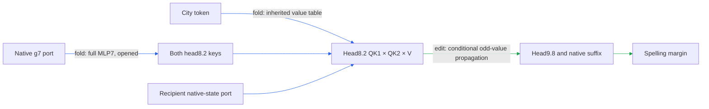

# Hourly strategic review

ACTIVE_TRACK: CIRCUIT

Actual UTC: 2026-09-17T21:55:29.928935+00:00. Next deadline: 2026-09-17T22:55:29.928935+00:00.
Previous: [20:51 review](HOURLY_STRATEGIC_REVIEW_2026-09-17_2051.md), WEIGHT_FOLDING. Review began at approximately 21:52 UTC; the previous receipt was already over 60 minutes old. No offline hours are backfilled.

The regional path now runs from an explicit MLP7 donor generator through head8.2's full routing/value product and the conditional head9.8 odd-value branch to spelling margins. Earlier-boundary replay improved, but two native-state inputs remain, fresh carry-only prediction failed, and the proposed write partition failed random-split specificity. This is a conditional path, not a completed five-property circuit.

A port is an externally supplied input; the native suffix is the downstream model rerun after an edit. The diagram does not claim token closure of g7 or the recipient state. Prediction error below is relative L2 error in a signed edited-minus-reference margin, using the receipt's own reference effect. Key-source increment and full-face effect are different denominators.

## Targets and full goal

1. Specify reads, operations, writes and downstream consumers.
2. Group across module boundaries and split within a module by computational role.
3. Predict activations and behavioral effects on held-out/OOD inputs.
4. Extract an executable at a declared boundary and background.
5. Selectively remove, swap or edit against appropriate controls, accounting for interactions and redundancy.
6. Predict composition and demonstrate reuse.
7. Identify units stably across documents, corpora, gauges and restarts, or by reader-defined operational equivalence.

The goal is a smaller transparent executable tensor program jointly predictive on fresh/OOD text, extracted, manipulable under registered interventions, composable under joint replacement and reusable across tasks. Price simplicity separately as independently specified readers/products/writers, stored weights, compute, state, edges, lookup tables, interfaces and adapters. Lower error or storage cannot replace any missing behavioral property. Quantization is excluded.

## Evidence since the previous review

| Claim | Tag / panel | Evidence | Verdict |
|---|---|---|---|
| Fresh paired midpoint removal is selective within its tested scope | edit / four previously unused source contexts, eight sequences | 12× median of 16 equal-norm nulls; 18/21 capable cells attenuate; mean attenuation 2.6%; four unrelated ratios .045–.097 | passes limited screen |
| Frozen key denominators preserve the write | fold diagnostic / opened | discrepancy reaches .28 against .10 | fails; retained in executor |
| Frozen key denominators preserve tested behavior | edit / eight fresh contexts | cue errors .039–.098 against .10 | passes distinct behavioral gate |
| Carry-only source prediction transfers | edit / eight fresh contexts | cue errors .41–.76 against .35 | fails |
| Carry plus MLP7 predicts key-source increment | edit / same fresh panel | .10–.18 against .20 | passes; no selective-source identification |
| Three physical writes compose unusually well | edit / four opened contexts | interactions small, but worst is 1.9× random median against ≤.50 | specificity fails |
| Donor boundary before MLP7 replays | fold / 16 opened sequences | native and isolated replay pass; two native-state ports persist | extraction progress only |
| Residual6-only / residual6+attention7 predict earlier donor source effect | edit / eight opened contexts | cue errors .31/.87 against .35; .22/.70 against .20 | both fail |
| Exact local MLP7 response decomposition | response / opened saved states | normalization, ordered cross, quadratic and residual-skip terms close | exact; no downstream selective edit |

All tested algebraic closures pass; primary numerical evidence is in [fresh source transfer](TYPED_FACE_KEY_SOURCE_FRESH_V1_RESULT.json), [write composition](TYPED_FACE_WRITE_COMPOSITION_V1_RESULT.json), [donor replay](TYPED_FACE_MLP7_DONOR_V1_RESULT.json), [earlier-source screen](MLP7_INPUT_SOURCE_V1_RESULT.json), and [local response](MLP7_EXACT_RESPONSE_V1_RESULT.json). Earlier strict recursive readout replay failed its .0001 gate; a later .001-gated donor replay does not retract it. Posthoc residual6+initial7 errors .098/.217 are not a new passing prediction. The original two-input interaction/smallest-single ratio 1.7 remains a failure, irrespective of exact Möbius closure.

Four behavioral traits, scored for this regional path: **held-out/OOD PARTIAL** (fresh source/position shift; unchanged endpoints, missing constant/fitted prediction nulls and structural template battery); **extraction PARTIAL** (standalone head8 write and earlier donor boundary, two external native-state arrays, conditional head9.8/suffix); **selective manipulation PARTIAL** (fresh paired midpoint removal with matched null and four readers, not certification of each newly folded source); **composition/reuse FAIL for proposed partition specificity**, broader reuse untested. **Simplicity NOT ESTABLISHED**: donor package stores 16,836,739 floats / 67,352,243 bytes and retains both ports, versus about .89 million floats for the earlier head package. No matched-effect random comparator or runtime saving establishes a simpler circuit.

Separate concurrent aspectual work is not substituted for regional progress. Its v4–v10 receipts report donor-free readout removal, template transfer, response census, three-head keep-only sufficiency and source folding. The census falsified the predicted largest responder (MLP11 won); the sweep found previously omitted head8.1. Its source fold still uses a native routing scalar: token-only inherited value is not token-only computation. The v11 runner exited 1 at 21:51:09 with `price exceeded: 38 > 30`; printed retention values are not a completed passing receipt. Board timestamps 21:24/21:40/21:58 have an explicit correction; use actual receipt/runlog times.

## Highest-value CIRCUIT action

Freeze a structural-template transfer screen of the **complete retained regional path**, using the existing shared paired-write executor. Compare the original colon/quote frame with colon removed, quote removed and quoted clause moved, preserving semantic city identity and matched token-position controls. This targets prediction, selective manipulation and stable identification (3, 5, 7), not another upstream omission selected from opened errors.

Proposed registration before any scoring: eight unused context/city-pair cells crossed with four structural variants (32 context-variant cells, not endpoint rows), six fixed endpoint readers plus the existing four unrelated readers. Freeze positions by semantic correspondence and hash the rows before execution; reject ambiguous correspondence rather than silently changing the intervention. Require native capability in at least six of eight cells per variant, full-path effect prediction error ≤.35 in every capable variant/cue aggregate, removal stronger than all 16 same-site equal-norm nulls, and each unrelated-reader RMS ≤.50 of target RMS. Compare frozen predictions to constant and discovery-fit baselines without refitting on test cells; inability to beat them prevents the stronger OOD claim. Preserve signed attenuation and report low-capability cells separately. Failure after moving punctuation, despite capability and exact native replay, kills structural generalization at this boundary. These are proposed gates, not an executed experiment or queue claim.

Circuit-to-fold connection: fresh carry-only failure selected the MLP7 branch for exact folding; its full product now supplies a fixed intervention object whose structural transfer can be tested. Do not propose a new suffix from native attribution: first collect a forward response census of the complete edit. Second-ranked action is that census if template transfer fails or changes the effect's route; third is deeper g7 folding. Another rank sweep or posthoc source5 promotion has lower information value.

WEIGHT_FOLDING handoff: preserve initial7 and all g7 source interactions; resume exact earlier-port closure from the local response identity after the circuit hour, without treating response mass as causal ownership.

For that deferred fold, the endpoint is both head8.2 key vectors [128] and ultimately its write [1152]. Native L7/R7 are [4608,1152], D7 [1152,4608], bias [1152], K1/K2 [128,1152], folded KD [128,4608]. g7 = a·residual6 + attention7 + b·embedding [1152]. Retain all nine ordered source products through (L g7)⊙(R g7), including attention×attention, carry-MLP×carry-MLP and both ordered attention/MLP terms when opening residual6. Nothing is dropped; native RMS with epsilon, bias, residual reentry, both key normalizers, rounded rotary, QK1×QK2×V, inherited values and conditional native background stay explicit. Price all 4608 products, factors and ports. Exact replay must match current donor state/write and registered readouts on existing fixtures before a later frozen fresh edit can test prediction/selectivity. Dense hidden Gram replacement is already more expensive than retained D7; do not repeat it as a savings claim.

## Confounds and index audit

Natural transfer contains eight distinct source contexts, 16 distinct token sequences and 96 endpoint/cue rows (48 paired endpoint measurements), not 96 independent contexts. The 20-token table exercised only four newly tested city IDs. Context/position transfer is not colon/quote template transfer or pretraining-disjoint evidence. Keep endpoint/cue strata, native versus paired baselines and noise floors separate; nonlinear RMS/softcap can change composition. Shared token difficulty, opened selection, precision-sensitive cancellation, dead controls and post-selection remain explicit risks. No fit was used to close the new donor port.

Read the circuit registry, computation-path registry, MODULE_DOSSIERS, MLP index, attention-middle dossier and current graph inventory. Graph inventory now has 34 packages, 29 manifests, 18 declared boundaries and two historical four-trait verifications; this is not two newly verified five-property circuits. The previous missing typed-face bridge has been added. Concurrent 21:52 additions link MLP7_INPUT_SOURCE and MLP7_EXACT_RESPONSE in the path registry and module dossier; the circuit registry search still lacks these exact receipt links at audit time. The MLP coverage index also does not expose this new MLP7-specific chain. Canonical bridge: regional inherited-city entry → PATH-SET2-001 regional subsection → head8.2/head9.8-O → MLP7 donor package → input-source failure/local response. Keep this review as the temporary link; owner can synchronize indexes with its completed unit. Do not rewrite concurrent registries.

Git commits substantiate folded-key publication at 21:21:26, fresh-source publication at 21:42:59 and donor verification/price at 21:48:24. Dirty board, runners, canaries and aspectual code/results are concurrent; preserved. theseus-bench status is clean. Historical LATEST and local-start workstation paths are not current runtime evidence: Supervisor currently reports bqrunner, bqrunner2 and cron RUNNING. No service changes are needed.

## PAST_HOUR_TIMING

Audit window: previous receipt 20:51:39 through this receipt, with runlog sampling through 21:53. Authoritative runner intervals and receipt `seconds` are distinct:

| Regional candidate | Claim → runner exit (observed partial serial latency) | Runner process interval | Model-body runtime |
|---|---:|---|---:|
| Key fold | 21:21:10 → 21:21:38 = 28s | 21:21:36–38 | 1.04s |
| Physical-write composition | 21:26:02 → 21:26:52 = 50s | 21:26:39–52 | 11.58s |
| Fresh source screen | 21:33:45 → 21:39:35 = 5m50s | 21:39:30–35 | 3.62s |
| Donor native replay | 21:41:36 → 21:45:17 = 3m41s | 21:45:14–17 | 1.79s |
| Earlier MLP7 source screen | 21:50:31 → 21:51:06 = 35s | 21:51:02–06 | 3.18s |

These are claim-to-exit spans, not complete prior-art-to-scored-dossier latency. Interpretation board receipts arrive at 21:26:02, 21:29:13, 21:41:36, 21:47:13 and 21:52:06 respectively; their elapsed gaps do not measure active interpretation. Full candidate latency and its median remain unknown. Design, implementation, validation, interpretation, documentation/review and idle/blocked durations are **unknown separately**. The phase ledger's last inspected markers are September 14, not this hour. This review's first clock sample is 21:52:14; receipt timestamp bounds its own elapsed audit only. Do not sum overlapping owners' durations, call commit gaps work time, or call empty GPU intervals human idle time.

## PROCESS_IMPROVEMENT

Ranked by likely saving versus cost: (1) existing endpoint deduplication saved a measured 12.71 model-body seconds per comparable replay (960→160 forwards, 16.29→3.58s, bit-identical); reuse it, no further repair needed. (2) Shared declarative arm-count validation could prevent the observed aspectual 38-versus-30 forward-budget abort; saves at least that failed 3-second process plus unknown rework per recurrence, but the library is currently dirty and owner-controlled—do not patch concurrently. (3) Restore use of the existing phase clock around design/implementation/validation/publication; likely reduces repeated timing reconstruction, saving unknown, low authoring cost. No new timing framework or runner refactor is justified by these data.

No CPU repair executed: the proven largest saving is already implemented; the live budget error overlaps another owner's code; phase accounting cannot be repaired retrospectively. Bounded repair to the review process is this explicit timing table plus a single proposed screen, instead of another audit suite. Scientific work remains the larger part of this receipt.

TRACK_ALTERNATION: PASS — WEIGHT_FOLDING → CIRCUIT; unfinished folding preserved for next hour.
TRACK_PROGRESS: PASS — exact MLP7 key/donor folds, native/standalone replay and falsified omissions are substantive prior-track receipts; no compression adoption claimed.
CEREMONY_BUDGET: FAIL TO VERIFY — science/review phase ratio and full serial latency are unmeasured. Apply the bounded accounting/reuse repair above; do not invent times.
NOVELTY_LESSON_GATE: PASS WITH INDEX DEBT — registries and failures inspected; structural controls selected over repeated source omission, generic additivity or denominator-Gram compression.

Scope honored: review and read-only CPU inspection only; no GPU model, agents, durable goal, job enqueue, timers, commits, pushes, contacts or existing experiment/result mutations. Primary retains TYPED_FACE_EXTRACTION_V1. Scientific gates above remain unexecuted handoff work.
