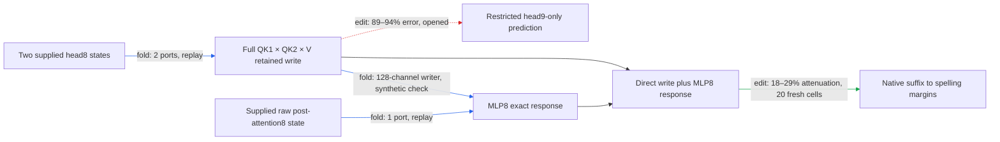

# Hourly strategic review

ACTIVE_TRACK: WEIGHT_FOLDING

Actual UTC: 2026-09-17T22:55:54.012212+00:00. Next deadline: 2026-09-17T23:55:54.012212+00:00.
Previous: [21:55 CIRCUIT review](HOURLY_STRATEGIC_REVIEW_2026-09-17_2155.md). It was 56m39s old at the first clock sample (22:52:09), so the 55-minute duplicate gate permits this review. No offline backfill. Evidence cutoff: 22:53:32 UTC.

The regional path is now the city-conditioned head8.2 write plus its full MLP8 response, followed by the native suffix to spelling margins. Fresh native application is selective, but the old head9-only route misses most of that effect; native inputs, composition failures and unproven simplicity prevent a completed five-property circuit claim.

A port is a supplied native-state input; suffix means downstream model computation. Relative prediction error is L2 error in signed intervention effects divided by the reference effect norm. Attenuation is proportional reduction of capable paired spelling margins. Collateral is unrelated-reader RMS change divided by target RMS. Exact closure and causal sufficiency are distinct.

## Seven targets and full goal

1. Specify reads, operations, writes and downstream consumers.
2. Group across module boundaries and split within modules by computational role.
3. Predict activations and behavior on held-out and OOD inputs.
4. Extract an executable sufficient at an explicit boundary and background.
5. Selectively remove, swap and edit against appropriate controls, accounting for redundancy and interactions.
6. Predict joint composition and demonstrate reuse.
7. Identify stable units across documents, corpora, gauges and restarts, or through downstream operational equivalence.

Build a smaller transparent tensor program that predicts fresh/OOD behavior, is extracted, supports selective manipulation and removal, and composes/reuses computations. Measure simplicity separately: readers, products, writers, weights, tables, compute, state, edges and adapters. Lower error or storage cannot substitute for any behavioral property. Quantization is excluded.

## Scientific audit since 21:55

| Claim | Tag / evaluation | Evidence | Status |
|---|---|---|---|
| Structural controls preserve conditional path | edit / four modified conditions fresh at freeze | 17–20% prediction error; 16/16 nulls beaten per condition; four context/city cells per condition | passes limited screen |
| Prospective conditional transfer clears every gate | edit / fresh construction families | line-break attenuation .0191 below .02; frozen constant/text-OLS comparisons pass | fails attenuation gate |
| Framing/clause pieces are unusually composable | edit / opened prospective panel | interaction/smaller .0031–.0085, but 1.10× random median and only 1/9 nulls beaten | specificity fails |
| Conditional head9 route predicts native8 application | edit / opened | .89–.94 error | fails |
| Native response is direct-only or fixed early suffix | response / opened | direct error .51–.64; early .43–.53 | fails; no suffix nomination from attribution alone |
| Direct write or MLP8 response may be dropped | edit / opened | skip-only .33–.65; MLP8-only .79–.90 | both fail all-family gates |
| Direct and MLP8 effects add | edit / opened | joint error up to .14; interaction/smaller up to .46 | fails |
| Full coupled application transfers | edit / fresh | 15–27% parent-effect error; 18–29% attenuation; 5.5–12× null median, 16/16 beaten; four collateral ratios ≤.17 | passes six registered gates |
| Coupled standalone formula matches native application | fold implementation / opened replay | 120 forwards, all three native precision predicates pass | native replay passes; isolated gate separate |

Primary receipts: [structure](TYPED_FACE_STRUCTURE_V1_RESULT.json), [prospective](TYPED_FACE_PROSPECTIVE_V1_RESULT.json), [destination null](DESTINATION_PARTITION_V1_RESULT.json), [native scope](TYPED_FACE_NATIVE8_SCOPE_V1_RESULT.json), [response census](TYPED_FACE_NATIVE8_RESPONSE_V1_RESULT.json), [factorial](TYPED_FACE_MLP8_MEDIATION_V1_RESULT.json), [fresh application](TYPED_FACE_NATIVE8_FRESH_V1_RESULT.json), [native coupled replay](TYPED_FACE_MLP8_COUPLED_V1_RESULT.json). All reported algebraic closures pass their respective gates; these do not erase prior strict replay failures.

The fresh panel has **20 construction/city-pair cells**, 40 sequences and 240 endpoint rows: ten constructions × two city pairs. Cities were held out from native8 scope, not the whole program; six endpoints remain unchanged. Earlier conditional baseline wins do not transfer to the broader native counterfactual. Both keys and inherited value are donated; current value stays recipient in the retained face, but is donated by its fuller parent. This difference defines the prediction test.

Explicit scorecard: **held-out/OOD PARTIAL** (fresh transfer, missing native-application constant/fitted nulls, new endpoints/corpus and token-only prediction); **extraction PARTIAL** (coupled native precision passes, three native arrays and external suffix, isolated gate not verified in this review); **selective manipulation PARTIAL** (fresh paired midpoint passes same-site norm-matched nulls/four controls; donor-free removal not tested); **composition/reuse FAIL for tested partitions**, wider reuse untested. **Simplicity NOT ESTABLISHED**: coupled prototype 16,812,545 floats plus 20 token indices, 74,880 input-state scalars at T=32. Conditional head8/head9 package was 1,788,419 floats; these are different boundaries, not a like-for-like saving. No matched-effect random description-length or runtime advantage.

Separate aspectual receipts do not count as regional progress. The concurrent owner's v16 failed its MLP8 pair-dominance hypotheses and stopped that fold; v20 failed unrestricted natural-`by` transfer and used a cancellation-sensitive signed collateral denominator; v21 still fails one gate. See their [v20](../bilinear_quotient/circuits/followups/aspectual_anchor_dod_natural_v20_result.json) and [v21](../bilinear_quotient/circuits/followups/aspectual_anchor_dod_natural_pattern_v21_result.json) receipts. Do not generalize an authored token table to all senses or silently repair a registered gate.

## Highest-value folding action

**Next owner action: expand the raw post-attention8 context port by its native producers in the existing coupled operator.** Finish the already-owned isolated certification first; do not duplicate TYPED_FACE_EXTRACTION_V1 or its implementation. This review supplies the exact expansion below, not a new scored experiment. Targets 1, 2 and 4 change if the declared context interface becomes an executable producer graph; prediction/selectivity remain later gates.

Endpoint: coupled change at the block9 input, Δh8 = δ + ΔMLP8, ultimately read by the spelling contrasts through the unchanged suffix. From `jacclust/tt_model.py`, g = λ8,0 h7 + λ8,1 e + a8. Name sources c=λ8,0 h7, e8=λ8,1 e, a=a8. Native L,R have shape [4608,1152], D [1152,4608], head8.2 writer W [1152,128], channel edit u [128], δ=Wu [1152]. Products LW,RW have shape [4608,128]. Existing learned-weight identity already verifies these factors; do not repeat it as novelty.

Let s0=mean(g²)+ε, s1=mean((g+δ)²)+ε and M0=D[(Lg)⊙(Rg)]/s0. Then

`Δh8 = δ + (s0/s1−1)M0 + D[(Lδ)⊙(Rg)+(Lg)⊙(Rδ)+(Lδ)⊙(Rδ)]/s1`.

Expand M0 into all nine ordered (c,e8,a) products and both δ/source cross orders into six terms; retain δ×δ and skip. When c is opened into prior attention and MLP writes, preserve attention×attention, MLP×MLP, attention×MLP and MLP×attention separately. No source is omitted in the exact reference. Bias cancels in this response; λ reentry, native RMS epsilon, both QK normalizers, rounded rotary, inherited/current values and full QK1×QK2×V generation of δ remain explicit. No SiLU or attention softmax is introduced. Background remains the unedited native context and suffix; replacing g by three supplied arrays is merely expansion, **not port closure**.

Simplicity objective: remove one independently supplied raw context array only when its producers are executable from already declared inputs; charge all added factors, source arrays, 4608 products, norm computation and interfaces. A selected reader-specific subset is permissible only after exact reference replay and a fresh causal test; source-attribution magnitude alone cannot select it. A fold that increases interfaces without revealing a testable grouping should stop at the honest open port.

Exact check: replay each of the existing 40 opened fixtures, match coupled block9 delta at ≤1e-4 relative, all readouts at ≤1e-4 absolute AND ≤1e-5 relative, each family/control effect ≤1e-3; preserve zero-strength and out-of-mask controls. Gates come from the existing coupled registration; no threshold relaxation. Later falsifier: freeze any proposed retained source group before a fresh 20-cell construction/city panel, require ≤.35 effect-prediction error in every family/endpoint against the complete native edit, beat constant and discovery-fit predictors, and retain same-site matched-null selectivity/four-reader collateral ≤.5. Failure kills the omission, not the exact expansion. No new job is authorized by this review.

Track connection: circuit factorials ruled out separating skip from MLP8, selecting their coupled response as the folding object; source-resolved folding can nominate a physical source edit, whose circuit test must decide causal ownership. Ranked alternatives: (2) native-boundary frozen predictor-null comparison, valuable next circuit hour; (3) further head9 or late-head suffix extraction only after the existing response census supports a specific intervention. Repeated arbitrary partitions and eigenvalue/rank sweeps are demoted by specificity failures and the historical near-quote sign reversal.

CIRCUIT handoff: freeze constant/discovery-fit prediction nulls for the native8 coupled intervention; preserve fresh midpoint selectivity and all composition failures, then test donor-free removal as a separate counterfactual.

## Confounds and organization

Keep fold/edit/response/fit and fresh/opened/replay labels separate. Native RMS and softcap curvature, baseline choice, small reference effects, precision-sensitive cancellation, shared token difficulty, selection on opened cells, control liveness and inherited template structure can change conclusions. Closed Möbius identities do not imply small interactions relative to the smallest piece or random-split specificity. The MLP8 near-quote dossier documents sign reversal and failed source-only interpretations; it argues against another magnitude-selected truncation.

Inspected circuit/path registries, MODULE_DOSSIERS, MLP index, MLP8/9/12 dossier, attention-middle dossier and [graph registry](CIRCUIT_GRAPH_REGISTRY_V1.md). Graph snapshot: 36 packages, 31 manifests, 20 boundaries, two historical four-trait records; not two new five-property completions. Graph lacks the live coupled package at inspection. Circuit/path/module entries stop at 22:33's pending native8 scope and lack the subsequent response/factorial/fresh/coupled receipts. One bounded repair appended six primary links to the [MLP index](explanations/MLP_MODULE_DOSSIER_INDEX.md); all resolve. Remaining graph/registry synchronization belongs with the owner's live publication. No generated index was refreshed across concurrent writes.

Git confirms fresh registration at 22:48:25, fresh result at 22:50:57, coupled package at 22:52:52. Board, logs, canaries and aspectual files are shared dirty work; preserved. theseus-bench status was clean. Current runner.log records managed bqrunner execution, including coupled replay 22:53:02–05. Historical local-start systemd/workstation paths were read as history; no service/timer operations or assumptions of old workstation state.

## PAST_HOUR_TIMING

Window: 21:55:29.928935 through evidence cutoff 22:53:32. Runner process intervals are authoritative; receipt `seconds` measures model body, not full candidate time.

| Candidate | Runner UTC start–end | Body seconds | Observed claim→exit latency |
|---|---|---:|---:|
| Structural transfer | 21:56:50–21:57:03 | 12.25 | not reconstructed |
| Prospective transfer | 22:04:50–22:05:03 | 12.07 | not reconstructed |
| Destination partition | 22:31:15–22:31:30 | 13.53 | 22:30:48.56→22:31:30 = 41.44s |
| Native8 scope | 22:38:59–22:39:10 | 9.63 | preflight 22:33:28.54→exit = 5m41.46s |
| Native8 census | 22:41:12–22:41:16 | 1.97 | 22:39:46.47→exit = 1m29.53s |
| MLP8 factorial | 22:45:41–22:45:45 | 2.78 | 22:45:17.39→exit = 27.61s |
| Fresh native8 | 22:48:28–22:48:39 | 10.10 | row claim 22:46:57.49→exit = 1m41.51s |
| Coupled precision | 22:53:02–22:53:05 | 2.47 | 22:51:55.55→exit = 1m09.45s |

Claim→exit spans are partial serial latency, not active labor or full prior-art→scored-dossier time. Full candidate latency/median are **unknown**. Design, implementation, validation, interpretation, documentation/review, and idle/blocked durations are **unknown separately**; model execution is measured above. The inspected phase ledger ends September 14. Claude's board claim of 28 idle minutes is self-reported, not validated by these process records. Do not infer active work from commit gaps, GPU gaps or sum parallel owner durations. This review's own elapsed interval starts at 22:52:09 and ends at its actual timestamp; it is not the preceding hour's phase accounting.

## PROCESS_IMPROVEMENT

Ranked by likely time saved/cost: (1) reuse existing endpoint batching—the prior review reports measured 12.71s saved per comparable replay; already implemented, no repair needed. (2) Add the missing MLP navigation chain—expected to avoid repeated receipt searches or duplicate folds, saving unmeasured, cost one small append and six link checks; **executed as the sole CPU repair**. (3) Resume existing phase markers and shared declarative forward-count validation—prospective savings unknown; cannot reconstruct missing labor times and live runner helpers are owner-controlled. No new timing framework, data builder or refactor justified. The audit remains smaller than the scientific analysis.

TRACK_ALTERNATION: PASS — CIRCUIT → WEIGHT_FOLDING, unfinished circuit work handed off.
TRACK_PROGRESS: PASS — prior circuit hour delivered structural/fresh selective screens, response census and honest composition/omission failures; interleaved extraction does not erase these receipts.
CEREMONY_BUDGET: FAIL TO VERIFY — measured phase ratio unavailable. Bounded repair: reuse existing replay gates and one navigation append, no bespoke audit suite; phase instrumentation remains a prospective owner handoff.
NOVELTY_LESSON_GATE: PASS WITH INDEX DEBT — registries/dossiers searched, source and random-split failures preserved, exact producer expansion distinguished from duplicate local response verification.

Scope: bounded review plus one index repair; no agents, durable goal, GPU model, jobs, timer/service changes, commits/pushes, contacts or experiment/result mutations. Primary retains TYPED_FACE_EXTRACTION_V1 and live coupled certification.
