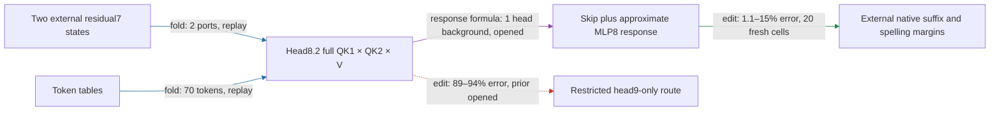

# Hourly strategic review

ACTIVE_TRACK: CIRCUIT

Actual UTC: 2026-09-17T23:55:44.216094+00:00. Next deadline: 2026-09-18T00:55:44.216094+00:00.

Previous: [22:55 WEIGHT_FOLDING review](HOURLY_STRATEGIC_REVIEW_2026-09-17_2255.md). At the first clock sample, 23:52:06 UTC, it was 56m12s old; the 55-minute gate permits this review. No backfill. Evidence cutoff: 23:53:16 UTC; the live owner's 23:52:42 handoff is included.

The regional path now generates a city-conditioned head8.2 write and approximate MLP8 response from two supplied residual7 states, then uses the native suffix to predict spelling changes. Fresh paired manipulation and independent package replay pass; donor-free removal, broader OOD, composition and matched-effect simplicity remain incomplete.

A port is a supplied native-state input; suffix is the downstream model. Effect error is relative L2 error in signed margin changes against the registered native edit; attenuation is proportional reduction of capable cue contrasts; collateral is unrelated-reader RMS change divided by target RMS. Algebraic replay tests equality of implementations, not circuit identification.

## Targets and goal

1. Specify reads, operations, writes and downstream consumers.
2. Group across native boundaries and split within heads/MLPs by computational role.
3. Predict activations and behavioral effects on held-out and OOD inputs.
4. Extract an executable sufficient at a declared interface and background.
5. Selectively remove, swap and edit, controlling unrelated behavior, redundancy and interactions.
6. Predict composition and demonstrate reusable shared computations.
7. Identify stable units across documents, corpora, gauges and restarts, or by downstream operational equivalence.

The full goal is a smaller transparent tensor program that predicts fresh/OOD behavior, is extracted, supports selective manipulation/removal, and composes/reuses computations. Price simplicity separately in readers, products, writers, tables, independently specified weights, edges, state, adapters and execution. Lower error or storage alone supplies none of the missing behavioral properties. Quantization is excluded. Apply [better circuits](../better_circuits.md) and [communication authority](../communicating_results.md).

## Progress and five-property score

| Claim | Evidence / evaluation | Key result | Verdict |
|---|---|---|---|
| Open MLP8 context into native sources | fold / opened | 17 ordered terms including normalization, both cross orders, quadratic and skip | exact reference passes |
| Generate context and move boundary before block8 reentry | fold implementation / replay | three native inputs reduced to two residual7 inputs | boundary progress |
| Head8.2-only attention cross is locally sufficient | response approximation / opened | multiline local error .473 exceeds .35 | fails, preserved |
| Same omission preserves behavioral effects | edit / opened, then fresh | opened error .022–.092; fresh .050–.116; all six fresh gates pass | narrower reader-specific claim passes |
| One-head frozen normalization predicts full edit | edit / fresh | error .011–.148, attenuation .158–.219, 16/16 nulls beaten, collateral ≤.163 | all six gates pass |
| Pruned package independently executes that candidate | fold implementation / replay | 120 native forwards; 40 isolated fixtures; native and isolated predicates pass | extracted at declared boundary |
| Pieces are independently composable | edit / earlier opened tests | local additivity and random-split specificity failures remain | fails; no new composition result |

Primary evidence: [ordered expansion](MLP8_CONTEXT_SOURCES_V1_RESULT.json), [reentry replay](TYPED_FACE_RESIDUAL7_V1_RESULT.json), [cross edit](HEAD2_MLP8_CROSS_EDIT_V1_RESULT.json), [fresh cross](HEAD2_MLP8_CROSS_FRESH_V1_RESULT.json), [fresh one-head](SINGLE_HEAD_FRESH_V1_RESULT.json), [native pruned replay](SINGLE_HEAD_PRUNED_V1_RESULT.json), [isolated pruned replay](SINGLE_HEAD_PRUNED_V1_STANDALONE_RESULT.json). The latter receipts supersede pending language in the package README and 23:48 report; they do not create new fresh evidence.

**Held-out/OOD: PARTIAL.** The single-head panel has 20 distinct construction/city-pair cells, 40 sequences, 240 endpoint rows, ten constructions and two city pairs, spanning headers, transcription, unquoted bulletins, broken lines and reported openings. Liverpool/Boston and Glasgow/Dallas are held out from normalization selection, not globally unseen. Six spelling endpoints are unchanged. Frozen constant/text-OLS comparisons pass, but the candidate receives native states while these nulls receive text features; token-only prediction and new-endpoint/corpus evidence are absent.

**Extraction: PASS at the declared boundary, incomplete upstream/downstream closure.** Two native residual7 arrays, token IDs and 70 supported sequence tokens; 38,016 supplied native-state scalars at T=32. Isolated replay imports no repository modules and rejects unsupported tokens. Native suffix remains external. **Selective manipulation/removal: PARTIAL.** Fresh paired edits beat 16 same-site, per-position equal-norm nulls per family, 30–43 times their median effect, and preserve four readers. This is paired manipulation; donor-free removal is a distinct, newly claimed counterfactual with no result at cutoff. **Composition/reuse: FAIL for tested decompositions; candidate-wide reuse untested.** Closed Möbius identities do not establish small interactions relative to the smallest piece or specificity versus random partitions.

**Simple: measured structural improvement, definition-of-done comparison missing.** The pruned bundle has 16,899,587 floats and one local attention head, retaining full MLP8 factors. The earlier fused bundle has 24,153,091 floats and a different 114-token support, so their storage difference is not a matched-domain saving. Exact fusion reduced Down evaluations 4→1 and duplicate attention/delta evaluations 2→1; six interleaved CPU examples measured median .1042→.0562 seconds. This is local timing, not full-model acceleration. No random component matched in effect and description length establishes the simplicity property.

## Highest-value CIRCUIT action and folding handoff

**Advance the owner's already-claimed donor-free inherited-city removal to its registered causal/selective screen.** Do not duplicate TYPED_FACE_EXTRACTION_V1 or edit its implementation. At 23:52:42 the primary claimed removal of half the recipient city's inherited-value write, using both native QK factors and the inherited token value, on the same after-city support. This directly addresses target 5 and tests whether the paired route owns native signal without donor information. Local response-error analysis must remain separate from the later effect claim.

Proposed screen contract, to freeze before outcomes: compare the approximate block9 write against removal at native attention8 followed by the full MLP8 and suffix; zero-strength and out-of-support controls must replay. Require every family effect error ≤.35, attenuation ≥.02 with positive direction on at least 90% of capable pairs, collateral ≤.5 on each of four readers, and target effect above every one of 16 same-site equal-norm nulls. Freeze at least 20 distinct new construction/city-pair cells for confirmation after the opened screen; count cells, not endpoints. These are prospective review recommendations, not a claim that registration or execution has occurred. A fidelity pass with no selective native removal rejects the ownership claim; a local approximation failure rejects the surrogate without disproving the native term. Preserve any failed gate before proposing a repair.

Ranked alternatives: (2) new endpoint/corpus prediction with frozen boundary-matched nulls, valuable but does not resolve donor dependence; (3) composition of independently defined causal pieces, only after both pieces are live and controls are fixed. Arbitrary fresh repartition searches, new behaviors and another generic rank sweep lose to regional depth. No suffix extraction is nominated: the existing forward response census already rejected head9-only and direct-only sufficiency.

**WEIGHT_FOLDING handoff:** after this removal counterfactual is scored, follow its recipient residual7 dependency one native producer step backward, preserving exact context and all ordered source terms; do not resume donor-dependent packaging merely because it remains unfinished.

Concrete track connection: the ordered fold separated other-head cross terms from head8.2 cross terms; local vector fidelity failed, yet downstream edit tests supported a reader-specific omission. Circuit selectivity now chooses whether the simpler one-head computation deserves further upstream folding.

The current folded endpoint is the block9 input change. With L,R=[4608,1152], D=[1152,4608], W8.2=[1152,128], δ=Wu, retained g₂=λ₈,₀h₇+λ₈,₁e+a₈.₂, the frozen-normalization candidate is
`δ + D[(Lδ)⊙(Rg₂)+(Lg₂)⊙(Rδ)+(Lδ)⊙(Rδ)]/(mean(g₂²)+ε)`.
It includes both δ/source orders for residual, initial and head8.2 sources, quadratic and skip; omits other eight heads and the baseline normalization correction. This is an approximation, not exact elimination from the full native response. Full QK1×QK2×V, learned reentry, rounded rotary, inherited/current value semantics and native epsilon remain explicit. No softmax or SiLU is introduced; bias cancels in the response. Native suffix includes RMS and softcap. Exact replay applies to this candidate's own implementation: existing local ≤1e-4 relative, readouts ≤1e-4 absolute AND ≤1e-5 relative, family/control effect ≤1e-3, plus isolated fixtures. Fresh donor-free causal failure would falsify its extension; it would not undo paired evidence.

## Confounds, novelty and organization

Retain baseline subtraction and signed-effect conventions; nonlinear RMS/softcap composition, small-effect cancellation, correlated endpoint rows, post-selection, native-state/text-null asymmetry and changed intervention sites can flip conclusions. Same norm at the wrong site is not a matched null. Avoid frame mixing and require live zero-strength/mask checks. The MLP8/9/12 dossier's near-quote sign reversal and the attention-middle dossier's failed contextual-routing closure remain relevant: magnitude and conditional fidelity do not identify a closed source.

Inspected circuit registry, computation-path registry, graph registry, MODULE_DOSSIERS, MLP index and the relevant MLP8/9/12 and attention-middle dossiers. Graph snapshot has 42 packages, 37 manifests, 26 declared boundaries and two historical four-trait records; these are not two new five-property completions. It lacks the pruned single-head package. Circuit registry and dedicated MLP8 dossier lag the new chain; path registry and MODULE_DOSSIERS have 23:48 links but pending certification language. Sole repair: append a short link chain to the dedicated MLP8 dossier, with native/isolated replay and limitations. Leave generated registry refresh and live package README to the owner.

Concurrent auxiliary work remains separate from the regional verdict. Board/commits record shared cue-value reuse, honest diffuse-source stops and strict four-way composition failure. Freshness corrections at 23:30/23:32 retract globally disjoint lexicon claims (13/16 places, 3/16 agents overlap corpus lists); those claims cannot be borrowed as regional OOD evidence. No auxiliary experiment is promoted by this review.

## PAST_HOUR_TIMING

Window: previous review 22:55:54 through cutoff 23:53:16. Sources: [runner log](../bilinear_quotient/runlogs/runner.log), primary receipt `seconds`, timestamped board claims, Git author/committer times and today's [phase log](RESEARCH_PHASES_2026-09-17.jsonl).

| Candidate | Process start–end UTC | Body seconds | Observed claim→process exit |
|---|---|---:|---:|
| Generated context | 23:03:22–23:03:26 | not extracted | 23:01:40.88→exit: 1m45s |
| Head2 cross screen | 23:15:35–23:15:39 | 2.56 | 23:13:16→exit: 2m23s |
| Fresh cross confirmation | 23:21:26–23:21:37 | 9.33 | row claim 23:17:53→exit: 3m44s |
| Reduced certification | 23:26:28–23:26:32 | 2.56 (board) | 23:26:06.33→exit: 26s |
| Fused certification | 23:31:08–23:31:12 | not extracted | 23:30:59.40→exit: 13s |
| Normalization screen | 23:34:52–23:34:57 | 3.45 (report) | 23:32:11.24→exit: 2m46s |
| Single-head screen | 23:42:38–23:42:43 | 2.92 (board) | 23:39:18.66→exit: 3m24s |
| Fresh single-head | 23:46:03–23:46:14 | 9.19 | 23:43:49.58→exit: 2m24s |
| Pruned certification | 23:51:32–23:51:36 | 2.32 | 23:50:41.54→exit: 54s |

These are partial serial candidate spans, not full prior-art→scored-dossier latency or active labor. Full latency/median remains unknown. Git records context registration 22:57:25, generated implementation 23:03:13, normalization implementation 23:34:49, fresh registration 23:45:49 and pruned certification registration 23:51:05; commit gaps are not effort measurements.

Correction to the previous review: current phase instrumentation exists. Seven marks fall inside this window, from implementation at 22:57:25 through publication at 23:48:58; a publication mark immediately precedes the window at 22:55:38. The within-window marks include implementation, validation and publication; the largest adjacent gap is 12m20s (23:03:31→23:15:51). They are sparse boundaries, not continuous labor records. **Design: unknown; implementation: unknown; validation: unknown; model execution: measured per process/receipt above; interpretation: unknown; documentation/review: unknown; idle/blocked: unknown.** Do not sum concurrent activities as wall time or call runner gaps idle. This review's own elapsed time starts at 23:52:06 and is separately bounded by its written timestamp.

## PROCESS_IMPROVEMENT

Ranked by likely savings and cost: (1) existing fused execution saves about .048 CPU seconds per measured example at unchanged formula; already implemented, no duplicate repair. (2) Missing dossier cross-links create repeated discovery and stale-pending reads; savings unmeasured, cost one append plus link validation. **Executed as the one bounded CPU repair.** (3) Extend consistent phase boundaries using existing research_phase_clock_v1.py; prospective timing clarity, unknown time saving, no new framework justified. Existing shared factor helper refactor is visible in commit 12bee9da0; no duplicate helper work. No evidence here justifies runner/service, data-builder or broad indexing refactors across concurrent work. The timing audit is smaller than the scientific review.

TRACK_ALTERNATION: PASS — WEIGHT_FOLDING → CIRCUIT; folding handoff preserved.
TRACK_PROGRESS: PASS — declared folding hour delivered ordered native expansion, reduced input boundary, shared-factor fusion and a tested one-head approximation, rather than a rank sweep.
CEREMONY_BUDGET: FAIL TO VERIFY — sparse phase marks cannot establish review/validation versus science durations. Bounded response: reuse existing gates, correct phase-log lookup, one short dossier repair; no bespoke audit suite.
NOVELTY_LESSON_GATE: PASS WITH INDEX DEBT — registries/dossiers inspected; local failure, composition failures, freshness corrections and response/edit distinction retained; owner's donor-free claim reused without duplication.

Scope: review and one append-only dossier repair. No GPU model, agents, durable goal, jobs, timer/service operations, commits/pushes, contacts or experiment/result mutations. Live checkout is /workspace/tensor_language; historical workstation paths are history. Supervisor/cron control is unchanged. Shared dirty files preserved; theseus-bench was clean when inspected.
