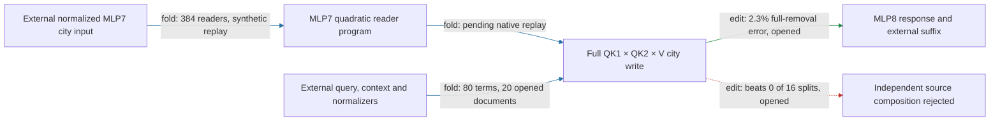

# Hourly strategic review

ACTIVE_TRACK: WEIGHT_FOLDING

Actual UTC: 2026-09-18T00:56:09.971499+00:00. Next deadline: 2026-09-18T01:56:09.971499+00:00.
Previous: [23:55 CIRCUIT review](HOURLY_STRATEGIC_REVIEW_2026-09-17_2355.md). First clock sample 00:52:07: previous review age 56m23s, so the 55-minute gate passes. No offline backfill. Evidence cutoff 00:53:23 UTC; concurrent receipts after that are outside this assessment.

The regional path removes the complete city-value write of head8.2, predicts its approximate MLP8 response, and uses the external native suffix to predict spelling effects. It now has one supplied residual7 array, fresh authored removal evidence and scoped Pile transfer. The latest instructive failure is composition specificity: the MLP7-dependent source group is selectively live, but its interaction exceeds every matched random split. Keep the coupled computation while tracing its native readers backward.

A port is an externally supplied native state; suffix means the later model. Effect error is relative L2 error of signed edited-minus-native spelling margins against the native edit. Attenuation is proportional reduction of capable UK/US contrasts; collateral is unrelated-reader RMS movement divided by target RMS. An exact fold is an identity, a response describes propagation, an edit tests intervention, and a fit is a learned predictor; these are different evidence types.

## Seven targets and full goal

1. Specify information read, operations, writes and downstream consumers.
2. Group across native module boundaries and split within modules by computational role.
3. Predict activations and behavioral effects on held-out and OOD inputs.
4. Extract an executable sufficient at a declared boundary and background.
5. Selectively remove, swap and edit against unrelated-behavior controls, accounting for redundancy and interactions.
6. Predict joint behavior and demonstrate composition and reuse.
7. Identify stable units across documents, corpora, gauges and restarts, or by downstream operational equivalence.

Goal: a smaller transparent tensor program that predicts fresh/OOD behavior, is extracted, supports selective manipulation/removal, and composes/reuses computations. Measure simplicity separately in readers, products, writers, tables, weights, state, edges, adapters and compute. Lower error or storage cannot replace a behavioral property. Quantization is excluded. Authorities: [better circuits](../better_circuits.md) and [communicating results](../communicating_results.md).

## Progress, failures and five-property assessment

| Claim | Evidence / evaluation | Result | Status |
|---|---|---|---|
| Inherited-only removal generalizes | edit / fresh endpoints | plain-note directional consistency .75 < .90; native signs agree | fails |
| Complete city-value removal generalizes | edit / fresh authored cells | 2.2–13% effect error, 10–13% attenuation, 120/120 positive, beats 16 nulls, collateral ≤.167 | scoped pass |
| One-input package executes independently | fold / opened replay | 16,877,827 floats; 53 tokens; one residual7 array | declared-boundary pass |
| Filtered Pile prediction | edit / fresh V2, opened V3 repair | 2.4% aggregate error; untouched natural arms 6.6%; V2 reference precision fails | scoped pass after reference repair |
| Full-strength prediction | edit / opened, prospective strength | 2.3% error, 30% attenuation, 102/111 capable contrasts positive | pass |
| Quadratic response is indispensable | response ablation with suffix / opened | full/secant/linear errors 2.3/7.3/14%; all broad screens pass | improves accuracy, not necessary for coarse gate |
| MLP7-dependent source group is live | edit / opened | 30% full target RMS, 7.5% attenuation, 16 nulls beaten, collateral ≤.088 | selective screen passes |
| Source pieces independently compose | edit / opened | interaction/smaller .345711 ≤ .35, but random median .244758; beats 0/16 | specificity fails |
| MLP7 native readers fold exactly | fold / synthetic CPU replay | 12,386,688 vs 16,368,768 floats | identity passes; native replay pending |

Primary receipts: [inherited endpoint failure](CITY_REMOVAL_ENDPOINT_FRESH_V1_RESULT.json), [fresh full removal](CITY_FULL_FRESH_V1_RESULT.json), [native export](CITY_FULL_EXTRACTED_V1_RESULT.json), [isolated export](CITY_FULL_EXTRACTED_V1_STANDALONE_RESULT.json), [Pile V2](CITY_FULL_PILE_V2_RESULT.json), [Pile V3](CITY_FULL_PILE_V3_RESULT.json), [full strength](CITY_FULL_STRENGTH_V1_RESULT.json), [quadratic ablation](CITY_FULL_QUADRATIC_V1_RESULT.json), [source edit](CITY_SOURCE7_EDIT_V1_RESULT.json), [split null](CITY_SOURCE7_SPLIT_NULL_V1_RESULT.json), [reader CPU identity](CITY_MLP7_READERS_V1_CPU_RESULT.json).

**Held-out/OOD prediction: PARTIAL, scoped passes.** Fresh full removal uses 20 distinct construction/city-pair cells (five families × two templates × two pairs), 40 sequences, 240 endpoint rows. The corpus panel uses 20 distinct source documents, each with one untouched arm and a city substitution. It is filtered Pile with fixed spelling probes, not unrestricted next-token prediction or proven pretraining disjointness. V3 repeats opened V2 rows with unchanged candidate/null outputs. Native-state candidate versus text-only constant/OLS nulls is an information asymmetry.

**Extraction: PASS at declared one-state boundary; full closure incomplete.** Token tables close inherited values, but native residual7 and later model remain external. The new MLP7 reader program instead requires a normalized MLP7 city input plus native query/context/denominator dependencies: it has not reduced the full executor's port count.

**Selective manipulation/removal: PARTIAL, registered scoped passes.** Complete city removal passes fresh four-reader and 16 same-site equal-norm controls. Pile has six shared native/candidate reversals and two additional small-effect candidate sign errors. The MLP7 source edit is opened and only 88.3% positive; its own five registered gates pass, not the stronger whole-route 90% directional criterion. This is attention8 source-term removal, not zeroing MLP7.

**Composition/reuse: FAIL for tested independent decompositions.** Inherited/current factorial interaction .369 > .35 remains failed. The new source split fails specificity even though its absolute interaction gate passes. Closed Möbius identities establish bookkeeping, not small interactions relative to the smallest piece or superiority to random splits.

**Simple: locally measured, definition-of-done comparison UNTESTED.** Reader folding removes the full 1152-coordinate MLP7 output intermediate for these three readers: 16.37M → 12.39M FP32 floats (65,475,072 → 49,546,752 bytes). All 4608 bilinear products and both input maps remain; this is local factor pricing, not a total-model runtime claim. The full package has 16.88M floats. No matched-effect random-component description-length advantage has been established.

## Highest-value WEIGHT_FOLDING action

**Complete primary-owned CITY_MLP7_READERS_V1 native replay and use its three reader outputs in the existing coupled city-write calculation.** The primary claimed this at 00:51:01; this review does not duplicate or modify its implementation or TYPED_FACE_EXTRACTION_V1. It directly advances computational specification, cross-boundary grouping and extraction (targets 1, 2, 4), conditional on measured downstream replay.

Endpoint: city-side K1, K2 and current-V inputs of head8.2, ultimately its complete city write at attention8. Exact native factors: W=stack(K1_8.2,K2_8.2,Vcurrent_8.2), shape [384,1152]; MLP7 L,R=[4608,1152], D=[1152,4608], b=[1152]. For native normalized input z=[1152], p=(Lz)⊙(Rz), C=WD=[384,4608], c=Wb=[384], hence Wm7=Cp+c. Retain native coordinates, no rotation/fitting or weight-magnitude truncation.

Included source terms: mixed8(city)=λ8,0(mixed7+a7+m7)+λ8,1 initial. Keep all four sources in both key slots and all four in the current-value slot: 64 ordered current-value products plus 16 inherited-value products. Thus attention×attention, MLP×MLP, attention×MLP and MLP×attention key terms remain separate, multiplied by each allowed value. The MLP7-present group and its complement remain coupled. No city-side term is dropped from the exact reference. Omitted from the folded *output interface* are MLP7 directions unused by these 384 readers; this is valid only for this reader boundary, not a whole-module replacement.

For the next input-source expansion, write u7=mixed7+a7 and z=u7/RMS(u7). Then p includes (L mixed7)⊙(R mixed7), (L a7)⊙(R a7), and both ordered mixed7/attention7 cross terms, divided by the common native squared RMS. Expanding mixed7 into learned residual6 and initial-state sources must likewise retain both orders. This is an algebraic plan, not a new source-causal result.

Nonlinearities/background: preserve learned reentry, Down bias, native RMS epsilon, head-key normalization, rounded rotary, both query factors, signed current/inherited value mixing and causal support. No softmax or SiLU. Query and other context states remain external. The downstream one-head MLP8 frozen-normalization response is still an approximation with both ordered cross terms, quadratic and skip; it is not exact elimination of other heads. Final RMS and softcap remain in the native suffix.

Exact replay contract from [registration](CITY_MLP7_READERS_V1_PREREGISTRATION.md): FP64 identity relative ≤1e-10; rounded program ≤1e-4. CPU results are 3.44e-15 and 2.38e-8. Native test requires all 40 opened fixtures, score replay ≤1e-5 absolute AND relative, reader error ≤1e-4 on every sequence and separately across each 128-coordinate reader, finite tensors and lower literal storage. Passing that does not yet validate downstream replacement: replay the complete QK1×QK2×V write and installed coupled response before adoption.

Later falsifier: freeze the folded implementation and same-site nulls before new construction/city/endpoint cells; reject if full-removal effect error exceeds .35, positive capable fraction falls below .90, attenuation below .02, any of four collateral ratios exceeds .5, or target effect fails to beat all 16 equal-norm nulls. Compare prediction with frozen boundary-matched baselines as well as text baselines. A fresh failure rejects the claimed transfer, not the symbolic identity. Never nominate a restricted suffix without its forward response census; previous head9-only/direct-only failures remain.

Alternatives ranked: (2) exactly open the MLP7 input into earlier residual/attention sources after reader replay; kill a proposed omission if full ordered-product replay fails. (3) fresh causal transfer of the existing source group on its next circuit hour. Arbitrary repartition, generic rank sweeps and extra behaviors have lower value than regional closure. Concrete track connection: the circuit's selective source-group effect nominates MLP7's three native readers; failed random-split composition requires their folded outputs to remain in the coupled response.

**CIRCUIT handoff:** fresh source-group removal with preregistered same-site nulls and four-reader controls; preserve the failed random-split composition result and do not promote independent pieces.

## Confounds and organization

Signed baseline subtraction, changed intervention sites, FP32 versus real-arithmetic reference order, nonlinear RMS/softcap, tiny-effect sign noise, repeated endpoint rows, prompt framing, selection on opened source attribution and native-state/text-null asymmetry remain live confounds. Zero-strength and support controls must be live, not inert precision checks. Historical MLP7 four-reader folds and near-quote partner-driven sign reversals in the MLP8/9/12 dossier prohibit inferring causal ownership from a term merely containing MLP7. The attention-middle dossier's failed recursive routing closure prohibits calling a conditional fold token-only.

Inspected circuit/path registries, MODULE_DOSSIERS, MLP index, MLP8/9/12 dossier and attention-middle dossier. Graph registry now lists 44 packages, 39 manifests, 28 declared boundaries and two historical four-trait records; these are not two five-property completions. Its city package still reports evidence gaps despite newer scoped receipts. Canonical Pile report still says random partitions are pending; source null receipt supersedes that sentence. Registries lack the source-edit → failed-split-null → MLP7-reader chain at cutoff. **Sole repair:** append this chain with module/circuit/review links to the computation-path registry; leave generated graph, dirty dossiers and owner's report untouched.

Concurrent auxiliary readout-family work has separate scope and cannot promote regional OOD/composition. Latest commits include source registration ece440127 (00:47:32), report/null registration b6ee854ab (00:49:51), shared battery c03943a7a (00:50:07), atlas driver 01bc4c3c1 (00:52:31); inspected author/committer stamps agree. These are publication landmarks, not active-work times.

## PAST_HOUR_TIMING

Window: previous review 23:55:44 through 00:53:23 cutoff. Authoritative runner start/exit pairs below come from [runner.log](../bilinear_quotient/runlogs/runner.log); calculation times come from receipt `seconds`.

| Candidate | Process UTC start–exit | Body seconds | Observed serial span |
|---|---|---:|---|
| Fresh endpoint removal | 23:59:28–23:59:38 | not extracted | design mark 23:56:34→exit 3m04s |
| Fresh full removal | 00:11:57–00:12:08 | 9.17 | row freeze 00:09:38→exit 2m30s |
| Full extraction | 00:16:05–00:16:09 | 2.31 | full prior-art→score unknown |
| Pile V2 / V3 | 00:22:57–00:23:07 / 00:30:45–00:30:56 | 9.17 / 9.33 | V2 start→V3 exit 7m59s, includes intervening activity |
| Full strength | 00:35:17–00:35:28 | 9.24 | claim 00:34:35→exit 53s |
| Quadratic ablation | 00:38:28–00:38:32 | 1.96 | full serial latency unknown |
| Source capture | 00:42:15–00:42:18 | 1.16 | claim 00:40:25→exit 1m53s |
| Source edit | 00:47:53–00:48:04 | 8.86 | claim 00:46:01→scored board 00:49:22: 3m21s |
| Source split null | 00:50:09–00:50:25 | 15.05 | claim 00:49:22→scored board 00:51:01: 1m39s |

These are partial serial candidate spans, not uninterrupted labor; full prior-art→dossier median is unknown. No parallel durations are summed as wall time. Process exit zero did not mean scientific success for V2 or split null.

Newest work-date [phase log](RESEARCH_PHASES_2026-09-18.jsonl) has three marks: validation 00:11:27, publication 00:22:36, science 00:34:35. Previous-date log adds science at 23:56:34 within this window. Sparse boundary coverage leaves gaps of about 15m, 11m, 12m and 19m to cutoff; none establishes continuous work. **Design unknown; implementation unknown; validation unknown; model execution measured above; interpretation unknown; documentation/review unknown; idle/blocked unknown.** Auxiliary board reports ten minutes lost to a refused two-token row and a wait loop; that is a self-reported delay, not an independently timed labor total. Review elapsed starts at 00:52:07 and ends at the timestamp above.

Live runner starts the auxiliary atlas at 00:52:23. Board estimates 25–35 minutes; actual end is unknown. An empty queue file does not imply an idle lane. No service changes: this checkout's Supervisor manages bqrunner/bqrunner2 and cron; old workstation systemd paths are historical.

## PROCESS_IMPROVEMENT

Rank by likely benefit/cost: (1) success-gated enqueue/wait handling prevents the reported ten-minute refusal wait at small conditional-control cost; auxiliary owner already reports it fixed, so do not duplicate. (2) Shared declarative battery already landed in c03943a7a; reuse before authoring another bespoke screen, savings unmeasured. (3) One path-registry cross-link prevents stale pending/composition claims at the cost of one append and link validation; **executed as the sole bounded repair**, time saved unmeasured. Current sparse phase coverage favors using existing research_phase_clock_v1.py, not another timing framework. Runner batching may reduce regional queue latency, but do not mutate a live atlas or infer its completion. No additional data-builder/refactor work is justified in this review. Timing audit remains smaller than science.

TRACK_ALTERNATION: PASS — CIRCUIT → WEIGHT_FOLDING, with circuit handoff preserved.
TRACK_PROGRESS: PASS — prior circuit hour produced fresh removal, corpus/strength tests and an honest composition null. Its late source census directly served a causal screen; the exact reader continuation now belongs to folding.
CEREMONY_BUDGET: FAIL TO VERIFY — phase marks cannot measure review/validation versus science. Bounded repair is to reuse existing gates, avoid duplicate code/review and repair one navigation gap; no invented timing ratio.
NOVELTY_LESSON_GATE: PASS WITH INDEX DEBT — registries and relevant dossiers searched; earlier reader folds, failed composition, conditional closure and precision lessons applied. New fold uses the full three native readers, not a duplicate four-reader fit.

Scope: this review plus one append-only registry repair and board coordination. No GPU model, agents, durable goal, jobs, timers, service operations, commits/pushes, contacts or experiment/result mutations. Concurrent dirty files preserved; theseus-bench status was clean.
