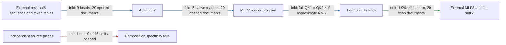

# Hourly strategic review

ACTIVE_TRACK: CIRCUIT

Actual UTC: 2026-09-18T01:55:50.775452+00:00. Next deadline: 2026-09-18T02:55:50.775452+00:00.
Previous: [00:56 WEIGHT_FOLDING review](HOURLY_STRATEGIC_REVIEW_2026-09-18_0056.md). First clock sample 01:52:11 UTC: age 56m01s, exceeding the 55-minute duplicate gate. Evidence cutoff 01:53:22 UTC. No offline backfill.

The regional path generates attention7, five MLP7 readers and head8.2's complete city-removal write from one residual6 sequence. Fresh document prediction and selective removal now pass, while the normalizer remains approximate, the later model remains external, independent composition fails, and literal cost has grown. The instructive limitation is that exact reader folding cannot in general recover the full output norm from those readings alone.

Effect error is relative L2 error of generated versus native edited-minus-unedited spelling margins. Attenuation is reduction of the UK-minus-US contrast; collateral is unrelated-reader RMS movement / target RMS. A port is an externally supplied input; the suffix is the later native model. Fold, edit, response decomposition and fitted prediction are separate evidence categories; no new fit supports this result.

## Seven targets and full goal

1. Specify information read, operations, writes and downstream consumers.
2. Group across native modules and split within modules by computational role.
3. Predict activations and behavioral effects on held-out and OOD inputs.
4. Extract an executable sufficient at a declared boundary and background.
5. Selectively remove, swap and edit against unrelated-behavior controls, including redundancy and interactions.
6. Predict joint behavior and demonstrate composition and reuse.
7. Identify stable units across documents, corpora, gauges and restarts, or downstream operational equivalence.

Goal: a smaller transparent tensor program that predicts fresh/OOD behavior, executes at a declared extraction boundary, supports selective manipulation/removal, and composes/reuses computations. Price simplicity separately in readers, products, writers, tables, weights, states, edges, adapters and compute. Neither lower error nor storage substitutes for a missing behavioral property. Quantization is excluded. Apply [better circuits](../better_circuits.md) and [communication authority](../communicating_results.md).

## Evidence since the previous review

| Claim | Evidence | Evaluation | Key result | Verdict |
|---|---|---|---|---|
| Full ordered MLP7 source expansion | fold | opened, 20 document pairs | self-only reader error 47–48%; write error 11% aggregate | retain cross terms |
| Norm factors through 384 readings | fold / structural witness | arbitrary hidden coordinates | nonzero output norm in reader kernel | false on this domain; native reachability unproved |
| Earlier residual6 export | fold plus installed edit replay | opened, 40 sequences | local and full-suffix replay gates pass | declared-boundary certificate |
| One-array removal | edit | opened, 20 documents | 1.2% effect error; 102/111 positive; 16 nulls beaten | scoped pass |
| One-array transfer | edit | fresh, 20 documents | 1.9% effect error; 114/120 positive; collateral ≤18%; 16 nulls beaten | scoped pass |
| Independent source composition | edit | prior opened source split | interaction .35 vs random median .24; beats 0/16 | failure preserved |
| Attention7 omissions | fold executor preflight | opened | replay and packing-price checks only | no causal subset selected at inspected receipt |

Primary evidence: [input terms](CITY_MLP7_INPUT_TERMS_V1_RESULT.json), [norm witness](CITY_MLP7_NORM_INFORMATION_V1_RESULT.json), [earlier boundary](CITY_EARLIER_BOUNDARY_CPU_V1_RESULT.json), [opened one-input](CITY_RESIDUAL6_SINGLE_INPUT_CPU_V1_RESULT.json), [fresh one-input](CITY_RESIDUAL6_SINGLE_INPUT_FRESH_V1_RESULT.json), [row audit](CITY_RESIDUAL6_SINGLE_INPUT_FRESH_V1_ROW_AUDIT.json), [fresh isolated replay](CITY_RESIDUAL6_SINGLE_INPUT_FRESH_V1_ISOLATED_RESULT.json), [composition null](CITY_SOURCE7_SPLIT_NULL_V1_RESULT.json), [omission preflight](CITY_ATTENTION7_OMISSION_V1_CPU_RESULT.json).

**Held-out/OOD prediction: PARTIAL, fresh scoped pass.** Twenty distinct Pile documents, forty original/city-substituted sequences and 240 fixed endpoint probes; 120 paired endpoint contrasts are not 120 independent contexts. No document or exact-input overlap with frozen panels. Untouched-arm effect error is 1.2%, substituted 2.0%; frozen constant and zero baselines are about 100% error. These are filtered same-corpus new documents and fixed spelling probes, not observed next-token labels, new endpoint validation, proven pretraining disjointness or token-only prediction. Boundary-matched predictive baselines remain absent; native-state versus constant information access differs.

**Extraction: PASS at declared approximate boundary.** Standalone generates the attention8 edit from residual6[1,T,1152], token IDs, city index and destination mask: four API inputs, one native activation array, no supplied queries/RMS. Isolated replay equals the approximate generator, not the exact native write. Blocks0–6 and full native MLP8/suffix remain external; approximation is not exact algebraic port closure.

**Selective manipulation/removal: PARTIAL, fresh registered pass.** All five fresh gates pass with four unrelated readers and sixteen same-site per-position equal-norm nulls. Mean attenuation 27%; target/null median 36×. All six reversals occur in document10 and are shared with the native removal; retain that contextual failure. Removal evidence does not establish interchange or whole-MLP7 causal ownership.

**Composition/reuse: FAIL for tested independent decompositions.** Source split and inherited/current failures persist. Whole coupled-program replay is implementation composition, not independent causal composition. A closed Möbius identity does not establish small interaction relative to the smallest piece or random-split specificity.

**Simple: measured, five-property gate UNTESTED.** Original package 23,326,342 FP32 values / 93,305,368 bytes; fresh 386-token variant 23,303,302 values. At T32 the native input has 36,864 scalars. Earlier exact-RMS export: 21,851,526 values and 23,169 native scalars. Fewer arrays moved the boundary earlier but increased weight/state cost. Five 128-dimensional readers retain all 4608 hidden products; no matched-effect random-component description-length advantage or measured whole-program speedup.

## Highest-value CIRCUIT action and alternatives

**Select a fresh source-group causal confirmation of the frozen MLP7-present city-write terms**, using the existing full product executor, before promoting those terms as a reusable component. This preserves the previous circuit handoff and tests targets 1, 2, 3 and 5. The twenty just-scored fresh documents are now opened for any new selection; freeze a new outcome-blind document panel, boundary, seeds and gates before outcomes. Keep full native query/context/normalization semantics for the reference and recompute the full suffix. Compare the frozen source-group removal, complement, full coupled write and sixteen same-site equal-norm controls; report four unrelated readers and document-level signs. Require effect error ≤.35, positive capable fraction ≥.90, mean attenuation ≥.02, every collateral ratio ≤.5 and all sixteen nulls beaten. The opened source-group screen had only 88% positive under its own weaker gates: the stronger fresh direction gate can falsify promotion. Preserve both results, without changing the earlier registration. This action is selected, not launched by this bounded review.

Ranked alternatives: (2) a five-arm source-interaction test at the head separates its product term from downstream curvature; worth doing after source transfer, but not another arbitrary partition search. Reject independent pieces if interaction/smallest effect >.35 or specificity does not beat registered matched random splits. (3) further earlier-boundary folding, retained for its next hour; it changes extraction but cannot answer the live source-selectivity uncertainty. Broad behavior atlases and generic rank/fit sweeps have lower value for the regional definition of done.

Concrete track connection: the selectively live MLP7-present group nominated the native readers to fold; exact five-reader generation now supplies a controlled executor for testing whether that same source group transfers. Its coupled products remain intact because composition specificity failed.

**WEIGHT_FOLDING handoff:** preserve primary-owned attention7 omission screen; next folding hour interpret its causal evidence, freeze any retained subset and price/export it before fresh validation; never replace full QK1×QK2×V with separate routing summaries.

Folding contract for that handoff: endpoint is the head8.2 city-removal write. Native MLP7 factors L,R=[4608,1152], D=[1152,4608], b=[1152]; W=stack(Q1,K1,Q2,K2,V)=[640,1152], C=WD=[640,4608], c=Wb. For normalized z, Wm7=C((Lz)⊙(Rz))+c. Attention7 has nine heads, each reader [128,1152] and output writer [1152,128], full dual-QK times signed current/inherited V. Expand MLP7 input into learned residual6, initial7 and attention7: retain all nine ordered products, including both attention/residual cross orders. Head8 city-side four-source expansion retains 64 current-value plus 16 inherited-value terms; no MLP-containing numerator term is omitted. The pending omission changes selected attention7 head outputs and recomputes downstream factors, not native module ablation. Background includes native residual6 and suffix, learned reentry, RMS epsilon, rounded rotary, causal support, biases and signed first-value mixing; no softmax or SiLU. Mixed8 RMS uses the declared other-source approximation. Exact reference replay requires full-subset equality to frozen generator plus native exact-factor checks at ≤1e-4; approximate subset causal effect error ≤.05 is separately registered, not an identity. Later fresh falsifier is the predictive/selective battery above. Price retained maps, products, tables and states; one dropped head provisionally saves 884,736 values only if actually packed.

## Confounds and organization

Keep signed baseline subtraction, CPU/GPU precision, nonlinear RMS and final softcap, shared token difficulty, small-effect sign floors, prompt/city filtering, post-selection and endpoint dependence visible. Earlier near-quote partner swaps prohibit assigning information to MLP7 just because its symbol appears in a cross term. A native edit's reversal is not approximation failure. No restricted suffix is proposed: prior forward response census and failed direct/head9-only sufficiency remain relevant.

Inspected circuit registry, computation-path registry, graph registry, MODULE_DOSSIERS, MLP index, MLP7 regional addendum, MLP8/9/12 dossier and attention-middle dossier. Graph snapshot: 46 packages, 41 manifests, 30 declared boundaries, two historical four-trait entries—not two five-property completions. The single-input manifest already links fresh evidence; generated graph and registry prose lag it. Missing navigation: fresh one-input/isolated receipts and completed native reader certificates are absent from the path-registry's last pending statements; MLP7 addendum still links the older donor route. **Sole bounded consequence:** append a cross-linked circuit/path/module evidence update to the path registry; leave generated inventory and concurrent dossiers/implementation untouched.

## PAST_HOUR_TIMING

Window: 00:56:09.971499 previous review to 01:53:22 cutoff. [Runner log](../bilinear_quotient/runlogs/runner.log) provides process pairs; JSON `seconds` provides calculation runtimes. Git author/committer times agree on inspected commits: input expansion 62e5703d5 at01:04:39, norm witness fd7749e53 at01:09:18, earlier export 4bcae2820 at01:27:50, one-input d25707fd4 at01:44:31, overlap audit 4c8d057d9 at01:45:14. Publication landmarks are not labor durations.

| Candidate | Authoritative execution time | Observed serial latency / limits |
|---|---|---|
| MLP7 readers | 01:47:33–01:47:36; body1.142s | claim00:51:01→exit56m35s; full prior-art→dossier unknown |
| Integrated readers | 01:47:43–01:47:46; body1.549s | CPU progress preceded delayed GPU certificate |
| Generated normalizer | 01:47:46–01:47:57; body9.324s | claim01:11:32→exit36m25s; not all active work |
| CPU prefix capture | receipt5.856s | claim01:16:39→scored board01:19:34:2m55s |
| Earlier boundary CPU suffix | receipt21.027s | claim01:21:54→scored board01:23:40:1m46s |
| Single-input CPU suffix | receipt201.063s | claim01:32:15→scored board01:44:06:11m51s |
| Fresh single-input CPU | receipt50.068s; isolated0.610s | claim01:41:07→scored board01:50:05:8m58s |

Atlas ran00:52:23–01:47:33,55m10s, exit1; board attributes failure after203 receipts to zero-row input. It restarted01:50:37; no completion assumed. At least51m24s elapsed from the00:56:09 board's explicit queued-wait report to reader start; CPU research continued, so this is not idle labor. Full candidate median cannot be recovered from partial overlapping spans. Do not sum parallel durations or compare the two CPU runtimes as a controlled speedup.

Newest matching [phase log](RESEARCH_PHASES_2026-09-18.jsonl) contains six marks total, three in this window: publication00:59:33.909, science01:01:44.226, validation01:39:18.657. Coverage gaps are about3m24s,2m10s,37m34s and14m03s to cutoff. These sparse boundaries do not measure uninterrupted work. **Design unknown; implementation unknown; validation unknown; model execution measured above; interpretation unknown; documentation/review unknown; idle/blocked labor unknown.** This review's elapsed span starts01:52:11 and ends at the receipt timestamp; no category allocation inferred.

## PROCESS_IMPROVEMENT

Ranked by plausible savings and cost: (1) ≤40-line atlas batches can avoid tens of minutes of shared-lane latency at small configuration cost; d523d7299 already added ATLAS_START/END, and the owner is repairing empty rows. Do not duplicate or alter live work. (2) Reuse existing batched CPU executor, selector and equal-norm controls; measured CPU execution is viable during queue contention, savings versus bespoke implementation unknown. (3) Append the missing fresh/certificate cross-link, low cost and immediate protection against stale “pending” claims; **executed as the one bounded CPU organizational repair**, time saved unmeasured. No new runner, data builder, index framework or refactor is justified here. Use existing research_phase_clock_v1.py for future phase marks. The timing audit remains smaller than the scientific assessment.

TRACK_ALTERNATION: PASS — WEIGHT_FOLDING → CIRCUIT; unfinished folding handoff preserved.
TRACK_PROGRESS: PASS — prior track produced exact native reader certificates, ordered input expansion, a scoped norm impossibility witness and earlier one-array extraction with fresh edit validation.
CEREMONY_BUDGET: FAIL TO VERIFY — sparse marks cannot establish validation/review < science. Bounded repair: reuse existing gates, avoid duplicate audit/framework work, and make only the navigation append; no fabricated ratio.
NOVELTY_LESSON_GATE: PASS WITH INDEX DEBT — registries and dossiers inspected; source ownership, random-split, precision, norm and recursive-closure failures constrain the next action; navigation debt repaired once.

Scope: scheduled review plus one registry append and required board coordination. No agents, durable goal, model load, jobs, timers, service changes, commits/pushes, contacts or existing experiment/result mutations. Live checkout is /workspace/tensor_language; Supervisor manages bqrunner/bqrunner2 and cron per current correction. Historical workstation systemd paths are not assumed live. Tensor checkout dirty concurrent work preserved; theseus-bench status clean.
