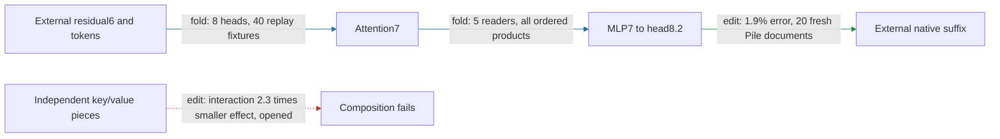

# Hourly strategic review

ACTIVE_TRACK: WEIGHT_FOLDING

Actual UTC: 2026-09-18T02:57:47.492992+00:00. Next deadline: 2026-09-18T03:57:47.492992+00:00.
Previous: [01:55 CIRCUIT review](HOURLY_STRATEGIC_REVIEW_2026-09-18_0155.md). First clock sample 02:52:12: prior receipt age 56m21s, exceeding the 55-minute duplicate gate. Scientific cutoff 02:53:25 UTC. No offline backfill.

The regional path generates head8.2's complete city-removal write from residual6 through attention7 and five MLP7 readers. A packed eight-head generator now predicts fresh removal effects, but independent composition fails and native prefix/suffix computation remains external. Successful coupled manipulation does not identify independently reusable key/value pieces.

Metrics: effect error is relative L2 error of generated versus native edited-minus-unedited spelling margins; collateral is unrelated-reader RMS movement / target RMS; interaction is joint effect minus singles relative to the smaller single-effect norm. A port is a supplied native input; suffix is the remaining native model. Fold, edit, response and fit are distinct; no new fit supports this path.

## Seven targets and full goal

1. Specify information read, operation/composition, write and downstream consumer.
2. Group across modules and split within modules by computational role.
3. Predict activations and behavioral effects on held-out and OOD inputs.
4. Extract an executable sufficient at a declared boundary and background.
5. Selectively remove, swap and edit against controls, accounting for redundancy and interactions.
6. Predict composition and demonstrate reuse across tasks/modules.
7. Identify stable units across documents, corpora, gauges and restarts, or downstream operational equivalence.

Goal: a smaller transparent tensor program that predicts fresh/OOD behavior, executes at a declared extraction boundary, supports selective manipulation/removal and composes/reuses computations. Measure simplicity separately in readers, products, writers, tables, weights, states, edges, adapters and compute. Lower error/storage cannot substitute for any behavioral property. Quantization is excluded. Authorities: [better circuits](../better_circuits.md), [communication guide](../communicating_results.md).

## Progress and five-property score

| Claim | Evidence | Evaluation | Result | Verdict |
|---|---|---|---|---|
| MLP7-present source direction | edit | fresh, 20 documents | 80% positive vs 90% gate | fails despite predictive fidelity |
| Self/mixed source rescue | edit | opened diagnostic | self 65% positive; value main 56% | no stable source role |
| Complete city interchange | edit | fresh, 20 documents | 1.4% error; 117/117 capable positive; collateral ≤7.5%; 16 nulls beaten | scoped pass |
| Two-prefix interface | fold/replay | opened | 50,688 native scalars; 23,300,998 stored values | extracted at declared boundary |
| Independent key/value interchange | edit | opened, same 20 documents | interaction 2.3 vs .35; head-cross omission 42% vs 10%; suffix interaction 1.1 vs .35 | fails |
| Packed drop-head3 removal | edit | fresh, 20 different Pile documents | 1.9% error vs 5%; 114/114 capable positive; collateral ≤12%; 16 nulls beaten | scoped pass |
| Physical packing | fold/replay + pricing | 40 opened fixtures; separate fresh replay | 884,736 fewer FP32 values, equal vocabulary | storage reduction |

Primary receipts: [source fresh](CITY_SOURCE7_FRESH_V1_RESULT.json), [interchange](CITY_FULL_INTERCHANGE_V1_RESULT.json), [composition](CITY_INTERCHANGE_COMPOSITION_V1_RESULT.json), [signed accounting](CITY_INTERCHANGE_COMPOSITION_V1_SIGNED_ACCOUNTING.json), [packing](CITY_ATTENTION7_DROP3_PACK_V1_RESULT.json), [packed fresh](CITY_ATTENTION7_DROP3_FRESH_V1_RESULT.json), [row audit](CITY_ATTENTION7_DROP3_FRESH_V1_ROW_AUDIT.json), [isolated replay](CITY_ATTENTION7_DROP3_FRESH_V1_ISOLATED_RESULT.json). Scope corrections and detailed evidence: [coupled interchange](explanations/for_logan/research_update_2026-09-18_0245_city_composition.md), [packed removal](explanations/for_logan/research_update_2026-09-18_0252_packed_city_removal.md).

**Held-out/OOD prediction: PARTIAL.** Frozen packed operator passes fresh same-corpus documents. Twenty distinct document/city-pair contexts produce forty original/substituted sequences and 240 fixed probes; endpoints are repeated measurements. Untouched/substituted error is 2.7%/1.6%. FineWeb transfer is registered and primary-owned, but its result was absent at cutoff. Pile is OOD relative to FineWeb training; repeated Pile selection does not make this a new cross-corpus confirmation. New endpoints, structural template variation and token-only prediction remain open.

**Extraction: PASS at declared approximate boundary.** Four API inputs: one residual6 array, token IDs, city index and destination mask. Native state is 36,864 scalars at T32; isolated forty-fixture replay passes. Blocks0–6 and MLP8/full suffix remain external. Generated approximate RMS is not exact native port closure. Interchange separately requires two logical contexts; the linked report explicitly corrects copied scope wording in its installed receipt.

**Selective manipulation/removal: PARTIAL, fresh registered passes.** Packed removal and complete interchange each beat sixteen same-site norm-matched nulls and four unrelated readers. They are different counterfactuals. MLP7 source-direction failure persists; capability conditioning (114/120 packed pairs) is visible rather than counting every context as successful.

**Composition/reuse: FAIL for tested independent splits; untested for packed subset.** All twenty interchange documents fail the joint/smaller bar. Head and suffix differences partly cancel (cosine −.68; aligned fractions 1.18 and −.18). A closed Möbius identity establishes neither small interactions nor random-split specificity. Keep the coupled operator.

**Simple: measured reduction; matched-effect null UNTESTED.** Fresh packed package stores 22,418,566 FP32 values / 89,674,264 bytes with 386 supported tokens, eight attention7 heads, five 128-dimensional MLP7 readers and all 4608 hidden products. Saving is 3.8% against equal-vocabulary nine-head execution; native input size is unchanged. No random-component matched-effect description-length comparison or whole-program speedup. No five-property completion.

## Chosen WEIGHT_FOLDING action

Highest value: complete and interpret the already primary-owned **frozen packed path's FineWeb transfer**, charging table growth and checking unchanged non-table factors. This advances prediction/selectivity of a concrete native folded subset and its extraction price. [Existing registration](CITY_ATTENTION7_DROP3_FINEWEB_V1_PREREGISTRATION.md) freezes the operator, gates and first twenty eligible documents. Do not launch a competing run. This review's sole consequence is the navigation repair below.

Endpoint: head8.2 city-removal vector at attention8 destinations. Input residual6 is [1,T,1152]. Attention7 retains heads {0,1,2,4,5,6,7,8}; each Q1/K1/Q2/K2/V map is [128,1152], output writer [1152,128]. Omit head3 only from the generator, not the native reference. Retain both rotated QK scores, their product with V, causal support, learned reentry and signed current/first-layer-value mixing; no softmax.

MLP7 native L,R=[4608,1152], D=[1152,4608], b=[1152]. Stack five head8.2 readers W=[640,1152]; fold C=WD=[640,4608], c=Wb. For normalized z, Wm7=C((Lz)⊙(Rz))+c. Expand input into learned residual6 + initial7 + retained attention7: include all nine ordered products, all three self terms and both orders of each cross term. No hidden-product pruning. Head8 retains the complete four-source city K1×K2×current-V expansion (64 terms) and 16 inherited-V terms, including MLP×MLP and both ordered attention/MLP crosses. Candidate queries may change after head omission.

Background/nonlinearities: learned residual coefficients, biases, token tables, rounded rotary, RMS epsilon 1.1920928955078125e-7 and bilinear products without SiLU. Mixed8 RMS keeps the registered other-source approximation. Full native suffix, final RMS and 30*tanh(logit/30) remain external. Price factors, tables, products, states and execution, separately from behavior.

Exact replay check: packed versus unpacked frozen omitted-head generator equality on fixtures, finite tensors, owned physical storage and zero off-mask writes; independently reconstructed full-reference queries within 1e-4 of capture. This certifies packing/reference semantics, not approximate-native equality. Later falsifier: first twenty fresh FineWeb documents, effect error ≤.05, ≥90 capable pairs, positive attenuation ≥.90 and mean ≥.02, all control ratios ≤.5, ≥2× null median and all sixteen nulls beaten. No outcome selection, refit, threshold change or failed-row replacement. Weight-derived token tables may extend and must be charged.

Alternatives: (2) exact norm dependency closure could improve extraction, but existing reader-kernel witnesses and costly D/Gram options rule out repeating that proof as compression; require a new restricted-domain argument. (3) any new suffix restriction requires a forward response census first; direct/head9-only failures remain. Arbitrary partitions, rank sweeps and behavior expansion have lower regional value.

Track connection: causal omission screening selected head3 as dispensable for this city reader; native folding makes that an actual factor removal. Fresh suffix edits test whether the smaller program retains the effect. Composition failure conversely forces folding to retain full QK1×QK2×V coupling.

**CIRCUIT handoff:** preserve coupled city interchange and failed source/key/value splits; after frozen corpus transfer, test a preregistered structural-template or new-endpoint manipulation with matched nulls, without another arbitrary partition search.

## Confounds and organization

Audit signed baseline subtraction, CPU reference precision, RMS/softcap nonlinearity, shared token difficulty, low-effect floors, capability conditioning, lexical/location filtering, endpoint reuse, leakage and post-selection. Source symbols do not establish causal ownership. Constant/zero baselines have different information access from native residual inputs. Exact local identities do not prove text-reachable behavior.

Read circuit/path registries, graph inventory, MODULE_DOSSIERS, MLP index, MLP7 addendum, MLP8/9/12 and attention-middle dossiers. Current graph has 48 packages, 43 manifests, 32 boundaries and two historical four-trait entries—not two five-property completions. Current circuit/path/module registries link packing/composition, but MLP7's dedicated addendum still points to the older donor interface. **Sole bounded repair:** append current evidence and registry links there; leave generated inventory and TYPED_FACE_EXTRACTION_V1 implementation untouched.

Separate program context: board/receipts v71–v103 extend pronoun/selection/number screens. v102 fails the pairwise small-interaction bar; v103 rejects the proposed head relay into 11.3 and finds MLP-written inputs. Shared heads, shared directions and downstream interaction differ. These are not regional evidence or grounds for borrowing five-property completion. Broad new-family expansion remains lower priority under the user's regional-depth authority.

## PAST_HOUR_TIMING

Window: previous receipt 01:55:50.775452 to 02:53:25 cutoff. Board claim/result boundaries measure serial elapsed spans, not uninterrupted labor:

| Candidate | Claim → scored board | Elapsed | Receipt execution |
|---|---|---:|---:|
| Fresh source group | 01:57:55.929 → 02:04:08.169 | 6m12s | 36.375s |
| Coupled interchange | 02:17:59.840 → 02:27:26.586 | 9m27s | 30.966s |
| Prefix export | 02:27:26.586 → 02:32:35.180 | 5m09s | installed 3.903s; isolated .782s |
| Interchange composition | 02:32:35.180 → 02:43:34.398 | 10m59s | 13.348s |
| Packing | 02:45:57.377 → 02:46:55.356 | 58s | 1.016s, zero full forwards |
| Packed fresh confirmation | 02:46:55.356 → 02:51:02.552 | 4m07s | 45.095s; isolated .462s |

Full prior-art→dossier latency is unknown; these partial spans do not establish a pipeline median. Composition exceeds ten minutes despite short execution; category attribution is unavailable. Runner process pairs: v97 02:42:57–02:43:03; v100 02:46:09–02:46:12; v101 02:46:12–02:46:15; v102 02:48:16–02:48:18; v103 02:50:38–02:50:41. These overlap CPU work; do not sum as wall time. Git landmarks: 47fb74fa2 02:46:56, 911e63458 02:51:28, 1dc658699 02:53:13; publication times do not measure labor or idle time.

Newest matching [phase log](RESEARCH_PHASES_2026-09-18.jsonl) has eight marks total, two in-window: validation 02:01:34.578 and publication 02:21:56.884. Gaps are 5m44s, 20m22s and 31m28s to cutoff; none implies uninterrupted active labor. **Design unknown; implementation unknown; validation unknown; model execution measured above; interpretation unknown; documentation/review unknown; idle/blocked labor unknown.** This review spans first clock sample 02:52:12 to receipt time; no category allocation inferred.

## PROCESS_IMPROVEMENT

Ranked savings/cost: (1) reuse existing regional_panel_overlap_v1 and batched CPU executor for corpus transfer—already owner-implemented, likely avoids repeated builder/audit work at minimal marginal cost; minutes saved unmeasured. (2) short atlas batches can prevent long shared-lane delays, but no newly measured stall justifies runner changes here. (3) repair missing MLP7 navigation—tiny append, likely avoids historical reconstruction; executed as the sole nonconflicting CPU organizational consequence. No new helper, runner or refactor justified. Use research_phase_clock_v1.py for future phase boundaries; sparse marks cannot support a ceremony ratio. Timing audit remains smaller than scientific review.

TRACK_ALTERNATION: PASS — CIRCUIT → WEIGHT_FOLDING; other-track handoff preserved.
TRACK_PROGRESS: PASS — CIRCUIT hour produced fresh source falsification, fresh coupled interchange and discriminating composition failure; late packing is a folding handoff, not a reason to repeat CIRCUIT.
CEREMONY_BUDGET: FAIL TO VERIFY — sparse phases cannot show review/validation smaller than science. Bounded repair: reuse controls and append only missing navigation; no bespoke audit machinery or invented durations.
NOVELTY_LESSON_GATE: PASS WITH NAVIGATION REPAIR — registries/dossiers searched; source-role, composition, norm-price and recursive-closure failures retained; dedicated-dossier link repaired.

Scope: review plus one dossier append and required board coordination. No agents, durable goal, model load, jobs, service/timer changes, commits/pushes, contacts or experiment/result mutations. Live checkout /workspace/tensor_language and current Supervisor ownership override historical workstation systemd paths. Concurrent dirty work preserved; theseus-bench status clean.
