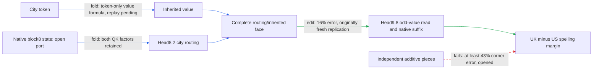

# Regional face: a sharp obstruction to independent additive pieces

Actual review UTC: **2026-09-17T20:57:00Z**. Next mathematical deadline:
**2026-09-17T23:57:00Z**. Previous mathematical review:
[15 September 05:52](THREE_HOURLY_MATHEMATICAL_REVIEW_2026-09-15_0552.md),
well beyond the 175-minute freshness stop. No offline reviews are backfilled.
This is one bounded review plus one executed CPU consequence.

The regional route takes a city-dependent head8.2 routing/inherited-value write
through head9.8's odd-value branch to UK/US spelling margins. Its complete
retained face predicts the original fresh replication, but its pieces fail the
new small-interaction definition; extraction and matched-null selectivity remain
open. This review strengthens the failure: **even freely chosen additive pieces
cannot approximate all four measured face corners within 35% of the smaller
original single-effect norm**. The sharp lower bound is 43% overall and 37–69%
in every one of the eight distinct context cells. These are opened-data bounds,
not new edits, causal identification, or evidence against keeping the full face.

**Metrics.** For stacked logit-margin vectors, replay error is
\(\|\widehat y-y\|_2/\|y\|_2\); change-norm ratio is
\(\|x\|_2/\|y\|_2\), which may exceed one under cancellation; aligned fraction
is \(x^Ty/\|y\|_2^2\), and cosine measures direction. Write replay uses relative
Frobenius norm. For face corners \(Y_{00},Y_{10},Y_{01},Y_{11}\), define
\(I=Y_{11}-Y_{10}-Y_{01}+Y_{00}\) and
\(m=\min(\|Y_{10}-Y_{00}\|_2,\|Y_{01}-Y_{00}\|_2)\).
The original stronger composition diagnostic is \(\|I\|_2/m\); the new
all-corners additive lower bound is \(\|I\|_2/(4m)\). They are different tests.
Zero-effect denominators must be reported undefined, never treated as a pass.

| Claim | Evidence tag | Fresh/opened | Key numbers | Status |
|---|---|---|---|---|
| Frozen face predicts full three-port intervention | edit | fresh at original replication; now opened | error .16, cosine .99957; four control ratios .076–.15 | passes original conditional gate |
| Original atom-wise support transfers in each cue cell | edit | original fresh panel | British .35318 versus .35 | fails; no retrospective rescue |
| Face pieces have small interaction | edit reanalysis | opened | interaction/smallest single 1.7; aligned fraction .068, cosine .30 | fails .35 gate; random-split null missing |
| Any additive two-piece approximation covers all four corners | edit-artifact mathematical analysis | opened, eight contexts | best possible worst-corner error .43 of smaller single overall | impossible at .35 under stated norm |
| Native producer location follows from output corners | fold, falsifying toy | synthetic | identical four outputs; fifth-arm outputs 2 versus 4 | falsified inference |
| Closed face is independently extracted and selectively removable | edit | native closure implementation in progress | no completed exact-face native/null receipt at cutoff | not yet tested |

## Native mathematical object and literal price

Indices: batch \(b\), positions \(t,s<T\), layers \(\ell=0,\ldots,17\),
heads \(h=0,\ldots,8\), residual coordinates \(i,j<d=1152\), head coordinates
\(a<k=128\), MLP channels \(c<p=4608\), and vocabulary \(v<V=50304\).
Embedding and unembedding \(E,U\in\mathbb R^{V\times d}\) are **untied**.
The actual initial state is \(e_{bt}=N_d(E_{\mathrm{token}_{bt}})\), where
\(N_n(x)=x/\sqrt{\|x\|^2/n+2^{-23}}\) for the FP32 native contract.
At each block,

\[
u_\ell=\lambda_{\ell0}x_\ell+\lambda_{\ell1}e,\quad
z_\ell=N_d(u_\ell),\quad y_\ell=u_\ell+A_\ell(z_\ell),\quad
x_{\ell+1}=y_\ell+D_\ell[(L_\ell N_d(y_\ell))\odot(R_\ell N_d(y_\ell))]+b_\ell.
\]

\(L,R\) are \([4608,1152]\), \(D\) is \([1152,4608]\), and
\(b\) is \([1152]\). No SiLU is active for this checkpoint. Each head has
\(Q_1,K_1,Q_2,K_2,V_h\in\mathbb R^{128\times1152}\) and
\(O_h\in\mathbb R^{1152\times128}\). With native rounded rotary \(\mathcal R_t\),

\[
q_{jbt}=\mathcal R_tN_k(Q_jz_{bt}),\quad
k_{jbs}=\mathcal R_sN_k(K_jz_{bs}),\quad
a_{jbts}=k^{-1}\sum_a q_{jbta}k_{jbsa},
\]
\[
v_{bsa}=(1-\mu_\ell)(V_hz_{bs})_a+\mu_\ell v^{(0)}_{bsha},\qquad
A_{bti}=\sum_{h,s\le t,a}(O_h)_{ia}a_{1bhts}a_{2bhts}v_{bhsa}.
\]

Layer zero sets the first-value tensor from its current projection before
contextual attention; later layers reuse that tensor. Mixing is signed, not
assumed convex. The contraction graph is residual → five projections → four
head normalizers/rotations → two dot products → their product → value product
→ source reduction/output map → residual addition → normalized bilinear MLP.
Outputs are \(30\tanh(U N_d(x_{18})/30)\); the regional endpoint subtracts two
**separately softcapped** logits, not the softcap of a contrast.

The native program is nonpolynomial because RMS and tanh remain live. With all
normalizers supplied, a QK numerator is quadratic, full QK1×QK2×current-V is
degree five in independently supplied residual slots, and an MLP is quadratic.
The inherited branch is degree four in current residual slots and linear in
its separate token-value slot. Across a block with frozen denominators the
largest degree can grow by ten; such formal degrees are not native error bounds.
Parameters are shared across positions; first values are also shared across
layers. MLP channel permutations, Left/Right swaps and reciprocal rescaling
preserve the bilinear form. Unrestricted Q/K GL transformations do not preserve
separate RMS plus fixed rotary; only transformations preserving those forms
and rotary contractions are legal. General tensor-factor gauges are not
identified semantic units. Named source partitions and clamp backgrounds are
part of the intervention specification.

Literal native storage is \(2Vd+18(6d^2+3dp+d+3)=545,902,902\) parameters:
six attention matrices, three MLP matrices, MLP bias, mixture and two residual
scalars per block. Common FP32 storage is 2,183,611,608 bytes before buffers.
Per block/token dense projection multiplications are \(6d^2+3dp\), plus
\(p\) MLP products. Attention adds about \((3k+1)\) multiplications per
head/causal query-key cell, plus value mixing, normalizers, rotary, additions
and reductions. Final full-vocabulary multiplication costs \(Vd\) per scored
position. Activations, causal score storage, masks, token metadata, adapters,
prefix generation and the entire recursive suffix remain charged.

### Current regional candidate and folded path

The candidate object is the fixed head8.2 routing/inherited face, masks
\((1,4,5)\), with the current-value switch fixed to recipient. The canonical
broader route is regional inherited-city head8.2 → head9.8-O, cross-linked to
`PATH-SET2-001`. This candidate is not yet a circuit under all five properties.

Write \(\rho_0,\rho_1\in\mathbb R^{B\times T\times S}\) for recipient and
city-key-donor head8.2 routing, each the **complete product of both QK scores**.
Let \(c_0,i_0,i_1\in\mathbb R^{B\times S\times128}\) be unmixed recipient
current and recipient/donor inherited values. For city mask \(M_s\) and
destination mask \(D_t\), the exact write is

\[
\delta w_t=D_tO_{8,2}\sum_s M_s\{\Delta\rho_{ts}[(1-\mu)c_{0s}+\mu i_{0s}]
+\rho_{0ts}\mu\Delta i_s+\Delta\rho_{ts}\mu\Delta i_s\}.
\]

It equals the difference of corners 5 and 0 before normalization. Current-value
changes and masks 2,3,6,7 are omitted as interventions, not set to zero in the
background. All other source tokens, nonselected destinations, queries and
other native head services are held to the recipient specification.

Block9 reentry/RMS computes the induced current-state difference, then only
head9.8-O's current-value read is changed. O is the odd part under the fixed
shared-key reflection:
\(\rho_O=(a_1a_2-a_1^{\rm reflected}a_2^{\rm reflected})/2\), with native
denominators and supplied key-coordinate adapters. It is not the whole head.
The lattice keeps its routing native while transporting the value difference;
the recursive suffix supplies final scores. This boundary is explicit in
[the shared runtime](../bilinear_quotient/ops/odd_attention8h2_sparse_lattice_runtime.py).

The factor prototype accepts five dynamic routing/value tensors plus two masks,
one mixture and one output matrix. Its current implementation materializes
three [B,T,1152] writes. With those factors already available, the static writer
and mixture alone cost 147,457 scalars; that excludes the expensive input
generators. The concurrently owned native closure instead proposes two native
state inputs, city IDs/index and destination mask, six [128,1152]-equivalent
matrices, mixture, and eight 128-value token entries: **885,761 floating
scalars plus eight token IDs**, before rotary buffers, serialization overhead,
native head9 adapters/state and suffix. This is a structural price derived
from the implementation, not measured package bytes or validated extraction.
Its unknown-token rejection and finite eight-token vocabulary must remain
declared. The historical full composed edge cost 1,933,572 static scalars and
about 4.09 dense deltas of dedicated state; do not transfer its savings to this
new face. A two-corner subtotal needs two downstream evaluations, while four
corners remain necessary to measure both singles and their interaction.

### Earlier residual sources and full multiplicative interactions

Let \(r=b+a+m\), with learned propagation included in the background, earlier
attention write and earlier MLP write. For a fixed-normalizer QK reader,
\(B_j(r_t,r_s)=\sum_{X,Y\in\{b,a,m\}}B_j(X_t,Y_s)\), where
\(B_j(X,Y)=X^TQ_j^T\mathcal R_t^T\mathcal R_sK_jY\) divided by all native
scales. The nine terms are bb, ba, bm, ab, aa, am, mb, ma, mm.
For a bilinear MLP, the corresponding ordered term is
\(D[(LX)\odot(RY)]\); am and ma are distinct unless explicitly grouped.
Bias is retained separately. Removing a source changes RMS and must recompute
it; dividing each source by its own RMS would not be this expansion.

At full attention level the expansion is
\(\sum_{X,Y,Z,W,H}B_1(X,Y)B_2(Z,W)V(H)\): 81 QK products and 243
current-value source products for three sources in each slot, plus inherited
terms. Shared query/key residuals and learned weights constrain these slots;
they are not statistically independent merely because the polynomial is written
with separate indices. The current face retains all upstream source terms
implicitly through supplied states; it claims no upstream sparse truncation.

For changes \(a_1\to a_1+u\), \(a_2\to a_2+v\), \(w\to w+z\), the
complete channel difference is exactly

\[
ua_2w+a_1vw+a_1a_2z+uvw+ua_2z+a_1vz+uvz.
\]

Thus \(\Delta\rho=ua_2+a_1v+uv\); the retained face includes that QK cross
term in both routing and routing×inherited contributions. QK2 is never
replaceable by a separately scored additive edit. Older PATH-SET2 QK1 folding
retained DD+DR+RD for \(D=A_5+M_5+M_6+M_7\); its exact parent-minus-RR
identity is already established. QK2 has a three-source census in the dossier,
but the deeper grouped-source closure and fresh selective edit remain open.

## Literature mapping and executed consequence

The best match is a finite intervention tensor, not a generic low-rank tensor
fit. Kuo, Sloan, Wasilkowski and Woźniakowski's **Theorem 2.1** gives the unique
decomposition under commuting coordinate projections and their annihilation
conditions. Here the coordinates are routing/inherited binary switches, the
other switch is fixed, and each tensor entry is a vector of native outcomes.
Anchor projections yield the existing Möbius face; uniform two-point averaging
instead gives an orthogonal constant/single/interaction decomposition. Both
are exact because every corner is available with the same background. No
natural-input independence, smoothness or low-degree assumption is needed.
The uniqueness is conditional on these coordinates/projections, not causal
or gauge identification. See [the authors' paper, Theorem 2.1 and examples
2.2–2.3](https://web.maths.unsw.edu.au/~fkuo/pubs/preprint/ksww09-decomp.pdf).

**Derived here:** stack the four outcome vectors as rows of \(Y\), let
\(s=(1,-1,-1,1)^T\), and use the additive design columns
\((1,a,b)\). Then \(s^TY=I\) and every additive table \(A\) obeys
\(s^TA=0\). Cauchy–Schwarz and the triangle inequality imply

\[
\|Y-A\|_F\ge\|I\|_2/2,\qquad
\max_{a,b}\|Y_{ab}-A_{ab}\|_2\ge\|I\|_2/4.
\]

Both bounds are attained by \(A^*=Y-sI/4\). This projection permits arbitrary
context-dependent additive coefficients, making the impossibility stronger
than rejecting one frozen coefficient choice. It is a closed-form diagnostic,
not a learned model or an adopted fit. Runtime and storage are O(N) for N
stored scalar outcomes. Full p-switch tables cost O(p 2^p N) for a fast
transform; reducing that requires a justified restriction, not assumed small
interactions. The .35 comparison here is a **new necessary condition for
four-corner approximation**, not a replacement for any original preregistered
gate. The proof is exact for the saved rounded values; finite arithmetic and
future distribution shift are outside it.

Executed [CPU control](face_additivity_bound_20260917_2055.py) and
[exclusive receipt](FACE_ADDITIVITY_BOUND_20260917_2055_RESULT.json) use
`/venv/main/bin/python`, hidden CUDA and two CPU threads. They bind artifact,
manifest and control hashes, verify attainment and orthogonality, inspect all
eight context cells and every anchor flip, and execute an interaction-location
counterexample. All algebraic checks pass; full precision is in the receipt.
The bound/smallest-single is .43 overall, .48 British, .37 American; all eight
context values exceed .35. Original interaction/minimum-single was 1.74; flipping
the inherited anchor changes that ratio to 2.25 while leaving absolute
interaction norm unchanged. Anchor selection cannot rescue the registered test.

The counterexample uses \(H_A(a,b)=(a,b,ab)\),
\(F_A(z)=z_1+z_2+2z_3\), versus \(H_B(a,b)=(a,b,0)\),
\(F_B(z)=z_1+z_2+2z_1z_2\). Both output \(a+b+2ab\) everywhere; only the
first producer has a mixed write. Their additive-write fifth-arm outputs at
(1,1) are 2 and 4. Thus the native output tensor cannot by itself locate the
interaction. This witness is a polynomial restriction, not a replica of the
full normalized model. The general derivative distinction is also reflected
in [Boyd and Vandenberghe, Appendix A.4.4](https://web.stanford.edu/~boyd/cvxbook/bv_cvxbook.pdf):
composition has both inner-function and outer-function curvature.

For actual writes \(h,a,b,c\), the exact finite diagnostic is

\[
I=[F(h+a+b+c)-F(h+a+b)]
 +[F(h+a+b)-F(h+a)-F(h+b)+F(h)].
\]

The first bracket propagates the producer cross write; the second measures
suffix interaction of additive writes. It needs the additional same-site
additive-write arm. This is already implemented for the *different* head9.8
QK1/current-value experiment; reuse its semantics if needed for this exact face.
Do not misattribute the old result to head8.2 routing/inherited closure.

**Alternatives checked.** [Oseledets's TT algorithm](https://users.math.msu.edu/users/iwenmark/Teaching/CMSE890/TENSOR_oseledets2011.pdf)
maps a finite coefficient/corner tensor to cores with ranks constrained by
unfolding matrices; sequential SVD gives an exact representation at full ranks
or a Frobenius-controlled approximation. Dense conversion must access the input
tensor and pay its unfolding SVD costs. Internal core gauges remain, and no
causal or OOD guarantee follows. Here the outcome tensor is already tiny and
RMS/suffix dependencies remain outside its entries, so TT/HT/MPO contraction
engineering would save the wrong object. Weighted-automaton/Hankel realization
would instead require an identified finite-rank string function with reusable
prefix/suffix transitions; the present eight-context clamp table supplies no
such closure. Tensor-rank identifiability and graph-width methods likewise do
not replace missing ports or matched interventions. No broad decomposition or
rank sweep is justified before the existing native closure and response census.

## Organization, efficiency and handoffs

Read completely: local research-driver skill, startup guide, NEXT_CODEX_PROMPT,
both user-designated authorities. Read board protocol/current tail, latest
mathematical and hourly receipts, recent commits, circuit/path/graph registries,
relevant attention8/9/17, MLP5–8/16/17 dossier slices and indexes, explanation
indexes/current regional report, typed-face preregistrations/results/runtime,
and historical ledger/backlog tails. Old absolute project paths were resolved
against this live checkout for reads. Latest observed commit is `5389f14ae`
(20:53:41 UTC), following `61507e668`; its scheduling/report changes belong to
the primary agent. theseus-bench was clean. No active durable goal exists here.

| Authority / alias | Reconciliation and actionable ownership |
|---|---|
| Circuit registry regional inherited-city → PATH-SET2-001 → module.attention.8 / module.attention.9 / head9.8-O | Existing chain, midpoint and QK1/value receipts are indexed. Exact face masks (1,4,5), replication and stronger failure are missing from these older indexes; this review links them without rewriting history. Owner should synchronize upon binding the exact package. |
| Graph registry V1 | Inventory predates new face: 32 packages, 27 manifests, 16 declared boundaries, two historically four-trait-verified packages, zero explicit cycles. Unknown metadata is not scientific failure. A new prototype is not a third certification. |
| Subject-number / M4 factor manifests | Historical four-trait flags remain scoped to their original verifiers. Subject graph takes token IDs and three metadata inputs, internally retaining native generators; M4 takes five activation ports and rotary context. Neither automatically passes the newly strengthened composition/simplicity nulls. No new behavior work opened here. |
| Typed face ownership | Primary owns TYPED_FACE_EXTRACTION_V1 and now TYPED_FACE_NATIVE_V1. The latter preregisters 288 opened-panel forwards and two-state/eight-token closure; no native result existed at cutoff. Prototype code is explicitly uncertified. |
| Explanations | Top README and Logan pointer correctly carry September17 composition failure. September13 migration NEXT/startup snapshots, dated LATEST and old systemd text are stale; current commits, board and Supervisor/cron override them. |
| Attention17 and late group aliases | Source/head/basis transfer failures already close several proposed suffix supports. Do not restart the stale September15 head-split handoff. QK2 three-source fold exists; deeper grouping and fresh edit are the remaining gap. |

Efficiency observations are bounded and timestamped, not reconstructed phase
accounting. At about 20:53:41 both Supervisor services were RUNNING since
20:46:44, both queues had zero lines, and lane1's last canary exited at
20:47:02. Old log segments are not current waits. The typed-face replication
reports 15.53 seconds for 1,152 forwards; this is kernel/run time, not serial
candidate latency. No complete phase markers establish a science/ceremony ratio
or ten-minute screen median. This review began its first clock check at
20:52:32 and executed its CPU bound at 20:56:02; the computation itself took
.0096 seconds inside a .75-second Python process. Literature/reading/publication
dominates this review by design; do not make this ceremony mandatory per screen.

Concrete avoidable work: the shared 186-line lattice runtime exists, yet the
363-line sparse runner and 194-line face runner repeat manifest/scoring ceremony.
More materially, the 96 replication rows are **eight context/source cells and
16 distinct token sequences**, each scored at six spelling endpoints. The
runtime forwards each endpoint row independently although all five readout
contrasts can be obtained from one logit vector. A future result-equivalent
deduplicated evaluator could reduce replication's eight-corner body from 768
to 128 forwards, or the proposed three-arm replay from 288 to 48, after proving
donor/mask/index equality and maintaining the frozen result row order. These
are execution-count opportunities, not measured speedups or extra independent
samples. The earlier destination-response runner already used context
deduplication; recover that design instead of inventing another data builder.

**No shared-code repair made:** the primary is actively modifying the exact
runtime derivative, completed runners are hash-bound, and the proposed job is
only seconds long. Concurrent mutation and revalidation would cost more than
the saved compute now. The safe organizational action is this explicit
crosswalk and handoff plus the isolated control; no extra publisher, registry
schema or reporting framework is warranted. Do not alter review timers,
queues, primary receipts or the owner’s extraction implementation.

The five-property assessment for the **current face**, separately scored:

- **Predicts held-out/OOD:** passes original authored-to-natural, source-disjoint
  conditional replication; constant/training-fit null comparison and token-only
  OOD prediction are not established. FineWeb is not pretraining-disjoint.
- **Extracted:** algebra prototype only; native two-state/eight-token closure is
  in progress, with block9/O/suffix still external. No extraction certification.
- **Selective manipulation/removal:** four unrelated readouts are small in the
  original interchange, but fresh same-site equal-norm removal null is missing.
- **Composes/reuses:** old full-face prediction passes; independent small-piece
  composition fails, and random splits are untested. Keeping the face as one
  component is a candidate regrouping, not a vacuous composition pass.
- **Simple:** three retained atoms/four diagnostic corners, two subtotal corners,
  explicit prices above; no matched-effect random-component description-length
  baseline, measured total speedup or whole-model reduction.

**WEIGHT_FOLDING handoff:** finish the owner's exact token-value/QK closure first;
keep both QK factors, full current baseline and explicit RMS. Then open head9.8
QK2's existing carry/attention8/MLP8 terms one level deeper, folding MLP5–7
quadratics and attention5's source-position QK1×QK2×V without fitted proxies.
Circuit evidence selected the city writer and odd reader; the mathematical
obstruction now selects a complete multiplicative group rather than independent
main effects. Track every remaining port and charge its generators.

**CIRCUIT handoff:** after exact replay, preregister same-site equal-norm
removal, at least three unrelated readers, self/no-op and matched random-split
controls with identical anchor, scale, masks and measured effect size. Preserve
the current failed .35 interaction gate. If locating interaction is needed,
add the fifth arm at this exact face and decompose each edited forward's final
pre-RMS change into propagated write plus all downstream module responses
before naming a suffix. Opposing predictions: a producer-cross mechanism makes
the first bracket dominate; downstream curvature makes the second dominate.
Neither outcome alone certifies selectivity. Template controls must change the
city-description/colon/quote structure used in authored discovery, not just
replace city names. The natural replication uses 32-token source fragments;
it does not by itself isolate colon/quote dependence.

Hourly alternation stays unchanged: latest 20:51 review is WEIGHT_FOLDING;
the next hourly track is CIRCUIT. This mathematical review starts no hourly
track, agent, goal, GPU job or unbounded continuation. No commit/push, contact,
timer/queue/service changes, or primary-receipt edits were performed. Algebraic
replay, the new approximation bound and storage counts do not prove native
causal fidelity. Quantization is out of scope.
