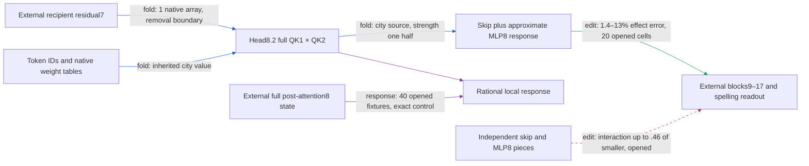

# Regional removal: exact strength dependence and the cost of omitted context

Actual review UTC: **2026-09-18T00:05:38.966598+00:00**. Next mathematical deadline: **2026-09-18T03:05:38.966598+00:00**.
Previous: [17 September 20:57](THREE_HOURLY_MATHEMATICAL_REVIEW_2026-09-17_2057.md).
At the first clock sample, 23:58:07, it was 181 minutes old, exceeding the
175-minute freshness stop. This is a bounded active review with one executed CPU
consequence; no offline hours are backfilled. Research evidence cutoff is
**2026-09-18T00:00:43Z**, except the explicitly identified read-only inventory checks.

The regional route now removes a city token's inherited-value contribution from
head8.2, carries its coupled residual-skip/MLP8 response into block9, and evaluates
spelling margins through the native suffix. The donor-free operator passes its
opened causal screen; the paired predecessor also passed fresh prediction and
selectivity. Neither completes the five-property definition: upstream native
states and the suffix remain external, composition failures stand, and simplicity
has no matched-effect comparator. The useful mathematical consequence is an exact
**two-sample reconstruction of the local strength-response curve**, together with
a diagnosis that omitted context, more than freezing RMS alone, explains the
current local approximation error. This is opened local response algebra, not a
fresh causal or OOD result.

**Metrics.** A port is an externally supplied input. The suffix is the remaining
native computation after installation. Local error is relative Frobenius norm
of the block9 input change; effect error is relative L2 norm of the signed
edited-minus-native spelling-margin vector. Norm ratio is ||candidate||/||reference||;
aligned fraction is their inner product divided by reference squared norm. Norm
ratios can exceed one under cancellation. Attenuation is proportional reduction
of the capable paired cue margin. Collateral is unrelated-reader RMS movement
relative to target RMS. Composition uses interaction norm relative to the
**smallest single effect**, with a matched random-split comparator. Undefined
zero denominators cannot count as passes.

| Claim | Evidence tag | Fresh/opened | Key numbers | Status |
|---|---|---|---|---|
| One-head paired approximation predicts full native half-write | edit | fresh at original freeze, now opened | 1.1–15% effect error; 16–22% attenuation; 16/16 nulls; collateral ≤.16 | passes original six gates |
| Donor-free city-source half-removal predicts/selectively changes spelling | edit | opened | 1.4–13% effect error; 7.7–10% attenuation; 16/16 nulls; collateral ≤.15 | passes original five gates |
| Paired pruned package runs independently at declared inputs | fold implementation | opened replay | 40 fixtures, 2 native arrays; native and isolated gates pass | passes boundary replay |
| Removal generalizes to new endpoints | edit, prospective | unopened at cutoff | 20 registered cells; no result inspected | not yet tested |
| Rational local response recovered from two samples | response algebra | 40 opened fixtures, 20 cells | all closures pass at seven signed strengths | exact restriction |
| Reducing strength automatically removes context-approximation error | response diagnostic | opened | 7.1–12% local error at .125 versus 7.2–13% at .5 | unsupported; error persists |
| Coupled executor is independently composable pieces | edit | earlier opened partitions | skip/MLP8 interaction reaches .46; destination split beats only 1/9 random splits | fails tested partitions |

Primary evidence: [paired fresh](SINGLE_HEAD_FRESH_V1_RESULT.json),
[donor-free screen](CITY_INHERITED_REMOVAL_V1_RESULT.json),
[pruned native](SINGLE_HEAD_PRUNED_V1_RESULT.json),
[pruned isolated](SINGLE_HEAD_PRUNED_V1_STANDALONE_RESULT.json),
[new-endpoint registration](CITY_REMOVAL_ENDPOINT_FRESH_V1_PREREGISTRATION.md),
[skip/MLP8 factorial](TYPED_FACE_MLP8_MEDIATION_V1_RESULT.json), and
[destination null](DESTINATION_PARTITION_V1_RESULT.json).
The .125 comparison reduces strength fourfold from .5; neither it nor a half-strength
change supplies a causal gate. No scientific pass threshold was invented for this curve.

## The native mathematical object

Indices are batch b, query/source positions t,s<T, block ell=0,…,17,
head h=0,…,8, residual i<d=1152, head coordinate a<k=128,
MLP channel c<p=4608, vocabulary v<V=50304. Untied E,U have shape [V,d].
Let N_n(x)=x/sqrt(mean(x²)+epsilon), with the native FP32 contract
 epsilon=2^-23. The initial state is e=N_d(E[token]); block input x_ell,
reentry u_ell=lambda_ell,0 x_ell+lambda_ell,1 e, and

\[
z_\ell=N_d(u_\ell),\quad g_\ell=u_\ell+A_\ell(z_\ell),\qquad
x_{\ell+1}=g_\ell+D_\ell[(L_\ell N_d(g_\ell))\odot(R_\ell N_d(g_\ell))]+b_\ell.
\]

L,R:[4608,1152], D:[1152,4608], b:[1152]. Each head has
Q1,K1,Q2,K2,Vh:[128,1152] and Oh:[1152,128]. For j=1,2,

\[
q_{jbt}=\mathcal R_tN_k(Q_jz_{bt}),\quad
k_{jbs}=\mathcal R_sN_k(K_jz_{bs}),\quad
r_{jbts}=k^{-1}\sum_a q_{jbta}k_{jbsa},
\]
\[
v_{bhsa}=(1-\mu_\ell)(V_hz_{bs})_a+\mu_\ell v^{(0)}_{bhsa},\qquad
A_{bti}=\sum_{h,s\le t,a}(O_h)_{ia}r_{1bhts}r_{2bhts}v_{bhsa}.
\]

Rotary R uses the actual rounded native buffers. First values v^(0) are the
block0 projection before contextual attention and are reused across layers;
they include block0's normalization/reentry semantics and depend only on the
token. Mixtures are learned signed coefficients, not presumed convex. Output
logits are 30 tanh(U N_d(x18)/30). UK-minus-US is the difference of two separately
softcapped logits. No attention softmax or MLP SiLU is active.

The contraction graph is residual/reentry → five head projections → four head
normalizers and rotations → two QK contractions → their product → value product
→ source sum/output projection → residual sum → normalized two-reader MLP
product → Down/write. Each layer's weights are tied across positions; first
values are also shared across layers. E and U are not tied. MLP channel
permutations, Left/Right exchange and reciprocal channel scaling are gauges.
Arbitrary Q/K GL gauges are invalid under separate RMS and fixed rotary;
only transformations preserving the normalizers and rotary pairings qualify.
A tensor-factor gauge is not a semantic identification.

The whole native model is nonpolynomial: live RMS and final tanh matter.
Conditioning on every denominator yields degree two QK numerators, degree five
QK1×QK2×current-V in independent slots, and degree two MLPs. The inherited branch
is degree four in current residual slots, linear in its separate token slot.
A block's maximal formal degree can multiply by ten if denominators are frozen;
that bookkeeping is not a native approximation guarantee. The local normalized
bilinear MLP, unusually, is rational because its two identical RMS square-root
factors multiply to one quadratic denominator.

Literal native storage is 2Vd+18(6d²+3dp+d+3)=545,902,902 scalars,
or 2,183,611,608 bytes at common FP32, before buffers. Dense block projections
cost 6d²+3dp multiplications/token, plus p elementwise MLP products and about
3k+1 multiplications per head/causal query-source cell, excluding normalizers,
rotary, mixture, additions and masking. Full readout costs Vd per scored position.
All supplied state generation, tables, metadata, suffix, and intervention arms
remain charged.

## Circuit candidate, folded path and selected terms

Canonical aliases: regional inherited-city route / PATH-SET2-001 / head8.2
(L8H2), historically conditional head9.8-O. O is the odd part under the fixed
shared-key reflection of the **complete two-QK product**, not the whole head.
The old routing/inherited face (masks 1,4,5; current-value change held off) has

\[
\delta w=D_tO\sum_sM_s\{\Delta\rho[(1-\mu)c_0+\mu i_0]
 +\rho_0\mu\Delta i+\Delta\rho\mu\Delta i\},\quad \rho=r_1r_2.
\]

It keeps the routing×inherited interaction. Its face closure never proved small
interactions or selective ownership. The forward response census and native8
scope test rejected conditional head9-only sufficiency (89–94% effect error)
and direct-only sufficiency. They selected the **coupled head8.2/MLP8 response**
for deeper folding; no new suffix is nominated here.

For the current donor-free operator, define a fixed recipient source direction

\[
w_{bt}=-D_tO_{8,2}\,r_{1bt,c}\,r_{2bt,c}\,\mu_8\,v^{(0)}_{b,2,c},
\quad \delta(t_*)=t_*w.
\]

Here c is the city position, D_t selects positions strictly after city and
before the last token, and strength t_*=.5 in the registered screen. Both
routing factors are recipient functions. Only the city inherited source is
removed; current value, other source positions and other heads remain in the
reference model. This is a different counterfactual from the paired donor swap,
not proof that its donor port was closed.

The exact reference uses g=u8+sum_h a8,h. The candidate uses g2=u8+a8,2 and

\[
\widehat F(t_*)=t_*w+
D[(t_*Lw)\odot(Rg_2)+(Lg_2)\odot(t_*Rw)+t_*^2(Lw)\odot(Rw)]/s_2,
\quad s_2=\operatorname{mean}(g_2^2)+\epsilon.
\]

It keeps skip, both ordered cross terms and quadratic response; freezes the
single-head background denominator and omits the other eight head writes and
the changing-normalization correction. This approximation passed downstream
tests at its registered strength; it is not exact elimination of those heads.

Earlier attention/MLP sources cannot be silently discarded. For r=b+a+m,
each fixed-full-denominator bilinear QK has nine ordered terms bb,ba,bm,
ab,aa,am,mb,ma,mm. A bilinear MLP has D[(LX)⊙(RY)] for the same nine ordered
pairs; am and ma are distinct. Denominators belong to the full state, not
separately normalized sources. Full attention expands to
sum B1(X,Y) B2(Z,W) V(H): 81 QK products and 243 current-value products for
three named sources per slot, with inherited-value terms separate. These slots
share native states/parameters and are not independent random inputs.
For score changes u,v and value change z the full product difference is
u r2 v0 + r1 v v0 + r1 r2 z + u v v0 + u r2 z + r1 v z + u v z.
The paired face retains the QK cross u v inside delta-rho. The new removal
changes only inherited value with both recipient QKs intact; it makes no sparse
claim about their earlier-source terms. In g2's MLP response, retain both w/source
orders for lambda80 residual7, lambda81 e and a8,2, plus w×w. Opening residual7
requires all preceding attention and MLP sources until a fresh edit justifies
an omission.

**Candidate price.** The paired pruned package has 16,899,587 floating scalars,
67,603,449 serialized program bytes, 70 supported sequence tokens, two native
arrays (38,016 scalars at T=32), and external blocks9–17/readout. Its six
head matrices total 6dk=884,736 scalars; full MLP8 L/R/D cost 3dp=15,925,248.
Tables, scalars and remaining entries account for the rest. The removal function
currently reuses this bundle and takes one residual7 array (36,864 scalars at
T=32); it has no separately certified isolated removal package. Unknown tokens
are outside the fixed table contract. One head rather than nine is a real local
operation reduction, but the upstream native producer still computes its full
state. No matched-effect random program price or end-to-end speed advantage is
established. The 800-forward screen is a validation price, not deployment cost.

## Literature mapping and executed mathematical consequence

Prior art found in the MLP8/9 dossier: [RESPONSE_PRODUCT_BASIS_V2](RESPONSE_PRODUCT_BASIS_V2_MATH.md)
already derives the three-vector exact local response, two-vector same-direction
mixed response, and six symmetric downstream products, with native validation.
Do not rediscover its rank claim or extend it through changing attention without
checking the assumptions. This review applies that identity to the new city
removal and adds a two-sample reconstruction instrument and error-source audit.

The best outside algorithm is polynomial interpolation after clearing the known
RMS denominator. Berrut and Trefethen give uniqueness at distinct nodes and
barycentric evaluation (Sections 2–4): [author-hosted primary paper](https://people.maths.ox.ac.uk/trefethen/barycentric.pdf).
Map the interpolation coordinate to removal strength; each residual coordinate
at each fixed position is a scalar output. After removing the known skip and
multiplying by the known squared RMS, the problem below is degree one. Two
distinct nonzero nodes therefore suffice. The nodes need not be sampled from a
natural distribution. Standard weight preparation is O(n²), evaluation O(n)
per scalar, and here n=2 is constant. Uniqueness concerns this conditional
polynomial, not semantic units, causal identification, or unsampled contexts.
Native rounding is tested separately; distinct nodes too close together or small
effect denominators can make empirical recovery ill-conditioned.

**Derived application.** Let B0=D[(Lg)⊙(Rg)], B1=D[(Lw)⊙(Rg)+(Lg)⊙(Rw)],
B2=D[(Lw)⊙(Rw)], s0=mean(g²)+epsilon, beta=2 mean(gw), gamma=mean(w²),
s(t)=s0+beta t+gamma t². Then

\[
F(t)=tw+\frac{B_0+tB_1+t^2B_2}{s(t)}-\frac{B_0}{s_0}
=tw+\frac{tP+t^2Q}{s(t)},
\quad P=B_1-\beta B_0/s_0,\quad Q=B_2-\gamma B_0/s_0.
\]

Consequently Z(t)=s(t)[F(t)-tw]/t=P+tQ. For distinct nonzero a,b,

\[
F(t)=tw+\frac{t}{s(t)}\left[\frac{b-t}{b-a}Z(a)+\frac{t-a}{b-a}Z(b)\right].
\]

Zero strength returns zero directly. s(t)≥epsilon in exact arithmetic; the
control computes mean((g+tw)²)+epsilon directly rather than subtracting large
quadratic terms. This is an exact conditional identity for any L,R,D,g,w,
including trained weights. Its three-vector span is **per position**; denominators
vary by position, so it is not a rank-three claim for the whole stacked sequence.
All coefficients depend on the supplied pristine context. Bias cancels.

Dense preparation costs O(BTpd); storing w,P,Q plus s0,beta,gamma costs
BT(3d+3) scalars. Subsequent local evaluations cost O(BTd), with no new dense
MLP multiplies. Two direct nonzero samples are an alternative instrument when
w and denominator coefficients are available, not a cheaper way to manufacture
missing native states. Already available analytic preparation is preferable for
production. No suffix acceleration or measured whole-model savings follows.

**Executed:** [control](review_rational_strength_20260918_0007.py),
[receipt](REVIEW_RATIONAL_STRENGTH_20260918_0007_RESULT.json), using
`CUDA_VISIBLE_DEVICES='' PYTHONDONTWRITEBYTECODE=1 OMP_NUM_THREADS=2 OPENBLAS_NUM_THREADS=2 /venv/main/bin/python`.
It used trained package weights and 40 saved native sequences from 20 actual
(variant, local-template-index, city-pair) cells, not 240 independent endpoint
rows. Twenty distinct British texts corroborate that count; template indices
alone are reused across variants. Source hashes are checked unchanged before
and after. Evaluation took 4.4 seconds. Nodes a=.25,b=.75 reconstruct strengths
-.5,.125,.25,.5,.75,1,1.5; interpolation nodes themselves are replay checks,
not held-out strengths. Exactness gates and zero/outside-support controls pass.
Full numerical closure values are in the appendix receipt.

The second useful identity is an exact split of candidate error. Put
Ffreeze=tw+(tB1+t²B2)/s0, and let C1 be B1 with g replaced by g2. Then

\[
\widehat F-F=(F_{\rm freeze}-F)+
\left[(tC_1+t^2B_2)/s_2-(tB_1+t^2B_2)/s_0\right].
\]

The first term isolates freezing full-context normalization; the second isolates
changing the background and its fixed norm. At strength .5, the first has
2.9–3.4% of the exact local-response norm; the second 6.6–12%; total error is
7.2–13%. Signed error cross-products are recorded, so these norms are not added
as independent contributions. At .125 total error is 7.1–12%; at 1.5 it is
7.7–13%. Removing less does not erase a first-order background discrepancy:
F'(0)=w+P/s0, whereas candidate derivative is w+C1/s2. Unless these coincide,
relative error can have a nonzero small-strength limit. No behavioral conclusion
about negative or >1 strength follows from this local control.

Opposing-prediction instrument: an exact local-response executor must satisfy
the rational identity across strengths; a frozen single-head executor generally
has the distinct quadratic curve just derived. A downstream spelling curve need
not satisfy either interpolation identity, because blocks9–17 recompute nonlinear
responses. Use this instrument to distinguish a local implementation mismatch
from genuine suffix effects; never interpolate final logits as if they were this
local object. The cheap control supports keeping live context in the exact
reference and the existing approximate candidate unchanged until fresh evidence
selects otherwise. It does not justify restoring eight heads merely to reduce
local vector error.

Alternative searched/opened: [arithmetic-circuit tensor networks](https://arxiv.org/abs/2209.07410)
represent multivariable functions and study structured integration. That is a
representation analogy here, not a recoverability theorem for this normalized
native causal program. TT/MPO/HT compression would operate on a sampled tensor
or a conditioned polynomial and leave the context generators/suffix outside;
weighted-automaton Hankel realization would require a finite-rank string function
with closed prefix/suffix transitions, which this clamp panel does not supply.
Neither is a serious replacement for the exact one-dimensional restriction and
registered fresh removal test. No new tensor-rank sweep is warranted.

## Five-property scorecard and track handoffs

| Property | Current regional verdict |
|---|---|
| Predicts held-out/OOD | PARTIAL. Paired fresh construction/city transfer beats fixed constant and text-OLS baselines; same endpoints. Removal is opened only at cutoff; new-endpoint confirmation registered. Corpus and token-only prediction remain open. Native-state access exceeds the text baselines' information. |
| Extracted at a declared boundary | PARTIAL. Paired implementation passes standalone/native replay with two native arrays; new removal function uses one recipient array but does not inherit isolated certification. Native prefix and suffix remain external. |
| Selective manipulation/removal | PARTIAL. Paired fresh selectivity and donor-free opened removal each pass their own same-site norm-matched null/four-reader gates. New removal freshness is still required. |
| Composition/reuse | FAIL for tested regional partitions; broader reuse UNTESTED. Closed face algebra and rational strength reuse cannot substitute for small interactions versus smallest piece or matched random splits. |
| Simple | MEASURED PRICE, NOT ESTABLISHED as a five-property win. One-head local computation and bundle counts above; no equal-effect random description-length comparison or whole-model runtime adoption. |

CIRCUIT handoff: primary owns the already registered new-endpoint donor-free
confirmation. Preserve its capability failures, if any; do not filter rows or
relax .90 positive fraction/16-of-16 null gates. It tests 20 fresh cells with
York/Portland and Oxford/Seattle and six endpoint-disjoint pairs against frozen
old-panel predictors. No outcome is assumed here. After interpreting it, a
prospective strength test at .25,.5,1 could compare exact versus approximate local
responses with full suffix, same-site norm-matched removals and four unrelated
readers; it must preregister margins before viewing those outcomes. The present
CPU curve is selection evidence for that design, not fresh confirmation.

WEIGHT_FOLDING handoff: use the removal result to select the recipient residual7
port for one exact upstream producer step; retain reentry, initial state and all
ordered attention/MLP interactions. The rational identity suggests grouping
head8.2's city source with its context-conditioned MLP8 response, rather than
naming skip and quadratic pieces independent circuits. Distinguish the current
one-head approximation from exact port closure. Existing response census rejects
a head9-only/direct-only shortcut; no suffix is proposed without new forward
response evidence. TYPED_FACE_EXTRACTION_V1 and all implementation remain
primary-owned. This review does not switch the hourly track: latest 23:55 is
CIRCUIT, with WEIGHT_FOLDING due at its next boundary.

## Organization and efficiency audit

Read the local skill completely, current startup and NEXT completely, both
user-designated authorities, board protocol/current tail, recent commits, all
three hourly receipts since the previous math review, circuit/path/graph
registries, module/index slices for attention8/9 and MLP7/8/9, current explanation,
primary registrations/results/runtime, and ledger/backlog tails. Historical
/workspace references were resolved against this live checkout for reading.
The stale September13 setting2-next-action and workstation systemd snapshots do
not override current September17 primary work or Supervisor/cron. No durable
goal exists in this review thread. Latest cutoff commit was d598e19e9; concurrent
logs, registries, explanations and queued work were left intact. theseus-bench
was clean at inspection.

| Index / object | Reconciliation at cutoff and owner handoff |
|---|---|
| CIRCUIT_REGISTRY → PATH-SET2-001 → module.attention.8 / .9 → MLP8 | Canonical regional link exists. Circuit entry's recent regional narrative stops at pending native8 scope; path registry and MODULE_DOSSIERS carry later 23:54 certification but still say removal untested. Bind CITY_INHERITED_REMOVAL_V1_RESULT when owner publishes the endpoint verdict; this review supplies the interim link. |
| Dedicated MLP8 dossier | 23:55 append already links ordered source expansion, fresh cross, pruned native/isolated receipts. It also exposed September13 rational-response prior art. Do not repeat either repair or theorem claim. |
| MLP7 / attention-middle dossiers | Initial-state/source-omission and contextual-routing failures remain relevant to residual7 closure. Old pending source omissions are not new unexplored candidates. |
| Graph inventory | Latest read: 43 packages, 38 manifests, 27 declared boundaries, 2 historical four-trait verifier records, 0 explicit cycles. Only 4 dependency edges are explicit: absence of cycles is not proof of full native closure. The one-head package is indexed; the removal function has no distinct package entry. |
| Package manifest | Top-level scope/receipts reflect native and isolated certification; nested validation.scope still says pending. This is a concrete stale-field inconsistency, not failure of those primary receipts. Owner should reconcile at next package publication. |
| Explanation indexes | Top README correctly points to the 23:48 one-head report; its removal paragraph is superseded by the opened receipt. Dated LATEST and startup NEXT are historical handoffs, not current experiment selection. |
| Concurrent auxiliary lanes | Separate scorecards/receipts exist; they do not establish regional traits. Board reports lexicon-overlap corrections and four-way composition failures. Keep those limitations and do not borrow their OOD labels or launch new auxiliary work. |

Eight package-local head8.py files have identical hashes. These copies support
standalone exports; replacing them by a repository import would violate extraction.
Their shared **authoring** source could be reused, but changing historical snapshots
or repackaging them now has no demonstrated benefit. The fresh single-head and
new-endpoint row builders visibly duplicate tokenization, paired-prefix checks,
old-prefix search and row construction, while forms/pairs/endpoints differ.
A future small declarative builder is plausible. Both are frozen/primary-owned,
and their semantic endpoint changes need distinct validation; refactoring now
would force rebindings and tests for unmeasured savings. All three relevant
runners already reuse regional_endpoint_batching_v1.group_rows/expand. Preserve
that 240-row→40-sequence batching; do not create a new scorer or executor framework.

**Focused repair decision:** no shared-code/registry repair in this turn. The one
executed consequence above has clearer immediate scientific value; the 23:55
review already repaired dossier navigation, owners are actively publishing, and
frozen export hashes/registrations make adjacent refactoring more costly than
its current benefit. This report records exact stale fields and canonical links
without modifying primary receipts. New builder consolidation should wait for
the next unfrozen panel, using one declarative specification and existing checks.

Runtime observed read-only: bqrunner, bqrunner2 and cron RUNNING under Supervisor;
one auxiliary job was queued at inspection. No service or queue changes made.
Runner intervals: single-head screen 23:42:38–43; paired fresh 23:46:03–14;
pruned replay 23:51:32–36; removal 23:55:43–54. Primary body times are respectively
2.9s (hourly receipt), 9.2s, 2.3s and 9.0s. Board claim→exit for fresh one-head is
about 2m24s, and pruned certification about 54s. These are partial serial spans,
not complete prior-art→scored-dossier time or active labor. Latest phase marks
include implementation, validation, publication and science; sparse boundaries
cannot determine their duration ratio. Review/ceremony dominance is **unverified**,
not automatically a pass or inferred from GPU gaps. Auxiliary owner reports
24 minutes spent constructing lexicons; treat that as self-report, with the
specific corpus-overlap corrections motivating reuse of existing vocabulary
validation instead of another disjointness hunt.

The review's own wall interval starts at 23:58:07 and ends at its actual timestamp
above; CPU control body is 4.4s. No whole three-hour labor accounting is fabricated.
The mathematical control was chosen over another decomposition fit because it
cost seconds, respects the current circuit-selected boundary and exposes the
approximation's first-order limitation. Primary fresh causal work remains the
highest-value next behavioral action.

## Reproducibility and limits

The new control's numerical maxima are identity relative error
4.045524590402766e-13 and interpolation relative error 5.307721995784635e-13;
zero strength and out-of-support response are exactly zero. It uses FP64 arithmetic
on saved native states/FP32 weights, not native FP32 whole-model execution.
Control and receipt identifiers are unique filenames; their actual execution
UTC is recorded inside the receipt (00:00:41), independent of the identifier suffix.
All new review links are checked locally before publication. The new files are
this review, the control, its receipt, and one short append to AGENT_BOARD.md.
No agents, GPU/model jobs, goal creation, timer/queue changes, commits/pushes,
contacts, primary receipt edits or changes to TYPED_FACE_EXTRACTION_V1 occurred.
