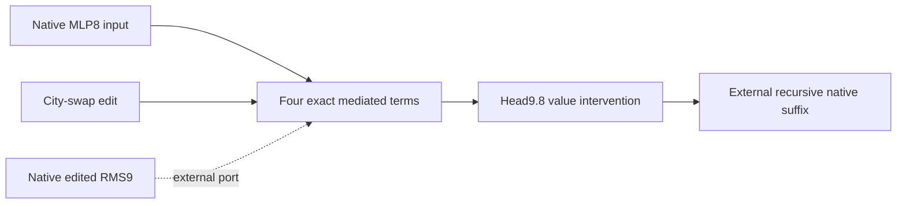

# Three-hour mathematical, organization and efficiency review

Actual review time: 2026-09-20 07:31 UTC. Next deadline: **2026-09-20 10:31 UTC**.
The 04:22:08 review was 183 minutes old at entry. This is a bounded scheduled review, not continuation of the primary goal. No agents, GPU jobs, schedule changes or commits were made.

The regional path remains a conditional MLP8-to-head9.8 value mediator with native input and edited-normalizer ports. A previously overlooked primary receipt already passes its opened composition screen; random-split specificity and fresh joint confirmation remain missing. Separately, the subject-number program now predicts four reader effects on new syntax at a conditional post11 boundary, but source-reuse preservation fails. Exact full-attention finite readers improve the instrument, not those behavioral verdicts.

## Native mathematical objects

Indices: layer l=0,…,17, token t,s<T with causal s≤t, residual i,j=1,…,1152, head h=1,…,9, head coordinate a=1,…,128, MLP channel k=1,…,4608, vocabulary v=1,…,50304. Embedding E and untied unembedding U are each 50304×1152. Each layer has L,R∈R^(4608×1152), D∈R^(1152×4608), b∈R^1152; Q1,K1,Q2,K2,V,O are head-stacked 1152×1152 maps. Parameters are shared across positions, not assumed shared across layers; first-layer values are explicitly reused downstream.

Let N(x)=x/sqrt(||x||²/1152+ε), ε=2^-23. With learned re-entry coefficients, r_l=λ_l0 h_l+λ_l1 E[token]. Define q^j_th=RoPE_t N_128(Q^j_h N(r_lt)), and similarly k^j_sh. N_128 uses the implemented head epsilon; actual rounded rotary constants are retained. Scores S^j_hts=<q^j_th,k^j_sh>/128 and value v_lsh=(1−μ_l)V_lh N(r_ls)+μ_l v_first,sh give

    a_lt = Σ_h O_lh Σ_s≤t S¹_hts S²_hts v_lsh,
    u_lt = r_lt + a_lt,
    h_(l+1),t = u_lt + D_l[(L_l N(u_lt)) ⊙ (R_l N(u_lt))] + b_l,
    logits_tv = 30 tanh((U_v N(h_18,t))/30).

This is the contraction graph: embedding/re-entry → two normalized, rotated QK contractions → their product with mixed value → O/residual → normalized bilinear MLP/residual → final RMS/U/softcap. No softmax or SiLU. RMS, reciprocal square root, masks and final tanh prevent treating the native program as a global polynomial. With denominators supplied as separate slots, one attention numerator has degree five in its state slots (or degree four times the external first-value slot), and an MLP numerator degree two. Substitution into later modules raises degree; multiplying degrees while ignoring denominator dependencies is not exact native folding.

For named residual sources r=c+Σ_p a_p+Σ_q m_q=Σ_α r_α, a denominator-conditioned score expands as Σ_αβ r_α,t^T B^j_hts r_β,s. Its full attention product has terms indexed by (α,β,γ,δ,η): B¹(r_α,r_β) B²(r_γ,r_δ) V(r_η). It includes attention-attention and MLP-MLP self terms, both ordered attention/MLP crosses, carry terms, and their interactions between the two scores and value. The analogous MLP is Σ_αβ D[(Lr_α)⊙(Rr_β)]/ρ²+b. Neither score can be independently pruned without testing the full product.

**Regional circuit object.** At the head9.8 current-value interface, let z be the native raw MLP8 input, δ the upstream attention8 city-swap change, ρ²=mean(z²)+ε, ρ'²=mean((z+δ)²)+ε, and C=W^V_9.8 D_8 (128×4608), including native scalar mixing/re-entry factors where applied. The mediated change before the receiving normalizer is exactly

    C[(Lz⊙Rz)(1/ρ'²−1/ρ²)
      +(Lδ⊙Rz + Lz⊙Rδ + Lδ⊙Rδ)/ρ'²].

The receiver divides by supplied edited RMS9 and applies its native current-value mixing. These four coupled terms retain both ordered crosses, δ self and MLP8 normalization response. Constant Down bias cancels in this MLP difference, but remains in the backgrounds and all complete forwards. The mediator excludes the direct δ route and the receiver's own baseline-normalizer-change term: this is a declared value intervention, not full upstream-swap replay. Keys, other heads and native suffix remain background. The separate registered A/B composition uses direct and mediated paths at this same value boundary.

**Current folded response object (separate subject-number thread).** Seven post11-to-post17 boundaries use encoders W_l and decoders V_l∈R^(1152×8), with full sequence coordinates z_lt∈R^8. Six MLPs compile symmetric output-valued cores C_l∈R^(8×8×8), stored as 36 unordered pairs per output. v668/v670 retain 18 pairs per layer, shared across eight outputs, hence 108 numerator products/token instead of 216. Background-linear terms, dense Gram RMS forms, carry, all two-QK/value attention interactions and four final contrasts stay live. Projected attention stores context-dependent score forms with O(T²r²) size. Native baseline sequences, first-layer values and initial response are explicit dependencies. v675/v676 are a different object: endpoint-conditioned pullbacks q_l satisfying <q_l,Δh_l>=Δcontrast. Both native endpoints are inputs, so these are response instruments rather than extracted predictors.

Gauges: MLP channel permutations, L_k→aL_k/R_k→R_k/a, and latent V→VG with compensating encoder/core/Gram/readout transforms preserve the represented map. Pair sparsity depends on general rotations; signed-diagonal invariance is a narrower verified property. Source labels and token positions constrain admissible interventions; algebraic gauges do not identify semantic units.

Norms: report per-cell relative L2 target-effect error, preservation-reader error divided by that cell's target-effect norm, native collateral/target norm, and absolute closure errors separately. Composition requires ||e_AB−e_A−e_B||/min(||e_A||,||e_B||), with live singles and random splits. Coefficient Frobenius error and endpoint replay are separate metrics.

Literal prices: each native MLP has 15,926,400 values, 4608 channel products and roughly 3×1152×4608 multiply-accumulates/token, plus normalization. The regional mediator stores 11,206,658 FP32 values (44,826,632 bytes), with 36,896 native scalars at T=32 plus 36,864 intervention scalars; prefix, edited-RMS generation and suffix are additional. Subject v670 has 1718 floating runtime values plus 216 support indices, 1,943,258 prepared-case tensor values and a 15,805,403-byte artifact for eight fixed examples. Producer maps cost 577,536 values; attention compiler state and its execution are additional. Dense Gram quadratic work is not removed by numerator sparsity. Full-model runtime or total-cost superiority has not been measured.

## LITERATURE_SEARCH

Actual queries executed:

1. `McLachlan Quispel Robidoux 1999 geometric integration discrete gradients chain rule`
2. `balanced truncation empirical gramians nonlinear model reduction observability Rowley 2005 balanced proper orthogonal decomposition`
3. `tensor train decomposition Oseledets 2011 SIAM original pdf`

Primary sources opened successfully (no access failure in these opens):

- [McLachlan, Quispel and Robidoux, 1998, §III](https://arxiv.org/pdf/math-ph/9805021), also its abstract page. The discrete-gradient condition is endpoint difference equals reader dotted with state difference, with a derivative limit at equal endpoints. Map V to a native scalar contrast and x to a complete boundary state. Smoothness holds in real arithmetic with positive RMS epsilon and fixed token/mask context; rounded native operations need numerical closure tolerances. Local midpoint product and divided-difference rules compose over our DAG at reverse-pass cost, including attention's quadratic token cost. They provide exact closure, not unique identification or an OOD error bound. **Plan effect:** separate endpoint calibration readers from frozen predictive features.
- [Otto, Padovan and Rowley, CoBRAS](https://arxiv.org/html/2207.14387v3), especially §2.1 and Theorem 2. State and gradient covariance map to intervention responses and suffix-observable sensitivities; snapshot SVD supplies oblique encoder/decoder spaces. The Gaussian conditional-expectation bound requires positive-definite state covariance, square-integrable differentiable outputs and actual gradient covariance. Native prompt distributions and endpoint secants do not meet that statement automatically. With n state coordinates and m snapshots, forming the cross-snapshot matrix costs O(nm²), its SVD O(m³). Bases have rotation/nonunique degeneracies, no semantic uniqueness. **Plan effect:** supports testing full-attention observability at unchanged width; does not certify v673/v674 or authorize more data-informed fitting.
- [Willcox and Peraire, balanced POD](https://kiwi.oden.utexas.edu/papers/Balanced-proper-orthogonal-decomposition-Willcox-Peraire.pdf). Opened original eight-page article. Linear-system state/adjoint snapshots motivate the shared rectangular contraction. A six-layer nonlinear, layer-dependent suffix is not a stable LTI system, so classical balanced-truncation guarantees cannot simply be imported. **Plan effect:** shared snapshot machinery is appropriate; no native fidelity claim.
- [Oseledets, Tensor-Train Decomposition](https://users.math.msu.edu/users/iwenmark/Teaching/CMSE890/TENSOR_oseledets2011.pdf). Opened original 23-page paper. Fixed-slot coefficient tensors admit unfolding-rank TT construction and SVD truncation; order k, mode n, rank r storage is O(knr²), but constructing a dense input tensor can be exponential in k. Internal bond gauges remain. Our repeated-input polynomial, normalizers and external contexts must be specified separately. **Plan effect:** TT/HT remain conventional same-object baselines, not universal circuit minimality or native causal guarantees.

## Executed mathematical consequence

The best direct match is discrete-gradient closure. Our derived falsifier is that it cannot establish reader reuse, even with correct equal-endpoint derivatives. For f(a,b,c)=abc, the midpoint product rule applied to (ab)c and a(bc) gives different readers at x=(1,2,3), y=(2,4,5): (12,6,5) and (13,6,4.5). Both dot y−x to exactly 34 and both limit to ∇f at coincident endpoints. Thus even algebraically equivalent full-product programs have different finite readers. More generally adding any continuous vanishing-on-diagonal vector orthogonal to Δx preserves closure.

A second planted case uses f(x)=xᵀQx, Q=[[1,2],[2,3]]. The exact reader for 0→(1,0), frozen for 0→(0,1), predicts 2 while truth is 3. Recomputing Q(x+y) gives exactly 3: full-rank algebra rescues the failure. This costs a tiny float64 CPU calculation and attacks the interpretation without consuming native runs.

Executed with `/venv/main/bin/python`, CUDA disabled and two CPU threads. [Control source](review_secant_control_2026_09_20_0727.py) and [receipt](REVIEW_SECANT_CONTROL_2026-09-20_0727.json) preserve exact outputs and hashes of audited primary sources. This is a planted mathematical control, not new native evidence. Consequence for experiments: freeze candidate features using calibration only, then predict independently generated source edits without their edited endpoint; otherwise label the output response attribution. Existing full-attention code already states this limitation correctly.

## BASELINE_COMPARISON

Authority: [DECOMPOSITION_BASELINES_2026-09-20.md](DECOMPOSITION_BASELINES_2026-09-20.md). Compare identical outputs, native ports/background generation, sequence lengths, precision and effect-error measures; equal latent width alone is not equal cost.

| Baseline | Measured status and limit |
|---|---|
| Native factors/full suffix | Reference, including biases, norms, both scores and values. Same five-port aggregate subject effect costs 36 native block evaluations versus 92 for individual graph edges; different output interfaces must stay separate. |
| Dense36 versus sparse18 versus sparse9/zero | v668 at fixed width8 and four readers: worst target errors 4.57%, 7.66%, 28.63%, 22.52%. Opened eight-cell panel. Context costs unchanged; sparse18 is not dense fallback. |
| Matched random18 | Three equal-support controls: 17.80%, 9.28%, 26.10%; one passes. On fresh irregular v669, zero and all random18 pass too. No uniqueness claim. |
| Spectral scalar quadratic | Conventional exact ≤1152 signed-square representation for one scalar normalized-input numerator. Earlier v619–624 concern another output/port interface; not a measured competitor for four-reader suffix behavior. |
| Joint Tucker/input-mode frames | Earlier native input/output-mode controls and repaired CPU float64 full-rank replay exist; negative transfer is family-specific. No same-boundary four-reader matched-total-price Tucker comparison here. |
| HT/TT fixed trees, alternative trees | Native same-output, same-port comparisons remain **missing**. Toy controls do not fill this cell. |
| Constant/isotropic shortcut | Historical regional/scalar controls cannot certify the newer subject target. Zero quadratic tests only numerator necessity; a calibration-only constant effect baseline on new subject cells remains **missing**. |

## REDTEAM_POSITIVE

Strongest new behavioral success: v667 joint-reader prediction/selectivity on 48 prospective rows, eight template-number cells (four structures × two numbers), not 48 independent contexts. Target error 0.64–4.57%, three modal prediction errors 1.71–3.36%, native collateral 1.59–3.53%, matched-site target/random ratio 15.23. Calibration uses 256 original texts; v673's 768 intervention cases do not create 768 texts. Evaluation-informed redesign makes v666 opened; vocabulary history is not proved globally disjoint. v669 adds irregular nouns but native capability is 83.3% in one cell, failing 90%; gate booleans excluding capability cannot erase this.

v670's isolated CPU replay and signed-diagonal gauge audit support boundary extraction, not token closure. Prepared contexts and initial responses may carry the difficult computation and are charged. Checkpoint-free loading is not absence of native-port dependence. Three preservation readers restrict unrelated-damage claims; same-task syntax transfer is not cross-task reuse. The executed cubic/quadratic control above specifically breaks the inference from exact finite-reader closure to reusable features while preserving native v675/v676 instrument successes.

Regional correction: [CITY_VALUE_PATH_COMPOSITION_V1_RESULT.json](CITY_VALUE_PATH_COMPOSITION_V1_RESULT.json) passes all three registered gates on the opened 40-sequence/20-document panel, 240 probes. Interaction/smaller is 0.200 overall, 0.152 reversed and 0.201 other versus 0.35. This is materially stronger than merely closed Möbius accounting. It still lacks same-full-write random-split specificity and fresh joint confirmation; do not promote independent composition.

## REDTEAM_NEGATIVE

Strongest new failure: v671/v672/v674 source-reuse preservation. Existing independent [CPU audit](SOURCE_REUSE_CPU_AUDIT_2026-09-20.json) confirms identical native targets between sparse and dense controls. Restoring all36 pairs leaves A/B modal errors 6.08%/6.81% against5%; v674's broader same-width source calibration also fails. Therefore pruning alone does not explain the failure. Dense36 is full quadratic core capacity **within width8**, not full1152-dimensional recovery.

The plausible rescue is missing full-attention observable directions, not a proved lack of low-dimensional structure. Native v675 independently validates attention forward contraction, finite closure, causal support and float64; v676 passes all seven boundary closures for four readers. Neither evaluates the rescued reduced model. Bias cancellation, axes/signs, actual rotary semantics, precision and residual re-entry are explicit in these instruments; their equal-endpoint CPU tests and our full-rank quadratic positive control prevent treating a broken approximation as impossibility. Optimization convergence is inapplicable to today's no-optimizer control; previous fitted negatives still require their own planted/restart audits. No rank escalation or GPU rescue was run here.

## Five-property scorecard

| Property | Regional mediator | Subject conditional sparse suffix |
|---|---|---|
| Held-out/OOD prediction | Fresh20 FineWeb documents pass conditional prediction; broad corpus OOD not established and parent direction failures preserved | Fresh syntax eight cells passes; irregular native capability failure; broad corpus OOD untested |
| Extraction | Three declared inputs: native z8, edit δ, edited RMS9; native suffix external | Portable prepared-context consumer passes CPU replay; initial response/background/first-value generators external |
| Selective manipulation/removal | Fresh mediated value intervention passes four controls and16 matched nulls; not whole-MLP removal | Joint-site edit passes three controls and8 random edits; separate-source preservation fails |
| Composition/reuse | Opened direct/mediated composition screen passes; fresh/random-split specificity missing | Joint dynamics prediction passes; A/B source reuse fails preservation; cross-error/sum is not interaction/smaller |
| Measured simplicity | 11,206,658 FP32 values and reduced ports; matched-effect simplicity unmeasured | 108 versus216 numerator products, explicit context/index price; whole-program matched-cost superiority unmeasured |

No object earns the full five-property definition from these results. The graph inventory's two `four_trait_verified` labels are scoped metadata and do not prove measured simplicity or transfer to the new response consumer.

## Organization, efficiency and actionable handoffs

Read startup/NEXT, skill in full, user authorities, newest board, recent commits (HEAD initially42691d873), both hourly receipts, circuit/path registries, graph registry, module/MLP indexes, relevant MLP8/17 module records, explanation index and regional explanation, primary results and runner preregistrations. Resolve historical `/workspace/rspd` instructions against this checkout for reading; Supervisor live state overrides stale startup systemd text. Theseus checkout was clean; live tensor checkout has concurrent uncommitted implementations, artifacts and board work. TYPED_FACE_EXTRACTION_V1 untouched.

Reconciliation findings:

- Graph registry lists49 packages/44 manifests/33 declared boundaries; regional mediator selection metadata lags its fresh receipt. This is documentation/schema debt, not a scientific failed selectivity test.
- Circuit/path/module records and explanation index agree on fresh mediator but still call direct/MLP8 composition pending. The landed receipt above changes that status to **opened screen passes; fresh and random specificity pending**. This review provides the correction with primary link rather than rewriting historical receipts.
- PATH-SUBJECT-001 still describes old scalar-proxy work; v665–676 live in the baseline ledger, new path note, board and followups. The v670 consumer is not the token-input subject graph despite shared subject-number naming. Do not transfer the latter's certificate or free-port count to it.
- Aliases MLP8/layer-8 MLP and PATH-SET2-001 resolve in MODULE_DOSSIERS; the guessed individual MLP8_CURRENT_UNDERSTANDING filename does not exist. Missing individual coverage is not unexplored work.
- Concrete duplicate ceremony: v671/v674 runner headers and plan fields still mention frozen suffix attention, despite dynamic execution and accurate terminal scope. Copied runner metadata can misstate calls/interfaces. Prefer later consolidation into one declarative arm specification around existing shared_response_runtime, finite_attention_readers and full_suffix_readers; do not create another framework now.

No shared-code refactor was made: the primary agent is actively editing the response infrastructure, and the safe review control has higher immediate value than touching that changing interface. Broad registry regeneration would also risk preserving stale certificate semantics. This is a deliberate bounded choice, not a claim that organization is complete. Current receipts are discoverable via this review and its board link.

Efficiency evidence: Supervisor bqrunner/bqrunner2 RUNNING, queue.txt empty at inspection; runner then executing a canary. v673 ended07:06:54, v674 ran07:08:34–07:08:38, v67507:14:59–07:15:02, v67607:21:03–07:21:06. Instrument receipt runtimes1.79s and2.50s contrast with multi-minute design/authoring intervals; no measured reason to add GPU capacity. Queue-idle intervals are not necessarily human idle time. Precise ceremony/science fractions are uninstrumented. v673 already caches prefix captures across source variants; retain that efficiency. Review read/output volume is itself overhead: use primary receipt summaries and hashes, not full historical inventories next time.

Hourly discipline:05:19 WEIGHT_FOLDING→06:22 CIRCUIT alternates correctly. Prior05:19 provenance overlooked later September19 hourly filenames; do not repeat its claim that18:47 was the latest. This review neither invents missing hours nor changes hourly track state. Next hourly work should use the actual newest receipt at execution.

**CIRCUIT handoff:** regional depth first. Reuse the completed direct/MLP8 composition receipt; preregister same-full-write random splits and fresh joint intervention at head9.8 value, retaining fixed keys, full downstream response census and all four preservation readers. Opposing prediction: a meaningful source decomposition beats effect-matched random splits; generic weak suffix curvature makes both pass similarly. Do not rerun the completed opened screen.

**WEIGHT_FOLDING handoff:** the regional mediator's exact exclusion of receiver-normalizer response selects the remaining edited-RMS port for closure; keep full two-QK/value context and compare native factorization at identical ports. Folded direct/MLP8 terms suggest a coupled value group until the specificity test supports a split. For the existing subject thread, full dynamic finite readers can test whether attention observability caused v674 failure, but only a frozen-frame evaluation on new independent source edits can decide; endpoint closure is calibration evidence. No successor job is launched by this bounded review.
