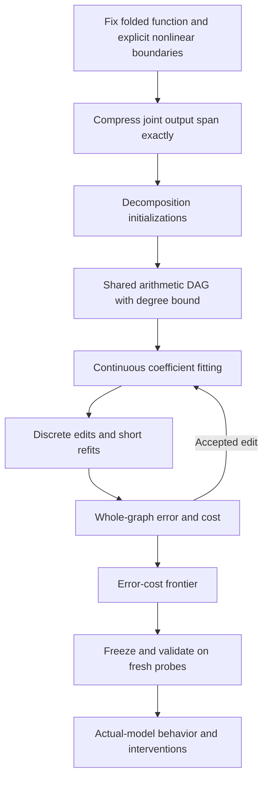

# Arithmetic-program search from folded weights

Recorded 2026-09-20 19:26 UTC from the user's concrete proposal. This is the implementation target for the alternative two-stage approach, not a claim that all stages already exist.

**Fit a small arithmetic program directly to a fixed folded section of the model.** Tensor decompositions propose useful intermediate computations and edits. The final architecture is a directed acyclic graph (DAG) of learned linear combinations and products; Tucker or hierarchical Tucker (HT) does not constrain the final graph.

## 1. Fix the teacher function and its boundaries

Start with the unembedding folded through one bilinear layer:

$$
F(x)=UD[(Lx)\odot(R_{\mathrm{in}}x)].
$$

Then extend to two bilinear layers, including the specified residual paths and biases. Without intervening nonpolynomial operations, this gives terms of degrees zero through four. Keep RMSNorm, Q/K normalization, attention operations outside the chosen polynomial section, and softcapping explicit. If normalization occurs between two layers, the full composition is not a quartic polynomial: state which polynomial numerator or fixed-interface subcomputation is being fitted.

Compress the output space exactly first. With a thin orthonormal factorization

$$
UD=Q R_{\mathrm{out}},\qquad Q^\top Q=I,
$$

fit

$$
\widetilde F(x)=R_{\mathrm{out}}[(Lx)\odot(R_{\mathrm{in}}x)],
\qquad F(x)=Q\widetilde F(x).
$$

For replacements using that same fixed output map, Euclidean reconstruction error is preserved. This avoids optimizing tens of thousands of vocabulary coordinates. If the target also includes residual or bias outputs outside the column space of \(UD\), include their output maps in the joint orthonormal compression, or retain them explicitly. Price the fixed output map separately and consistently across baselines.

## 2. Replacement representation

Initial nodes are the input coordinates and one shared constant. Permit:

$$
\text{linear: }h_k=b_k+\sum_{i<k}a_{ki}h_i,
\qquad
\text{product: }h_k=h_i h_j,
\qquad
\widehat{\widetilde F}(x)=Wh.
$$

Outputs may read any node. Learned input directions are linear nodes. A quadratic feature is a linear combination of product nodes. Sharing means multiple consumers reference the same node.

For an initial degree-four search, constrain every reachable node to degree at most four. Degree bookkeeping: inputs have degree one; the shared constant has degree zero; a sum has degree at most the maximum of its terms; a product has degree at most the sum of its children's degrees. These are safe upper bounds—algebraic cancellation can lower the true degree. Exact zero simplification should happen before degree checks where practical. Avoid admitting a larger function class through an unnoticed graph edit.

## 3. Decomposition-derived initial graphs

Sparse symmetric Tucker supplies

$$
s=P^\top x,\qquad
h_g=\sum_{p\le q}G_{gpq}s_ps_q,\qquad
\widehat F=Wh.
$$

Create one linear node per input feature, one product per distinct active pair, linear assembly nodes for the quadratic features, and the output readout. A product used by several features exists once. In this upper-triangular convention, off-diagonal coefficients already include both symmetric contributions; do not accidentally halve or double them when converting a full symmetric core.

Use CP, block terms with low-rank quadratic forms, and two-level/HT decompositions as alternative initializations. Dense low-rank forms can be cheap even when their expanded cores have many nonzeros. Different structures and restarts are competing hypotheses, not merely optimizer settings.

## 4. Objective and literal cost

$$
J(\mathcal G,\theta)=E(F,\widehat F_{\mathcal G,\theta})
+\lambda_\times N_\times+\lambda_+N_++\lambda_cN_c.
$$

| Quantity | Accounting |
|---|---|
| \(N_\times\) | Distinct reachable product nodes; charge a shared product once |
| \(N_+\) | Additions in reachable linear nodes, including bias combination when needed |
| \(N_c\) | Stored nonzero learned coefficients, with an explicit convention for structural signs/constants |
| \(E\) | Reconstruction error under the declared metric |

Dense linear combinations have a cost. Report edges and implementation storage alongside this objective; a rational JSON review format is not a compressed deployment format. Current graph code treats exact unit signs as structural rather than stored floating-point coefficients. Comparisons must use the same convention.

For quadratics, use implicit coefficient-tensor contractions. For deeper compositions, a practical starting metric is

$$
E=\mathbb E_{x\sim\mathcal N(0,I)}\|F(x)-\widehat F(x)\|_2^2,
$$

estimated with artificial probes independent of text. Use fresh probes for validation and separate topology-selection probes from a final untouched evaluation set. These synthetic evaluations remain weights-first discovery; **this is not coefficient Frobenius error**. A data-informed covariance or second-moment metric is a separate declared comparison, not an interchangeable interpretation of this isotropic loss.

Retain exact contractions where tractable as low-noise objectives and correctness controls. General DAGs do not automatically allow the efficient contractions available for restricted trees. Normalize teacher error consistently when comparing penalty settings; state whether reported relative errors are norms or squared norms.

## 5. Alternate continuous optimization and topology edits

With topology fixed, jointly optimize linear coefficients and output readouts. Propose edits, give each a short refit, and retain it only if the whole-graph objective improves. Periodically refit the whole graph.

| Edit | Proposal mechanism |
|---|---|
| Remove connection/node | Ablation and estimated error increase |
| Merge computations | Exact equality or near-equality on proposal probes |
| Introduce shared sum | Repeated coefficient patterns across consumers |
| Introduce shared product | Repeated products or a factorized quadratic block |
| Add computation | Fit a small factorized component to the residual |
| Change hierarchy | Refactor a local subgraph's function |

Exact algebraic rewrites may use equality saturation. Approximate merges belong outside the equality engine and require reconstruction testing. Numerical roundoff and ill-conditioned rewrites still need replay checks.

For example,

$$
u(ab+ac)+v(db+dc)
=u\,a(b+c)+v\,d(b+c).
$$

Introduce \(t=b+c\), compute \(at\) and \(dt\), and reuse \(t\). Evaluate the cost of **all consumers**: factoring one output may not save a product if other outputs still need the original terms. The same principle applies to quadratic intermediates reused within quartic computations, beyond input-basis changes.

## 6. Return a tradeoff frontier and test behavior

Return several nondominated graphs across error, products, additions, coefficients, and edges. Compare the native computation, CP, sparse Tucker, and fixed-tree HT under identical metrics and accounting. Compare Adam and Muon using planted controls and multiple restarts, rather than assuming a winner.

Freeze candidates before actual-model prediction, extraction, selective intervention, and reuse tests. A compact feature may combine unrelated conditions with a common output effect. Keep constituent conditions explicit; computational sparsity does not establish monosemanticity.

## Implementation status at recording

- Implemented: scalar linear/product DAG, exact structural caching, common-factor proposals, global reachable-node pricing, exact toy polynomial oracle, native export/replay, and one approximate shared-output linear-factor edit.
- Verified: five exact graph controls; native graph replay; rank-four shared-output reduction saves14.2% coefficients at25.28%→26.28% empirical pure-quartic error. Rank-two reduction failed its preregistered bars.
- Outstanding: explicit constant-node/degree constraints; general differentiable parameterization and probe-based fitting; broad edit/refit loop; residual additions; equality-saturation engine if useful; full baseline/Pareto comparison; semantic and causal validation.
- Current native teacher is a selected pure-quartic path. It does **not** yet implement the full two-layer residual-and-bias target described above.

The research question is whether joint search over learned feature directions, algebraic factorization, and cross-branch reuse finds substantially smaller, understandable programs in trained weights. Individual ingredients are existing techniques; their combination and demonstrated recovery are the proposed experiment.

Related: [two-stage overview](TWO_STAGE_DISCOVERY_AND_DAG_SEARCH.md), [latest timed report](../explanations/for_logan/research_update_2026-09-20_1923_two_stage_decomposition_and_graphs.md), [centered quadratic target](CENTERED_QUADRATIC_FOLD.md).

### Implementation update, 19:34 UTC

Explicit shared constants, conservative degree limits, a differentiable fixed-graph compiler, and the first product-deletion/refit/accept loop are now implemented. Five planted topology controls and a16-arm square optimizer diagnostic are recorded in TRAINABLE_DAG_CHECK_V1.json and DAG_SQUARE_OPTIMIZER_V1.json. DAG_EDIT_REFIT_V1.json records successful redundant-product removal and rejection of independent-product removal. General topology search, automatic residual additions, equality saturation, and native graph-edit discovery remain outstanding. This update supersedes the corresponding pending items in the recording-time status above.
