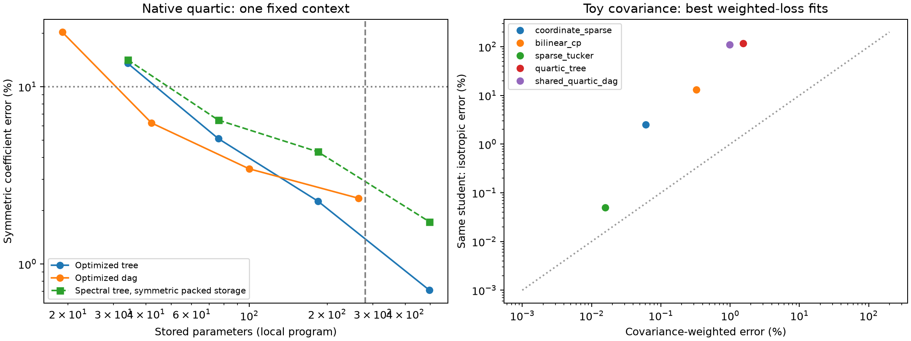

# Direct tensor optimization: opening findings

**20 September 2026, 15:22 UTC; updated 15:25 UTC.** This is the opening phase of the two-day study, not its final report. We have completed 740 optimization runs across planted problems and native weight targets. The question is whether a randomly initialized, constrained student can discover a simpler computation directly from a teacher's weights.

## The objective

For polynomial coefficients $c$, we optimize

$$
\mathcal L=\frac{(c_\theta-c_*)^\top M(c_\theta-c_*)}{c_*^\top M c_*},
$$

summing independently over outputs. Symmetric coefficient Frobenius uses inverse monomial multiplicities. Gaussian function norm uses exact moments. With input covariance $\Sigma$, $M$ contains the corresponding higher-order Gaussian moments, not merely $\Sigma$ itself. Once the metric is fixed, the loss is computed entirely from weights.

The [Tensor Similarity paper](https://arxiv.org/pdf/2605.15183) supplies the metric framework. We use a squared difference to match scale as well as direction. Small quartic losses are checked against full polynomial symmetrization rather than assuming local tree symmetrization captures every repeated-input identity. Independent dense tensors, exact Gaussian quadrature and gradient checks agree to numerical precision.

## Five planted structures: recovery is possible, but not reliable everywhere

The initial sweep has 120 fits: five structures, matched and doubled widths, Adam and Muon, two learning rates, and three seeds. The wider variant also adds a weak L1 penalty, so that initial comparison does not isolate width from regularization. A subsequent covariance sweep includes unpenalized matched/wide controls.

All five functions have a best fit below **0.1% relative Gaussian error**. This is best-run recovery, not a claim that every seed succeeds.

| Planted structure | Best Adam error | Best Muon error |
|---|---:|---:|
| Sparse coordinate quadratic | 0.000095% | 0.00470% |
| Rank-3 bilinear CP | 0.0327% | 0.0122% |
| Sparse shared Tucker | 0.000091% | 0.00521% |
| Quartic tree, two features per branch | 1.685% | 0.0220% |
| Shared three-feature quartic DAG | 0.0841% | 0.0400% |

The table takes minima over widths, rates and seeds. It does not establish a universal optimizer winner. Matched-width tree fits often plateau at **13.35% error**, despite the target being representable. Wider Muon students recovered it much more accurately.

A further 48 matched-width fits used 10,000 steps and eight seeds per optimizer/rate combination. Adam recovered below 0.1% in **4/24** runs; Muon in **7/24**. Muon succeeded in 4/8 runs at learning rate 0.005, 0/8 at 0.05, and 3/8 at 0.2. Longer runs and restarts rescue some failures, but substantial basin instability remains. An optimization miss is not a representation lower bound.

## Matching the function does not automatically recover its sparse basis

The best CP and shared-DAG fits nearly contain the planted feature spaces: relative feature-energy residuals are $7.9\times10^{-5}$ and $9.0\times10^{-5}$.

The Tucker fit recovers the planted input span to $2.1\times10^{-6}$, yet uses **12 non-negligible core entries versus four planted interactions**. Basis changes permit a dense representation of the same sparse computation. Sparse-basis discovery is therefore a distinct optimization problem even after function matching succeeds.

The coordinate-sparse toy recovers its four-entry support at the declared diagnostic threshold. The wider tree includes extra feature directions, so its functional recovery does not establish minimal latent structure. Thresholded weights remain diagnostics until we explicitly zero, refit and evaluate a sparse program.

## Native quartic optimization improves the actual baseline

The first native target is a homogeneous two-MLP numerator with four outputs and five input amplitudes. A 96-fit pilot compares random trees and shared DAGs at widths 1, 2, 4 and 8, both optimizers, three seeds, and Gaussian/Frobenius objectives. Initial plan prose mistakenly counted this grid as 192; the script and receipt contain 96. Independent dense reconstruction confirms the coefficient errors.

| Program on the same target | Stored values | Best symmetric Frobenius error |
|---|---:|---:|
| Exact canonical quartic | 280 | 0% |
| Spectral tree, rank 2, symmetric packed storage | 76 | 6.48% |
| Optimized tree, rank 2 | 76 | 5.10% |
| Optimized shared DAG, width 2 | 42 | 6.24% |
| Optimized tree, rank 4 | 184 | 2.26% |
| Optimized shared DAG, width 4 | 100 | 3.44% |

The matched comparison matters. Earlier 36% HT errors were worst-case results over other contexts, not this pilot target. Old rank-2 storage of 116 values included redundant ordered-pair coefficients; packing reduces it to 76 without optimization. The fair rank-2 comparison is therefore **76 versus 76 values, 6.48% versus 5.10% error**. The 42-value DAG changes the structural hypothesis.

The subsequent **384-fit, 16-context sweep** gives this broader picture, using the best of three Frobenius-objective restarts per target:

| Family | Values per target | Median error | Worst error | Targets below 10% |
|---|---:|---:|---:|---:|
| Tree, width 2 | 76 | 5.04% | 19.93% | 12/16 |
| Tree, width 4 | 184 | 2.28% | 6.14% | 16/16 |
| Shared DAG, width 2 | 42 | 6.36% | 29.06% | 12/16 |
| Shared DAG, width 4 | 100 | 3.73% | 14.52% | 14/16 |

Each target is independently optimized. This demonstrates a local error–storage frontier across these conditional tensors, not one feature bank transferring between contexts. Native source generators and normalization remain outside the polynomial benchmark.

## Covariance changes importance and conditioning

Eighty additional toy fits compare isotropic and covariance-informed objectives. The covariance is a zero-mean second-moment estimate from 512 synthetic calibration inputs, with a declared ridge. This is **not native activation covariance yet**, and it is not empirical fourth/eighth-moment matching.

A covariance-fitted shared DAG reaches **0.985% weighted error but 110.5% isotropic error**. A covariance-fitted tree reaches **1.54% weighted error but 116.9% isotropic error**. Each pair scores the same student under both metrics. Low-variance directions are weakly constrained, and the optimization conditioning changes too.

This does not show covariance is inherently worse. It shows why we need both norms, covariance spectra, and equivalent-coordinate preconditioning controls. A separate exact control confirms that a singular covariance can make some polynomial differences invisible.

## Full joint quadratic: still difficult

The first full last-MLP sweep optimized random bilinear students with widths 32, 128 and 512, Adam/Muon, and two seeds. All 12 runs improved. The best, width-512 Muon, reached **56.67% Gaussian error and 95.97% coefficient Frobenius error**. Exact ambient reduction replayed within $7.6\times10^{-7}$ relative error.

The global matching target is not met at these settings. This is a measured optimizer result, not evidence against all compact structures. A follow-up 24-fit grid compares objectives, learning rates and larger width. It includes an explicit radial quadratic baseline to test whether Gaussian gains mainly capture trace structure.

## Next scientific questions

The two-day focus continues with sparse-basis selection, explicit pruning/refitting, covariance conditioning under equivalent whitened coordinates, and actual native activation covariance. We will distinguish stable structural findings from best-run examples and optimization artifacts. Compression or tensor agreement alone will not be presented as an identified semantic circuit.

All curves, seeds, failed fits, independent checks and executable definitions are indexed in [the study README](README.md).
