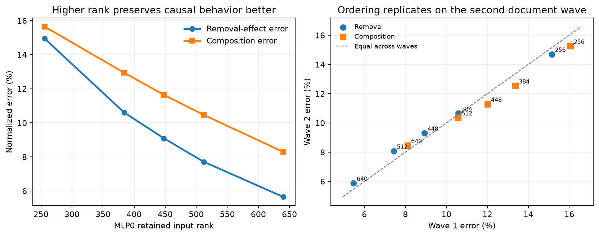

# One queued idea has now become usable causal training data — 2026-09-01 23:14 UTC

## Goal and what “dropped” means

The project goal is to compile the trained model into a smaller, predictive, manipulable tensor program whose parts
generalize to new data, can be extracted as circuits, and can be removed or composed without damaging unrelated
computations. A useful notion of simplicity must help with those outcomes; small storage alone is not enough.

When I called work from the20:54 plan “dropped,” I meant **proposed but not yet executed**. Viable items are now in
`SIMPLICITY_PROSPECTIVE_CONSEQUENCE_QUEUE.md` and are meant to run. An item leaves that queue only when it runs, when
its stated prerequisite fails, or when a stronger test explicitly supersedes it. We do not rerun an already-falsified
object unchanged merely to say that every note was executed.

Rung448 has now executed the first postponed item: causal consequence labels for all five MLP0 context-input
decompositions. The other two teaching families—seven MLP-PCA programs and23 vocabulary-factorization programs—are
still explicitly queued.

## What the computation was

The five candidate programs replace MLP0 while retaining respectively256,384,448,512, or640 directions from the
1,152-dimensional input. The retained directions are chosen using how often input directions occur on fixed fitting
documents and how strongly MLP0's two multiplicative input maps use them. No consequence result is used to choose
these programs.

Every program was then evaluated on96 separate TEACHING documents under two tests:

1. **Removal-effect preservation.** In the native model, replace attention layer16's output with its fixed mean and
   record the change in cross-entropy at every token. Repeat the identical intervention after replacing MLP0 with a
   candidate. The normalized error is

   `||candidate removal effect - native removal effect|| / ||native removal effect||`.

   Cross-entropy is the model's token-prediction loss in natural-log units; lower is better. “Removal effect” means
   the signed per-token change caused by the intervention, not merely the candidate's ordinary loss.

2. **Composition prediction.** Independently replace MLP16 with the previously validated14,984-value quadratic
   program `Q`. Compare the actual loss change when both candidate `P` and `Q` are installed with the sum of the loss
   changes from installing each alone. The normalized composition error is

   `||actual joint change - additive prediction|| / ||additive prediction||`.

   A small value says the two replacements compose predictably; a large value exposes an interaction that the
   separate measurements miss.

The96 documents were fixed in advance as two48-document waves. This checks whether a candidate ordering survives a
new group of documents rather than existing only in one aggregate. The sealed attention0 documents were never
loaded.

## Result

All registered checks passed and the strong failure condition did not fire.

- Removal-effect error falls from14.95% at rank256 to5.65% at rank640.
- Composition error falls from15.65% to8.29%.
- The intermediate ranks improve monotonically on both measurements, giving rank-versus-lower-error Spearman
  correlation1.0 for each.
- Both five-candidate orderings repeat with Spearman1.0 across the two document waves.
- Native replay is exact, the removal is substantial rather than inert, and all360 candidate,144 partner, and144
  knockout dispatches occurred.

This is substantial but narrow progress. It shows that retained MLP0 input rank is a clean structural coordinate for
two downstream causal properties **within this family**. It gives the future predictor five honest labeled examples
and one eligible family. It does not yet establish that one simplicity rule transfers across different program
grammars, and it is not a semantic interpretation, compression result, or adoption result.

## Next

Generate the same fixed consequences for the seven MLP-PCA candidates and the23 vocabulary candidates. Only after
all three teaching families are available will a consequence-specific rule be fit with whole-family-held-out
validation and frozen. The unseen attention0 family remains sealed until that freeze. Independently, the continuous
attention quotient remains queued for selective-removal and pair-interaction semantics; the rejected convex SAE
atoms will not be rerun unchanged.
