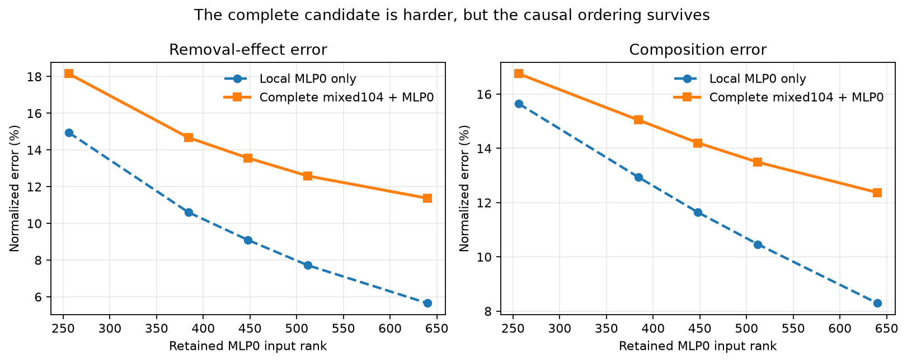

# The first complete-candidate teaching family now passes — 2026-09-01 23:35 UTC

## Outcome

Yes: viable work that was previously “dropped” is being run later, not merely archived. The first queued family now
has five **legal complete-candidate labels**. The next two queued families are seven MLP-output projection programs
and23 vocabulary-factorization programs.

The local MLP0 result reported at23:14 was real, but it replaced only MLP0 inside the native model. The frozen bank's
prices describe a larger compiled object: mixed104's attention/MLP program plus that MLP0 replacement. I caught this
before fitting a predictor, withdrew the local result's teaching eligibility, and reran the entire object.

## What changed computationally

For each retained MLP0 input rank256,384,448,512,640, the corrected candidate `P` includes every component charged by
its frozen531.6–535.6-million-scalar price. Three isolated builds measured:

- ordinary `P`;
- `P` with attention16's output replaced by the fixed original-native mean;
- `P` together with the independent14,984-value quadratic MLP16 program `Q`.

The removal error compares the knockout's signed per-token loss change under `P` with its change under the native
model. The composition error compares the actual joint `P+Q` loss change with the sum of the separately measured P
and Q changes. Both are normalized vector errors, so10% means the disagreement norm is one tenth of the reference
effect norm.

The complete candidate's per-token loss vector differs from the local shortcut by mean absolute.0683–.0695 nat.
That is not rounding noise: it confirms that the object correction mattered.

## Result and interpretation

All registered checks pass and the strong failure condition is false.

- Complete-candidate removal error falls monotonically from18.16% to11.37% as rank rises.
- Complete-candidate composition error falls from16.75% to12.37%.
- Both rank orderings have Spearman correlation1.0 and reproduce with correlation1.0 on the second48-document wave.
- All full compiled identities, prices, hooks, hashes, and native replay checks pass. Attention0's sealed confirmation
  documents remain unopened.

The complete object is harder than the local MLP0 replacement, especially for removal, but the causal ordering
survives. This now supplies five honest training rows and one of the required three whole program families. It is
still only a within-family result: it does not show that a learned definition of simplicity predicts an unseen kind
of program.

## Two scorer failures and why no GPU work was repeated

All three expensive condition files were complete on the first attempt. The parent scorer then looked for one count
inside the wrong nested dictionary; the first repair corrected the calculation but missed the same stale reference in
the final JSON payload. Both no-result failures and the provisional invalid bundle are preserved. The final scorer
reused the hashable completed tensors and finished in.02 seconds rather than rerunning the model. No measurement,
prediction, threshold, or route changed during either repair.

## Next

Rebuild and label the seven complete MLP-PCA candidates under the same removal and composition definitions. Then do
the23 vocabulary candidates. Only after all three teaching families exist will we fit a consequence-specific rule
using whole-family-held-out validation and freeze it. The unseen attention0 family stays sealed until then.
