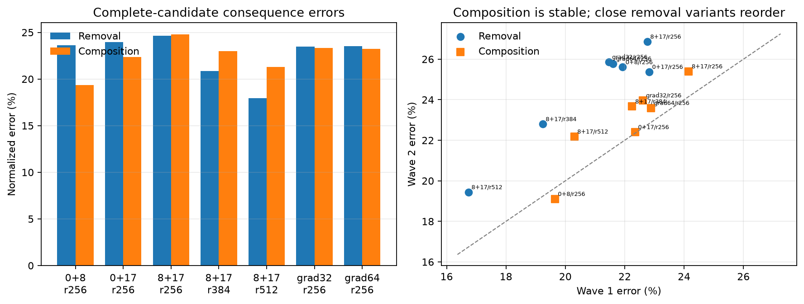

# The second teaching family is informative but not stable enough yet — 2026-09-01 23:47 UTC

## What ran

The second queued family contains seven complete compiled models. They project the outputs of MLP layers0,8, and17
onto lower-dimensional subspaces:

- three rank256 choices of which two layers to project;
- a fixed layers8+17 ladder at ranks256,384,512;
- two rank256 variants that exchange32 or64 ordinary activation-variance directions for directions chosen to protect
  previously catalogued circuit effects.

“Project an output” means compute the native1,152-number MLP output `y`, subtract its fitted mean, retain its
coordinates in a rank-r orthonormal basis, and reconstruct `mean + basis basis^T (y-mean)`. Every result below uses
the full mixed104 compiled candidate charged by the bank, not only these local projections.

The same attention16 removal and physical MLP16 composition tests used for the first family were measured on96
TEACHING documents split into two fixed48-document waves.

## Result

Three of four predictions pass:

- Every model identity, price, rebuild, and intervention check passes; the sealed attention0 data remains closed.
- Within the coherent layers8+17 ladder, more rank improves both removal error (24.63%→20.86%→17.97%) and composition
  error (24.79%→22.98%→21.27%) monotonically.
- Across all seven candidates, the removal and composition error ranges are6.67 and5.43 percentage points, large
  enough to provide a nontrivial learning signal.
- Composition ordering replicates across the two waves with Spearman correlation.821, above the.70 bar.
- Removal ordering reaches only.50, below.70, so the family is **not eligible**.

The failure is not that the consequences are absent. The rank384 and512 candidates remain clearly better. The
problem is that five rank256 variants have very similar removal errors and change order between document halves.
For example, the full-data removal errors of the0+8, gradient32, and gradient64 variants are23.60%,23.49%, and23.52%.
Ordering differences of a few hundredths of a percentage point is not a robust basis for teaching a predictor.

## Decision

I am preserving all seven measurements but not counting MLP-PCA as family2 and not fitting a predictor. Lowering the
failed correlation threshold or declaring the close arms tied after seeing them would be post-hoc.

The principled follow-up is to freeze additional candidate-disjoint documents before evaluating them, then test a
predeclared uncertainty-aware quantity: whether between-candidate differences exceed their document-sampling error,
whether the clearly separated comparisons replicate, and whether a latent continuous consequence estimate predicts
the new documents. This avoids demanding arbitrary order inside statistically unresolved ties while still being
falsifiable. It does not change rung450's failed verdict.

The23-candidate vocabulary family also remains queued. If MLP-PCA cannot pass the independent reliability follow-up,
we will add a new outcome-free teaching family—likely the dossier-checked late-MLP quadratic programs—before any
predictor fit. Attention0 stays sealed throughout.
