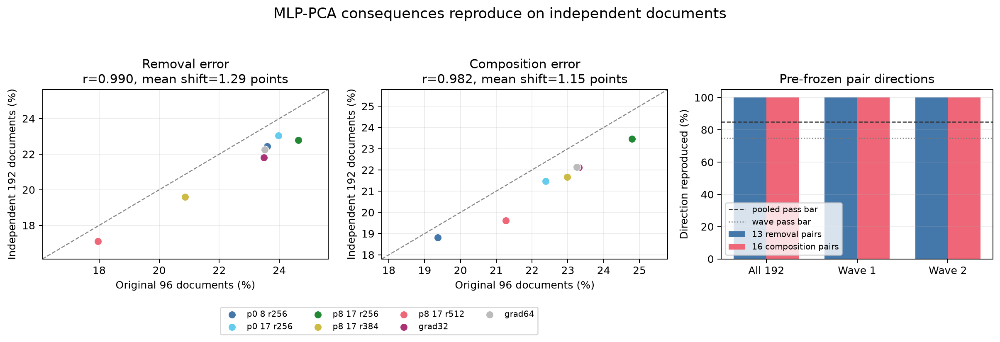

# The postponed experiments are running: MLP-PCA now replicates independently — 2026-09-02 00:08 UTC

## Direct answer about “dropped work”

Yes: when I wrote “treating those as dropped work,” I meant viable ideas that had been proposed but not executed were
being restored to an ordered experiment queue. They were not being abandoned. A queued idea leaves that queue only
when it runs, when its stated prerequisite fails, or when a stronger test supersedes it and the replacement is recorded.

That distinction is active rather than aspirational. The complete MLP0 family has run and passed. The MLP-PCA family
ran, failed its first stability test, received a preregistered independent follow-up, and has now passed that follow-up.
The23-program vocabulary family is next. Predictor fitting and the sealed attention0 test remain deliberately blocked
until all three teaching families have legal labels.

## Why the first MLP-PCA result did not count

The seven MLP-PCA programs replace selected1,152-number MLP outputs by projections into lower-dimensional subspaces.
For example, rank256 keeps256 coordinates in a fitted orthonormal basis and reconstructs the1,152-number output.

We measure two consequences using per-token cross entropy, which is the negative log probability assigned to the true
next token:

- **Removal error:** compare the cross-entropy change caused by removing native attention16 under candidate `P` with
  the same removal under the native model. The reported normalized error is
  `norm(candidate removal effect - native removal effect) / norm(native removal effect)`.
- **Composition error:** combine candidate `P` with a physical quadratic MLP16 program `Q`. Compare the actual joint
  cross-entropy change with the additive prediction `(P-native) + (Q-native)`, normalized by the additive vector's norm.

The original96-document run showed a clean rank256→384→512 improvement, but five rank256 variants had almost equal
removal errors and changed order between two48-document halves. A Spearman rank correlation treats a0.01-percentage-
point difference like a large difference, so the preregistered total-ranking gate failed. We preserved that failure.

## The uncertainty-aware test

Before opening new outcomes, I resampled the original96 documents2,000 times with replacement. For every pair of
candidates, I computed a95% bootstrap interval for `error(left)-error(right)`. A comparison was frozen only if this
interval excluded zero:13 of21 removal pairs and16 of21 composition pairs qualified. The eight unresolved comparisons
were all internal comparisons among same-price rank256 variants, which independently confirms that the problem was
near ties rather than collapse of the main rank signal.

I then rebuilt all seven complete candidates on192 document-disjoint rows, split into two fixed96-document waves. No
threshold or pair definition was changed after these outcomes became visible.

The left two panels compare each candidate's old and independent error. The dashed diagonal means exact equality.
The right panel asks what percentage of the pre-frozen pair directions reproduced; a direction is simply whether the
left candidate's normalized error is larger or smaller than the right candidate's.

## Result

All registered gates pass:

- Exact full-candidate identities, prices, native replay, and interventions pass. Candidate knockout and partner hooks
  fired336 times each; native knockout and partner hooks fired48 times each. The sealed attention0 role stayed closed.
- Old-versus-independent Pearson correlation is`.9902` for removal and`.9817` for composition, above`.85`. Pearson
  correlation measures whether continuous magnitudes follow the same straight-line ordering and spacing after centering.
- Mean absolute shifts are1.29 and1.15 percentage points, below the4-point bar.
- All13/13 removal and16/16 composition directions reproduce on all192 documents.
- The same29/29 directions reproduce separately in each96-document wave, above the75% wave bar.
- The layers8+17 rank256→384→512 errors decrease for both metrics in the full role and in both waves.

Therefore MLP-PCA counts as teaching family2/3. This is stronger and more precise than retroactively calling rung450 a
pass: rung450's raw total-ranking prediction remains false, while the new test shows that its statistically resolved
continuous structure generalizes to independent documents.

## What this does and does not establish

It establishes that these structural program differences yield reproducible removal and composition consequences,
which makes the family suitable training data for the proposed simplicity rule. It does not yet show that the rule
generalizes across program grammars, predicts the sealed attention0 family, names semantic features, or produces a
deployable compressed model.

Next I will generate the23 vocabulary-program labels. Those programs keep the input token embedding exact and replace
only the output vocabulary map, so three shared native/knockout/partner hidden-state captures are sufficient; each of
the23 output programs can then be scored exactly against those states. This is the next queued experiment, not a new
direction substituted for the older plan.
