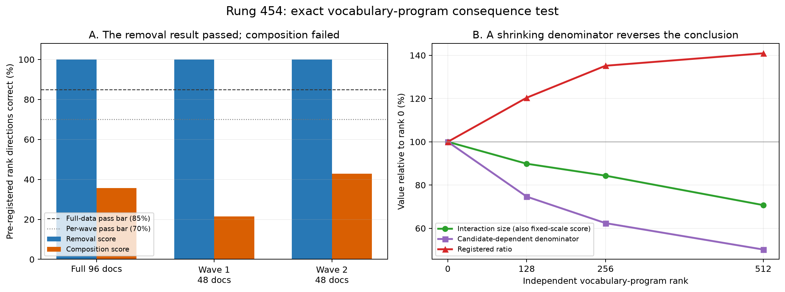

# What the current experiment is actually trying to learn — 2026-09-02 00:24 UTC

## Short answer and correction

The attention16-ablation and two-edit interaction experiments are valid measurements, but I gave them the wrong role.
They test whether an **already chosen** approximation is robust to one ablation and combines predictably with one
other model edit. They do not discover the model's components, show that two heads/features implement the same thing,
or explain why a decomposition is simple. Calling them the main supervision for simplicity was too indirect.

The more relevant direction is the one proposed earlier using the 62 known behavior checks: define two local features
as equivalent when downstream computation responds to them in the same way, then find a basis that makes those shared
response patterns sparse and reusable. The 62-dimensional downstream response should help choose the decomposition;
attention16 ablation and the MLP16 two-edit test should be later validation checks.

The completed experiments below remain useful as a measurement audit—especially the independently confirmed
normalization bug—but I will not fit the proposed simplicity predictor from these two outcomes alone or make the MLP2
version the next main experiment.

The experiments came from the 20:54 proposal to learn which kinds of simplification produce useful circuits, rather
than assuming that fewer parameters, lower rank, or more sparsity is automatically better. We had many old
approximations with CE and reconstruction results but few common causal measurements, so we added two: preservation
of one attention16 ablation and prediction of one two-edit interaction with an MLP16 replacement.

Those measurements answer a legitimate but narrower question: **after somebody has chosen a decomposition, does the
resulting approximation remain reliable under these two edits?** They do not tell us how the model should be divided
into components. Consequently, they can be kept as later validation data, but they should not be the main labels for
learning simplicity or the reason to choose one basis over another.

## What happened between the 20:54 file and this one

The missing bridge is:

1. We first audited the old experiment archive. It had many reconstruction and OOD results, but almost no comparable
   causal-ablation results and no consistent measurements of how two approximations combine. There was not enough data
   to learn the proposed simplicity rule honestly.
2. We therefore froze a prospective set of 45 existing approximations before measuring these new outcomes.
3. Thirty-five approximations from three different construction methods were assigned to develop the predictor:
   five MLP0 input-factorization variants, seven MLP-output projection variants, and 23 unembedding factorizations.
4. Ten sparse-QK attention0 variants and controls were reserved as the genuinely different final test. We have not
   generated their new causal labels.
5. We chose the same two downstream tests for every approximation: attention16 mean ablation and joint installation
   with the physical 14,984-parameter MLP16 quadratic replacement.
6. The MLP0 variants produced stable labels. The seven MLP projection variants initially had noisy ordering among
   near-tied variants, so we froze only statistically distinguishable comparisons and reproduced all of them on 192
   independent documents. The unembedding variants were the next group.

Here, a “group” just means several variants made by the same method. Five ranks of one MLP0 factorization are not five
independent discoveries. Holding out a whole construction method is the relevant generalization test.

## The candidate approximations

### Five MLP0 variants

These replace MLP0's input factorization at ranks 256, 384, 448, 512, and 640 inside the same existing compiled-model
baseline. We evaluate the whole compiled candidate, not an isolated MLP0 edit, so its measured behavior corresponds to
the full program whose structure and cost will be given to the predictor.

All five gave stable downstream measurements. As rank increased, both the attention16-ablation mismatch and the
MLP16-combination mismatch decreased.

### Seven MLP-output projection variants

These project the 1,152-dimensional outputs of selected MLPs into fitted subspaces:

- three choices of which two of MLP0, MLP8, and MLP17 to project at rank 256;
- ranks 256, 384, and 512 for the fixed MLP8+MLP17 pair;
- two rank-256 variants that replace 32 or 64 ordinary PCA directions with directions chosen to preserve catalogued
  circuit effects.

The important rank ladder replicated cleanly. Some rank-256 variants were effectively tied, so we did not pretend
that their arbitrary sample ordering was a stable target. On 192 new documents, every one of the 13 distinguishable
attention16-ablation comparisons and 16 distinguishable MLP16-combination comparisons reproduced.

### Twenty-three unembedding variants

This is the part the previous version failed to explain. Let `W_U` be the `50,304 × 1,152` matrix that maps the final
residual stream to vocabulary logits. These 23 candidates replace `W_U`; they do not change the token embedding or
anything upstream of the final residual stream.

They are:

- **8 basic variants:** four capacity levels (0, 128, 256, and 512) for two methods. The shared method predicts each
  token's unembedding vector from that token's input-embedding vector and then stores a low-rank residual. The
  independent baseline directly takes a matched-size low-rank approximation of the unembedding without using the
  input embedding.
- **3 rare-token correction variants:** start from the shared rank-512 map and store exact residual corrections for
  1,129 rare vocabulary rows. The corrected rows are chosen by downstream Fisher importance, residual norm, or a
  seeded random control.
- **12 frequency-weighted variants:** ranks 512, 640, and 768, using either square-root token-frequency weights or
  token-frequency weights, for both the embedding-shared method and the independent low-rank baseline.

That is `8 + 3 + 12 = 23`, not 24. Because these candidates only change `W_U`, we can run the transformer once per
upstream condition, save the final hidden states, and exactly score all 23 output matrices against the full vocabulary.
There is no approximation in that computational shortcut.

## The two downstream measurements

For an approximation `P`, let `L_N` be the native per-token CE vector and `L_P` the vector with `P` installed.

### 1. Preserve the causal effect of attention16 mean ablation

Mean-ablate attention16 in both models:

`effect_native = L_native_ablation - L_N`

`effect_P = L_P_ablation - L_P`.

We measure

`||effect_P - effect_native|| / ||effect_native||`.

This asks whether the approximation preserves a separate downstream circuit's signed causal effect, rather than only
whether it has similar activations or CE. Attention16 was chosen as one fixed, distant, already-audited intervention
that can be applied identically to every candidate; it is not claimed to be the only interesting circuit.

### 2. Predict joint behavior with the MLP16 replacement

Call the existing MLP16 replacement `Q`. We measure `L_P`, `L_Q`, and `L_PQ`. The non-additive cross-term is

`interaction(P,Q) = L_PQ - L_P - L_Q + L_N`.

If this is small, the combined edit is well predicted by adding the two individual effects. MLP16 was chosen because
we already have a compact, executable, well-audited replacement for it. Calling it a “partner” in the old version
made this sound like a new project concept; it is simply the second model edit in a two-edit interaction test.

The originally registered score divided the interaction norm by

`||(L_P-L_N) + (L_Q-L_N)||`.

That denominator changes with `P`. The better comparison, now frozen for independent testing, uses the same ruler for
every candidate:

`fixed_scale_interaction(P,Q) = ||interaction(P,Q)|| / ||L_Q-L_N||`.

## What the unembedding experiment found

The attention16 result was extremely clean: all 14 pre-specified rank comparisons went in the expected direction on
all 96 documents and separately on each 48-document half.

The originally normalized MLP16 interaction score failed: only 5/14 rank comparisons went in the expected direction.
This failure was also stable across the two document halves, so it was not sampling noise.

The right panel shows why. For the independent low-rank unembedding, increasing rank from 0 to 512 reduces the actual
interaction norm from `82.15` to `58.10`. That is the expected improvement. But the old denominator falls much faster,
from `934.15` to `468.80`, so their ratio rises from `.08794` to `.12393` and incorrectly reports the higher-rank
candidate as worse.

Across all 14 rank comparisons:

- the old candidate-dependent ratio orders 5/14 correctly;
- the raw interaction norm orders 14/14 correctly;
- the fixed-scale interaction score orders 14/14 correctly.

The same fixed-scale score also preserves the already-open MLP0 and MLP-projection rank ladders. Two independent code
paths reproduced this diagnosis. Nevertheless, the original registered result remains a failure; we do not change a
metric after seeing the answer and then call the old experiment a pass.

## Independent result

We froze the fixed-scale equation and reran the same 23 unembedding candidates on 192 documents that were not used for
their first causal measurements, split into two 96-document halves. The first managed attempt stopped before loading
the model because a JSON dictionary contained the right 23 names in alphabetical rather than historical order. We
preserved that abort and changed only the identity check to compare membership; no outcome had been opened.

The corrected run passed every pre-specified threshold:

- The 23 fixed-scale interaction scores correlate `.9992` between the old and new documents; their mean absolute
  change is `.0291`, against pre-specified requirements of at least `.90` and at most `.10`.
- All 14/14 rank comparisons improve for the fixed-scale interaction and all 14/14 improve for attention16 mean
  ablation on the full 192 documents.
- The same 14/14 + 14/14 comparisons hold separately in each 96-document half.
- The two halves correlate `.9997` for the fixed-scale interaction and `.9986` for the attention16-ablation result.

This is strong independent evidence that the old failure came from the moving denominator, not from unusual or
unstable behavior of the unembedding approximations.

The original plan was to find a third construction group, fit predictors of these two outcomes, and test them on ten
attention0 approximations whose outcomes had not been measured. MLP2 was audited because five equal-size rank-512
programs already exist. That audit is now documented in the MLP2 dossier, but this execution plan is paused. It would
make a more careful predictor of approximation robustness; it would still not use the 62 known behaviors to discover
shared components. No MLP2 consequence run or simplicity predictor has been started.

## What should replace the proxy-first plan

The stronger route starts from the continuous attention0 computation found in rungs 424/425. For an attention edge,
that model has two low-dimensional attention-score factors and one output factor:

`edge output ≈ sum_{r,s,u} Core[r,s,u] × score1[r] × score2[s] × output[u]`.

Here `r` and `s` run over six learned directions for the two QK branches, and `u` runs over 32 learned directions of
the value/output write. This representation already combines information across heads; a head index is not treated
as the semantic unit. On held-out data it retained about 99% of the responses measured by the six downstream readers
used in that experiment.

The missing step is to add a **downstream behavior axis**. For any proposed local feature `f`, define

`Phi(f)[c] = signed effect of changing f on behavior c`, for `c = 1,...,62`.

Two features count as the same component when `Phi(f-g)` is small: downstream computation cannot reliably
distinguish them across the behavior battery. Conversely, two geometrically similar features must remain separate if
their 62 response patterns differ. This directly addresses the intended cases:

- different heads or QK directions that produce the same downstream variable can merge;
- one shared Q or K feature can be reused with several different features on the other side;
- different attention patterns that result in downstream-equivalent writes can merge on the output side; and
- one input feature that produces distinct downstream writes remains split along the output/response axis.

The concrete object is a response tensor indexed by first-QK feature, second-QK feature, output feature, and behavior:

`R[r,s,u,c] = downstream response of the (r,s,u) attention interaction on behavior c`.

We can estimate it in two stages. The cheap screen uses derivatives from an attention0 edge-output change to the
losses at the behavior's registered token positions. The exact confirmation installs or removes selected factor
blocks and measures their signed effects with full forward passes. Factoring `R` jointly, rather than clustering
heads, can expose a small vocabulary of reused input-side features, output-side features, and their allowed
combinations.

## How the 62 behaviors enter the computation

Each of the 62 entries is a registered behavior tag with a set of token positions and a native mean-ablation
reference size. They are useful supervision but should not be confused with 62 independent mechanisms. For a local
edge-output error `delta e`, a behavior-weighted local loss is

`delta e^T G_62 delta e`,

where

`G_62 = sum_c 1/(|M_c| tau_c^2) sum_{i in M_c} J_i^T J_i`.

`M_c` is the set of positions for behavior `c`, `J_i` is the derivative from the local attention output to the final
loss at position `i`, and `tau_c` is half that behavior's stored native-ablation effect. Overlapping positions are
downweighted so that a position belonging to several tags is not counted several times. This is the 62-behavior
version of the downstream-response loss already used to fit the six/six/32 continuous block.

There is an important control. In older QK rank sweeps, the 62-dimensional damage vectors were almost scalar
multiples of one common vector (`R^2 = .99945`). A model can therefore improve the raw number of passed checks merely
by reducing total error, without discovering behavior-specific components. The new fit must remove or model this
common damage direction and predict the remaining behavior-specific pattern. It must also beat a control in which
behavior labels are permuted while tag sizes and weights are preserved.

Rank is not the proposed explanation. A matched-rank comparison is only a control: it prevents a task-guided method
from winning merely because it kept more dimensions. The actual candidates should be task-conditioned pieces that
may cross head and module boundaries. A control comparison can hold capacity and stored values fixed across:

1. ordinary variance-based decomposition;
2. the rung-424 six-reader downstream loss;
3. the new 62-behavior downstream loss; and
4. the same 62-behavior loss with behavior labels permuted.

Fit documents and evaluation documents must be disjoint. The evaluation should report held-out prediction of the
continuous 62-response vector after removing the common damage direction, exact CE, and selective signed
interventions. A useful decomposition should also recover similar factors on a second corpus. Only after this
identification test succeeds should we ask whether the task-conditioned pieces also form a smaller executable
attention program. Compression is optional evidence about simplicity, not the definition of the pieces.

## What remains from the SAE work

The raw-QK Archetypal SAE and the response-space convex dictionary were actually run. They improved some geometric
stability but failed their registered computational and identification tests, so those exact versions are closed.
The continuous attention0 representation remains a useful probe because it does not force attention heads or
discrete SAE atoms to be the true basis. The next identification route is the task-conditioned graph below, using
62-response fingerprints plus targeted task variations and interchange—not another generic low-rank fit. The
recent attention16 and MLP16 measurements remain available as later checks that the chosen decomposition survives a
distant ablation and a second model edit. Parameter count, low rank, sparsity, and quantization remain baselines or
costs; none is being treated as the definition of an interpretable component.

## Correction after red-teaming the rank-reduction framing

The objection is substantially right: another rank reduction of attention0 or an MLP would not, by itself, advance
OOD circuit prediction, extraction, selective removal, or reuse. A low-rank basis can mix induction, copying,
successor behavior, syntax, and unrelated high-variance activity into the same directions. It also has rotational
freedom, so its individual axes need not correspond to stable computations. The six/six/32 attention result should
therefore be used only as a convenient continuous coordinate system for proposing and perturbing smaller pieces—not
as the sought explanation.

The circuit goals, stated explicitly, are:

1. **Specify the computation:** what information is read, what operation or composition is performed, what is
   written, and which later computations use it.
2. **Find the right boundaries:** group parts of different heads or MLPs when they implement the same downstream
   variable, and split a native module when its parts implement different tasks or compositions.
3. **Predict on held-out and OOD inputs:** predict both the circuit's activation and its behavioral effect on unseen
   contexts, task variations, and shifted data.
4. **Extract a sufficient computation:** isolate an executable circuit, or a clearly specified interface plus
   background, that reproduces the target computation or signed causal effect.
5. **Manipulate selectively:** remove, swap, or edit the target computation while leaving unrelated behavior intact,
   including tests for redundancy and interactions.
6. **Explain composition and reuse:** show which subcomputations are shared across tasks/modules and predict how they
   combine with task-specific branches.
7. **Identify stable units:** recover the same operational units across data splits, corpora, fitting restarts, and
   equivalent parameter gauges.

Smaller storage or computation is useful only after, or alongside, these properties. It is not a replacement for
them.

The actual target is a task-conditioned decomposition across modules:

- group parts of different heads or MLPs when they supply the same intermediate variable to downstream readers;
- split one head or MLP when separable parts serve different behaviors or take part in different compositions;
- represent reuse explicitly, such as one equality/copy matcher feeding several output or use branches; and
- allow different structures in different places rather than imposing one global hierarchy.

There is already evidence for this level. All 62 behavior tags localize to model components, but many tags share the
same component: attention8 is the strongest location for 16 tags and attention16 for 13. Attention8's leading shared
direction explains 91.61% of five fitted circuit directions; removing it makes four of five residual directions more
selective. The same operation hurts attention16, so one universal hierarchy is wrong. A separate copy experiment
found an exact reusable equality-matching service that generalized, but removing it also hurt useful non-induction
copying. That says the matcher should be shared while its output/use branches should be split.

### What can go wrong with the task-first idea

1. The 62 tags are not 62 independent mechanisms. Many overlap, and their damage vectors can collapse to one generic
   error direction. Grouping from the raw pass/fail vector would mostly group by importance.
2. Two pieces can look equivalent on the current battery but differ on new text or a missing behavior. Equivalence
   must be tested on held-out contexts, synthetic task variations, and a second corpus.
3. Removing a piece establishes necessity, not sufficiency. Redundant heads can make a real shared computation look
   unnecessary, while a broad shared service can look necessary for many tasks. Interchange and reconstruction of
   the task effect are needed as well as removal.
4. Serially connected pieces should not be merged merely because they affect the same behavior. The representation
   must record whether pieces are alternative producers of the same variable or successive steps in a composition.
5. We need candidate pieces before measuring their task effects. Fine-grained algebraic terms should be an
   overcomplete proposal set, and downstream interchange and selective interventions should decide which terms merge.
   The proposal coordinates must not be assumed to be the final basis.

### Revised experiment

Start with two behavior families whose computations and controls are relatively concrete: equality/copy/induction
and ordered-successor behavior. For attention, propose fine-grained `Q feature × K feature × OV write` terms across
all heads rather than using whole heads. For MLPs, propose bilinear product terms or small learned mixtures, retaining
which input features compose and which output is written. For every proposed term, measure a signed fingerprint over
the relevant behavior positions, matched off-task positions, downstream readers, contexts, and intervention type.

Then fit a sparse producer–computation–consumer graph, not a low-rank reconstruction:

- producer nodes are Q/K features, MLP input features, or upstream residual features;
- computation nodes are Q×K or MLP bilinear products;
- consumer nodes are OV/MLP writes and the later modules that read them; and
- task labels annotate which paths have selective causal effects.

Merge nodes only when their downstream interchange is equivalent on held-out examples. Split a module when two sets
of terms have different task fingerprints and can be independently removed or transplanted. A proposed grouping
passes only if it predicts held-out task behavior, extracts the task computation, and removes it with low damage to
unrelated behaviors. Reuse across tasks or modules is additional positive evidence. Rank and parameter count enter
only as matched controls and later implementation costs.
