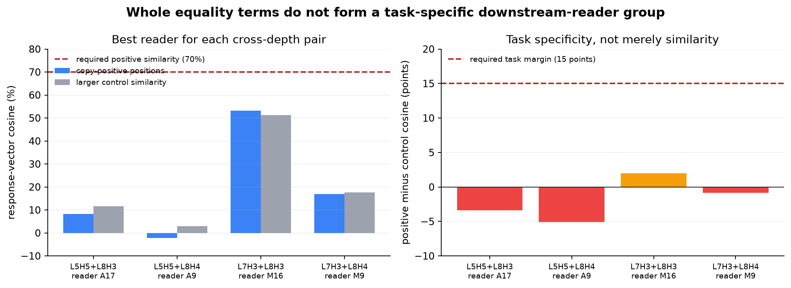

# Downstream-reader result and active-loop repair — 2026-09-02 03:03 UTC

## Short version

The next experiment ran successfully rather than remaining queued. It asked whether any later attention or MLP
output treats a pair of the four equality/copy terms as the same task-specific variable. None did under the frozen
criteria. The best case was the L7H3 and L8H3 pair at MLP16: their changes had cosine similarity `0.532` on copy
positions, but `0.512` on the matched-negative control. The copy-specific margin was therefore only `0.020`, far
below the required `0.150`. The required positive cosine was also `0.700`.

This is a registered strong null for grouping **whole equality terms by a later module's full output vector**. It is
not evidence that the heads are unrelated. Each equality term still mixes two different possible shared objects:
the QK score that decides how strongly one position reads another, and the value/output vector that carries
information along that connection. The next experiment has therefore started from the preregistered finer split.

The durable research goal is active. The continuation rule now requires an unfinished goal to begin its next safe
experiment before a turn can end; completing a rung, writing an explanation, making a commit, or seeing an empty
queue is explicitly not a stopping condition. This turn verified the goal, tested and queued rung 458, scored its
null, and began the QK-versus-value/output successor.

## Result as percentages

For each cross-depth pair, the graph shows the later reader with the largest copy-specific margin. A “reader” here
means one complete attention output or MLP output in layers 9 through 17. The blue bar is the similarity of the two
term-induced changes at copy-positive positions. The grey bar is the larger similarity on matched-negative or
off-target positions. The right panel subtracts the grey bar from the blue bar.

Only L7H3+L8H3 had a positive margin, and that margin was 2.0 percentage points rather than the required 15 points.
Its positive similarity was 53.2%, rather than the required 70%. The other three pair margins were negative: their
apparent similarity was at least as large on control positions as on the intended copy computation.

## What was computed

The experiment used the same 192 frozen natural-text documents and exact equality-term removals as the previous
subset experiment. Documents 0–95 were used to choose a possible pair and reader. Documents 96–191 were reserved
for validation.

For term `h`, later component `j`, and input `x`, it measured

`change_j(h,x) = output_j(remove h,x) - output_j(native,x)`.

The output is a 1,152-dimensional vector at every token position. For each task condition, the experiment flattened
the selected token vectors and computed the ordinary cosine between the changes caused by two terms. It checked all
four early-to-layer8 term pairs at every attention and MLP output from layers 9–17: `4 × 18 = 72` candidates.

For each candidate it then computed

`task margin = cosine on copy positives - max(cosine on matched negatives, cosine off target)`.

This matters because two removals can produce similar broad disturbance simply because both make the model less
confident. A useful shared circuit variable should look especially similar where the equality/copy computation is
actually needed.

The model and intervention checks passed exactly:

- native analytical replay had zero error;
- all 192 planned forwards ran with the intended three equality sites replaced;
- peak GPU memory was 3.16 GB and runtime was 14.00 seconds;
- no code-document outcomes or sealed attention0 outcomes were opened; and
- the experiment claims zero parameter saving.

## Why the patch and interchange tests did not run

The protocol deliberately chose the pair and reader using only the first 96 documents. A candidate needed positive
cosine at least `0.70`, task margin at least `0.15`, and a non-negligible response. None qualified.

Therefore the second half remained unused for pair-specific patching and swapping. Running those tests after picking
the merely best failed candidate would change the protocol after seeing the answer and turn validation data into a
second search set. The correct result is: instrument A passed; fitting prediction B failed; C–E were not reached;
the registered strong null is true.

## What this rules out—and what it does not

The result rules out the simple proposal:

> Two complete equality terms are the same circuit unit if removing either produces the same full later-module
> output change on copy positions.

Even the best response similarity was moderate and nearly as large on controls. This agrees with the previous
factorial result: the terms have overlapping CE benefit, but overlap in final loss does not imply that a complete
later attention or MLP output represents one shared variable.

It does **not** rule out shared matchers or shared payloads. An exact equality term has the form

`term_h(q) = sum_k equality(q,k) × score_h(q,k) × payload_h(k)`.

Here:

- `equality(q,k)` says that the token at query position `q` equals the token immediately before source position `k`;
- `score_h(q,k)` is the product of the head's two QK scores and controls the strength of that connection; and
- `payload_h(k)` is the value vector after that head's output projection, expressed in the model's 1,152-dimensional
  residual-stream coordinates.

Two terms can use similar scores but carry different payloads, or carry similar payloads using different scores.
Adding those together before measuring a later reader can hide either relationship.

## Next computation now underway

The successor separates the two factors without using native head boundaries as the answer:

1. Compare the equality-restricted score functions across all four terms on fitting documents. The score is already
   invariant to changes of basis inside Q and K because it is the actual scalar used by attention.
2. Compare the value-after-output vectors across terms. These are already in a common residual-stream coordinate
   system, so value-channel basis changes inside a head cannot create a false match.
3. Build controlled hybrid terms. A score swap uses term A's equality score with term B's payload; a payload swap
   uses term A's payload with term B's score. This directly asks “same input rule, different output?” and “different
   input rule, same output?”
4. Choose possible shared score or payload groups only on the fitting half, then require their downstream effects and
   within-versus-between swaps to transfer to held-out documents.
5. Use matched-negative and off-target positions throughout, so generic disruption cannot masquerade as a copy
   circuit.

This is a finer circuit-decomposition test, not a rank-reduction experiment. A successful result would name which
part is reused across heads and which part is task-specific; a failure would direct the next split toward the two
individual QK branches or toward context-conditioned payload features.

