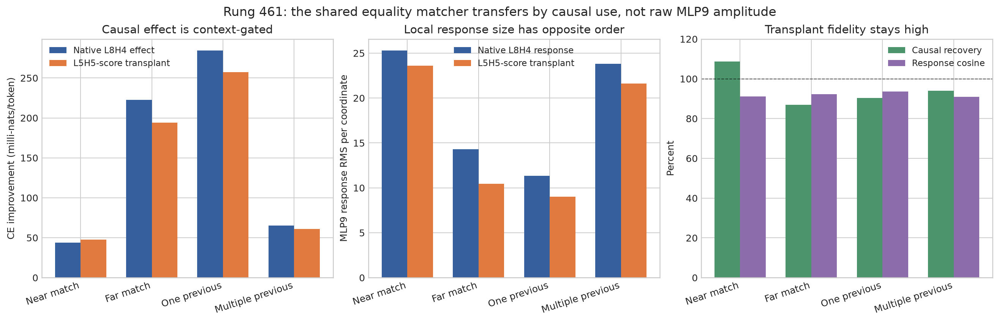

# The equality matcher is context-gated downstream — 2026-09-02 03:44 UTC

This update follows `explanation_2026-09-02_0331.md`. It covers rung 461 and the next decision. The larger goal is
still to replace native head/MLP boundaries with components that predict held-out behavior, can be reused across
circuits, and can be removed or swapped without changing unrelated computations. Rank or storage reduction alone
does not count.

## What question we tested

Rung 459 found that L5H5's equality **score** can replace L8H4's equality score while keeping L8H4's own output
vector. In ordinary language: the two heads appear to share a matcher but use it to write different things.

Rung 460 tested that fixed transplant on code. It recovered the causal CE effect, but its MLP9 response pointed in
almost the same direction on positive and negative positions. The preregistered task-specific cosine margin failed.
We therefore asked a narrower question before decomposing the matcher further:

> Is the code effect specific because the MLP9 response vector becomes larger in important contexts, or because a
> similar response is used differently by the rest of the model?

No pair, reader, factor, or scale was searched. We reused L5H5 score → L8H4 payload, the natural-text scale, MLP9,
the same 192 code documents, and four context definitions fixed before the new forwards:

- **near match:** the latest previous occurrence of the current token is at most 16 tokens away;
- **far match:** it is more than 16 tokens away;
- **one previous:** the current token occurred exactly once earlier in the context;
- **multiple previous:** it occurred at least twice earlier.

The two 96-document halves were reported separately.

## Computation

For each context cell, `base` removes both the early and L8H4 equality terms. `reference` restores native L8H4.
`hybrid` restores L8H4's payload but drives it with L5H5's score.

The native causal effect is

`[CE(base) - CE(reference)] / number of selected tokens`.

The transplanted effect is

`[CE(base) - CE(hybrid)] / number of selected tokens`.

Positive values mean that restoring the term improves prediction. Recovery is transplanted effect divided by the
native effect. Separately, the MLP9 response size is the RMS of
`MLP9(reference)-MLP9(base)` over the 1,152 output coordinates and selected tokens. This is a raw activation size,
not a rank, compression score, or normalization by another moving activation.

## Result

The causal context law transferred exactly:

| context comparison | native L8H4 effect | transplanted effect | result |
|---|---:|---:|---|
| far versus near | .2228 versus .0437 nat | .1939 versus .0475 nat | far is larger |
| one previous versus multiple | .2845 versus .0650 nat | .2571 versus .0611 nat | one is larger |

All four inequalities had the same sign in both fixed halves. Across the four cells, the ordering of transplanted
effects and native effects had Spearman correlation 1.00 in the pooled set and in each half. Per-cell recovery was
87.0% to 108.7%, and response-direction cosine was 90.8% to 93.6%. Predictions A--D passed; the strong null did not
fire.

The simple amplitude explanation failed. Native MLP9 response RMS was 25.30 for near versus 14.31 for far, and
23.80 for multiple versus 11.34 for one. The transplanted response had the same reverse ordering. Thus the contexts
where the equality service matters most have **smaller**, not larger, local MLP9 responses.

This is not just a weak correlation. Dividing causal effect by response RMS makes the distinction stark: the native
effect per unit response is about 9.0 times larger for far than near and about 9.2 times larger for one than
multiple. Those ratios are a descriptive calculation, not a new pass criterion.

## Interpretation

The best current account is:

1. L5H5 and L8H4 share a portable equality-score computation on held-out natural text.
2. On code, that transplant preserves the native causal context ordering almost perfectly.
3. The MLP9 response direction is reused broadly rather than being a task-only direction.
4. Context specificity is not represented by the size of that MLP9 write. It must come from how the changed state is
   aligned with or read by the remaining computation, or from another path that accompanies the MLP9 response.

This also explains why using a cosine task margin as the entire definition of a circuit component was too narrow:
two contexts can use nearly the same local direction while assigning it very different causal importance. But rung
460 still failed its registered margin clause; rung 461 does not retroactively change that verdict.

## Next experiment

Do not jump straight to another low-rank basis or assume MLP9 amplitude is the gate. The next registered experiment
should localize **downstream use** of the fixed score transplant. The cheapest informative version captures the
reference and hybrid changes at every later attention and MLP write, together with the final correct-token/logit
effect, and asks where the far/near and one/multiple causal ordering first becomes predictable from response
alignment rather than response norm. A stronger follow-up then patches the identified later response on held-out
documents and tests whether it repairs the signed CE effect with low off-task change.

Only after that downstream gate is identified—or prospectively ruled out—should we spend the four QK branch swaps
to ask which half of the equality matcher is shared. The durable research goal remains active through those steps;
finishing rung 461 is a checkpoint, not a pause.
