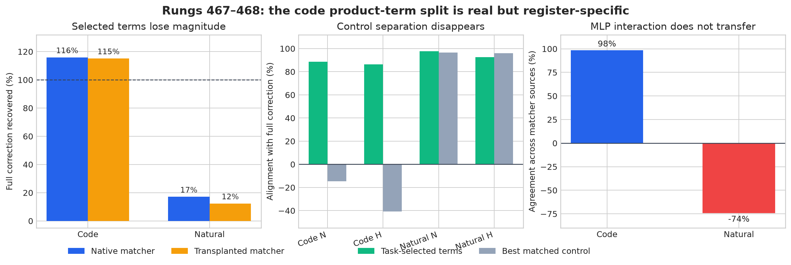
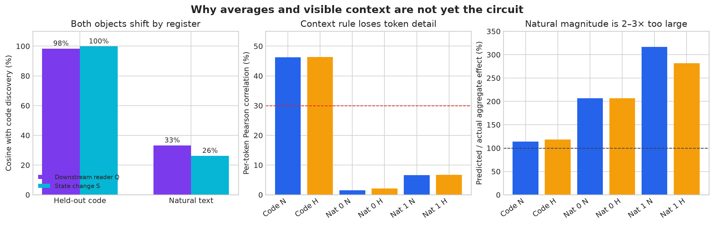

# Update since 04:31: inside the three context MLPs — 2026-09-02 05:12 UTC

## Goal

The goal is to turn bilin18 into a smaller, executable explanation whose parts correspond to computations rather
than native layer boundaries. A useful circuit should say what information is read, what operation is performed,
what is written, and how later computation uses it. It should predict held-out and shifted data, support clean removal
or interchange, compose with other circuits, and identify the same computation when it is spread across heads or
MLPs. Saving parameters matters only after those claims are established.

The current target is the equality/copy circuit. Before this update, we had localized its context-dependent correction
to a group spanning MLP8, MLP9, and MLP12, while attention14 and MLP17 provide a separate broad suppression effect.

## What an exact product term is

Each of these MLPs receives a 1,152-number residual-stream vector `x` and computes

`z_j = (Left_j x)(Right_j x)` for `j=1,...,4608`,

then

`MLP(x) = sum_j Down[:,j] z_j + bias`.

So an exact product term is one scalar product activation `z_j` together with its 1,152-dimensional output direction
`Down[:,j]`. This is not a hidden dimension of size 512, an attention head, or a low-rank approximation. The full MLP
has 4,608 such products and writes 1,152 numbers back to the residual stream.

## Rung 467: a real held-out split on code

On code documents 0:96, we measured how each of the 13,824 product terms across MLP8/9/12 affected the four known
context cases: near versus far repeats and one versus multiple previous occurrences. The measurement was the gradient
of the selected-token CE loss with respect to the MLP output, contracted with the exact change in that product term
when the equality matcher is present. In ordinary terms: select terms by their downstream task effect, not by how
large their activations are.

The frozen rule selected 450 terms in MLP8, 426 in MLP9, and 482 in MLP12. On untouched code documents 96:192, we
replaced only those products by their same-document values from the equality-absent run and let all later layers
recompute.

- Their joint causal effect aligned with removing all three MLP contributions at cosine 0.885 under the native
  matcher and 0.864 under the transplanted matcher.
- They recovered 115.9% and 115.2% of the complete correction along its own direction. Values above 100% mean the
  selected component runs somewhat stronger than the complete parent because omitted terms partly oppose it.
- Equally large groups chosen by output-weighted activation size were anti-aligned: -0.346 and -0.408 cosine.
- All three MLP groups worked individually. Their union was not the sum of their separate effects; the interaction
  agreed across the two matcher sources at cosine 0.985.

This was a valid held-out code result. It split native MLPs by task and grouped the selected pieces across modules. It
did not yet show a model-wide circuit or save any parameters.

## Rung 468: the exact indices fail to generalize to natural text

We then froze all 1,358 indices and applied the identical interventions to all 192 natural-text documents. No term
was reselected and no threshold was adjusted.

The selected effect still pointed in approximately the right direction: cosine 0.977 for the native matcher and
0.926 for the transplanted matcher. But that fact is misleading on its own:

- the selected terms recovered only 17.1% and 12.4% of the complete natural-text correction;
- matched-size activation and random controls pointed in almost the same direction, so task selection no longer
  separated the proposed component from controls;
- only MLP8 still passed individually; and
- the cross-MLP interaction changed from strongly source-consistent on code to source-opposed on natural text.

The complete MLP8/9/12 correction is itself about seven times smaller on this natural role than on code. Its near and
far effects are also nearly equal on natural text, whereas the code effect is much stronger at long range. The best
interpretation is therefore: the MLP-level correction exists in both registers, but the particular native product
coordinates carrying it are code-specific.

The first panel shows the percentage of the full MLP correction recovered along its direction. The second compares
directional alignment with matched-size controls. The third shows whether the three-MLP interaction agrees when the
native matcher is replaced by the transplanted matcher.

This is the stopping result for product-index selection. We will not change the number of terms, relax the selection
rule, or treat lower rank as a semantic explanation.

## Rung 469: averaging the reader and state separately loses the computation

The next test represents the complete quadratic MLP function in input coordinates. Let `g` be the gradient of the
selected-token CE loss with respect to the MLP's 1,152-dimensional output. Define

`Q(g) = sym(Left^T diag(Down^T g) Right)`.

`Q` is a 1,152 by 1,152 matrix. It describes which quadratic changes in the MLP input matter to the later computation.
Because it represents the complete input-to-output function after contracting with its downstream use, it is unchanged
by rescaling or refactoring individual product terms.

For the equality-present and equality-absent MLP inputs `x_s` and `x_0`, define

`S = sym((x_s+x_0)(x_s-x_0)^T)`.

`S` is the corresponding state change. The local first-order loss effect is exactly the entrywise matrix inner product
`<Q,S>`. Across examples, its average separates into:

`average response = <average Q, average S> + reader/state covariance`.

This distinguishes three explanations:

- `Q` transfers but `S` does not: later computation uses the same quadratic variable, but code and natural text drive
  the MLP into different states;
- `S` transfers but `Q` does not: the input change is similar, but downstream layers use it differently;
- both averages transfer but their covariance changes: the important information is which state change occurs when a
  particular downstream use is active.

The stronger check froze `Q` and one causal calibration scale on code discovery documents, combined that frozen
reader with held-out states, and tried to predict the actual effect of replacing the full MLP contribution.

The instrument passed: 1,440 forwards and 768 context-specific gradient calculations completed; replay and empty
patches were exact; the MLP factorization error was `7.36e-14`; and the matrix formula agreed with the product-space
calculation to `1.79e-6` nat.

The scientific result was a strong null:

- Within code, both objects were individually stable. Discovery-to-validation cosine was 0.982–0.985 for `Q` and
  0.997–0.999 for `S`.
- Nevertheless, the code-average reader combined with validation-average states predicted the union's held-out local
  response at only 0.433 cosine for the native matcher and 0.265 for the transplant. So stable averages are not the
  paired computation.
- Across code to natural text, both objects changed: median `Q` cosine was about 0.32–0.35 and median `S` cosine about
  0.20–0.33. The failure is not cleanly “only changed inputs” or “only changed downstream use.”
- Reader/state covariance supplied about 73% of the code local response and essentially 100% of the natural response.
  On natural text, the product of the separate averages was tiny and pointed in the wrong direction.

This means the legal full quadratic form is useful for ruling out a tempting simplification, but averaging it over a
corpus erases the important example-by-example pairing. No form-rank or product-count variant is licensed.

## Rung 470: visible context predicts code averages, not individual causal state

For every positive-copy token, this test recorded the exact CE change caused by
removing all products in MLP8, MLP9, MLP12, their union, and the union-minus-singletons interaction. It then fits on
code discovery only a fixed eight-feature function of:

- distance to the most recent previous occurrence;
- number of previous occurrences; and
- query position.

The function used logarithms, squares, and one distance-by-count interaction, with one fixed ridge penalty. It was
compared against the existing four-bin near/far × one/multiple summary. Held-out code and both natural waves could not
change the function.

On held-out code, the continuous rule reproduced the four aggregate context means very well: cosine 0.990/0.996 and
magnitude 114%/118% of the true effect under the two matcher sources. It also reproduced the interaction's four means
at cosine 1.000/0.980. But at the individual-token level, Pearson correlation was only 0.463/0.463 and prediction
error improved only 5.2%/5.0% over the four-bin baseline, below the registered 15% requirement.

On natural text, individual-token correlation was only 0.015–0.067 and prediction error was essentially unchanged.
The aggregate direction often looked similar, but its magnitude was 2.06–3.17 times too large. No pair of MLPs shared
one normalized context rule across every source and window, and the interaction rule did not transfer reliably.

So “stronger far away and with one predecessor” is a real code-average observation, but not the hidden per-token gate.
The simple distance/count scalar-gate proposal is rejected. The missing variable must describe the model state or how
downstream computation uses it.

In the first panel, `Q` and `S` are almost unchanged between code halves but both change sharply from code to natural
text. The middle panel shows how the context rule's per-token correlation collapses out of register. The final panel
shows that its natural-text aggregate effects are much too large even when their direction looks plausible.

## Rung 471: preserve downstream use and state change at the same position

The next test is already preregistered. For a selected target token `q` and MLP write position `p`, it computes

`-gradient(CE at q, MLP write at p) dot equality-induced change in that MLP write at p`.

This is the paired local response that the separate averages in rung469 lost. It is summed in four interpretable
position groups: the current query, the latest matching predecessor, positions between them, and earlier context. The
first two positive targets per document are fixed without inspecting outcomes.

One scalar calibration is frozen on code discovery. On held-out code and natural text, the resulting response kernel
must predict the exact per-token removal effect better than rung470's context-only function. A stable position pattern
would tell us where the three MLPs' correction is read from and would license exact interventions on those position
groups. If the total kernel predicts effects but the position split does not transfer, it remains a useful downstream-
use variable but not yet a named spatial circuit.

## Why this should not pause again

The durable research goal is active. The working stopping rule is now: every finished run is immediately followed by
an interpretation and a started successor. Rung 467 therefore launched 468; the null in 468 launched 469 rather than
ending the goal. Rung 469's null launched rung470; rung470's null has now launched the paired response-kernel rung471.

The GPU runner is supervised and does not require an interactive wait approval. An empty queue is not treated as task
completion; useful mathematical derivation, receipt analysis, and the next preregistration continue at run boundaries.
