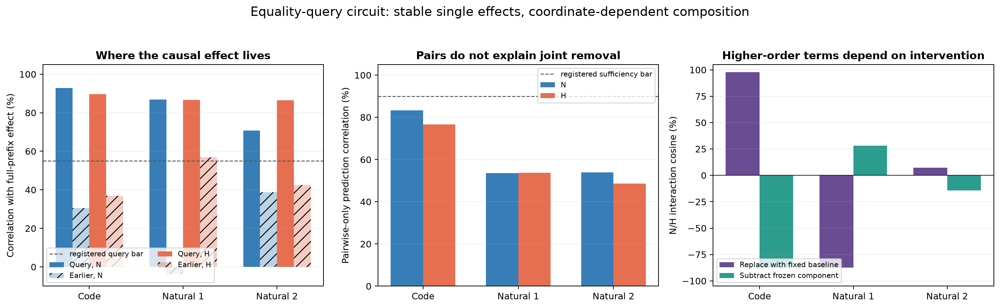

# Update since 05:12: an exact query-position circuit, but no whole-MLP grouping — 2026-09-02 06:10 UTC

## Goal

The goal is a smaller executable account of bilin18 whose parts are computations, not assumed attention-head or MLP
boundaries. A useful circuit should specify what it reads, what operation it performs, what it writes, and which later
computations use that write. It should predict held-out and shifted inputs, survive reasonable changes of coordinates,
support selective removal or interchange, and compose with other identified parts. Parameter count matters after this
evidence exists; rank reduction by itself does not identify a circuit.

This update continues the equality/copy circuit. The previous file ended with three candidate correction MLPs—MLP8,
MLP9, and MLP12—and a planned test of where their causal effect is read.

## Rung 471: the downstream response predicts individual effects, but not a stable position breakdown

For target token position `q`, MLP write position `p`, and one of the three MLPs, rung 471 computed

`- gradient(CE at q, MLP write at p) · equality-induced change in the MLP write at p`.

The dot product contracts a 1,152-number downstream sensitivity with the exact 1,152-number write change. It is a
first-order estimate of how much that write position changes the target's CE loss. The calculation retained the
example-specific state and downstream gradient together, rather than averaging them separately.

This predicted the exact complete-MLP removal effect much better than the distance/count rule from rung 470:

- held-out code per-token correlation was 0.918/0.895 under the native/transplanted matcher sources;
- natural-text correlations were 0.839/0.786 in wave 1 and 0.588/0.703 in wave 2; and
- prediction error fell by about 48–57% relative to the frozen context-only rule.

All three MLPs beat that context-only rule in every validation condition. This confirms that paired downstream use
and state carry real information across code and natural text.

The registered position claim still failed. The query position had the largest absolute contribution everywhere, but
the signed query/predecessor/earlier-position profile changed between code and natural text. The two matcher sources
also disagreed on natural text. One numerical instrument bar failed conservatively: independently adding four float32
position sums differed from the directly summed total by `1.82e-8` nat, above the frozen `1e-9` absolute tolerance,
although replay, future-position leakage, and factor reconstruction were exact. The receipt remains A=false; the
strong predictive correlations are diagnostics, not a retroactive pass.

## Rung 472: exact removal proves that the query contribution is causal

Rung 472 replaced MLP product activations by their equality-absent values at three position sets:

- only the target's current query position;
- earlier positions in its causal prefix; or
- the complete prefix through the query.

Later layers then recomputed normally. This is an exact intervention, not a gradient estimate. It was applied to each
MLP separately and to all three together, under both matcher sources, on held-out code and two natural-text waves.

Query-only removal predicted the complete-prefix effect with per-token correlation:

| data | native matcher | transplanted matcher |
|---|---:|---:|
| held-out code | 92.8% | 89.7% |
| natural wave 1 | 86.8% | 86.7% |
| natural wave 2 | 70.8% | 86.4% |

Earlier-position removal was worse in every condition. The query-only effect also reproduced the four aggregate
near/far × one/multiple-predecessor effects at 84.3–97.5% cosine. All three individual MLPs had positive query/full
correlation everywhere.

The intervention was selective. Mean absolute CE change on unrelated tokens was `0.000001–0.000295` nat, compared
with `0.000679–0.007879` nat on the selected targets; every fixed document-half check agreed. Therefore the
query-position part of MLP8/9/12 is now an identified causal subcircuit, not merely the largest part of a gradient
plot.

## Rung 473: exact pair and triple effects depend on register

For a subset `S` of the three MLPs, let `y(S)` be the target CE change when their query-position products are removed.
The pair interaction is

`I(i,j) = y(i,j) - y(i) - y(j)`.

The three-way interaction is whatever remains after subtracting all three individual and all three pair terms from
`y(8,9,12)`. This is the usual factorial or Möbius decomposition. It measures how removal effects combine; it does not
prove the model stores a separate “interaction feature.”

The decomposition closed exactly, but no universal pair emerged:

- code was led by MLP8+MLP9 under both matcher sources, with pair-source cosine 98.8%;
- natural wave 1 was led by MLP8+MLP12;
- natural wave 2 chose MLP8+MLP12 under the native source but MLP8+MLP9 under the transplant; and
- the residual three-way term was material, especially on natural text.

Dropping the three-way term left only 49–54% per-token correlation on natural text. Natural text therefore was not
well described by a fixed sum of individual and pair terms under this removal definition.

## Rung 474: the higher-order terms are properties of the intervention coordinate

There are two reasonable ways to remove several sequential MLP contributions.

1. **Fixed replacement:** replace each chosen MLP product with the equality-absent product captured when all earlier
   MLPs were intact. This is what rungs 472–473 used.
2. **Frozen-component subtraction:** capture the intact equality-induced product difference once, then subtract that
   fixed difference from each MLP's current recomputed product. Earlier removals may change the later background state,
   but the component subtracted stays fixed.

For a one-MLP removal, these definitions must agree. They did: every singleton target effect matched exactly to 0.0
nat. That makes the individual MLP query components coordinate-robust causal observables.

For combinations, the story changed sharply. The all-three effects remained reasonably related per token—78.1–93.1%
correlation—but the pair/triple allocation and context averages did not. Even code's N/H interaction cosine changed
from +97.9% under fixed replacement to -87.6% under subtraction. Code interaction magnitude fell to 33–44% of its
fixed-replacement value, while natural magnitude stayed similar or grew.

The correct conclusion is not “one coordinate found the real pair.” Higher-order removal terms at this grain are
coordinate-dependent. They can be reported for a specified intervention, but cannot yet be promoted as semantic
variables. Natural text under the transplanted matcher also failed its document-half sign check under both
coordinates, so that particular fragility is real rather than an artifact of one removal definition.

The first panel shows that current-query removal predicts the complete-prefix effect much better than earlier-position
removal. The second shows that individual plus pair terms miss the registered 90% sufficiency bar. The third shows why
we do not identify those interaction terms: changing the explicit removal coordinate changes their source agreement,
including a sign reversal on code.

## Rung 475: the 62 downstream circuits do not group whole MLPs

The next test used the existing 62 curated behavioral circuits as downstream readouts. The frozen census contains
256,000 positions. Exactly 101,052 have at least one equality-successor edge, and every behavioral circuit has at
least 135 such member positions.

For each matcher source, rung 475 removed the complete MLP8, MLP9, or MLP12 product at every equality-positive query
position and reran the model. For each MLP it then formed a 62-number fingerprint:

`fingerprint[circuit] = mean signed CE change on that circuit's equality-positive member positions`.

It repeated the comparison after linearly removing the relationship between intervention effect and the token's
native CE. That control asks whether two MLPs merely agree because they both hurt generally difficult tokens. It also
recomputed fingerprints on documents 0:500 and 500:1000.

No whole-MLP pair passed:

- under the native matcher, pair cosines were moderate: 0.51–0.63;
- after the difficulty control, MLP8+MLP9 was best at 0.64;
- under the transplanted matcher, MLP8+MLP9 was again best but only 0.53 raw and 0.57 after the control;
- the winning pair changed between raw/residualized measures and document halves; and
- no pair was jointly concentrated on the same set of at least ten circuits.

This is a useful null. Downstream computation does not treat any two complete MLP query writes as one stable variable.
The native MLP boundaries remain too coarse.

## What is running next

The next step moves inside the MLPs without using rank. It reuses rung 467's frozen, task-selected product groups and
their matched-activation controls, and asks whether the selected pieces—not the complete MLPs—have a shared 62-circuit
downstream fingerprint. A positive would supply a cross-MLP candidate defined jointly by the equality task and later
behavior. A negative would close that pre-existing split and require learning a new within-MLP partition directly from
downstream circuit responses.

The durable research goal remains active. In this interval, each result was followed by an interpreted and actually
started successor: 472 → 473 → 474 → 475 → the within-MLP downstream split. Neither a positive result, a null, an
explanation file, nor an empty queue is a completion condition.
