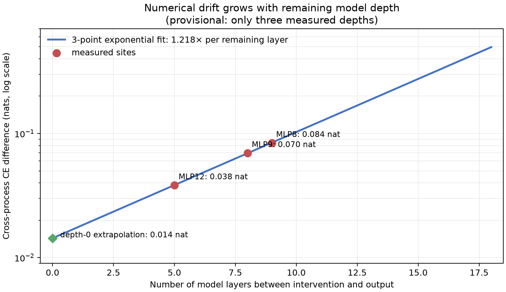

# Full update since 07:54: attention0 downstream decomposition, numerical reproducibility, and the exact MLP0 fallback — 2026-09-02 10:52 UTC

## Goal

We want an executable explanation of bilin18 in which the parts correspond to computations, not automatically to
native attention heads, whole MLPs, or convenient low-rank coordinates. A useful part should say what information it
reads, what operation it performs, what it writes, and which later computation uses that write. It should predict new
documents and shifted tasks, survive harmless coordinate changes, support extraction, and allow selective removal or
editing without disrupting unrelated behavior. Shared parts should compose predictably across tasks and modules.

Fewer parameters, lower rank, quantization, and low reconstruction error can eventually reduce the price of a circuit
we have already identified. They are not evidence that the circuit boundary is correct.

The last full update ended after three proposed internal groupings of MLP8/9/12 failed. The active question became:
can downstream circuit effects choose meaningful parts inside the successful continuous attention-0 interface?

## 1. What rung 480 is computing

Earlier rungs found a compact continuous description of attention-0 with:

- six varying coordinates for the first attention-score branch;
- six varying coordinates for the second score branch; and
- 32 varying coordinates for the information carried to the output.

This describes the fitted attention computation well on held-out documents, but those coordinates can rotate without
changing the function. We therefore cannot call coordinate 3 a circuit merely because it is stable in one fit.

For one source-to-destination attention edge, the fitted output has the form

`sum over i,j,k of score1[i] * score2[j] * payload[k] * fixed_output[i,j,k]`.

The two score factors determine how strongly the source is attended to. The payload factor describes what information
that source sends through the attention output. This is a trilinear computation: it multiplies one coordinate from
each of three groups.

Rung 480 asks which direction in each coordinate group later circuit behavior distinguishes most strongly. For a
selected target token, it differentiates that token's CE loss with respect to a latent coordinate vector `z` and
forms

`A = (z * gradient(z)^T + gradient(z) * z^T) / 2`.

`A` is a symmetric matrix. For a proposed one-dimensional projector `P`, `trace(P*A)` is the first-order CE effect of
removing that direction while leaving the other two attention factors unrestricted. The direction is chosen from the
32 discovery-circuit matrices, then tested across two document halves, two later-computation conditions, and an
independent refit.

This construction handles the coordinate ambiguity correctly. If a latent basis rotates by an orthogonal matrix
`Q`, the response matrix becomes `Q^T A Q`; its projector rotates with it and still denotes the same subspace. The
experiment is therefore testing a downstream-defined part of the attention computation, not one arbitrary axis or
one native head.

## 2. A mathematical correction made before outcomes

The attention fit is affine: each of its three coordinate groups has a fixed average term as well as varying terms.
The initial description counted only the varying `6*6*32 = 1,152` products. That could not exactly reproduce the
fitted block because it omitted products involving one or more fixed terms.

The preregistration was corrected before collecting any response outcome. Adding one distinguished constant to each
group gives dimensions `7*7*33 = 1,617`. The learned varying dimensions remain exactly `6/6/32`; this is not a rank
change. The sum of all 1,617 contributions must reproduce the fitted attention write to relative squared error at most
`1e-8`.

A second correction was conceptual. Assigning a causal effect to each individual Cartesian product is
basis-dependent. The complete 1,617-term tensor is retained only as an exact accounting check. Scientific selection
uses the symmetric response matrices above because their projectors transform correctly under legal rotations.

## 3. What would count as a positive attention result

The discovery test is deliberately harder than finding a direction with large activation variance:

1. at least two of the three coordinate groups must have a clear leading downstream-response direction;
2. that direction must agree across document halves and the independent refit;
3. agreement must exceed overlap with an activation-only direction by at least 10 percentage points;
4. one proposed direction must have a stable 32-circuit response profile and beat controls where circuit identities are
   permuted;
5. the result must survive removing one discovery-circuit family at a time; and
6. the selected direction and its complement must have measurably different downstream uses.

Even a complete discovery pass is only identification evidence. It licenses the next experiment: exact physical
removal on 30 reserved circuit cases and documents 500:1000, with all later layers recomputing and unrelated-circuit
damage measured separately.

Rung 480 is still running as of this update. It performs 317,100 individual-target backward passes across the main fit
and independent refit. This is slow because a separate target derivative avoids contaminating an earlier query with
losses at other positions. It has run continuously since 08:26 UTC at about 93--94% GPU utilization with stable memory
and no second error. There is no scientific result to report yet.

## 4. A separate experiment exposed a reproducibility problem

While rung 480 was running, another intervention experiment compared a freshly recomputed causal effect with a value
saved several hours earlier. The difference was `.11--.20` nat, far above its allowed tolerance. A focused diagnostic
showed:

- inside one process, the two supposedly equivalent interventions agree within about`0.000002` nat;
- replay and algebraic checks are exact; but
- rerunning the original collection code in a new process differs from its stored result by as much as`.084` nat.

The model weights, data, and relevant source files did not change. Regular health-check forwards stayed bit-identical,
so this is not a global model change. The current hypothesis is that this hook-heavy intervention path can choose
slightly different GPU kernels or accumulation orders in different processes, and the remaining bilinear layers
amplify the tiny numerical change.

Three measured intervention depths fit an exponential growth of about `1.218×` per remaining layer:

This is a provisional three-point fit, not an established law. Its value is that it has frozen predictions waiting
for the queued repeat and deterministic-GPU-workspace experiments. The extrapolated depth-zero value is`.0143` nat,
close to the old empirically chosen`.015` tolerance, but the deep-layer extrapolation must not be treated as measured.

The trust boundary is precise. Results that compared alternatives inside one process remain valid. Stored causal
effects compared with fresh effects from another process require an in-process baseline or a measured
depth-dependent tolerance. Rung 480's main response and refit are rebuilt in one process; however, it also has several
old numerical reproduction checks. If only those old-number checks fail while its in-process identities pass, the
original receipt will remain failed and the already queued in-process repair will run before any scientific
interpretation.

## 5. Tensor-network direction: coupling downstream views can improve identifiability

The full attention response for one circuit and view is a `7 x 7 x 33` tensor. A possible block decomposition would
use the same score1, score2, and payload subspaces across circuit identities, document halves, later-computation
conditions, and independent fits, while allowing each circuit to use those blocks with different strengths.

This is more promising than decomposing one tensor in isolation because the shared factors must satisfy many coupled
equations. Existing block-term-decomposition theory gives uniqueness results in some specified-rank, generic cases,
and coupled tensor decompositions can be identifiable when one tensor alone is not. But those assumptions have not
been established for our dense attention core. We will first test whether contractions of the response tensors have
nontrivial common invariant subspaces. A trivial common algebra kills the block hypothesis before a flexible fit can
interpolate it.

Tensor-network canonical forms can also remove arbitrary gauge choices and decide whether two tensors represent the
same computation up to gauge. They do not tell us what a component means or whether removing it is selective. Here,
canonicalization is an equality check; downstream response and intervention provide semantics.

The detailed object-to-theorem mapping and primary references are in
[`COUPLED_RESPONSE_TENSOR_NOTE_2026-09-02_1018.md`](../COUPLED_RESPONSE_TENSOR_NOTE_2026-09-02_1018.md).

## 6. The exact MLP0 fallback is already implemented

If rung 480's in-process checks pass but no stable attention direction survives, the next experiment is conditional
rung 481. It uses the exact MLP0 decomposition already established by rung 401:

`MLP0 write = constant + T + C + I + S + retained numerical remainder + bias`.

- `T` is the token-only main effect at the average normalization gain.
- `C` is the context-only main effect.
- `I` is the centered bilinear interaction between the particular token and its attention0 context.
- `S` is the change caused by this example's normalization gain differing from the average.

The small numerical remainder needed for exact equality stays fixed in every arm; it is not compressed or given a
semantic name.

Rung 481 runs all 16 subsets of `{T,C,I,S}`. For each subset it physically changes the MLP0 write and lets all 17 later
blocks recompute. For circuit case `c`, it calculates

`P_c(subset) = -mean CE on positions belonging to c`.

The Shapley effect of one branch is its marginal improvement averaged over all orders in which the four branches can
be restored. A pair interaction is the average second difference

`P(U+b+d) - P(U+b) - P(U+d) + P(U)`

over all settings `U` of the other two branches. This retains nonlinear downstream interactions rather than adding
single-branch effects as though CE were linear.

Every effect is measured separately on positions belonging to a circuit case and matched positions from the same
data slice. Their difference is the circuit-selective effect. Full-model token difficulty is removed as a second
control, using a coefficient learned only on the first document half.

The competing hypotheses are intentionally separated:

- **different downstream variables:** `T` and `I` circuit profiles have absolute cosine at most 70%, with at least
  eight stable opposite-sign circuit effects; or
- **one shared downstream variable:** their cosine is at least 90%, and one scalar mapping learned on the first half
  predicts the second-half relationship with at most 35% relative error.

The middle interval is an honest null. A descriptive audit also reports how many sign differences remain after
minimum effect sizes of `1e-4`, `1e-3`, and `1e-2` nat, so tiny sign flips cannot hide behind the frozen zero-threshold
gate.

Discovery uses 32 circuit cases and documents 0:500. Only a stable, control-beating relationship opens the other 30
circuit cases on documents 500:1000. Stable pair interactions determine whether later decompositions should be joint
or branch-specific. No rank or sparse support is selected.

The implementation, tests, and dry-run gates are committed and pushed. It is not queued early: the program checks the
rung 480 receipt at startup and refuses to execute unless rung 480 has both a valid in-process instrument and its
scientific strong null.

## 7. Why the research loop is not paused

The durable program goal remains `active`; it was not marked complete after the previous explanation, the tensor
note, or the rung 481 implementation. The managed GPU state at this update is:

- rung 480 actively running;
- repeated intervention-reproducibility probe queued next;
- in-process projector experiment queued after it;
- deterministic-GPU-workspace cure test queued after that; and
- conditional rung 481 code complete and guarded for the scientific-null branch.

The next action after rung 480 is fixed before its result:

- full scientific pass: start exact held-out attention-direction removal;
- valid instrument plus scientific null: enqueue rung 481;
- failure only in the old stored-number comparison: run the queued in-process repair first; or
- any other instrument failure: preserve it and repair only the failed measurement.

Hourly reviews restate the circuit goals and reject rank reduction as a substitute. The separate three-hour review
checks tensor-network mathematics and must produce an executable consequence. Most importantly, a completed result,
clean commit, explanation, or empty queue is explicitly not a stopping condition: before yielding at a result
boundary, the licensed successor must actually be started.
