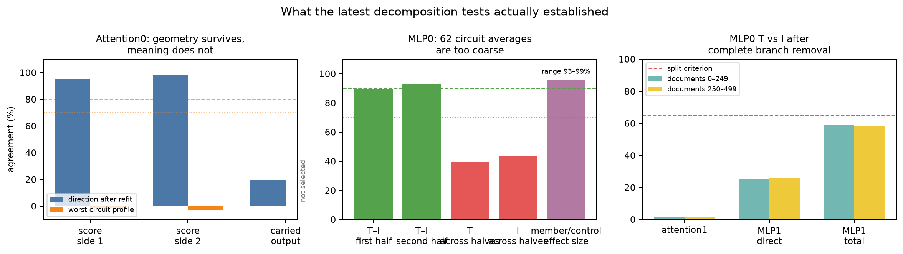

# Full update since 02:19: from whole heads to shared matchers, task-conditioned MLP parts, and MLP0's immediate readers — 2026-09-02 11:40 UTC

## Goal

We are trying to turn bilin18 into a smaller executable program whose parts correspond to computations rather than
automatically treating one attention head, one MLP, one low-rank direction, or one native product coordinate as a
circuit.

A successful circuit part should:

- say what information it reads, what operation it performs, what it writes, and which later computation uses it;
- predict held-out documents and genuinely shifted data;
- be recoverable as the same computation when it appears in different heads, MLPs, or coordinate systems;
- support selective removal, replacement, or interchange while leaving unrelated behavior mostly unchanged; and
- compose predictably with other identified parts.

Parameter count, storage, low rank, quantization, or reconstruction error matter only after they help these tests.
None of them is a substitute for finding the right circuit boundary.

The 02:19 update was the point where the program was redirected accordingly: stop optimizing ranks and start asking
which pieces of different heads or MLPs implement the same behavior, and which pieces inside one module implement
different behaviors. Since then we have run a complete equality/copy arc, three increasingly invariant MLP-grouping
tests, a downstream-defined attention decomposition, and two exact MLP0 branch experiments.

## Executive summary

The most important positive result is a shared **equality matcher** below attention-head level. An attention score
from layer 5 head 5 can drive layer 8 head 4's own output and recover the intended copy effect on held-out natural
text. It also transfers causally to code, although one stricter task-specific similarity margin failed there. The
matcher and the information carried by it are therefore separable computational parts.

Downstream of that matcher, MLP8, MLP9, and MLP12 form an exact, selective query-position correction. Removing their
contributions only at the current query predicts the effect of removing them throughout the whole causal prefix, and
barely affects unrelated tokens. However, their internal product coordinates do not define a reusable common basis:
the code-selected products fail on natural text, sparse mixtures interpolate one data view but do not transfer, and a
coordinate-independent common-block test also fails.

The best current account is consequently not “one representation copied across three MLPs.” It is “three distinct
causal components cooperating on the same behavior.” Their joint effect is also sensitive to how removal is defined.
A newer subspace-defined removal gives one guarded composition result on code, but not on natural text.

Inside attention0, downstream computation does fix two stable geometric directions in the continuous score
interface. That is genuine identifiability evidence. Their behavioral meaning across the 32 discovery circuits does
not transfer, however, so they are not yet named circuit parts.

For MLP0, the existing 62-circuit averages were too coarse. The newest experiment instead measured how its exact
token-only and token-by-context branches affect attention1 and MLP1. Complete removals produce clearly different
directions at attention1 and the direct MLP1 path. But the local derivative does not accurately predict the complete
removal, so this is a useful split screen rather than a validated operational decomposition. The held-out 500
documents were correctly left unopened.

The left panel separates stable geometry from stable circuit meaning. The middle panel shows why averaging MLP0 over
62 circuit labels was inconclusive. The right panel shows the newest complete-removal result: token-only and
token-by-context effects are very different at attention1 and the direct MLP1 route, and still below the registered
65% similarity boundary for the complete MLP1 route.

## 1. The equality/copy circuit was first tested at whole-head grain

Four exact equality terms were already known: layer 5 head 5, layer 7 head 3, layer 8 head 3, and layer 8 head 4. At a
query position `q`, each term sums over source positions `k` for which the current token equals the token immediately
before the source:

`token[q] = token[k-1]`.

The term then multiplies that discrete equality relation by the head's attention-score function and by the
information that the head carries from `k` into the residual stream.

Experiment 457 ran every one of the 16 subsets of the four terms, under both removal and extraction. Extraction means
deleting all four selected head contributions and restoring only a chosen subset. Restoring all four recovered
`0.503 nat` on all equality-positive positions and `0.492 nat` on matched copy positions, while changing unrelated
positions by only `0.004 nat`.

The four singleton recoveries summed to 186% of the all-four result. That is possible because the terms overlap in
what they accomplish. The early pair and layer-8 pair had a robust negative interaction of `-0.224 nat`, with the
simultaneous uncertainty interval entirely below zero. In ordinary terms, either depth block supplies part of a
benefit that the other block can also supply. The proposed L8H3/L8H4-only group remained unresolved because its wider
simultaneous interval crossed zero.

The effect was stronger when the matching predecessor was far away and when there was exactly one earlier occurrence.
That was stable context dependence, but not evidence for four separately named head specializations.

The next screen asked whether removing two complete equality terms causes the same change in some later attention or
MLP output. It checked 72 pair-and-reader combinations. The best pair reached 53.2% response similarity on copy
positions, but 51.2% on matched negative positions. The task-specific margin was therefore only 2.0 percentage points,
against a required 15 points. This ruled out grouping complete equality terms by one later module's complete output.
It did not rule out shared pieces inside them.

## 2. Splitting the attention term exposed a reusable matcher

An exact equality term can be written schematically as

`equality relation × attention score × carried output`.

The **attention score** is the scalar that says how strongly the query reads a source. It is computed from the Q/K
part of attention. The **carried output** is the 1,152-dimensional residual-stream vector sent along that connection
after the value and output maps. Earlier explanations called this the “payload”; here it simply means the information
being carried.

Experiment 459 kept layer 8 head 4's carried output but replaced its equality-restricted score with layer 5 head 5's
score. On held-out natural text, this hybrid recovered 112.1% of the native causal effect; the uncertainty interval's
lower end was 99.4%. Swaps within the selected pair were 8.5 times more successful than the registered cross-pair
control. The chosen score functions had 83.1% similarity while the carried outputs had only 4.8% similarity.

This is the first clean computational grouping from this arc:

> L5H5 and L8H4 contain a reusable equality-score computation, while retaining different output branches.

The fixed hybrid then recovered 91.9% of the causal effect on code, with a 15.5-to-1 interchange separation from its
control. One stricter clause failed: positive and matched-negative downstream response directions were 91.0% and
87.8% similar, leaving a 3.2-point task margin rather than the required 5 points. We therefore preserve the causal
transfer facts but do not call the complete code confirmation passed.

On code, both the native and transplanted score were much more useful for far repeats than near repeats, and for one
predecessor than multiple predecessors. Their four-condition ordering matched perfectly. Yet the MLP9 output change
was *smaller* in the contexts where the causal benefit was largest. The context rule is therefore not encoded simply
as “a bigger MLP9 activation.” It depends on how later computation uses the changed state.

## 3. The downstream program is distributed, but it has separable roles

No one later attention or MLP write explained the context dependence: the best single site recovered only 5.6%.
Removing the direct matcher alone over-corrected some contexts, whereas the collection of later writes carried the
near/far and one/multiple modulation almost exactly.

The matcher source and later correction were then cross-wired. The later correction induced by the native L8H4 score
and by the transplanted L5H5 score agreed at 99.5% cosine; cross-wired versions retained 86.5–108.1% of the effect.
This showed that the matcher and its downstream correction are separable and reusable parts.

A five-site factorial then split the later program into two roles:

- MLP8, MLP9, and MLP12 carry the task-shaped context correction; and
- attention14 and MLP17 provide a broad suppressing effect.

The three-MLP correction agreed across matcher sources at about 99.2%. The suppressor group acts broadly rather than
carrying the context rule, and the two groups have a real interaction. This was useful circuit anatomy, but the native
MLP boundaries were still too large to be a final decomposition.

## 4. Going inside MLP8/9/12 found a code circuit but no universal product basis

Each of these bilinear MLPs receives a 1,152-dimensional vector `x` and computes 4,608 exact products:

`z_j = (Left_j x) (Right_j x)`

and then writes

`sum_j Down[:,j] z_j + bias`.

Experiment 467 selected products by their downstream equality-task effect on code documents 0–95, not by activation
size or rank. It selected 450 products in MLP8, 426 in MLP9, and 482 in MLP12. On untouched code documents 96–191,
their physical removal aligned with the whole three-MLP correction at 88.5% and 86.4% under the two matcher sources.
They recovered 115.9% and 115.2% along the parent direction, while equally large activation-selected controls pointed
the wrong way. This was a genuine held-out, task-conditioned split inside three MLPs.

Freezing the same 1,358 product indices and applying them to natural text failed. Their direction still looked
similar, but they recovered only 17.1% and 12.4% of the full correction, matched controls looked nearly as good, and
only MLP8 survived individually. The coordinates were therefore code-specific rather than a reusable circuit basis.

The next three tests asked whether a less coordinate-dependent grouping would work:

- Averaging the exact downstream quadratic reader and the input-state change separately failed, even within code.
  Their example-by-example covariance supplied about 73% of the code response and essentially all of the natural-text
  response. Which state occurs with which downstream reader matters.
- A simple continuous function of repeat distance, predecessor count, and position reproduced code's four average
  conditions at about 99% cosine but predicted individual code effects at only 46% correlation and natural effects
  at roughly 2–7%. Context labels alone are not the hidden gate.
- Sparse mixtures of six to eight native products fit one 32-circuit view at 96.5–98.3% cosine, then dropped as low
  as 5.9% on another source/half, below a 33.9% destroyed-alignment control. This was interpolation, not a reusable
  computation.

A coordinate-independent common-block test also failed. It asked whether the downstream quadratic reader matrices
from two MLPs preserve the same pair of input subspaces. Synthetic planted blocks were recovered exactly, but the real
reader matrices left 34–38% of their size outside the proposed blocks, against a 3% calibration boundary, and did not
beat independently rotated controls. This rules out that particular shared two-block algebra without asserting that
no task-conditioned decomposition can exist.

## 5. Exact intervention localized the MLP correction to the current query

The paired downstream calculation

`- gradient(CE at target q, MLP write at p) dot equality-induced write change at p`

predicted individual effects much better than the simple context rule: about 90% correlation on held-out code and
roughly 59–84% on the natural-text conditions. This keeps the example-specific state and the reader that uses it
together.

The exact follow-up removed each MLP contribution only at the current query, only at earlier positions, or throughout
the full causal prefix. Query-only removal predicted full-prefix effects at 89.7–92.8% correlation on code, 86.7–86.8%
on the first natural set, and 70.8–86.4% on the second. It beat earlier-position removal everywhere. Unrelated-token
changes were `0.000001–0.000295 nat`, compared with `0.000679–0.007879 nat` on selected targets.

This gives us an actual selective circuit boundary: the current-query contributions of MLP8, MLP9, and MLP12 are
causally sufficient for most of the equality correction.

The interactions among those three contributions were not invariant. A fixed-replacement removal and a
fixed-component-subtraction removal give identical one-MLP effects, but disagree sharply about pair and triple terms;
even code source agreement changed from +97.9% to -87.6%. Individual removals are robust facts. Higher-order terms at
this grain are properties of the named intervention rule and cannot yet be treated as separate semantic variables.

Using the 62 existing circuits as downstream fingerprints did not group any pair of complete MLP8/9/12 writes. The
best pair similarities were only about 53–64%, and the winning pair changed across controls and document halves.
Repeating the test with the old task-selected product groups made the grouping weaker, not stronger.

## 6. A new subspace-defined removal gives one narrow composition result

Because fixed replacement and subtraction disagreed, a third intervention removed only the component of each
equality-induced MLP change along a registered one-dimensional subspace. This definition is invariant to rescaling
the vector and is explicitly part of the scientific claim; it is not asserted to be the uniquely “real” removal.

On code, the three-MLP joint interaction agreed across native and transplanted matcher sources at 93.9%. An immediate
48/48-document stress test reproduced the pooled value exactly and obtained 96.9% and 87.4% agreement in the two
halves, with material effects throughout. This is the first guarded statement that these three MLP contributions
compose consistently under one subspace-defined removal on code.

The scope matters. On natural text the interaction nearly vanished under this removal even though it was material
under the two earlier removal rules. The current geometric hypothesis is that code cooperation lies along the
equality-induced change direction, while natural-text cooperation lies mostly in the orthogonal component. A mirror
intervention that removes the orthogonal component has been proposed but has not yet been promoted into the main
MLP0 line.

## 7. Downstream computation fixes attention directions, but not their meanings

The successful continuous attention0 model has two six-dimensional score sides and a 32-dimensional carried-output
side. Including each side's fixed average term makes its exact affine computation a `7 × 7 × 33 = 1,617` term tensor:

`sum(i,j,k) score1[i] score2[j] output[k] fixed_tensor[i,j,k]`.

These coordinates can rotate without changing the computation, so selecting coordinate number 3 would be arbitrary.
Experiment 480 instead used downstream CE responses to choose a one-dimensional subspace inside each side. For a
coordinate vector `z` and its downstream gradient `g`, it formed the symmetric matrix

`A = (z g^T + g z^T) / 2`.

The leading direction of the collection of these matrices is defined by downstream use, and rotates correctly if the
latent coordinates rotate.

The two score sides passed the geometric test: their leading directions had eigengaps 5.72 and 4.94, and independent
refits recovered them at 95.2% and 98.0% subspace overlap. They also beat activation-only directions by 44 and 53
percentage points. The carried-output side did not pass.

The semantic test failed decisively. The selected directions' worst cross-view 32-circuit profile similarities were
-1.6% and -2.6%, against a required 70%, and leaving out one circuit family at a time did not repair them. Thus later
computation genuinely fixes two attention directions, but the present circuit labels do not give them stable meanings.
We keep the continuous interface and the stable projectors; we do not name or selectively remove them yet.

## 8. MLP0's exact branches and what the latest experiment found

MLP0 already has an exact real-context decomposition:

`MLP0 write = constant + T + C + I + S + numerical remainder + bias`.

- `T` is the token-only main effect evaluated at the average normalization scale.
- `C` is the context-only main effect.
- `I` is the centered token-by-context bilinear interaction.
- `S` is the correction caused by this example's normalization scale differing from the average.
- The numerical remainder is retained so the branches sum back to the deployed BF16 computation; it is not being
  called a feature or compressed.

Earlier exact attribution showed `I` and `T` are the two largest MLP0 roles: on the selected data their Shapley CE
benefits were 1.538 and 1.498 nat, versus 0.418 for `C` and 0.067 for `S`. This says context mostly changes the
token-specific bilinear computation rather than merely adding a context-only vector.

Experiment 481 ran every subset of `{T,C,I,S}` and measured each branch's signed CE effect across the 62 existing
circuits. `T` and `I` looked similar within each document half—89.7% and 92.8% cosine—but the same branch's profile
only agreed 39–47% across halves. More decisively, circuit-member effects were only 93–99% as large as matched-control
effects. The branch changes were diffuse rather than specific to those circuit labels. The 62-circuit average is
therefore the wrong resolution for MLP0; the result does not say that the exact branches are meaningless.

Experiment 483 changed the observed object to the actual next computations. For branch `b`, it varied

`MLP0 write(alpha) = native write - alpha b`

and captured three 1,152-dimensional outputs:

1. the recomputed attention1 write;
2. MLP1's direct write while attention1 was restored to its native value; and
3. MLP1's total write with attention1 recomputed normally.

It computed both the derivative at `alpha=0` and the complete physical removal at `alpha=1`, plus all six two-branch
removals. Response similarity was calculated over every document, token position, and output coordinate in two fixed
250-document halves.

The derivative implementation passed for `T`, `C`, and `I`. The finite difference for `S` missed its frozen accuracy
boundary: 93.5–95.3% cosine and 30–36% scale-adjusted error in the affected consumers, versus required 98% and 20%.
This is localized to the small normalization-scale branch and is consistent with curvature over the relatively large
finite-difference step. The registered instrument verdict nevertheless remains failed.

More importantly, the local derivative did not predict complete removal of `T` and `I` well enough. For the token-only
branch at attention1, derivative-versus-removal cosine was only 66–67% with about 74% scale-adjusted error. Other
consumer/branch cosines were higher, but the all-consumer rule failed. A Jacobian at the native point is therefore not
an adequate substitute for actually removing a complete MLP0 branch.

The physical removals still give a clear descriptive split. `T` versus `I` response cosine was:

- 1.5% and 1.7% at attention1 in the two halves;
- 25.1% and 26.1% for direct MLP1; and
- 58.7% and 58.5% for total MLP1.

All are below the preregistered 65% split boundary. Every two-branch interaction was also stable and material across
the halves, so future finite interventions must include interactions rather than adding singleton effects.

Because the finite-difference instrument and derivative-to-removal prediction failed, the strict result is a strong
null and no held-out document was opened. The correct statement is:

> Complete finite interventions strongly suggest that immediate consumers distinguish token-only and
> token-by-context MLP0 information, especially in attention1. Local linearization is too weak to validate that split
> or define the next circuit by itself.

## 9. Numerical reproducibility and the current trust boundary

One separate intervention path exposed a cross-process discrepancy of roughly 0.03–0.20 nat when fresh effects were
compared with values stored before 08:02. Repeated processes after 08:02 now agree bit-for-bit, including deterministic
workspace tests. No relevant file, process environment, CUDA cache, or tested workspace setting explains the one
discrete shift between 05:57 and 08:02.

The cause is therefore unknown but contained. Results comparing alternatives inside one process remain trusted.
Every future experiment now rebuilds its causal baseline in the same process and carries a deterministic fingerprint
that will catch another shift. Old and fresh intervention numbers are not compared below roughly 0.1 nat without an
in-process bridge. The earlier 1.218-times-per-layer curve remains a description of how this one perturbation grew
with depth, not evidence for random kernel selection on every process.

## 10. What is established, what is not, and the active next step

Established:

- a shared equality-score computation can be transplanted between L5H5 and L8H4 while each retains its own carried
  output;
- the later equality correction separates into a three-MLP context-shaped part and a broad suppressing part;
- the current-query contributions of MLP8/9/12 are exact, selective causal components;
- three tested internal bases do not turn those MLPs into one reusable representation;
- one subspace-defined removal yields a source- and half-stable code-composition result;
- downstream use fixes two geometric directions inside the continuous attention0 score interface; and
- complete MLP0 token-only and token-by-context removals look distinct to its immediate consumers.

Not established:

- a global semantic basis for the continuous attention block;
- a shared internal coordinate system across MLP8/9/12;
- a context-independent definition of their pair/triple interaction;
- a sparse vocabulary or compressed replacement for MLP0's token-only function; or
- a validated operational T/I split based on the immediate Jacobian.

The next MLP0 step changes the downstream measurement rather than tuning a rank. It will use complete finite branch
changes together with task-conditioned reader functions, preserving per-token and per-context information instead of
averaging over all positions or 62 coarse labels. The immediate target is to determine which attention1 score/output
computations distinguish `T` from `I`, whether those distinctions repeat across tokens and contexts, and whether a
group learned on one document half survives physical interchange on the other. This directly addresses the original
question: which token groups have the same downstream effect, and which contextual features change that effect?

The durable research goal remains active. A successful experiment, a null, a written explanation, a clean commit, or
an empty GPU queue is not a stopping condition. The research-driver now requires both a board claim and an actually
performed next step or managed successor before yielding; the overall stopping condition remains a predictive,
composable, selectively manipulable tensor program.
