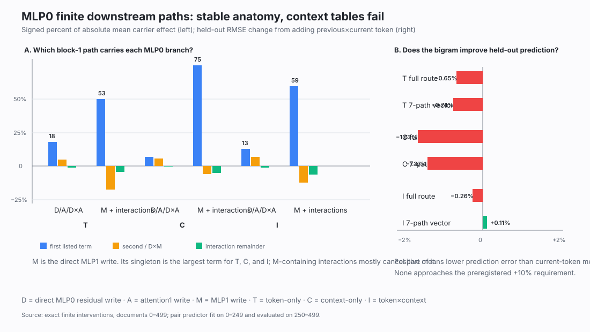

# MLP0 update: exact downstream paths, two failed lookup explanations, and the continuous-factor test — 2026-09-02 13:18 UTC

## Goal

We want an operational explanation of MLP0: what information it computes from the current token and context, how
that information travels through the next block, which parts can be grouped or must be separated, and whether those
parts can later be extracted or changed without disturbing unrelated computations.

The exact MLP0 formula remains:

`MLP0 write = fixed remainder + T + C + I + S + bias`,

where:

- `T` is the part determined by the current token at the average normalization scale;
- `C` is the part determined by attention0's context at that average scale;
- `I` is the bilinear interaction between this token and this context; and
- `S` is the smaller correction caused by the example's actual normalization scale.

These are exact causal terms, not a low-rank approximation. The current work asks what later computation does with
`T`, `C`, and `I`.

## Main result

We now have a stable exact description of how all three important branches cross block1, but not yet a simple rule
for their example-by-example magnitudes.

The dominant immediate carrier is MLP1's output. Its average contribution is combined with substantial cancelling
interactions, and the complete seven-term pattern is nearly identical across two document halves. However:

- neither Left nor Right side of MLP1 alone predicts the complete finite effect;
- current-token identity does not predict the token-only branch's downstream effect; and
- adding previous-token identity—an old successful explanation of part of MLP0's activation—also fails to predict
  the downstream effect.

So “what MLP0 writes” and “how the rest of the model uses that write” have now cleanly separated. A bigram can
describe some activation structure without being the downstream circuit boundary.

## What was computed

### 1. Exact attention1 paths

For `T` and `I`, we removed the whole branch from MLP0, then reconstructed attention1 using every native/removed
combination of its two score factors and its carried value. Inclusion–exclusion gives seven effects: three single
factors, three pair interactions, and one three-way interaction. Their sum exactly reproduced the complete attention
route.

`T` had no smaller attention path. Two large score-side effects mostly cancelled through their interaction. `I` had
a promising two-factor path, but it was generic rather than specific to the equality behavior and narrowly failed
independent selection in the second half. The seven-effect patterns were nevertheless extremely stable.

### 2. Exact MLP1 Left/Right paths

For normalized MLP1 input `z`, the layer computes

`Down1[(Left1 z) * (Right1 z)] + bias1`.

We again removed T or I upstream, restored attention1 to isolate the direct MLP1 route, and ran all four native versus
removed combinations of `Left1 z` and `Right1 z`. Neither side alone passed: its direction was similar to the full
effect (cosines about`.90--.92`), but after fitting the best one-number scale,40--44% of the full effect remained
unexplained. The required limit was35%.

The average `(Left, Right, Left×Right interaction)` profiles were almost identical for T and I—cosine`.9998`—but
the individual complete effects were not related by one scale: held-out relative error was`.952`. This means “same
average shape” is not the same as “same computation.”

Current-token means also failed. Across698 well-supported tokens, the T effect profile transferred at only`.425`
cosine without frequency weighting and`.672` with weighting. Per-position correlation was`.028`, and the lookup
slightly increased prediction error.

### 3. Joint direct/attention1/MLP1 carrier cube

The next calculation stopped assigning the response to one consumer at a time. For each of T, C, and I, it captured
native and branch-absent versions of:

- `D`: MLP0's direct residual write;
- `A`: attention1's write; and
- `M`: MLP1's write.

It then ran every one of the eight native/absent combinations. Inclusion–exclusion gives the seven exact effects

`D, A, D×A, M, D×M, A×M, D×A×M`.

The empty corner exactly reproduced the branch-absent model, the full corner exactly reproduced the native model,
and all inclusion–exclusion sums closed at numerical zero. The profiles transferred across halves at
`.999996/.999688/.999955` cosine for T/C/I.

The term order matters. MLP1's singleton `M` is the largest mean term:52.6% of absolute profile mass for T,75.2%
for C, and59.5% for I. MLP1-containing interactions subtract much of that effect. A collaborator initially called
the D×A interaction dominant; that was a mask-labeling error, corrected in the ledger and graph above.

### 4. Previous×current token test

The old dossier found that `(previous token,current token)` explained more of MLP0's token×attention activation than
current token alone on repeated pairs. We tested that exact named variable on downstream causal effects rather than
assuming the activation result transferred.

Before model outcomes,287 ordered token pairs were frozen because each occurred at least eight times in both
discovery halves. They cover7,859 training-half and8,292 test-half positions. For each pair, the first half estimated
the mean complete effect and mean seven-path vector. Those means were applied unchanged in the second half and
compared with current-token means fitted on exactly the same positions.

The pair lookup made prediction worse for T: RMSE changed by`-0.65%` for the full route and`-0.74%` for the path
vector, where positive would mean improvement. Full-route correlation was`.045`. C also worsened; I's path-vector
improvement was only`+0.11%`. The required gain was10%.

This does not retract the old activation-level bigram result. It shows that the suffix does not use MLP0 according
to that categorical partition.

## What this rules out

At this downstream grain, we should stop trying:

- current-token lookup tables;
- previous×current-token lookup tables;
- another Left/Right subset;
- another sparse product selection; or
- a lower-rank quadratic fit presented as interpretation.

The older rank-256 quadratic program remains a strong functional approximation—97.9% of MLP0's measured function—but
its features were distributed and informal feature names failed a code-level check. It is useful implementation
evidence, not the missing semantic decomposition.

## The active mathematical test

MLP1 is quadratic, so its complete finite change has an exact factorization. If `z_N` is its native input and `z_b`
is its input with branch `b` absent, define

`delta_b = z_N - z_b`,

`mid_b = (z_N + z_b)/2`.

Then

`MLP1(z_N) - MLP1(z_b) = B(delta_b, mid_b)`

exactly, where `B` is the symmetric bilinear form obtained from MLP1's Left, Right, and Down weights. `delta_b` says
what the upstream branch changed; `mid_b` is the continuous live state multiplying that change.

The running experiment cross-swaps these factors for every pair among T, C, and I:

- keep T's change but use I's live-state factor;
- keep T's live state but use I's change;
- repeat in the opposite direction; and
- do the same for T/C and C/I.

Each constructed MLP1 write is physically injected and the rest of the model recomputes. Sixteen shifted-position
controls test whether same-position agreement is special. If live-state swaps work but change swaps do not, the
branches share a downstream reader but supply different inputs. If change swaps work but live-state swaps do not,
they supply an interchangeable input that different states use differently. If neither works, the two factors are
coupled and the next object is the within-branch finite response integrated through the suffix.

This is progress toward grouping and splitting by computation. It is not compression, and it does not yet complete
MLP0.
