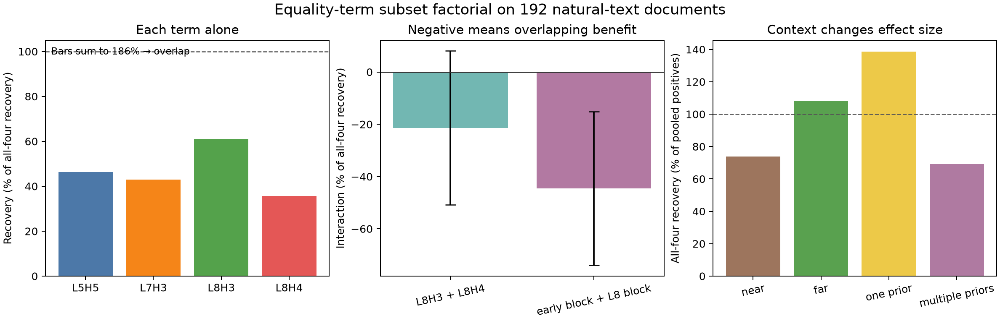
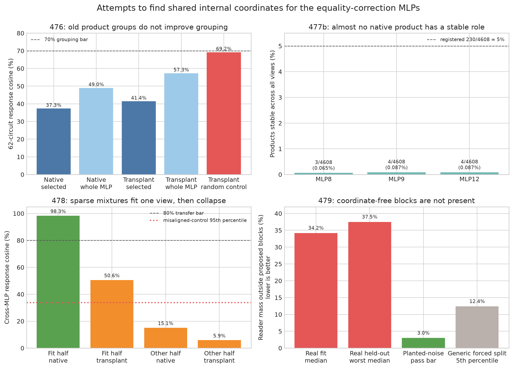
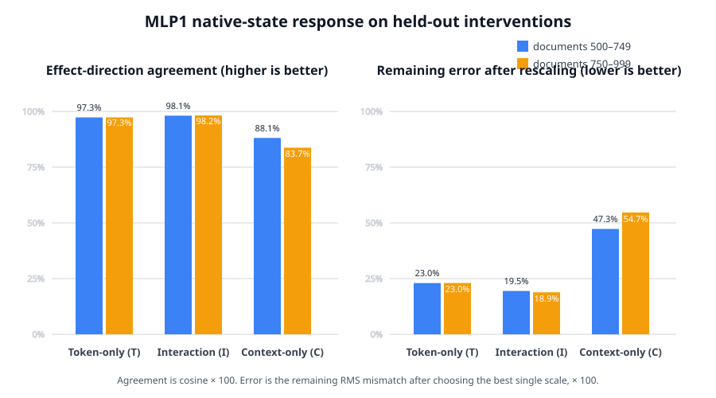

# Full update since 02:19: a shared equality matcher, selective MLP parts, and MLP0's continuous reader — 2026-09-02 13:30 UTC

## Goal

We are trying to replace bilin18 with a smaller executable program whose pieces correspond to computations, rather
than assuming that an attention head, an MLP, a low-rank direction, or an individual weight coordinate is a circuit.

A successful piece should tell us what information it reads, what operation it performs, what it writes, and which
later computations use that write. It should predict held-out and shifted inputs, support extraction and selective
removal or swapping, preserve unrelated behavior, compose with other pieces, and remain identifiable under harmless
changes of coordinates. Storage and compute matter for the eventual compiled program, but lower rank, quantization,
or reconstruction error do not establish any of these properties by themselves.

The 02:19 explanation marked the change to this research direction. Since then, the project has completed two major
arcs:

1. It found a real computation shared below attention-head level in the equality/copy circuit, then localized the
   distinct downstream parts that use it.
2. It moved from broad MLP0 branch averages to exact finite paths through attention1 and MLP1, and found the first
   strong candidate for grouping two MLP0 branches by how MLP1 uses them.

## Short version

The clearest established circuit is an equality matcher shared between layer5 head5 and layer8 head4. The score made
by the earlier head can drive the later head's own output and recover the copy behavior on held-out text. The matcher
is therefore reusable while the information carried by the two heads remains different.

The later correction to that signal separates into three MLPs—MLP8, MLP9, and MLP12—that carry the context-dependent
part, plus attention14 and MLP17, which provide a broader suppressing effect. The current-query contributions of the
three MLPs are selective causal components. However, three attempts to identify one shared internal basis across the
MLPs failed: native product coordinates, sparse mixtures of those products, and a coordinate-independent two-block
decomposition. The current honest description is three distinct components cooperating on one behavior, not one
representation copied across three MLPs.

For MLP0, we now know exactly how its token-only (`T`), context-only (`C`), and token-by-context (`I`) branches cross
the next block. MLP1 is the largest immediate carrier. Token identity and previous×current-token identity both fail
to predict the downstream effects, even though the latter had previously explained some of MLP0's activation. A
continuous-factor experiment initially suggested a special reader shared by T and I. Held-out intervention outcomes
reproduced its graph, but a stronger control showed that the graph was mostly explained by the native MLP1 state
common to every branch midpoint. The corrected result is narrower and stronger: the native-state response predicts
T and I very well but not C, and each branch still needs a separate finite nonlinear correction. The live successor
is splitting that whole native state into named sources and testing which sources are actually necessary.

## 1. Whole attention heads were too coarse, but one matcher is genuinely shared

The starting object was four known equality/copy terms in layer5 head5, layer7 head3, layer8 head3, and layer8 head4.
At target position `q`, an equality term reads source position `k` only when

`token[q] = token[k-1]`.

It then multiplies that discrete match by the head's continuous attention score and by the residual-stream vector
carried from the source.

Running all 16 subsets of the four terms showed that every term contributes and that the early and late pairs partly
substitute for one another. Removing complete terms and comparing later module outputs did not identify a stable
whole-head group: on-task and matched off-task responses were almost equally similar. That was a useful null because
it forced the split below head level.

An equality term factors into:

`discrete equality relation × continuous attention score × carried output vector`.

Keeping layer8 head4's carried output but replacing its score with layer5 head5's score recovered 112.1% of the
native causal effect on held-out natural text; the bootstrap lower bound was 99.4%. Swaps within that selected pair
were 8.5 times safer than a pre-registered cross-pair control. The score functions were 83.1% similar, while their
carried output vectors were only 4.8% similar.

This is a proper cross-head split and grouping: the heads share a portable equality-score computation but write
different information. The same frozen transplant recovered 91.9% of the effect on code. One stricter code-specific
similarity margin failed, so the natural-text identification stands while complete cross-corpus confirmation remains
withheld.

## 2. The downstream equality program has separable roles

The copy effect is strongest for distant repeats and for tokens with exactly one earlier occurrence. That ordering
transferred from the native matcher to the transplanted matcher. It was not explained by simply making MLP9's output
larger: MLP9's change was actually smaller in the contexts where its causal benefit was larger.

No single later module carried the context rule. Patching the collection of later writes did. Cross-wiring the
matcher and its later correction gave 99.5% directional agreement and retained 86.5–108.1% of the effect, showing
that these are separable parts.

A five-module experiment then split the suffix into:

- MLP8, MLP9, and MLP12, which carry the near/far and one/multiple context dependence; and
- attention14 and MLP17, which supply a broader suppressing effect.

The three-MLP correction agreed across the native and transplanted matcher sources at about 99.2%. The groups also
interact, so this is not merely an additive list of modules.

An exact intervention localized most of the three-MLP correction to their writes at the current target position.
Query-only removal predicted full-prefix removal at roughly 90% correlation on held-out code, 87% on one natural
set, and 71–86% on the harder natural set. Changes on unrelated tokens were about `0.000001–0.000295 nat`, compared
with `0.000679–0.007879 nat` on the selected targets. This supplies selective causal components, not just correlated
activations.

## 3. Going inside those MLPs did not reveal one reusable coordinate system

Each bilinear MLP receives a 1,152-number input `x`, forms 4,608 products,

`product[j] = (Left[j] x)(Right[j] x)`,

and writes

`sum_j Down[:,j] product[j] + bias`.

Selecting products by their equality-task effect found 450 terms in MLP8, 426 in MLP9, and 482 in MLP12. Their exact
removal on held-out code aligned 86–89% with the full three-MLP correction and beat equally large activation-selected
controls. This was a real code-specific split inside each MLP.

The exact indices did not generalize to natural text: they recovered only 12–17% of the full correction, controls
looked almost as good, and only MLP8 remained individually useful. Native product coordinates therefore are not the
cross-register semantic basis.

Three broader alternatives also failed:

- A sparse six-to-eight-product mixture fit one 32-circuit view at 97–98% similarity, then fell as low as 5.9% on
  another half/source. It had interpolated the fit view.
- Individual products had almost no stable behavioral identity: only 3/4/4 products survived in MLP8/9/12, with no
  stable cross-MLP match.
- A coordinate-independent test for two common input subspaces left 34–38% of each downstream reader outside the
  proposed blocks, versus a 3% calibrated boundary, and did not beat independently rotated controls.

These failures do not say the MLPs have no structure. They say the tested internal bases do not justify merging their
parts. The three exact query-position components remain real and distinct.

## 4. Interaction terms depend on how removal is defined

Removing several sequential MLP contributions can be implemented in at least two reasonable ways: replace each with
its value from an equality-absent run, or subtract a fixed equality-induced change from the currently recomputed
state. Single-MLP effects agreed exactly between these definitions. Pair and triple effects did not; one code
interaction even changed from +97.9% source agreement to -87.6%.

Therefore, an individual MLP removal is a robust causal observable, but a higher-order interaction is not a semantic
object until its intervention definition is stated and justified.

A third removal projected out only a registered one-dimensional component. Under that explicit definition, the
three-MLP code interaction agreed 93.9% across matcher sources and 96.9%/87.4% in two document halves. A mirror test
later showed that the supposedly orthogonal component was negligible—around `10^-7` compared with a `.003` material
effect boundary. So the signal at each position is effectively one-dimensional; the differing interaction results
come from nonlinear changes in magnitude, not different geometric directions.

## 5. Attention0 has stable downstream-defined geometry, but not stable semantic labels

The continuous attention0 approximation uses two six-dimensional score factors and a 32-dimensional carried-output
factor. After including each factor's fixed average, its exact fitted computation has `7×7×33 = 1,617` trilinear
terms.

Those coordinates can rotate without changing the fitted function. Instead of selecting an arbitrary coordinate,
the experiment used downstream CE effects to select a one-dimensional subspace. For a coordinate vector `z` and its
downstream gradient `g`, it formed

`A = (z g^T + g z^T)/2`.

The leading directions of the two score factors were stable across independent refits, at 95.2% and 98.0% subspace
overlap, and clearly beat activation-only directions. The carried-output factor did not pass. More importantly, the
two score directions' 32-circuit meanings did not transfer across data views—the worst similarities were near zero
rather than the required 70%. We therefore retain stable geometry but do not name these as circuit variables yet.

## 6. The reproducibility problem was contained

One intervention family showed a discrete cross-process shift between results produced before and after about 08:02
UTC. Six later processes agree bit-for-bit, and no relevant file, environment setting, or tested CUDA state explains
the transition.

Comparisons made inside one process remain trusted. New experiments rebuild their baselines in the same process and
carry a deterministic fingerprint. Old and new intervention numbers are not compared below roughly `0.1 nat`
without an in-process bridge. The incident did not silently invalidate the within-run results above, but its unknown
cause remains recorded.

## 7. MLP0: exact branches, exact downstream paths, failed token tables

MLP0 has the exact decomposition

`MLP0 write = fixed remainder + T + C + I + S + bias`,

where `T` is the current-token contribution at the average normalization scale, `C` is the context contribution at
that scale, `I` is their bilinear interaction, and `S` is the correction from the example's actual normalization
scale. These are algebraic pieces of the real layer, not a low-rank approximation.

The 62-circuit averages were too coarse: branch effects on circuit-member tokens were about as large as on matched
controls and were unstable across document halves. We therefore followed the branches into the actual next
computations.

The complete attention1 path was decomposed into its two score factors, carried value, and all interactions. MLP1 was
similarly decomposed into its Left factor, Right factor, and interaction. Both decompositions closed exactly, but no
smaller subset predicted the complete effect. Local derivatives also failed to predict complete branch removal, so
we now use finite changes rather than treating a tangent approximation as the circuit.

The joint next-block experiment captured the direct MLP0 write (`D`), attention1's recomputed write (`A`), and MLP1's
write (`M`), then ran all eight native/absent combinations. The seven exact terms are

`D, A, D×A, M, D×M, A×M, D×A×M`.

Their patterns reproduced across document halves at 99.97–100.00% similarity. The largest average term was MLP1
alone: 52.6% of absolute path mass for T, 75.2% for C, and 59.5% for I. Several MLP1-containing interactions oppose
it. An earlier note mistakenly called `D×A` largest because the bit-mask order was read incorrectly; that correction
is now explicit in the ledger and source.

Neither current-token identity nor previous×current-token identity predicts the downstream response. Current-token
means gave near-zero per-position correlations and slightly increased error. The older bigram variable still explains
some MLP0 activation variance, but on 8,292 held-out supported positions it worsened prediction of T's complete effect
by 0.65% and its seven-path response by 0.74%. The suffix does not use MLP0 according to either categorical table.

## 8. Newest result: T and I may share MLP1's continuous reader

MLP1 is quadratic. If `z_N` is its native input and `z_b` is the input when MLP0 branch `b` is absent, define

`change_b = z_N - z_b`,

`midpoint_b = (z_N + z_b)/2`.

For MLP1's exact bilinear form `B`, its finite change is

`MLP1(z_N) - MLP1(z_b) = B(change_b, midpoint_b)`.

This is an identity, not a linear approximation. `change_b` says what branch `b` changed in MLP1's input. The
midpoint is the continuous live state that multiplies that change.

The experiment swapped these two factors between T, C, and I, physically injected the resulting MLP1 write, and let
layers2–17 recompute. For T and I, keeping each branch's own change but borrowing the other branch's midpoint
predicted the complete causal effect in both directions and both discovery halves:

- T with I's midpoint: 95.0–95.1% effect cosine, 31.1–31.2% scale-adjusted error;
- I with T's midpoint: 97.3% cosine, 22.9% error.

Swapping the change factor instead was much worse, and same-position MLP1 writes clearly beat 16 shifted-position
controls. T–C and C–I did not form bidirectional edges. The natural interpretation is:

> T and I supply different changes, but MLP1 uses a shared continuous state to read those changes.

There is an important alternative explanation. The graph requires both directions of a pair to pass, but the
individual donor midpoints are not T–I-specific. For a T target, C's midpoint is slightly better than I's midpoint
(`.960` versus `.951` cosine; `.280` versus `.311` adjusted error in the first half). For an I target, C's midpoint is
also nearly as good as T's (`.967` versus `.973` cosine). T–C and C–I disappear as graph edges mainly because the C
*target* is harder to predict in the reverse directions.

Algebra explains why this can happen. Since `midpoint_b = z_N - change_b/2`, every branch midpoint contains the same
large native state `z_N`. The swapped result may therefore mean “the native-state part dominates, so several branch
midpoints are interchangeable,” rather than identifying a special T–I reader. Shifted-position controls do not test
this alternative because moving to another position also changes the large native state. Before extracting a shared
T–I component, the next control must compare every donor midpoint with the explicit native-state term
`B(change_b,z_N)` and require T–I to beat C and native-state baselines within each fixed target.

That is exactly the sort of grouping we want—defined by downstream interchange rather than native branch labels.
However, rung487 remains a failed instrument. Its exact float32 identity had relative squared error `1.98e-12`, but
two pre-registered BF16 checks measured `7.61e-5` and `3.62e-5` against overly strict `1e-5` limits. BF16 is simply
the model's 16-bit numerical format here; it is not being proposed as compression or interpretation.

Rung488 preserves the failure and reruns the same experiment under independently registered BF16 roundoff bounds.
It must reproduce the T–I edge from scratch before opening documents500–999. Both held-out quarters must then pass
the original effect, opposite-swap, and shifted-position controls. Until that happens, the T–I result is a strong
screen, not an identified circuit. Even if it passes, the native-state-dominance control above is required before
calling the result a T–I-specific shared reader.

## What is established and what remains open

Established:

- L5H5 and L8H4 share a portable equality-score computation while carrying different outputs.
- The later equality program separates into a three-MLP context correction and a broader suppressor.
- The query-position contributions of MLP8/9/12 are selective causal components.
- Native products, sparse product mixtures, and a shared two-block reader do not provide a reusable cross-MLP basis.
- Attention0 has two stable downstream-defined score directions, but current circuit labels do not give them stable
  meanings.
- MLP1 is the largest immediate carrier of T/C/I, and categorical token tables do not explain those downstream effects.

Open:

- whether the held-out T–I graph survives and reflects a specific shared reader rather than a common native-state
  baseline;
- how to extract that shared reader as an executable component and selectively swap it without unrelated damage;
- how the distinct equality MLP components should be represented across code and natural text;
- semantic identification of the stable attention0 directions; and
- conversion of identified components into a smaller jointly predictive, composable, and manipulable program.

This was the state at 13:30. Sections9–11 below record rung488's result, the stronger control, the held-out corrected
rule, and the current GPU continuation. No rank sweep is on this route.

## 9. Update after 13:30: the held-out graph passed, but its first interpretation did not

Rung488 reran the midpoint swap from scratch under numerical tolerances derived from the model's bfloat16 arithmetic.
Discovery again found exactly the T–I bidirectional edge. The edge then passed on two held-out document quarters:
using I's midpoint for T gave effect-direction agreement `.955/.953`, and using T's midpoint for I gave `.973/.975`.
Here “agreement” is cosine similarity between the per-token CE-benefit vectors: `1.0` means the two interventions help
and hurt exactly the same examples up to a positive scale. The adjusted errors were `.298/.303` and `.232/.224`; this
is the remaining root-mean-square mismatch after allowing the prediction one best overall multiplier.

That validates the registered graph, but not the proposed reason for the graph. Rung489 explicitly compared the full
native-state term with every donor midpoint while holding the target branch fixed. The native-state term was better
than the proposed T/I-specific donor. Its agreement/error was:

- T: `.972/.234` and `.970/.242` in the two discovery halves;
- I: `.981/.194` and `.982/.191`; and
- C: only `.871/.492` and `.870/.493`.

So the claim “T and I share a special midpoint reader” was rejected before adoption. What survived is a branch split:
the whole native MLP1 state is a very good predictor for T and I, but not for C.

## 10. The narrower T/I-versus-C rule survived held-out interventions

Rung490 froze the narrower rule before computing these intervention outcomes on documents500–999. It reproduced in
both quarters. The chart reports percentages only to make the comparison easier to read; no percentage is a claim
about model accuracy or explained variance.

The exact MLP1 computation behind this is useful. Let `z_N` be MLP1's input in the real run and `z_b` its input when
MLP0 branch `b` is removed. Define `delta_b = z_N-z_b`. Because MLP1 is quadratic, its output change is exactly

`B(delta_b,z_N) - 1/2 B(delta_b,delta_b)`.

`B` is the bilinear form obtained from MLP1's two input projections, elementwise multiplication, and output
projection. The first term asks how the branch-induced change interacts with the real MLP1 state. The second is the
finite quadratic correction; it is not an approximation error. After physically inserting each term and recomputing
layers2–17, the first term had 97–98% effect-direction agreement for T and I, versus 84–88% for C. The gap was larger
than the registered minimum in both held-out quarters.

The correction cannot be dropped. Relative to the complete branch effect, its root-mean-square size consistently
ordered `T > I > C`: about `2.70, .90, .71` in the first quarter and `2.79, .91, .64` in the second. The later layers'
nonlinear response to that correction had the same ordering. Large opposing terms cancel, especially for T, so this
is not a simple additive linear story.

This is held out with respect to the newly computed intervention outcomes, but it is not new-corpus OOD evidence:
other arms on the same documents had been used earlier. It identifies a reproducible response rule, not yet a named
semantic circuit or a compressed replacement.

## 11. Current experiment: which real source inside the native state matters?

The phrase “native state” still hides too much. Immediately before MLP1, that state is built from named residual
sources: the embedding/skip path, attention0, the fixed remainder of MLP0, each exact MLP0 branch (`T/C/I/S`), and
attention1. The current experiment writes the normalized state as

`z_N = z_E + z_A0 + z_M0_OTHER + z_M0_T + z_M0_C + z_M0_I + z_M0_S + z_A1 + z_NUMERICAL`.

The last term retains the small difference caused by the model's deployed operation order and rounding, so the sum
is exact rather than silently approximate. Bilinearity then gives the exact computation

`B(delta_b,z_N) = sum_source B(delta_b,z_source)`.

For every T, I, and C target, rung491 physically runs both `source alone` and `all named sources except source`, then
recomputes the rest of the model. A source counts as a shared T/I modulator only if removing it materially worsens
both targets, inserting it alone has a nontrivial causal effect, it beats source states shifted to other token
positions, and the same source set appears in both document halves. Only then may untouched source-decomposed
interventions on documents500–999 open. C is measured but cannot be selected as solved because its complete
native-state parent already failed.

This directly tests cross-branch grouping at a named computational boundary. It does not reduce rank, quantize
weights, or claim that fewer parameters are automatically more interpretable. If no named source passes, the honest
conclusion is that the useful T/I native-state response is distributed or depends on interactions among sources; the
next model must then retain integrated native-state and curvature responses rather than inventing a sparse label.

As of 14:19 UTC, rung491 is committed and running through the managed GPU queue. The durable goal remains the same:
turn these identified response rules into executable pieces that predict held-out and shifted inputs, compose, and
support selective removal or swapping without changing unrelated computations.
