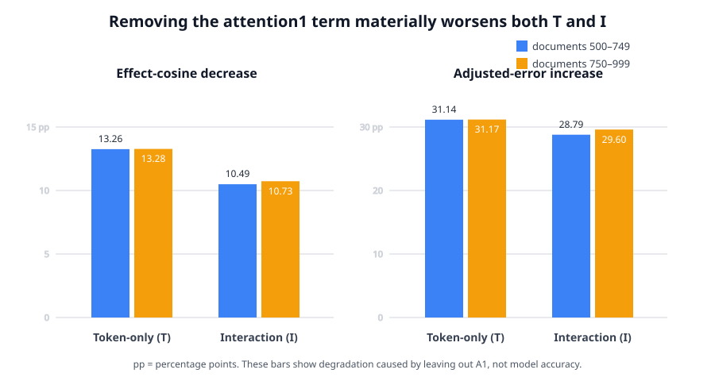

# Full update since 02:19: from native modules to an attention1→MLP1 causal dependency — updated 2026-09-02 15:33 UTC

## Goal

The goal is to replace the model with an executable description made of meaningful computations. We do not assume
that one attention head, one MLP, one low-rank direction, or one weight coordinate is automatically a circuit.

A useful circuit unit should say what information it reads, what operation it performs, what it writes, and which
later computations use that write. It should predict held-out and shifted inputs, be extractable or sufficient for a
stated effect, support selective removal or editing without changing unrelated computations, be reusable when the
same computation serves several tasks, and remain stable across data splits and harmless changes of coordinates.

Lower rank, fewer stored numbers, quantization, activation reconstruction, and CE loss are useful engineering or
control measurements. They do not by themselves show that we have found a circuit. Since the 02:19 update, no active
experiment has used rank reduction as the discovery target.

## Short version

There are now two main positive results.

First, two attention heads at different layers share an equality-matching computation even though they carry very
different output information. This is a genuine split below the head boundary: the matching rule can be transplanted
between the heads on held-out natural text. Downstream, three MLPs provide a context-dependent correction and two
later modules provide a broader suppressing effect. Attempts to force the three MLPs into one shared internal basis
failed, so they remain distinct causal components rather than a claimed common representation.

Second, the exact token-only (`T`), context-only (`C`), and token-by-context (`I`) parts of MLP0 were followed through
attention1 and MLP1. Categorical token and bigram tables did not explain how later layers use these parts. A sequence
of increasingly strong tests instead found that the real state entering MLP1 predicts the effects of T and I very
well, but not C. Splitting that state into its actual sources then identified attention1's residual-stream write as
the unique named source needed by both T and I. Attention1 alone is not enough, and C also uses attention1, so the
result is a shared causal interface rather than a standalone semantic circuit.

The current GPU experiment is testing that interface directly. It removes attention1 only from MLP1's input, leaves
attention1's direct residual write available to later layers, and compares this narrow edit with deleting attention1
entirely. This can either promote the result to an executable reader path or demote it to a local MLP1-output
attribution.

## 1. Equality/copy behavior was decomposed below the attention-head boundary

The first experiment ran all 16 subsets of four known equality/copy terms from layer5 head5, layer7 head3, layer8
head3, and layer8 head4. At a query position `q`, one of these terms reads a source position `k` only when

`token[q] = token[k-1]`.

This is the relation used by induction-style copying: the current token matches an earlier token, so the head can
read what followed that earlier occurrence. Each complete term is

`equality relation × continuous attention strength × value/output vector`.

The all-subset experiment found real redundancy and cooperation, but it did not find a stable task-specific group of
whole heads. That negative result mattered: the head boundary was too coarse.

The next experiment separated the matching strength from the value/output vector. Keeping layer8 head4's output but
replacing its matching strength with layer5 head5's recovered 112.1% of the native causal effect on held-out natural
text; the bootstrap lower bound was 99.4%. The two matching functions were 83.1% similar, while their output vectors
were only 4.8% similar. The same frozen transplant recovered 91.9% on code, although a stricter code-specific
similarity requirement failed.

The supported interpretation is therefore:

> Layer5 head5 and layer8 head4 reuse a matching computation, but use it to carry different information.

This is the kind of grouping we want: it crosses native module boundaries and is defined by an interchangeable
computation, not by low rank or activation similarity.

## 2. The later equality program has several distinct causal roles

The transplanted matcher and the native matcher both need a later correction. Exact interventions separated this
later computation into:

- MLP8, MLP9, and MLP12, which carry the dependence on repeat distance and whether there is one or more earlier
  match; and
- attention14 and MLP17, which provide a broader suppressing effect.

The three-MLP correction agreed across the native and transplanted matcher sources at about 99.2%. Removing only the
three MLP writes at the current query position predicted full-prefix removal at about 90% correlation on held-out
code, 87% on one natural-text set, and 71–86% on the harder natural set. Changes on unrelated tokens were around
`0.000001–0.000295 nat`, compared with `0.000679–0.007879 nat` on selected target tokens. Thus the current-position
writes are selective causal pieces, not merely correlated activations.

The groups interact, so this is not a claim that the five modules add independently.

## 3. Three attempts to merge the equality MLPs internally failed

Each bilinear MLP receives a 1,152-number input `x`, computes 4,608 products,

`product[j] = (Left[j] x)(Right[j] x)`,

and writes a weighted sum of those products back to the 1,152-dimensional residual stream.

Selecting products by their equality-task effect found 450 terms in MLP8, 426 in MLP9, and 482 in MLP12. Exact
removal aligned 86–89% with the full correction on held-out code, but the same product indices recovered only 12–17%
on natural text and barely beat matched controls.

Two less coordinate-dependent attempts also failed. Sparse mixtures could fit one downstream view at 97–98%
similarity but fell as low as 5.9% on another split or source. A test for two shared input blocks left 34–38% of each
reader outside those blocks, far above its 3% calibrated boundary, and did not beat independently rotated controls.

The honest conclusion is not that the MLPs lack structure. It is that native products, sparse mixtures of those
products, and the tested common-block model do not justify calling parts of MLP8/9/12 the same reusable variable.
Their exact current-position components remain valid but distinct.

## 4. Multi-module interactions depend on the intervention definition

For sequential MLPs, “remove this contribution” has more than one reasonable implementation. One can replace each
write with its value from a run where the equality signal was absent, or subtract a fixed equality-induced write
while later modules recompute on the edited state.

The single-MLP effects agreed between these definitions. Several pair and triple interactions did not; one code
interaction even changed from strongly aligned to strongly opposed. A later one-dimensional removal showed that the
signal direction at each position was effectively one-dimensional, so the disagreement came from nonlinear changes
in magnitude rather than a hidden orthogonal direction.

The resulting rule is simple: a higher-order interaction is not a well-defined circuit object until its intervention
procedure is specified. We keep the robust single-module effects and do not treat one arbitrary interaction table as
the decomposition.

## 5. Attention0 had stable geometry but no stable circuit meaning

An approximation to attention0 used two six-dimensional attention-score factors and a 32-dimensional value/output
factor. Including the constant part of each factor gives `7 × 7 × 33 = 1,617` exact terms in that fitted model.

Those factor coordinates can rotate without changing the function, so the experiment defined directions by their
downstream CE effects. The leading directions of the two score factors reproduced across independent fits with 95.2%
and 98.0% overlap. The value/output direction failed. More importantly, the score directions did not keep the same
meaning across different 32-circuit data views: their worst cross-view similarities were near zero.

This establishes stable sensitivity geometry, not a named circuit. It is a useful warning against assigning semantic
labels merely because a low-dimensional direction is reproducible.

## 6. A numerical reproducibility change was isolated

One older intervention family shifted between processes around 08:02 UTC. Six later processes agree bit-for-bit,
while no relevant file, environment setting, or tested CUDA state explains the transition.

The trust boundary is now explicit. Comparisons made inside one process remain usable. Every new run rebuilds its own
baseline in that process and stores a deterministic fingerprint. Results from opposite sides of the transition are
not compared at small effect sizes without a fresh in-process bridge. This issue did not invalidate the within-run
causal comparisons reported here, but its unknown cause remains recorded.

## 7. MLP0 was split exactly and followed through the next block

MLP0 has an algebraically exact decomposition

`MLP0 write = fixed remainder + T + C + I + S + bias`,

where:

- `T` is the current-token contribution at an average normalization scale;
- `C` is the contextual contribution at that scale;
- `I` is the bilinear token-by-context interaction; and
- `S` is the correction caused by the example's actual normalization scale.

These are parts of the real computation, not learned low-rank approximations.

The 62 stored circuit averages did not cleanly label the parts: member-token effects were comparable to matched
controls and unstable across document halves. We therefore measured the exact immediate computation instead.

The next block was separated into MLP0's direct residual write (`D`), the recomputed attention1 write (`A`), and the
MLP1 write (`M`). Running all eight present/absent combinations gives the seven exact finite contributions

`D, A, D×A, M, D×M, A×M, D×A×M`.

Here `D×A`, for example, means the part of the combined effect that remains after subtracting the individual D and A
effects; it is a finite causal interaction, not a tensor product. The seven-part patterns reproduced across document
halves at 99.97–100.00% similarity. MLP1 alone was the largest average term: 52.6% of absolute path magnitude for T,
75.2% for C, and 59.5% for I. Several MLP1-containing interactions opposed it.

Neither current-token identity nor previous×current-token identity predicted these downstream effects. On 8,292
held-out positions, the old bigram table worsened prediction of T's complete effect by 0.65% and its seven-path
response by 0.74%. A categorical table can explain some MLP0 activation variance without explaining how later layers
use that activation.

## 8. The first MLP1 reader hypothesis passed, then a stronger control corrected it

Let `z_N` be MLP1's real input and `z_b` its input when MLP0 branch `b` is absent. Define

`delta_b = z_N - z_b`.

Because MLP1 is quadratic, its exact output change is

`MLP1(z_N) - MLP1(z_b) = B(delta_b, z_N) - 1/2 B(delta_b, delta_b)`.

`B` is the bilinear computation obtained by applying MLP1's left and right projections, multiplying the corresponding
numbers, and projecting the products back to the residual stream. The first term measures how the branch-induced
change interacts with the real MLP1 input. The second is the exact finite correction, not approximation error.

An initial experiment expressed the same identity using the midpoint `(z_N + z_b)/2` and swapped midpoints between
T, C, and I. It found a bidirectional T–I grouping, and that grouping reproduced on two held-out intervention sets:
T using I's midpoint had 95.5%/95.3% effect-direction agreement, while I using T's midpoint had 97.3%/97.5%.

However, every midpoint contains most of the same large native state. A direct control found that C's midpoint could
predict T as well as I's midpoint, even though the bidirectional graph did not group T with C. We therefore rejected
the interpretation that T and I share a special midpoint. The graph was real; its first explanation was not.

## 9. The corrected T/I-versus-C rule passed held-out intervention tests

The stronger test used the explicit native-state term `B(delta_b,z_N)`. It predicts the downstream effects of T and
I very well but does not adequately predict C:

- T: about 97.3% effect-direction agreement and 23.0% adjusted error;
- I: about 98.1–98.2% agreement and 18.9–19.5% adjusted error;
- C: only 83.7–88.1% agreement and 47.3–54.7% adjusted error.

“Effect-direction agreement” is cosine similarity between per-token CE-effect vectors. One hundred percent means the
two interventions help and hurt exactly the same tokens up to one positive multiplier. “Adjusted error” is the
remaining root-mean-square mismatch after fitting that single multiplier.

The gap between T/I and C passed pre-written minimums in both held-out quarters. The exact quadratic correction also
had the same strict relative-size order in both quarters: `T > I > C`. The correction is large and often opposes the
native-state term, especially for T, so it cannot be discarded.

This is a reproducible branch-specific response rule, but the held-out data are new intervention outcomes on an
already used corpus. It is not yet new-corpus OOD evidence.

## 10. Attention1 is the named source shared by the T and I responses

The phrase “native state” still combined many actual sources. Immediately before MLP1, the experiment wrote the
normalized input as the exact sum of contributions from:

- the embedding and residual skip;
- attention0;
- MLP0's fixed remainder and its T, C, I, and S pieces;
- attention1; and
- a separately retained numerical remainder from bfloat16 operation order.

The summed state had relative squared error `7.18×10^-28`. Bilinearity then gives

`B(delta_b,z_N) = sum_source B(delta_b,z_source)`,

which closed to `2.62×10^-12` relative squared error. This is exact bookkeeping rather than a fitted sparse model.

For each source, the experiment physically inserted that source's response alone and the complete response with that
source removed, then recomputed layers2–17. A source counted as necessary only if removing it materially worsened the
per-token effect, its individual effect was nontrivial, and its same-position write beat 16 controls that moved the
source state to another token position. The selected set had to match in two discovery halves before held-out
source-decomposed interventions were opened.

Every registered check passed. The stable necessary-source sets were:

- T: `{MLP0-I, attention1}`;
- I: `{attention1}`; and
- C, descriptively: `{embedding, MLP0-T, MLP0-I, attention1}`.

Attention1 is therefore the unique named source shared by T and I. This does not mean it is exclusive to them: C also
uses it, but C's full native-state response was already inadequate, so a component inside that failed parent cannot
be called a solution to C.

On held-out interventions, removing attention1's MLP1-response term reduced agreement by 12.5–13.3 percentage points
for T and 9.3–10.7 points for I. Adjusted error increased by 29.2–31.2 points for T and 26.8–29.6 points for I.
Attention1 alone had 75–79% of the complete response's RMS magnitude, but was not sufficient: it still left large
direction and magnitude errors. The numerical remainder was only 0.34–0.42% of the complete T/I write and was never
selected.

The supported statement is:

> Attention1's residual write is a necessary, position-specific input to how MLP1 responds to both MLP0-T and
> MLP0-I, but attention1 alone is not the complete circuit.

## 11. What is running now

Rung492—the next numbered pre-registered experiment—is active on the managed GPU runner as of this update. It asks
whether the attention1→MLP1 connection is an executable reader path rather than only a decomposition of MLP1's
output.

Let `a` be attention1's contribution to the normalized MLP1 input. In both the real trajectory and the trajectory
where one MLP0 branch is absent, the narrow edit computes MLP1 after subtracting `a`. Attention1's residual write is
left in the stream for layers after MLP1. For branch `b`, the edited MLP1 difference must exactly equal

`original MLP1 difference - B(delta_b,a)`.

The experiment compares that narrow reader edit with a true attention1 knockout performed in both trajectories. The
full knockout removes both attention1's input to MLP1 and its direct residual path. Sixteen position-shifted reader
edits are controls. T, C, I, and S are all measured; the experiment must keep the complete supported branch set rather
than assuming in advance that only T and I use the path.

A positive result requires three things:

1. deleting attention1 must materially change the T and I effects, so the parent interpretation remains causal;
2. the narrow MLP1-input edit must reproduce a position-specific part of that change; and
3. it must disturb the native model less than deleting attention1 entirely.

If this fails, the attention1 result remains a local attribution of MLP1's output and is not promoted to a portable
path. If it passes, the next tests are new-corpus/OOD prediction and preservation of unrelated semantic circuits,
followed by a finer decomposition of attention1's two attention-score branches and value/output computation. That
finer work should group pieces by their downstream use across heads, not assume the head itself is the correct basis.

## 12. Rung492 result: attention1 is causally important, but the proposed narrow reader path is wrong

Rung492 finished after the original 15:10 publication. Its first result strengthens rung491: actually removing
attention1 changes the T branch effect by 5.82 and 5.94 times the size of T's normal effect in the two document halves.
For I the ratios are 1.78 and 1.73. The changes also point positively along the original branch effects. Thus
attention1 is not merely correlated with the MLP1 response; both T and I genuinely depend on it upstream.

The proposed narrow path nevertheless failed. The experiment subtracted attention1's normalized-state contribution
only at MLP1's input, in both the normal and branch-absent runs, while leaving attention1's direct residual write in
place. If that edit isolated a portable reader edge, its change in the branch effect should point in the same
per-token direction as a true attention1 knockout.

It did not. For T, the cosine between those two changes was `.423` and `.416` in the two halves, leaving about 91% of
the true knockout pattern unexplained even after fitting one overall scale. For I the cosine was `-.006` and `.017`,
which is effectively no agreement. The same-position edit also lost to the best of sixteen shifted-position controls
for every branch. This is the most important diagnostic: the narrow edit caused a large perturbation, but not the
position-specific computation attributed to attention1.

The likely reason is that `z-a`—the MLP1 input state `z` with the attention1 part `a` subtracted—is not a state the
network naturally produces. MLP1 is quadratic, so an unnatural input can create a large effect even when the
algebraic decomposition is exact. Rung492's identity and BF16 reconstruction checks passed; this is therefore not a
numerical failure. It is a causal-intervention failure.

The corrected interpretation is:

> Attention1 is a real upstream dependency of the T and I responses, and its contribution to MLP1's output can be
> attributed exactly. That does not make “attention1's part of the MLP1 input” an independently executable circuit
> edge. Its effect travels through a coupled route containing the direct residual write and downstream recomputation.

This distinction matters for the project goal. Exact decomposition is useful bookkeeping, but circuit extraction
requires an intervention which follows the model's real computation and makes held-out causal predictions.

## 13. Current experiment: does the model progressively merge T and I between attention1 and MLP1?

Rung493 uses an independent clue from the exact response geometry. The fraction of the T and I response vectors that
is common to both grows with depth: approximately 51% at attention1, 62% for MLP1's direct write, and 79% for MLP1's
total response. This might mean the model progressively converts two distinct upstream effects into one shared
downstream variable. It could also be a non-causal change of scale, so the percentages alone are not treated as a
circuit result.

The new intervention avoids the unnatural subtraction used in rung492. If `Y_T` and `Y_I` are the real writes made
when T or I is absent, it gives both trajectories their arithmetic mean `(Y_T+Y_I)/2`. The mean lies on the line
segment between two states the model actually produced. The test is run at attention1 with MLP1 allowed to recompute,
at attention1 while keeping the original MLP1 write so that only the direct residual route changes, and at MLP1
itself.

The final quantity being tested is also causal. Let

`x = CE(T absent) - CE(I absent)`

be the original per-token difference between the two branch effects, and let `y` be that difference after making the
two writes equal. The intervention removes `r=x-y`. We measure `<r,x>/||x||^2`, the fraction removed specifically in
the direction of the original T-versus-I distinction. A large unrelated disruption does not score well on this
measure, which directly addresses rung492's failure mode.

All six pairs among T, C, I, and the small residual branch S are tested. T/I must be uniquely strongest both in the
old write-space depth gradient and in the physical final-loss effect; it must also beat sixteen position-shifted
controls in both document halves. This prevents a generic early-layer perturbation from being renamed a T/I circuit.

As of 15:33 UTC, rung493 is active through the managed GPU runner. If it passes, the next step is a cross-corpus test
on natural text and code with no exact or short-prefix overlap with the current documents, plus explicit preservation
of unrelated semantic circuits. If it fails, the 51%→62%→79% pattern remains a description rather than a circuit
boundary. The main alternative then becomes an exact decomposition of attention1's two score factors and
value/output computation across heads, grouping pieces by downstream use rather than by native head identity.

## What now stands

The strongest supported objects since 02:19 are:

- a reusable equality-matching computation shared across two native attention heads with different outputs;
- distinct, selective downstream equality components in MLP8/9/12 plus a broader attention14/MLP17 suppressor;
- an exact finite T/C/I/S decomposition of MLP0 and its exact next-block causal paths;
- a held-out MLP1 response rule that groups T and I but separates C; and
- attention1's write as the unique named input necessary for both the T and I MLP1 responses; and
- causal confirmation that removing attention1 changes both responses, together with a negative result showing that
  its normalized-state contribution is not a portable attention1-to-MLP1 reader edge.

The important negative results are equally constraining: whole heads were too coarse; the tested common internal MLP
bases did not transfer; stable attention0 geometry lacked stable circuit meaning; token and bigram tables did not
predict downstream MLP0 use; local derivatives did not predict complete branch removals; and the original T/I
midpoint interpretation was rejected by a stronger common-state control.

The program is therefore making progress through grouping, splitting, held-out prediction, and physical
interventions—not through rank reduction. The active stopping condition remains a predictive, composable, and
selectively manipulable tensor program for the model, not the completion of any one experiment or explanation.
