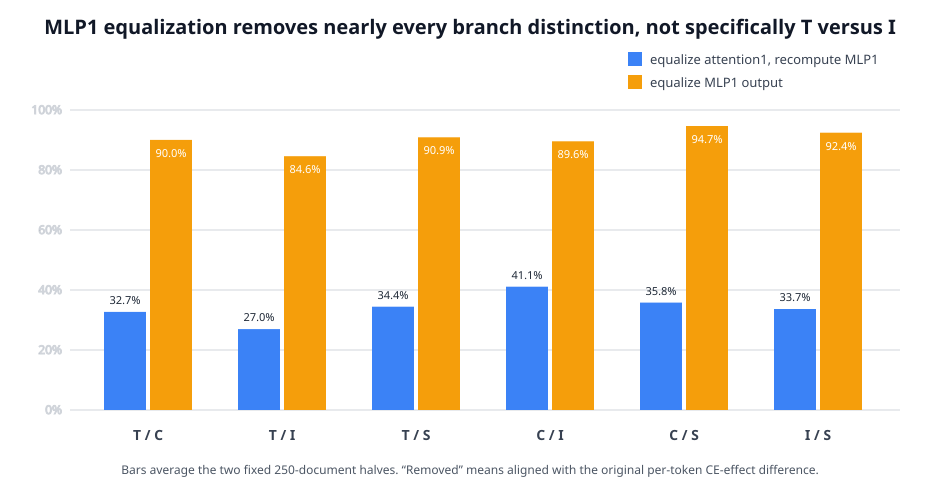
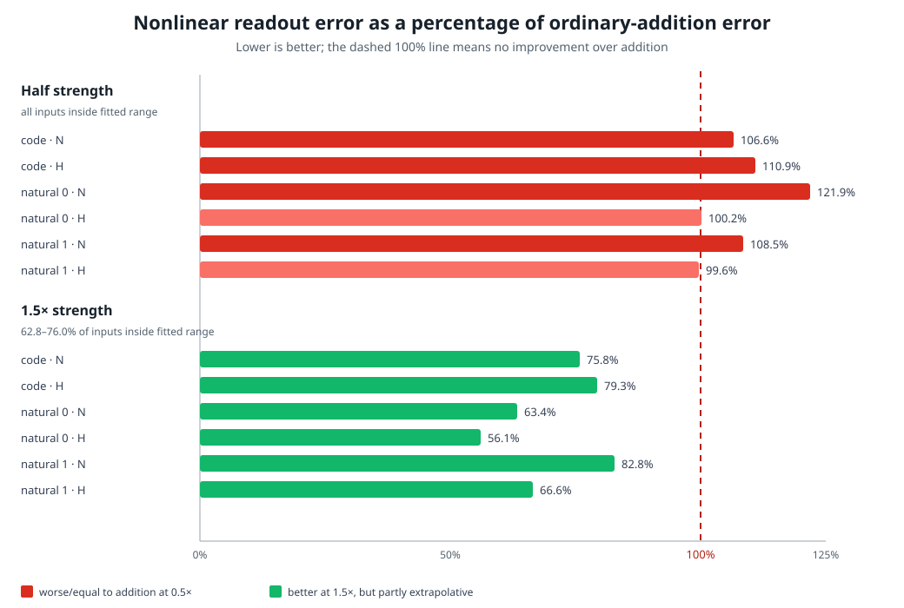

# Full update since 02:19 through rung495 — 2026-09-02 16:01 UTC, updated 16:15 UTC

## Goal

The overall goal remains a smaller executable tensor program whose pieces correspond to computations in the model.
Those pieces should predict fresh and shifted text, compose predictably, support selective removal or replacement,
remain stable under reasonable changes of basis and data split, and eventually reduce literal storage or compute.
Lower rank, quantization, or low reconstruction error alone does not meet that goal.

The detailed chronology through rung492 is in the earlier
[full explanation since 02:19](explanation_2026-09-02_1510.md). This file gives a compact account of that whole
period and then explains the new rung493 and rung494 results and the computation now being implemented in rung495.

## 0. What changed since 02:19

The main line stopped treating an attention head or MLP as the automatic unit of explanation.

1. **A matching computation was shared across heads.** Layer5 head5's equality-matching score could drive layer8
   head4's own output and recover 112.1% of its held-out natural-text effect. Their output vectors were only 4.8%
   similar. This is evidence that different heads can reuse the same read operation while carrying different
   information.
2. **The later equality computation split into several roles.** MLP8, MLP9, and MLP12 supply a context-dependent
   correction at the current query position. Attention14 and MLP17 supply a broader suppression. The individual
   current-position MLP effects transferred, but attempts to give the three MLPs one shared set of native products,
   sparse mixtures, or input blocks failed on natural text or held-out views.
3. **Attention0 has a compact continuous description but not named parts.** A fitted `score1 × score2 × output`
   model retained 98.5% of the relevant signal and about 99.3% of six downstream responses. Some response directions
   reproduced across fitting restarts, but their meanings did not transfer across downstream circuit views. It is a
   good function approximation, not yet a circuit decomposition.
4. **MLP0 was split exactly.** `T` depends on current-token identity, `C` on continuous context, `I` is their
   bilinear interaction, and `S` is the correction for the input's actual normalization scale. Shapley attribution
   assigns 1.498 nat to T, 0.418 to C, 1.538 to I, and 0.067 to S. Literal deletion from the complete computation is
   much smaller—0.0817, 0.0543, 0.1255, and 0.0008 nat—because T and I overlap and interact. These are different
   definitions of importance, not contradictory measurements.
5. **Token labels did not explain downstream use.** Current-token and previous-token/current-token tables did not
   predict how attention1 and MLP1 use the exact MLP0 branches. Finite interventions showed that the branch effects
   become more similar through MLP1, but local derivatives did not predict complete removal well enough.
6. **Attention1 is a real shared dependency, but the narrow extracted edge failed.** Removing attention1 strongly
   changed both T and I effects. An exact decomposition also showed that attention1's write is necessary to MLP1's
   response to both. But subtracting only the attention1 component from MLP1's input produced the wrong token-level
   effect, especially for I. The exact algebra was right; the edited state was not a naturally produced state.
7. **Stable geometry repeatedly failed stronger causal tests.** This is now a central constraint. A proposed group
   must predict a new physical intervention, not merely have high cosine, low reconstruction error, low rank, or a
   reproducible coordinate system.

## 1. The proposed progressive T/I merge failed

MLP0 has already been separated exactly into four output contributions. T is the part determined by token identity;
C is the context-only part; I is the token-by-context interaction; and S is the small change caused by normalization.
Earlier measurements found that T and I looked increasingly similar between attention1 and MLP1. Rung493 asked
whether that similarity corresponded to a causal merge.

For any pair of branches `p,q`, the experiment captured the writes produced when p or q was absent:

`Y_p = site write with p absent`, and `Y_q = site write with q absent`.

It then gave both trajectories their arithmetic mean `(Y_p+Y_q)/2`. This was done in three ways:

1. equalize the attention1 writes and let MLP1 recompute normally;
2. equalize attention1's direct residual contribution while retaining the original MLP1 write; and
3. leave attention1 unchanged and equalize the MLP1 writes.

Let `x=CE(p absent)-CE(q absent)` be the original per-token difference between the branches' final effects. If `y` is
the difference after equalization, then `r=x-y` is the part removed by the intervention. The reported aligned fraction
is `<r,x>/||x||²`. A value of100% means the intervention removes the original distinction in its own direction. A
large unrelated perturbation does not automatically score highly.

The attention1 intervention did not pass. For T/I it removed only26.2% and27.7% in the two document halves. Its
cosine with the original T/I difference was only`.388/.393`; 96.6–97.1% of the original RMS contrast remained; and
the same-position advantage over16 shifted-position controls was only`.046/.048`, below the registered`.10` bar.

The surprising result occurred at MLP1. Equalizing the two MLP1 writes removed84–95% of the original distinction for
**every** pair, including pairs involving S:

T/I is therefore not special. C/I is actually the strongest pair under the physical attention1-versus-MLP1
comparison. The old 51%→62%→79% T/I similarity gradient remains a correct geometric measurement, but it does not
identify a causal T/I merge.

The supported interpretation is narrower:

> MLP1's output is a common bottleneck through which all four MLP0 branch distinctions reach later layers. Making
> any two MLP1 outputs equal nearly erases their downstream difference. This does not tell us that those branches
> compute the same variable.

This negative result matters because it is the third recent example where exact or stable geometry failed to imply a
selectively executable circuit. We now require a proposed decomposition to predict a new physical intervention, not
merely have a stable vector overlap.

## 2. The independent causal-composition rule also failed at the intended scale

The main MLP0-to-MLP1 route has reached a clean negative boundary, so the next experiment returns to an independent
equality-circuit result. Three MLP components—MLP8, MLP9, and MLP12—jointly change a later attention query. Their
combined effect is nonlinear: adding the three individually measured CE effects does not reproduce pair or triple
interventions.

A previous CPU analysis found a more specific rule. At each selected query occurrence, define the scalar index for a
subset S as the sum of its measured singleton effects:

`x_S = sum of the MLP8, MLP9, and MLP12 singleton effects included in S`.

Fit a non-decreasing one-dimensional function `h_t` from this index to the actually measured effect of each of the
eight subsets, including the empty subset. When one pair was hidden during fitting, this function predicted that
pair22–39% better than direct addition in all six natural/code and model-source conditions. That could still be an
eight-point interpolation trick.

Rung494 tested the rule causally using interventions the fit had never seen. For each MLP component it applied half of
the normal query-product change and1.5 times that change. The curve predicts

`predicted effect = h_t(lambda × singleton effect)`, for `lambda=.5 or1.5`.

The direct-addition baseline predicts only `lambda × singleton effect`. Sixteen controls apply another query
occurrence's fitted function to the current scalar input. Thus a pass requires the occurrence's own nonlinear
readout—not generic smoothing—to predict the new intervention.

Every baseline and all seven ordinary subset interventions were recomputed in the same process because earlier work
found that very small CE differences are not safe to compare across separate GPU processes. The run uses three fixed
document sets, two already defined model sources, both48-document halves, and exactly4,266 model forwards.

A positive result required at least15% lower median absolute error than addition and at least10% lower error than the
best end of the shifted-readout controls in every condition. Half-strength and1.5× interventions were scored
separately.

The half-strength result was a systematic failure. The nonlinear function's prediction error was 99.6–121.9% of
ordinary addition's error across the six data/source conditions. All inputs were inside the fitted range, so this is
not an extrapolation problem: small interventions are approximately additive, and the fitted nonlinear function
does not help.

At 1.5× strength the nonlinear function did better in all six pooled conditions, with 56.1–82.8% of addition's
error. That is an interesting large-change effect. However, only 62.8–76.0% of these inputs were inside the fitted
range; the function used its constant endpoint outside that range. One fixed natural-text/model-source half also
lost to addition, with a 107.2% error ratio. The registered result is therefore A=true, B=false, C=true, D=false,
E=false and a strong null.

The supported interpretation is:

> The earlier leave-one-subset-out success did not become a causal interpolation law. These three MLP effects are
> approximately additive for small changes. A one-dimensional nonlinear description becomes useful only for larger
> changes, where the present test partly relies on saturation outside its fitted range.

We keep that large-change clue, but it does not identify a reusable circuit or justify a shared readout.

## 3. What is being implemented now: split attention1 below heads and group by downstream use

Rung495 changes the object rather than tuning rung494. Attention1 has nine heads. At query position `i`, head `h`
writes

`sum over earlier j of score1[h,i,j] × score2[h,i,j] × output_value[h,j]`.

`score1` is the dot product of the first normalized query and key vectors. `score2` is the same computation using the
second query and key vectors. `output_value` is the value vector after the head's output matrix maps it into the
1,152-dimensional residual stream.

For each exact MLP0 branch removal, the experiment will capture those three quantities in the normal and
branch-absent runs. It evaluates all eight choices of taking each quantity from the normal or absent run. Subtracting
the lower-order choices gives seven exact finite pieces for each head:

`score1`, `score2`, `output`, `score1×score2`, `score1×output`, `score2×output`, and the three-way interaction.

Across nine heads that is 63 pieces. Their sum must exactly reconstruct the complete change in attention1's write.
The head number records provenance only; it is not assumed to be the final basis.

The seven-term decomposition is exact at attention1's raw residual-stream write. An implementation check caught an
important boundary before downstream results were opened: the model normalizes the sum of the incoming residual and
attention1's write before MLP1. Therefore the 63 raw pieces cannot each be passed independently through MLP1's
quadratic formula and still add exactly. Doing so would omit their shared normalization.

Each piece instead receives a 62-number **downstream-use signature** from the real computation. For each already
catalogued circuit, we take the gradient of its member-versus-matched-control CE with respect to attention1's raw
write and dot that gradient with the exact raw piece. That gradient passes through the actual normalization, MLP1,
the direct residual route, and all later layers. The 63 first-order responses must sum back to the response of the
complete attention-write change. Two pieces from different heads become a candidate shared computation only if
these signatures agree on one document half, predict the second half, beat shuffled-circuit and shifted-position
controls, and then predict the 30 held-out circuit labels on documents500:1000.

This is deliberately a discovery screen. A passing pair would still need a physical two-way swap on held-out natural
text and code. If no pair passes, the next split is inside the two scores themselves—query versus key—because heads
may share only one side of an attention relation. We will not respond by lowering rank or loosening the similarity
thresholds.

The [mathematical review](../THREE_HOURLY_MATHEMATICAL_REVIEW_2026-09-02_1608.md) gives the full tensor indices,
normalization caveat, gauge freedoms, exact MLP1 identity, and why CP/Tucker uniqueness, matrix-product-state
canonical forms, weighted-automaton realization, and polynomial-identity algorithms do not directly solve the real
object. The [rung495 preregistration](../ATTENTION1_DOWNSTREAM_USE_QUOTIENT_RUNG495_PREREGISTRATION.md) freezes the
data split, controls, pass conditions, and null before any downstream-use result is opened.

The durable research goal remains active; neither this explanation nor rung494 is a stopping condition.
