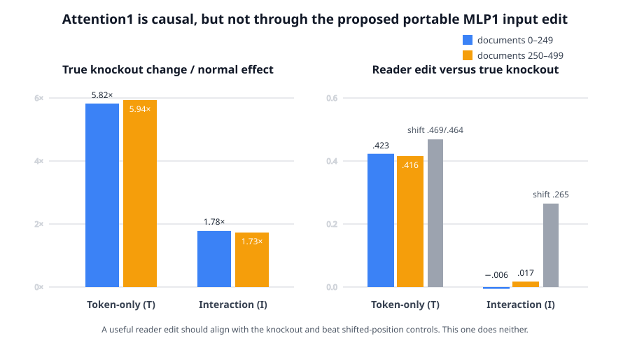
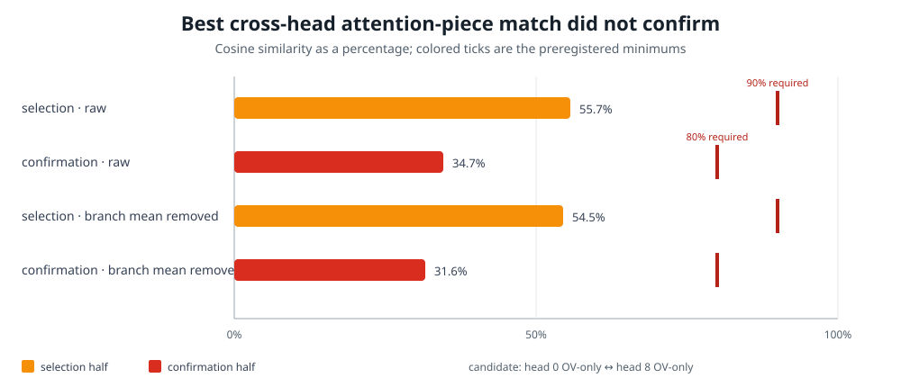

# Full explanation update since 02:19 — 2026-09-02 17:27 UTC

## Goal

We are trying to replace bilin18 with a smaller executable tensor program whose parts are actual computations in the
model. A useful part should specify what it reads, what operation it performs, what it writes, and which later
computations use that write. The same computation should be grouped across heads or MLPs when it is genuinely reused,
while one native head or MLP should be split when its pieces do different jobs.

The evidence we ultimately want is:

1. prediction on held-out and shifted text;
2. an extracted circuit that reproduces the intended computation;
3. selective removal, replacement, or editing without comparable damage to unrelated circuits;
4. predictable composition when several pieces are changed together;
5. stable identification across document splits and harmless changes of internal coordinates; and
6. a literal reduction in stored numbers or computation after the circuit is identified.

Lower rank, quantization, activation reconstruction, or average cross-entropy loss alone does not meet this goal.
Since 02:19, the main experiments have instead asked how to group computation across modules and how to split native
modules into causally different pieces.

## Short answer

The strongest positive result is a shared **matching operation** across two attention heads. Layer5 head5's matching
strength can replace layer8 head4's matching strength while layer8 head4 keeps its own values and output map. This
recovers 112.1% of the held-out natural-text effect even though the two heads' output vectors are only 4.8% similar.
This is direct evidence for “same read operation, different output,” below the native head boundary.

The downstream equality/copy computation then separates into a current-position correction from MLP8, MLP9, and
MLP12, plus broader suppression from attention14 and MLP17. The individual MLP writes are real selective causal
pieces, but three different attempts to find a shared internal representation across the MLPs failed. We should keep
the MLP components separate until a different decomposition predicts a physical interchange.

For MLP0, we followed the exact token-only (`T`), context-only (`C`), token-by-context (`I`), and normalization-scale
(`S`) contributions through attention1 and MLP1. The real state entering MLP1 predicts the effect of T and I very
well but predicts C substantially worse. An exact source decomposition then identified attention1 as the only named
input needed by both T and I. However, subtracting only that input from MLP1 produced an unnatural state and failed
to reproduce a true attention1 knockout. Attention1 is a real dependency, but the proposed narrow
attention1-to-MLP1 edge is not an independently executable circuit.

The most recent completed experiment split each attention1 head into exact score1, score2, value/output, and
interaction changes, then compared how 62 downstream circuits respond to each piece. No piece from two different
heads was similar enough or stable enough to count as a shared variable. The current managed-GPU experiment goes
one level finer: it separates the query and key sides of both attention scores and asks whether different heads share
one input side while combining it with different partners.

## 1. The whole-head equality test said the head boundary was too coarse

The starting object was a known equality/copy computation spread across layer5 head5, layer7 head3, layer8 head3,
and layer8 head4. At query position `q`, the relevant edge points to source position `k` when

`token[q] = token[k-1]`.

In words, the current token matches an earlier token, so attention can read the token that followed the earlier
occurrence. Each head's complete contribution combines:

`equality match × first continuous attention score × second continuous attention score × value/output`.

The first experiment after 02:19 measured all 16 subsets of the four head contributions. It found robust overlap
between the earlier heads and the layer8 heads, but did not find a stable task-specific grouping of complete heads.
This was a useful negative result: it said to split the heads rather than cluster them as indivisible units.

## 2. Splitting matching from output found a reusable computation

The next experiments separated the continuous equality-matching strength from the vector being copied. Keeping
layer8 head4's own values and output map, but replacing its matching strength with layer5 head5's, recovered 112.1%
of layer8 head4's held-out natural-text causal effect. The bootstrap lower bound was 99.4%.

The two matching functions were 83.1% similar, while the output vectors they wrote were only 4.8% similar. On held-out
code the same frozen transplant recovered 91.9%, although it missed one stricter code-specific similarity condition.

This supports a precise interpretation:

> Layer5 head5 and layer8 head4 reuse a matching computation, but combine it with different carried information and
> different outputs.

That is a real cross-head grouping. It is defined by interchangeability on held-out examples, not by rank or weight
similarity.

## 3. The later equality computation separates into different roles

Interventions downstream of the matcher found two broad roles:

- MLP8, MLP9, and MLP12 provide a context-dependent correction at the current query position. Their effects depend
  on repeat distance and on how many earlier matches exist.
- attention14 and MLP17 provide broader suppression. MLP17 in particular can oppose the direct correction strongly.

The three-MLP correction agreed across the native and transplanted matching sources at about 99.2%. Removing just
the three MLP writes at the current query position predicted the complete prefix-removal effect at about 90% on
held-out code, 87% on one natural-text set, and 71–86% on the harder natural set. Changes at unrelated token positions
were much smaller than changes at selected equality positions.

The modules do not simply add: pair and triple effects depend on which legal intervention is used. The robust claim
is therefore about the selective individual current-position components and their two broad roles, not about one
fixed additive five-module circuit.

## 4. Three attempts to merge MLP8, MLP9, and MLP12 internally failed

Each bilinear MLP takes a 1,152-number residual-stream vector `x`, computes 4,608 products

`product[j] = (Left[j] · x) (Right[j] · x)`,

and maps those products back to the 1,152-number residual stream.

Selecting native products by their equality-task effect found 450 products in MLP8, 426 in MLP9, and 482 in MLP12.
Those selections reproduced 86–89% of the full correction direction on held-out code, but only 12–17% on natural
text. Sparse mixtures of products fit one downstream view at 97–98% similarity but fell as low as 5.9% on another
view. A coordinate-independent common-input-block test also failed: 34–38% of each reader remained outside the
proposed blocks, compared with a pre-written 3% limit.

So the equality-relevant MLP writes are causal and selective, but native products, sparse product mixtures, and the
tested common input blocks do not identify one representation shared across all three MLPs.

## 5. Attention0 has a compact continuous approximation, but not named circuit parts

Earlier work approximated attention0 using two six-dimensional attention-score factors and a 32-dimensional
value/output factor. Including constant terms produces `7 × 7 × 33 = 1,617` terms. This approximation retained
98.5% of the routed signal and about 99.3% of six downstream response measurements.

When the coordinates were defined by their downstream effect, the leading score directions reproduced across
independent fits at 95.2% and 98.0%. But their meanings did not survive different downstream-circuit views: the
worst cross-view agreement was close to zero. This is stable function geometry, not yet a semantic or executable
circuit decomposition.

## 6. MLP0 now has an exact functional split

MLP0's write is separated algebraically as

`fixed remainder + T + C + I + S + bias`,

where:

- `T` is the part determined by current-token identity at an average normalization scale;
- `C` is the context-only part at that scale;
- `I` is the centered token-by-context bilinear interaction; and
- `S` is the small correction from the example's actual normalization scale.

These terms sum back to the deployed MLP0 computation; they are not learned low-rank approximations. They also show
why one number called “importance” is misleading. Fairly dividing all interactions among branches assigns about
1.498 nat to T, 0.418 to C, 1.538 to I, and 0.067 to S. Deleting one branch from the complete computation adds only
0.0817, 0.0543, 0.1255, and 0.0008 nat respectively. The values differ because T and I overlap and interact strongly.

The next block was then measured as three pieces: MLP0's direct write (`D`), the recomputed attention1 write (`A`),
and the MLP1 write (`M`). All eight present/absent combinations give seven exact finite terms:

`D, A, D-with-A interaction, M, D-with-M interaction, A-with-M interaction, three-way interaction`.

The seven-term patterns reproduce across document halves at 99.97–100.00% similarity. MLP1's individual term is the
largest average contribution, but several interactions containing MLP1 oppose it. Current-token and
previous-token/current-token lookup tables failed to predict the per-token downstream effects. Token identity alone
therefore does not explain how later layers use the exact MLP0 branches.

## 7. Local derivatives were too weak; an exact finite MLP1 rule survived

Several local derivative tests failed to predict complete MLP0 branch removals. We then used MLP1's exact quadratic
form. Let `z_N` be MLP1's real input and `z_b` its input when branch `b` is absent, with

`delta_b = z_N - z_b`.

For the symmetric bilinear form `B` implemented by MLP1, the exact output difference is

`MLP1(z_N) - MLP1(z_b) = B(delta_b, z_N) - 1/2 B(delta_b, delta_b)`.

The first term says how the branch-induced change interacts with the real input state. The second term is the exact
finite correction. It is not approximation error.

On prospective held-out intervention outcomes, the first term predicted T and I much better than C:

- T: 97.3% effect-direction agreement and about 23.0% adjusted error;
- I: 98.1–98.2% agreement and 18.9–19.5% adjusted error;
- C: 83.7–88.1% agreement and 47.3–54.7% adjusted error.

Here 100% agreement means the two interventions help and hurt the same token positions up to one positive scale.
Adjusted error is the remaining root-mean-square mismatch after fitting that one scale. The T/I-versus-C gap and the
strict size ordering of the finite corrections, `T > I > C`, both reproduced in two held-out quarters.

This is a held-out rule about intervention effects, not a compression or a standalone circuit.

## 8. Attention1 is necessary to both the T and I responses

The real state `z_N` was next expanded into actual sources: embedding/residual skip, attention0, the fixed MLP0
remainder, MLP0's T/C/I/S pieces, attention1, and a separately retained BF16 numerical remainder. Their sum matched
the state to `7.18×10^-28` relative squared error. Bilinearity then split `B(delta_b,z_N)` into one exact term per
source with `2.62×10^-12` relative squared error.

Physical singleton and leave-one-source-out interventions found these stable necessary-source sets:

- T needs `{MLP0-I, attention1}`;
- I needs `{attention1}`; and
- C descriptively uses `{embedding, MLP0-T, MLP0-I, attention1}`, although C's complete parent prediction had already
  failed and is not promoted to a circuit claim.

Removing attention1's term reduced held-out agreement by 12.5–13.3 percentage points for T and 9.3–10.7 points for
I, while increasing adjusted error by roughly 27–31 points. Removing attention1 from the actual network changed T's
effect by 5.8–5.9 times its normal size and I's by 1.73–1.78 times. Attention1 is therefore a real shared dependency,
not merely a correlated direction.

But attention1 alone is insufficient. Its isolated term has 75–79% of the complete response's RMS size and still
leaves large direction and magnitude errors.

## 9. The proposed narrow attention1-to-MLP1 path failed physically

The next intervention subtracted attention1 only from MLP1's input while leaving attention1's direct residual write
available to later layers. If the exact source term were an independently executable reader edge, this narrow edit
should reproduce a true attention1 knockout.

It did not. For T, the two changes agreed by only 42.3% and 41.6% across the document halves, leaving about 91% of the
knockout pattern unexplained after rescaling. For I the agreement was -0.6% and 1.7%, effectively zero. The intended
token position also lost to shifted-position controls for every branch.

The algebra was exact; the problem is causal. Removing one component from a normalized MLP1 input creates a state
the model does not naturally produce. The supported claim is therefore local: attention1 is necessary to how MLP1
responds to T and I, but the extracted normalized-state term is not a portable attention1-to-MLP1 circuit edge.

A separate portability test reached the same boundary at MLP1's output. Reinstalling each example's own MLP1 write
restored 95.6–96.3% of its effect, but transplanting a matched write from another example was harmful: recovery was
about -89% to -92% for T and -21% for I, where negative means worse than installing nothing. MLP1 is a sensitive
site, not a context-independent interface that can be carried between examples.

## 10. The apparent T/I merge at MLP1 was a generic bottleneck

The similarity shared by T and I appeared to grow from about 51% at attention1 to 62% at MLP1's direct write and
79% in MLP1's full downstream effect. A physical test made the real T-absent and I-absent writes equal at attention1
or MLP1 and measured how much of the original T-versus-I loss difference disappeared.

At attention1, only 26.2–27.7% of the T/I distinction was removed, with weak agreement and almost no advantage over
shifted-position controls. At MLP1, 84–95% was removed—but the same happened for every branch pair, including pairs
with the tiny S branch. MLP1 is therefore a generic downstream bottleneck, not a special T/I merge boundary.

This retires the 51%→62%→79% pattern as a circuit claim. It remains a correct geometric observation.

## 11. A one-dimensional composition rule failed at the scale where it was supposed to work

MLP8, MLP9, and MLP12 have nonlinear pair and triple effects. A previous leave-one-subset-out analysis suggested
that their joint effect might depend only on the sum of their three individual effects, followed by a monotone
one-dimensional readout. That rule predicted one omitted subset 22–39% better than addition in six conditions.

A causal test applied half and 1.5 times each component's normal query-position change. At half strength, the
nonlinear rule had 99.6–121.9% of ordinary addition's error: it never reliably improved on addition, even though all
inputs lay inside its fitted range. At 1.5 times strength it did better in pooled conditions, with 56.1–82.8% of
addition's error, but much of that region lay outside the fitted range and one fixed document half failed.

An architecture-motivated two-point quadratic rule,

`effect(lambda) = a lambda + b lambda^2`,

also lost to addition at half, 1.5, and a new 2 times strength. We keep the qualitative fact that large interventions
saturate, but neither scalar rule identifies a reusable circuit or predicts the response curve.

## 12. Splitting attention1 below heads produced a clean negative result

Each of attention1's nine heads has two attention scores and one value/output path. At query position `i` and source
position `j`, its raw residual-stream contribution is

`score1[h,i,j] × score2[h,i,j] × output_value[h,j]`.

For each MLP0 T/C/I/S removal, the experiment used the normal and branch-absent versions of those three quantities
and evaluated all eight combinations. Inclusion–exclusion gives seven exact changes per head: each individual factor,
each pairwise interaction, and the three-way interaction. Across nine heads this gives 63 pieces which sum exactly
to the complete change in attention1's raw write.

For each piece, we differentiated each of 62 downstream circuit losses with respect to the complete attention1 raw
write, through the real normalization, MLP1, residual path, and later layers. Dotting that gradient with the piece
produces its signed downstream-use fingerprint. This is a first-order screen of which later circuits use the piece;
it is not yet a finite interchange.

The first run mistakenly performed the cancellation-heavy inclusion–exclusion arithmetic in BF16 and failed its
pre-written exactness limits. It was preserved as an invalid instrument. Repeating only that algebra in float32 made
the endpoint, 63-piece, and downstream-response closure errors `2.7×10^-14`, `6.3×10^-12`, and `3.7×10^-13`.

The lawful result was a strong null. The best cross-head match was the output/value-only change from head0 and head8.
Their downstream-use agreement was 55.7% on the selection documents and fell to 34.7% on confirmation, far below
the required 90% and 80%. Best-scaled residual errors were 83.0% and 93.8%, where lower is better. Validation was
correctly left unopened.

This does not restore the head as the correct basis. It says that complete score1, score2, value/output, and their
interaction changes do not expose a stable shared variable across heads under the current downstream tests.

## 13. What is running now: split both attention scores into query and key sides

One attention score is a dot product between a query-side vector and a key-side vector. Two heads could read the
same query feature but compare it with different key features, or share a key feature while producing different
outputs. The previous experiment kept each whole score together and could miss this.

The current experiment treats every head as five factors:

`Q1, K1, Q2, K2, V`.

For each MLP0 branch removal it evaluates all 32 normal-versus-branch-absent factor combinations. The 31 nonempty
finite interaction terms are divided equally among the factors involved. For example, a `Q1 × K1 × V` interaction
contributes one third to Q1, one third to K1, and one third to V. This symmetric accounting is the Shapley allocation;
the five allocated pieces sum exactly to the complete attention-write change.

Because that allocation is a convention, a candidate must also agree in two direct measurements:

- change the factor first, while all four partners remain branch-absent; and
- change the factor last, after all four partners are already normal.

The experiment compares query sides with query sides and key sides with key sides across different heads. It never
compares private 128-dimensional coordinates directly, so compatible query/key rotations cannot change the result.
Selection uses documents 0–249; the pair is frozen on documents 250–499; shifted circuit labels and shifted token
positions are controls; and documents 500–999 plus 30 further circuits open only after the discovery conditions pass.

As of this explanation, this numbered experiment (rung496) is live through the managed GPU runner. It has no model
result yet. A pass would identify a candidate shared query or key side and would immediately require a finite physical
interchange. A failure would close this particular attention-side fingerprint route and move to an
intervention-defined grouping across module boundaries rather than another rank or similarity sweep.

## What now stands

The strongest supported circuit statements since 02:19 are:

- layer5 head5 and layer8 head4 share an interchangeable equality-matching computation while carrying different
  output information;
- MLP8/9/12 provide selective current-position equality corrections, while attention14/MLP17 provide broader
  suppression;
- MLP0 has an exact T/C/I/S functional decomposition and an exact finite path decomposition through attention1 and
  MLP1;
- the native-state part of MLP1's finite response predicts T and I much better than C on held-out intervention
  outcomes; and
- attention1 is the unique named state source necessary to both T and I responses, but is not sufficient and does
  not define a portable normalized-state edge.

The most important boundaries are equally useful:

- whole attention heads are too coarse for the equality matcher;
- no tested product, sparse-mixture, or common-block basis merges the three equality MLPs across data views;
- stable attention0 directions do not keep a stable downstream meaning;
- token and bigram tables do not predict how later layers use MLP0;
- local derivatives and exact output decompositions do not automatically survive finite physical edits;
- MLP1's apparent branch merge is generic, and its writes do not transplant between examples; and
- complete attention1 score/value pieces are not stable shared variables across heads.

The program has not achieved its stopping condition. Rung496 is live, and its registered outcome already determines
the next concrete branch: physical interchange after a pass, or a finite intervention-defined cross-module quotient
after a null. We will not stop at the explanation or at an empty queue.
