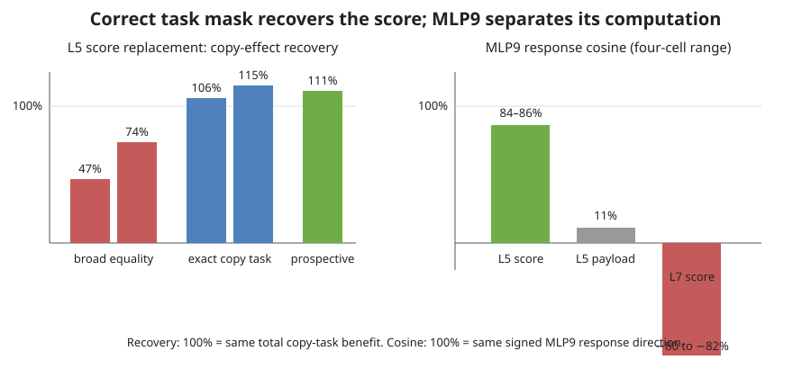

# Update after the 17:48 explanation — 2026-09-02 18:19 UTC

## What changed

We now have a useful positive result about how a downstream layer recognizes a shared attention computation, plus two
carefully preserved failures that explain why the positive needed the right measurement.

Rung498 used one common table of finite actions: remove layer8 head4's equality term, restore it, replace its matching
score, replace its value/output contribution, and combine those changes with removal of the earlier donor term. The
implementation was exact, but the task mask was too broad. It called every position with an earlier equal token
“positive,” even when the token following the nearest match was not the current next-token target. Under that broad
mask, the known layer5-head5 score replacement restored only46.5% and73.9% of the layer8-head4 benefit in the two
halves, so Rung498 correctly failed its written gate and left validation unopened.

A CPU diagnosis then used the exact copy-task definition from the original positive result: the token after the
nearest earlier occurrence must equal the current target. On that subset, the same already-collected actions restored
106–118% of the effect with90–93% agreement across documents. This did not change Rung498's verdict; it identified a
task-definition mismatch and justified a new prospective run.

Rung499 tested the corrected definition only on the previously uncomputed500 documents. The score replacement again
restored106–119% of the copy benefit with91–96% document-level agreement. However, the nine general downstream
circuit coordinates with enough copy examples could not consistently distinguish the matching score from the
value/output replacement. The copy computation was real, but the generic circuit battery was the wrong observation
basis for separating these two mechanisms.

Rung500 therefore used a specific downstream reader chosen independently in earlier work: the1,152-number write from
MLP9. This produced a full prospective pass. The MLP9 response to the layer5 score replacement matched the native
layer8 response at84–86% cosine. The layer5 payload replacement was only11% similar, and the wrong layer7 score was
80–82% anti-aligned. Removing the earlier layer5 contribution barely changed the relation: the two background
responses agreed at94–95%. Copy positions also exceeded non-copy positions by23–25 percentage points.

## Interpretation

This is an interaction-determined basis in a concrete sense. We are not declaring an attention head to be one unit,
and we are not grouping components because their weights or activations look alike. We split each head into its
matching score and its value/output contribution, replace those parts physically, and ask how a later computation
responds. MLP9 treats layer5 head5's matching score like layer8 head4's matching score, while treating the same head's
payload as a different thing.

The supported statement is:

> Layer5 head5 and layer8 head4 share a copy-matching score computation that MLP9 reads in the same way, while their
> carried/output information remains distinct.

This still is not a compressed model or a complete extracted circuit. The next registered step is a directed search
among the four known equality-score components. It will use both copy-task behavior and MLP9 response, keep the known
positive and negative as live controls, and require selection/confirmation plus conditional validation. A one-way
edge will mean that one score can supply another; only a verified two-way relation can mean operational equivalence.
