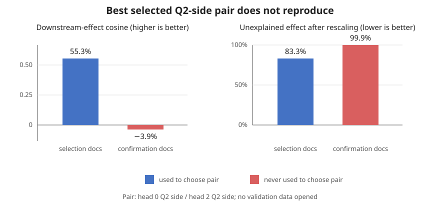
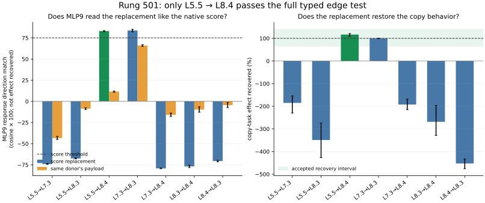
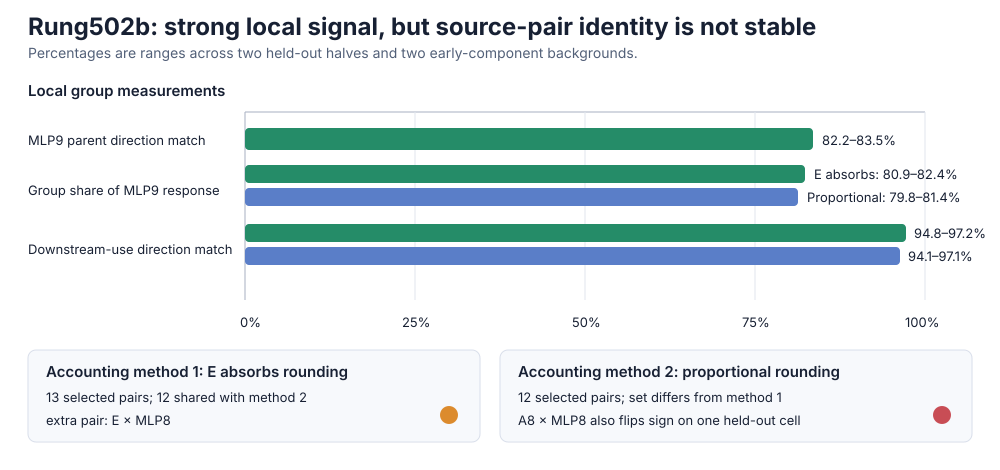

# Full explanation update since 02:19 — 2026-09-02 19:22 UTC

## Goal

We want to replace bilin18 with a smaller executable account of what the model computes. The useful units need not be
whole attention heads or whole MLPs. We want to group pieces from different modules when later computation treats them
as the same thing, and split one module when its pieces do different jobs.

A proposed circuit should eventually satisfy all of these tests:

1. predict its behavior on held-out examples and shifted data;
2. be extractable as an explicit computation;
3. survive a direct removal, replacement, or edit test;
4. leave unrelated computations mostly intact when changed;
5. compose predictably with other circuit pieces; and
6. reduce stored numbers or executed work after the computation has been identified.

Low rank, quantization, activation reconstruction, or low average CE loss alone cannot establish these properties.
They can be useful engineering tools after circuit identity is known, but they are not our definition of
interpretability.

## Short version

Since 02:19, the strongest positive result is that layer 5 head 5 and layer 8 head 4 share a **copy-matching score
computation**, even though they carry and write different information. Replacing only layer 8 head 4's attention score
with the layer 5 score restores its copy behavior, and MLP9 responds to the replacement like it responds to the native
score. This is a real grouping below the whole-head boundary.

The model then uses that matching result through several different downstream roles. MLP8, MLP9, and MLP12 provide
current-position corrections; attention14 and MLP17 provide broader suppression. Attempts to find one common internal
basis across the three MLPs failed, so those MLP writes should remain separate for now.

MLP0 was split exactly into token-only, context-only, token-by-context, and normalization-scale terms. Following those
terms through attention1 and MLP1 found a real shared dependency: attention1 matters to both the token-only and
token-by-context responses. But a narrow edit at MLP1 did not reproduce a true attention1 removal, so this dependency
is not yet a portable circuit edge.

Two finer attempts to group attention1 across heads also failed: first splitting each head into its two scores and
value/output path, then splitting each score into query and key sides. The selected similarities did not reproduce on
held-out documents. This does not vindicate whole heads; it says these two proposed below-head coordinate systems did
not identify stable shared variables.

The newest direction uses the known copy-score replacement as a controlled input and asks which **pairs of real input
sources inside MLP9** produce the downstream response. The first implementation failed its own source-accounting check,
so its apparently compact four-pair group is not evidence. Rung502b reran the complete 210-pair analysis with the exact
deployed residual and two independent ways of allocating unavoidable rounding differences. The repaired measurement
worked, but the two methods did not select exactly the same terms and one selected term changed sign on held-out data.
The present source-pair description is therefore not identified well enough for finite group removal.

## 1. Whole attention heads were too coarse

The first experiment measured all 16 present/absent subsets of four equality-related head contributions: layer 5 head
5, layer 7 head 3, layer 8 head 3, and layer 8 head 4. The computation supports copying after a repeated token: when the
current token matches an earlier token, attention can retrieve what followed the earlier occurrence.

Complete heads had overlapping effects, but no stable task-specific grouping of whole heads emerged. That result sent
us below the head boundary instead of toward a head-ranking or head-pruning study.

## 2. A matching computation is genuinely shared across heads

An attention contribution can be written schematically as

`attention score over source positions × value/output vector at each source`.

We replaced only layer 8 head 4's score with layer 5 head 5's score, while preserving layer 8 head 4's own value and
output map. On held-out natural text this restored 112.1% of the native causal effect; the bootstrap lower bound was
99.4%. The score functions were 83.1% similar, while the vectors written by the two heads were only 4.8% similar.

The interpretation is therefore specific: the two heads reuse a way of deciding **where to read**, but use that read to
carry different information. This is exactly the type of “same input operation, different output” decomposition we
wanted instead of treating a head as indivisible.

## 3. The later copy computation has different causal roles

Removing downstream writes showed two broad roles:

- MLP8, MLP9, and MLP12 make a context-dependent correction at the current query position.
- attention14 and MLP17 provide broader suppression, with MLP17 often opposing the direct correction.

The three-MLP correction reproduced across native and transplanted matching sources at about 99.2% direction
agreement. Current-position removal of those MLP writes predicted much of the complete prefix effect on held-out data,
while changes at unrelated positions were much smaller.

The components do interact. Their pair and triple effects depend on the exact legal intervention, so we should not
pretend that one fixed sum of five modules is the circuit.

## 4. Three internal decompositions did not merge MLP8, MLP9, and MLP12

Each bilinear MLP receives a 1,152-number residual vector `x`, computes 4,608 learned products

`product[j] = (Left[j] · x) (Right[j] · x)`,

and maps them back to a 1,152-number residual write.

Three possible shared descriptions were tested:

- native products chosen by task effect;
- sparse weighted mixtures of those products; and
- common input subspaces defined without relying on a particular internal product basis.

Task-selected products reproduced 86–89% of the correction direction on held-out code but only 12–17% on natural
text. Sparse mixtures fitted one downstream view at 97–98% yet fell as low as 5.9% on another view. The proposed common
input blocks also missed their written limits. The MLP writes remain real causal pieces, but these particular internal
groupings do not generalize.

## 5. MLP0 has an exact functional split

MLP0 can be separated algebraically as

`fixed remainder + T + C + I + S + bias`,

where `T` depends on the current token, `C` depends only on context, `I` is the token-by-context interaction, and `S`
is the small correction caused by the example's actual RMS-normalization scale. These terms add back to the deployed
MLP0 write; this is not a learned approximation.

Their apparent “importance” depends on the intervention definition because they interact. Fairly sharing all
interactions assigns about 1.498 nat to T, 0.418 to C, 1.538 to I, and 0.067 to S. Simply deleting one branch from the
complete model adds only 0.0817, 0.0543, 0.1255, and 0.0008 nat. Both measurements are correct; they answer different
questions.

We also decomposed the next block into MLP0's direct write, attention1's recomputed write, MLP1's write, and all four
interaction terms among them. Those seven exact terms reproduced across document halves at 99.97–100.00%. Token and
previous-token lookup tables did not predict the per-example downstream effects, so the later model is not merely
reading a token-category table from MLP0.

## 6. Attention1 is a real dependency, but not a portable edge into MLP1

MLP1 is quadratic. If `z_N` is its normal input and `z_b` is its input after removing MLP0 branch `b`, define
`delta_b = z_N - z_b`. For MLP1's symmetric bilinear function `B`, the exact finite output change is

`MLP1(z_N) - MLP1(z_b) = B(delta_b, z_N) - 1/2 B(delta_b, delta_b)`.

The first term measures how the branch-induced change combines with the real input. The second is the exact finite
correction, not approximation error. On held-out interventions this predicted T and I substantially better than C.

Expanding `z_N` into its actual upstream sources found attention1 as the only named source necessary to both T and I.
Removing attention1 changed the T response by 5.8–5.9 times its ordinary size and the I response by 1.73–1.78 times.
But editing only the attention1 component inside MLP1's normalized input did not reproduce a true attention1 removal:
direction agreement was only about 42% for T and about 0% for I. The exact algebra had created a state the model does
not naturally visit.

Likewise, reinstalling an example's own MLP1 write restored 95.6–96.3% of its effect, while importing a matched write
from another example was harmful. MLP1 is a sensitive causal site, not yet a context-independent interface.

## 7. Apparent low-dimensional laws did not survive direct tests

The T and I responses looked progressively more similar at attention1 and MLP1, but physically making branch pairs
equal at MLP1 erased nearly every branch distinction, including controls involving the tiny S branch. This was a
generic bottleneck, not a special T/I merge.

The nonlinear interaction among MLP8, MLP9, and MLP12 also looked describable by a one-dimensional monotone function.
On direct half-strength interventions that rule did not beat ordinary addition. It helped only for larger changes,
largely outside its fitted range. A separate quadratic-in-strength rule also lost to addition. Large interventions do
saturate, but neither scalar formula became a reusable circuit description.

## 8. Two cross-head attention1 decompositions failed on held-out documents

The first attempt split every attention1 head into exact changes in its first score, second score, value/output path,
their pairwise interactions, and their three-way interaction. Across nine heads this gives 63 pieces. Each piece was
summarized by how 62 known downstream circuit measurements changed in response to it.

Here “62 circuits” means 62 pre-existing, named behavioral measurements used as observers. They do not automatically
make the proposed pieces interpretable; a piece still has to reproduce across document halves and survive a finite
edit. The best cross-head match fell from 55.7% direction agreement on selection documents to 34.7% on confirmation.

The next attempt split both attention scores into query and key sides: `Q1, K1, Q2, K2, V`. It evaluated all 32
normal-versus-removed combinations and allocated every finite interaction equally among its participating factors.
Among 288 allowed cross-head pairs, the best selected pair fell from 55.3% agreement to -3.9% on held-out documents;
direct “change first” and “change last” checks also changed sign.

These are useful negative results. Whole heads are still too coarse, but these score/value and query/key coordinate
systems did not expose a stable shared variable under the present observer circuits.

## 9. Finite actions and the right downstream reader recovered the known matcher

We next put removal, restoration, score replacement, payload replacement, and a second upstream removal into one
compatible action table. The first run used too broad a definition of a copy position. A corrected prospective run
showed that the copy-score replacement really restores 106–119% of the copy benefit with 91–96% per-document direction
agreement.

The general 62-circuit observer set still did not reliably distinguish score replacement from payload replacement.
MLP9's 1,152-number output write did. On held-out documents:

- the MLP9 response to the layer 5 score replacement matched the native layer 8 response at 84–86%;
- the donor payload replacement was only about 11% similar;
- the wrong layer 7 score was 80–82% anti-aligned; and
- removing the earlier layer 5 contribution left 94–95% of the response direction intact.

This is an **interaction-determined basis**: the downstream computation tells us that two score components are the
same kind of input while rejecting their payloads as different inputs.

## 10. The four-score search found only the known directed edge

Rung501 tested every causally possible directed score replacement among the four equality-related heads. Only the
known `layer 5 head 5 score -> layer 8 head 4` edge passed all task, MLP9, payload, non-copy-position, and background
checks. It restored 109.0–121.1% of the copy effect; task direction agreement was 89.7–92.6%; MLP9 direction agreement
was 82.2–83.5%; and the payload control was only 10.8–12.3% similar.

The tempting `layer 7 head 3 -> layer 8 head 3` replacement restored about 100% of the task effect, but its payload
also looked similar to MLP9 and one copy-specificity check failed. It may share a broad influence, but this experiment
cannot call it the same copy-score circuit.

## 11. Current direction: exact source interactions inside MLP9

Immediately before MLP9, the residual is described by 20 named upstream contributions: the embedding/skip stream,
attention outputs 0–9, and MLP outputs 0–8, each with the model's actual residual-mixing coefficient. After RMS
normalization, MLP9 computes

`MLP9(z) = Down9[(Left9 z) * (Right9 z)] + bias`.

If `z = sum_s z_s`, bilinearity expands the non-bias output into 210 unordered source pairs:

`sum_{s <= t} pair_output(s,t)`.

A term such as `A5 × A8` means the part of MLP9 produced by multiplying the attention5-derived input with the
attention8-derived input, including both multiplication orders. This “product” is not the hidden dimension; it is one
interaction between two named upstream sources inside all 4,608 learned MLP products.

For the known score replacement, we measure how every source pair's MLP9 output changes. Gradients of copy loss and
the downstream observers can cheaply shortlist terms, but gradients are only local sensitivity measurements. Any
selected group must next be removed as a finite intervention and the full model suffix rerun.

The first run had two measurement failures. It used the wrong native comparison for one background, and a supposedly
numerical residual explained 10.9–13.3% of the small MLP9 response—far above its frozen 2% ceiling. Its four selected
pairs (`E×A8`, `A7×A8`, `A8×A8`, and `A8×M6`) are therefore descriptive only.

Rung502b repairs this without loosening the scientific thresholds. It captures the exact BF16 residual immediately
before MLP9, checks that the 20 raw sources reconstruct it within the scale expected from BF16 rounding, and performs
the complete analysis under two fixed accounting choices:

- put all remaining rounding difference into the embedding/skip source; or
- spread it among sources in proportion to their squared sizes.

Both choices reconstruct the exact same deployed normalized state. A semantic group can pass only if they select the
identical nonempty set of at most 32 source pairs, preserve all signs on held-out documents, and pass the same circuit,
payload, and shifted-position controls independently.

## 12. What this changes about the plan

The overall direction has not changed, but the measurement grain has. The evidence now says:

- keep the verified shared copy-score computation;
- use MLP9 as the downstream reader that distinguishes this score from payload;
- split MLP9 by exact pairs of named upstream sources rather than by native product index or rank;
- use gradients only to narrow the finite candidate set;
- require agreement across source-accounting choices before assigning semantic meaning; and
- require finite group removal through layers 10–17 before calling a selected group a circuit.

If both accounting choices identify the same group, the immediate next experiment is the frozen finite MLP9 group
removal with held-out copy behavior, unrelated-circuit preservation, payload controls, and partner-present/absent
conditions. If they disagree, the source-pair semantics are not identified at deployed precision. The next object is
then an exact finite upstream-source factorial or an explicitly float32 explanatory tensor—not a third favorable
allocation, rank sweep, or quantization study.

The broader interaction framework and how gradients should narrow rather than establish circuit identity are written
in [`explanation_circuit_interactions.md`](../../../explanation_circuit_interactions.md).

## 13. Rung502b result: the local anatomy is strong but not uniquely identified

The repair passed every measurement check. All 1,000 model forwards and 7,366 gradients were accounted for. The 20 raw
sources missed the deployed raw residual by at most 0.518% RMS, below the frozen 3.125% BF16 limit. The remaining
normalized-state difference was at most 0.165%, below 1.5625%. Both accounting methods reconstructed the normalized
state to better than `4×10^-15`, reconstructed the float32 MLP9 output exactly at the stored precision, and agreed
with the deployed BF16 write to `1.024×10^-5` relative squared error.

The corrected parent response also reproduced rung501 almost exactly. Its MLP9 direction match was 82.2–83.5%, and
the absolute change from rung501 was only 0.038–0.061 percentage points. Thus the earlier background-reference bug is
fixed and the scientific source-pair test is live.

Both accounting methods found a strong late-layer group:

- putting rounding into the embedding/skip source selected 13 pairs;
- proportional allocation selected 12 pairs;
- 12 pairs were common, mostly interactions involving attention8;
- each complete group explained about 80–82% of the MLP9 response;
- each group matched the 32 downstream circuit measurements at 94.1–97.2%; and
- payload and shifted-position controls were much worse.

Those large numbers are useful anatomy, but the frozen identification test was stricter for a reason. The first method
also selected `embedding/skip × MLP8`, while the second did not. More importantly, `attention8 × MLP8` changed the sign
of its copy-loss contribution in the second held-out half when the earlier donor was absent. This sign failure occurred
under both accounting methods. The complete selected sets therefore disagree, and each set fails the rule that every
selected pair preserve its effect sign on held-out data.

The verdict is a lawful scientific negative result: there is a stable **family-level fact** that MLP9's response is
dominated by late-source interactions centered on attention8, but the exact named source-pair group is not stable
enough to call a circuit. We will not remove the favorable intersection, drop the sign-changing pair after seeing the
result, or choose whichever accounting method looks cleaner.

The registered next move is a finite intervention on raw source contributions before MLP9 normalization, or a clearly
labeled float32 explanatory control. The finite version is preferable because it asks directly which other sources
MLP9 needs in order to turn the attention8 change into the copy-selective response. It avoids assigning the normalized
rounding remainder to any semantic source and tests interaction by changing real source contributions.

## Current status

Rung501 is complete and recorded. The first rung502 receipt is preserved as invalid. Rung502b is complete: its
instrument and parent response pass, while exact pair-set agreement and held-out per-pair sign stability fail. No
source-pair circuit or finite group-removal test is licensed. Rung503 will change the measurement to finite raw-source
interventions around attention8 rather than retrying the same attribution with a third accounting choice. Its complete
source vocabulary, finite-removal equation, selection/confirmation split, thresholds, and null routes are frozen in
[`MLP9_ATTENTION8_FINITE_PARTNER_SCREEN_RUNG503_PREREGISTRATION.md`](../MLP9_ATTENTION8_FINITE_PARTNER_SCREEN_RUNG503_PREREGISTRATION.md);
implementation is active and no outcomes have been opened.

Operational note: while the managed run was active, I discovered that the script ignored the supplied `--dry-run`
argument and had started a duplicate direct process. I killed only the duplicate before it wrote a receipt; the managed
job completed normally with exact calls and checks. Its 203.6-second runtime includes the temporary GPU contention.
