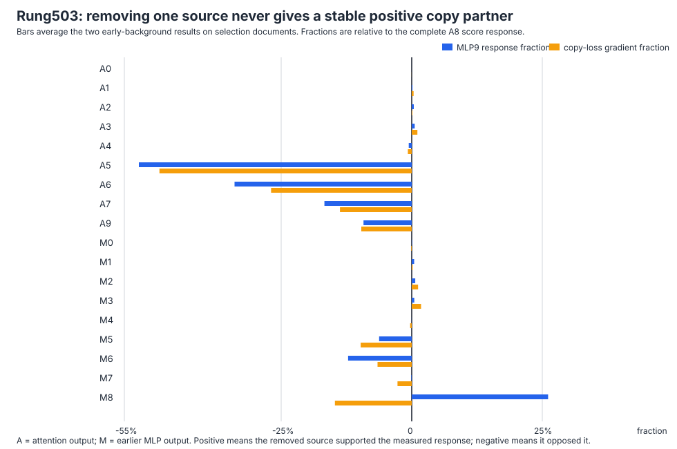

# Research update — 2026-09-02 19:44 UTC

## Goal

We are trying to replace the 546-million-parameter bilin18 model with a smaller transparent tensor program whose
parts are actual computations rather than convenient coordinate axes. A successful circuit description must say
what information is read, what operation is performed, what is written, and which later computations use it. It must
predict held-out and out-of-distribution behavior, remain understandable when circuits are combined, and support
targeted removal or editing without damaging unrelated behavior. Storage and compute matter for eventual adoption,
but low rank, quantization, or low reconstruction error do not by themselves identify a circuit.

## What rung503 computed

The known copy circuit changes the score pattern produced by attention layer 8. MLP9 is a useful downstream reader:
it responds similarly when the layer-5 copy score is substituted, but not when only the layer-5 payload is substituted.
Immediately before MLP9, the residual stream contains the outputs of earlier attention and MLP blocks. Rung503 asked
whether any one of 18 explicit sources is a necessary positive partner for MLP9's response to the attention8 score
change.

For source `t`, it captured the exact BF16 residual `x` entering MLP9, subtracted that source's raw contribution, and
ran the model's real RMS normalization and BF16 MLP9:

`x_without_t = BF16(float32(x) - source_t)`

`write_without_t = MLP9(RMSNorm(x_without_t))`.

For each early-background condition, let `Delta` be the ordinary MLP9 difference between the recipient-absent and
score-replaced runs. Let `Delta_without_t` be the same difference after source `t` is removed from both runs. The
finite contribution of source `t` is

`J_t = Delta - Delta_without_t`.

This is a real finite edit, not a derivative and not an allocation of a normalized vector. The **response fraction**
is the projection `<J_t, Delta> / ||Delta||²`: 100% would mean that removing the source removes the complete MLP9
response in its original direction. The **copy-loss gradient fraction** is `<gradient_of_copy_loss, J_t> /
<gradient_of_copy_loss, Delta>`: it checks whether the same finite change points in the direction that matters for
copy behavior. The gradient is only a local prioritization measurement; it cannot establish a circuit by itself.

Selection used documents 0–247, split into two fixed halves, under both early-present and early-absent backgrounds.
A source had to have at least a 1% response fraction and a 1% copy-gradient fraction, reject the payload control, and
keep positive signs in every half and background. Every passing source would be retained; there was no top-k choice.

## Result: valid experiment, empty singleton set

The instrument passed. It executed exactly 496 full-model forwards, 6,696 local MLP9 evaluations, and 124 backward
passes. The named raw sources reconstructed the captured state to the registered BF16 tolerance; every edited BF16
input changed; calls matched exactly; and the parent MLP9 score-response cosine was 83.0–83.6%, within 0.05 percentage
points of rung501.

No source passed the full selection rule. Therefore A is true, B is false, and confirmation, downstream-circuit
tests, and documents 500–999 remained unopened as required. C–E are false by gating, not by looking at those outcomes.

This is not a “nothing happened” result. The local response is strongly cancellation-structured:

- Removing A5 accounts for about **−52%** of the response and **−48%** of the copy-gradient effect.
- A6, A7, A9, M5, and M6 are also consistently negative. Their presence opposes or regulates the final response under
  this intervention rather than supporting it as a positive standalone partner.
- Removing M8 accounts for **+25–27%** of the response, but its copy-gradient fraction is negative or unstable
  (**−28%** and **−2%** across backgrounds). It changes MLP9 in roughly the response direction but not in a stable
  direction that helps the measured copy computation.
- Small positive candidates such as A3, M2, and M3 do not reach the 1% response threshold in both backgrounds.

Thus the attention8-driven MLP9 response cannot be described as “attention8 plus one positive necessary source” at
this grain. Several large terms cancel one another, and response alignment alone would have incorrectly selected M8.
This directly supports the user's concern about interaction effects: a single-component causal measurement can mix a
component's role with the state of all other components.

## What this does and does not establish

Rung503 is a valid finite local screen and a scientific strong null for singleton partners. It does not show that the
earlier sources are irrelevant. Negative finite effects can arise when one source counterbalances another, and two
sources can have a joint effect that neither has alone. It also does not identify a circuit, compress MLP9, or permit
removing any module from the deployed model.

This result sharpens the connection to the sign-gauge result from the parallel lane. The upstream copy-score pattern
appears to be one operation shared across several attention heads up to a sign flip, but the downstream MLP9 response
to that operation is produced in a cancellation-heavy context. A useful compiled unit therefore needs both parts:
the sign-aware score operation and the later interaction that converts it into the copy-selective write.

## Next experiment: finite two-source interactions

Rung504 is now claimed and being preregistered. It will remove every unordered pair among the same 18 sources, using
the same exact BF16 computation. For sources `s,t`, define the simultaneous removal effect `J_st` and the finite mixed
difference

`K_st = J_st - J_s - J_t`.

`K_st` is the part of the score response that appears only when the two removals are considered together. It is zero
for a purely additive local response and nonzero when RMS normalization plus MLP9 makes the sources interact. The new
screen will require a pair to improve both the MLP9 response and the copy-loss direction, have a material positive
mixed term, reject payload controls, and reproduce as the same complete pair set on fresh document halves before any
downstream validation opens. This can expose a genuine two-source interaction that the singleton screen necessarily
misses. If no pair survives, the evidence will favor changing the observation or using the explicitly float32
explanatory tensor rather than trying larger post-hoc subsets.

The key distinction is that this is not rank reduction. It tries to split MLP9 into a causally testable interaction
that can later be removed through layers 10–17 and checked for selective copy behavior—the circuit criteria we care
about.
