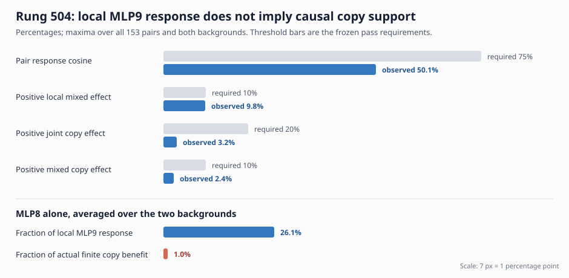

# Research update — 2026-09-02 20:24 UTC

## Goal

We are trying to replace the 546-million-parameter bilin18 model with a smaller, transparent tensor program. Its
parts should correspond to reusable computations rather than convenient low-rank coordinates. A useful circuit must
say what information is read, what operation combines it, what is written, and what later computations use it. It
must predict held-out and out-of-distribution examples, work when combined with other extracted parts, and permit a
targeted removal or edit without damaging unrelated computations. Storage and compute matter for eventual adoption,
but quantization, rank reduction, and reconstruction error do not by themselves meet these goals.

## What rung 504 actually computed

Rung 503 showed that removing MLP8's output from the input to MLP9 removes about 25--27% of MLP9's response to the
known equality-score replacement. That was only a local write-space result, and its loss gradient had the opposite
sign. Rung 504 replaced the gradient approximation with an exact finite causal calculation for every pair among 18
earlier attention and MLP outputs.

For a source set `S`, the experiment took the exact BF16 vector `x` immediately before MLP9 and subtracted the raw
contributions in `S`:

`x_without_S = BF16(float32(x) - sum(source_s for s in S))`.

It then reran the model's real RMS normalization, MLP9, and every later block through layer 17. “BF16” is simply the
16-bit numerical format used by the deployed model; it is retained here so the intervention tests the model that
actually runs, not a cleaner mathematical approximation.

Let `Delta` be MLP9's ordinary response to replacing the attention8 equality score, and let `Delta_without_S` be the
response after removing `S`. The local contribution is

`J_S = Delta - Delta_without_S`.

Let `d` be the score replacement's reduction in copy-token cross-entropy, and `d_without_S` the reduction after the
same source removal. The actual finite copy contribution is

`C_S = d - d_without_S`.

For a pair `{s,t}`, the terms that cannot be explained by adding the two singleton effects are

`K_st = J_{s,t} - J_s - J_t` for the MLP9 write, and

`Q_st = C_{s,t} - C_s - C_t` for copy loss.

These are inclusion--exclusion differences: zero means the two removals combine additively, while a nonzero value
measures their interaction. This directly addresses the multiple-mediators problem at the chosen intervention
boundary.

The search included every one of the 153 unordered pairs. A pair had to carry at least 20% of both the local response
and the finite copy benefit, have at least 10% genuinely mixed effects in both measurements, reject the payload
control, and keep the required positive signs in both document halves and both earlier-service backgrounds. Every
passing pair would be retained; there was no top-k selection.

## Result: the finite instrument passed, but no pair is a causal copy component

The experiment ran exactly 496 full forwards and 63,984 MLP9-plus-suffix evaluations, with no backward passes. The
zero-removal control reproduced the MLP9 write and every per-token loss exactly. All action and source edits were
nonzero, the old MLP9 response reproduced, and every registered call count matched.

No pair passed. This is not a marginal threshold failure:

- MLP8-containing pairs carry 25.4--27.5% of the local MLP9 response, but their best response cosine is only about
  50%, below the required 75%. Most of that apparent pair response is simply the MLP8 singleton appearing in every
  pair that contains it.
- The largest positive local interaction is attention5 plus MLP8: 8.8% and 9.8% in the two backgrounds, just below
  the 10% floor. But the same pair carries **negative** fractions of the actual copy benefit, -21.8% and -11.9%.
  It is therefore not a favorable near-miss.
- Across all pairs, the largest positive joint copy effect is only 3.2% and 2.2% across backgrounds, versus the 20%
  requirement. The largest positive mixed copy effect is only 2.4% and 2.3%, versus 10%.
- No pair keeps all required positive signs in both document halves and both backgrounds.

The complete pair table also determines each singleton's finite loss effect without another model run. Because

`C_{s,t} - Q_st = C_s + C_t`,

all singleton values can be recovered by solving this complete set of pair-sum equations. The reconstruction closes
within `2.18e-7` accumulated nat. MLP8 carries only **0.64% and 1.41%** of the actual finite copy benefit in the two
backgrounds, despite carrying 25.4% and 26.8% of the local MLP9 response. Attention7 is instead strongly
antagonistic at about -20.3% in both backgrounds; attention5 is -14.6% and -8.8%.

The conclusion is precise: MLP9 is a calibrated reader of the equality-score replacement, but its response is not a
standalone causal mediator of copy behavior at the one- or two-source-removal grain. A large change in a later write
does not imply a correspondingly large behavioral contribution.

## Why the next step is not triples, rank reduction, or quantization

Trying triples would search 816 combinations after singleton and pair effects already failed by large causal
margins. It would invite a post-hoc subset hunt without a positive reason to expect that MLP9 is the correct causal
boundary. Rank reduction or quantization would only store the same failed local response more compactly; neither
would identify a reusable computation or improve selective intervention. A float32 rerun could clarify whether a
local write attribution is sensitive to numerical rounding, but it cannot turn the observed 1--3% finite copy effects
into the registered 10--20% causal effects in the deployed model.

## The older result that prevents duplicated work

The MLP dossier shows that we already tested the larger downstream object in rungs 465--466. On code data:

- `{MLP8, MLP9, MLP12}` formed a task-shaped correction group;
- `{attention14, MLP17}` formed a distinct broad-suppression group; and
- the finite interaction between those two groups was as large as either marginal contribution and reproduced under
  the native and transplanted equality scores.

That is why another search for a single MLP9 mediator would move backward. The missing evidence is whether this fixed
three-part downstream program survives a change of corpus and a change among the newly validated score
implementations.

## Next experiment

The next rung will keep the five sites and the two groups fixed before looking at new outcomes. On natural text it
will supply the same copy-score computation using the native layer8 score, the known layer5 donor, and the two
newly validated sign-flipped donors. For each supplied score it will replace the task-shaped group, the suppressor
group, or both with their score-absent writes and recompute the rest of the model.

The decisive question is whether the three causal vectors—task-shaped contribution, broad suppression, and their
finite interaction—remain similar across all score implementations and fixed document halves. A pass would show
that downstream computation treats the sign-gauged scores as one reusable variable across module boundaries. A
failure would sharply separate two possibilities: the score itself is interchangeable, but its downstream
realization depends on which head supplied it; or the old five-site program was specific to code data. Either answer
changes the circuit description. The experiment does not select a rank, refit a basis, or assume that native heads
and MLPs are semantic units.
