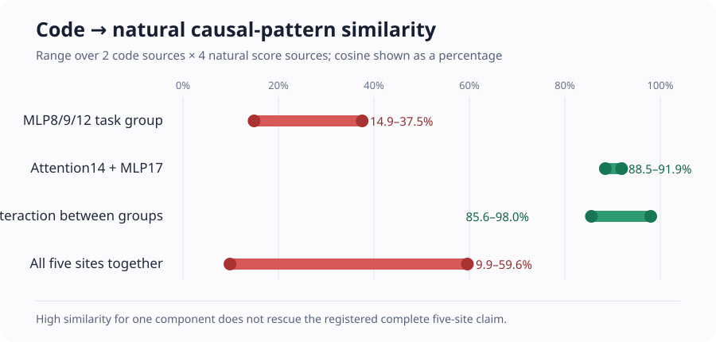
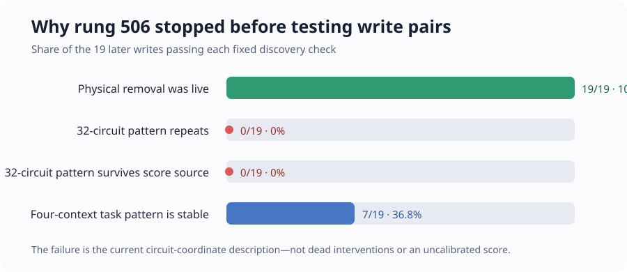

# Rung 505 result and the new downstream-causal grouping experiment

**Updated:** 2026-09-02 21:16 UTC

## Goal

We are trying to replace the native model with a smaller understandable program whose parts have computational
meaning. A proposed circuit part should eventually satisfy all of the following:

1. say what information it reads, what operation it performs, and what it writes;
2. merge pieces from different heads or MLPs when downstream computation treats them as the same variable, while
   splitting a native head or MLP when its pieces do different jobs;
3. predict activations and causal effects on held-out and out-of-distribution examples;
4. reproduce its target computation when extracted;
5. change the intended behavior when removed or edited without broadly damaging unrelated behavior; and
6. combine predictably with other circuit parts.

Fewer parameters, lower rank, quantization, and low reconstruction error do not establish these properties. They are
relevant only after we have identified a computation or as matched-capacity controls.

## What rung 505 actually tested

Earlier code examples suggested a five-site downstream program for the equality-copying score:

- a task-dependent group `T = {MLP8, MLP9, MLP12}`;
- a broadly suppressing group `G = {attention14, MLP17}`; and
- a finite interaction between those groups.

Rung 505 asked whether that exact grouping also describes natural text and whether it is unchanged when four
different attention heads supply the same equality score. No sites were chosen from the new results.

For score source `a`, site subset `S`, and a context such as “near copy,” define

`v_a(S) = copy benefit with every site intact - copy benefit after replacing sites S by score-absent writes`.

Equivalently, this is the mean cross-entropy increase caused by removing `S`. Positive means those sites helped the
copy prediction. Every removal is a real forward pass: after a write is replaced, all later layers recompute.

The run evaluated all `2^5 = 32` subsets under four correctly oriented score sources:

- native L8H4;
- L5H5 supplied to L8H4;
- L7H3 supplied with its sign reversed; and
- L8H3 supplied with its sign reversed.

It also removed all 19 later writes as a total-effect control and ran the two unreversed score replacements as
wrong-sign controls. The exact cost was 17,875 full-model forwards, 52,000 write replacements, 2,375 write captures,
and no backward passes.

## Result: the score is reusable, but the old downstream grouping is not

The intervention machinery passed exactly. Native replay had zero logit error, the attention-factor reconstruction
error was `4.79 × 10^-14`, and every score and write edit was live.

The four correctly oriented score sources still perform the same upstream job. Relative recovery was `89.9–113.9%`,
their per-document copy-effect cosine was `90.6–95.4%`, and unrelated-token loss changed by less than `.001` nat.
The wrong-sign replacements were anti-aligned. Correct versus wrong orientation differed by at least `1.508` cosine
units, so the sign is causally meaningful downstream.

The five-site program failed its cross-corpus test. The old code result required the MLP8/9/12 group to have the
signs

`near negative, far positive, one previous match positive, multiple previous matches negative`.

On natural text, every entry was positive for every score source:

| Score source | Near | Far | One previous | Multiple previous |
|---|---:|---:|---:|---:|
| Native L8H4 | +.00478 | +.00597 | +.00860 | +.00332 |
| L5H5 replacement | +.00658 | +.00640 | +.00957 | +.00394 |
| Sign-corrected L7H3 | +.00497 | +.00518 | +.00729 | +.00339 |
| Sign-corrected L8H3 | +.00481 | +.00376 | +.00589 | +.00253 |

These numbers are cross-entropy effects in nats, not percentages. Both the near and multiple-match signs reversed
relative to code, in both document halves. The task-group magnitudes also missed the registered floor. Therefore this
is not merely the same program operating at lower strength; the task-dependent causal pattern changed.

The graph reports cosine similarity as a percentage. `100%` means two four-context causal-effect vectors point in
the same direction; `0%` means their directions are unrelated. Across all two code sources and four natural sources,
the MLP8/9/12 task group is only `14.9–37.5%` similar and all five sites together are `9.9–59.6%` similar. The
attention14/MLP17 suppressor component (`88.5–91.9%`) and the interaction (`85.6–98.0%`) are much more stable.
Those are useful clues, but they were inspected after the registered complete-program failure and cannot rescue it.

The formal score was:

- exact intervention: pass;
- score calibration: pass;
- code program transfers to natural text: fail;
- complete program invariant across score implementations: fail;
- correct score sign matters downstream: pass.

The registered response is therefore to abandon the code-selected five-site set as one cross-corpus circuit. We are
not lowering the thresholds or relabeling the failure.

## Rung 506: define units by what downstream computations do with them

Rung 506 changes the object. It considers all 19 attention and MLP writes after the equality score, rather than
assuming the old five sites or any native module grouping is correct.

For write `s`, score source `a`, and known downstream circuit `j`, it computes

`F_a(s)[j] = removal effect on circuit-j examples - removal effect on matched control examples`.

This is a vector of causal effects, not an activation vector. Two writes are proposed as the same downstream variable
only when their vectors agree under all four score sources and on separate document sets. The experiment retains
every pair that clears the fixed conditions; it never takes the best few pairs. Zero pairs means no shared variable
at the whole-write level. More than eight means the 62 downstream measurements are too coarse to identify a small
set, not permission to choose eight.

The data separation is:

- 32 fixed circuit families on documents `0:248` for discovery;
- the same families on documents `248:496` for confirmation; and
- 30 different circuit families on documents `500:1000` for held-out validation.

For a pair of writes `s,t`, the run also performs the real joint removal and computes

`interaction(s,t) = joint effect - effect(s) - effect(t)`.

This directly measures the multi-component interaction that ordinary one-component activation patching mixes into
its effect estimate. A pair must follow one simple rule chosen on discovery—additive, redundant, or a one-number
interaction correction—and that rule must predict both confirmation and held-out validation. Its copy-task effect
must also be at least `.002` nat and at least three times its off-target effect.

This tests four things we care about at once: grouping across modules, prediction on held-out circuits, predictable
composition, and selective causal removal. It does not yet split the inside of a head or MLP. If no whole-write pair
survives, the next experiment will decompose fixed writes into exact attention query/key/value terms or bilinear
input-pair terms and apply the same downstream-effect test there.

The cost depends on how many discovery pairs survive:

`20,729 + 496 × discovery pairs + 500 × confirmed pairs` full forwards,

with a maximum of 28,697, no backward passes, and no deployed parameters added or removed.

## Rung 506 result: the present 32-circuit coordinates fail before pair selection

The run landed after 5,146 full forwards because the registered discovery selector found zero eligible sites and
therefore correctly opened no pair, confirmation, or validation outcomes. This is a lawful strong null:

- the intervention passed, with exact call counts, zero replay-logit error, and factor error `5.09 × 10^-14`;
- all four score sources recalibrated on the new documents: recovery `88.5–112.4%`, per-document cosine
  `92.3–95.4%`, and off-target change at most `.00147` nat;
- every one of the 19 site removals was physically live;
- zero sites passed the repeatability requirement in the 32-circuit member-minus-control coordinates; and
- zero sites passed source invariance in those coordinates, so there was no lawful pair comparison.

The distinction in the graph matters. This is not evidence that the 19 writes are causally inactive. Their circuit-
fingerprint root-mean-square effects were `.0025–.0089` nat, and their physical write changes were large. Instead, the
direction across the 32 named circuit categories changed between document halves and between otherwise equivalent
score sources.

A hash-pinned CPU audit used only the already saved sufficient statistics to compare this with the simpler task
description. Seven MLP writes—MLP8, MLP9, MLP10, MLP14, MLP15, MLP16, and MLP17—have stable four-context task
effects under the same repeat and source tests. Descriptively, they form an early cluster `{MLP8, MLP9, MLP10}` and a
late cluster `{MLP14, MLP15, MLP16, MLP17}`. These are clues, not rescored rung-506 edges: the registered circuit-
fingerprint test still failed.

## The active successor: exact bilinear terms inside MLP10

The frozen zero-edge route says to stop treating a complete write as the basic unit and split a task-stable write
internally. MLP10 is a particularly useful case because its task pattern is stable across both document repeats and
all four score sources, and because its bilinear computation can be expanded exactly.

Its normalized 1,152-dimensional input is the coefficient-correct sum of 22 named earlier sources: the embedding,
attention writes A0 through A10, and MLP writes M0 through M9. The Left and Right maps each produce 4,608 numbers,
which are multiplied coordinate by coordinate and projected back to 1,152 dimensions. Expanding the two input sums
gives exactly `22×23/2 = 253` unordered named source-pair terms, plus an explicitly measured floating-point
remainder.

Rung 507 is now preregistered. It will use gradients only to screen all 253 terms without ranking, then physically
remove every passing term on new documents. If at least two terms survive, it will remove every pair jointly and
measure

`joint finite effect - first singleton effect - second singleton effect`.

That is the multiple-mediator interaction ordinary one-component patching does not separate. A simple interaction
rule learned on confirmation must predict validation. The report will distinguish two questions:

- different named inputs that produce the same downstream effect; and
- terms sharing one input source but composing that source with different partners.

No gradient-only term will be called a circuit, and no rank, top-k selection, quantization, or hidden-unit basis is
used.
