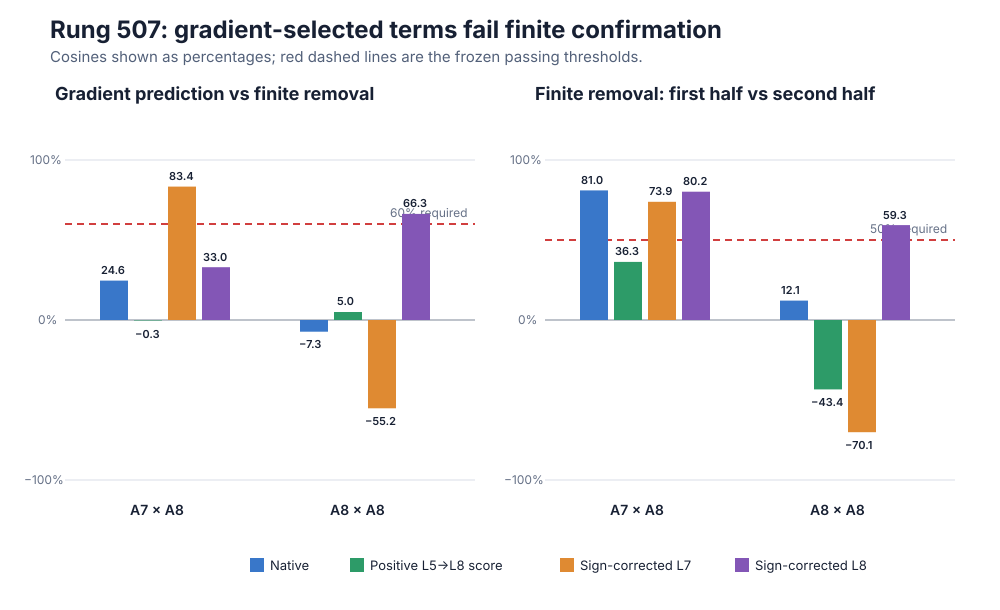

# Exact MLP10 interaction terms: the gradient shortlist fails the causal test

**Updated:** 2026-09-02 21:39 UTC

## Goal

We want a smaller executable account of the model whose parts say what information is read, what operation combines
it, what is written, and what later computations use it. The parts should generalize to held-out and shifted data,
support selective removal or editing, and combine predictably. They may split one native MLP or merge pieces across
native modules. Lower rank, fewer stored numbers, quantization, or low reconstruction error do not establish these
properties by themselves.

## What rung 507 computed

The 1,152-dimensional normalized input to MLP10 was reconstructed as the exact coefficient-correct sum of 22 named
earlier sources:

`embedding E + attention outputs A0...A10 + MLP outputs M0...M9 + measured numerical remainder`.

MLP10 applies a Left linear map and a Right linear map, producing two 4,608-dimensional vectors. It multiplies them
coordinate by coordinate and projects the product back to 1,152 dimensions:

`MLP10(z) = Down[(Left z) * (Right z)] + bias`.

Expanding both input sums gives `22×23/2 = 253` unordered source-pair terms. For different sources `s,t`, the term is

`Down[(Left z_s)*(Right z_t) + (Left z_t)*(Right z_s)]`.

For example, `A7×A8` is the part of MLP10 created when the attention7 contribution enters one branch and attention8
enters the other, including both branch orders. It is not an attention head or a low-rank approximation; it is an
exact additive part of this bilinear MLP computation.

For each of four equivalent implementations of the equality-copy score, the experiment compared each term with the
same term when that score was absent. Removing a term meant subtracting that score-dependent term from the real MLP10
write and then recomputing layers11 through17. The measured value was the resulting change in cross-entropy loss for
near-copy, far-copy, one-previous-match, and multiple-previous-match tokens.

## Numerical correction caught before the scientific run

The first managed smoke test passed the source algebra but failed one BF16 check. The 253 terms plus the explicit
input numerical remainder reconstructed the independent float32 MLP10 score change to relative squared error
`1.71×10^-16`. Each float32 MLP10 write was also close to its deployed BF16 write (`1.12×10^-5`). However, subtracting
two separately rounded and very similar BF16 writes amplified the rounding difference to `1.63%` of the small score
change.

That failed number remains recorded. Before any task result was opened, a separate instrument amendment added the
exact output-rounding remainder

`rho = deployed BF16 write, converted to float32 - independently recomputed float32 write`.

This repaired the deployed score-change identity to `1.05×10^-16`. The remainder was excluded from all 253 named
terms, selection, removals, and interaction fits. It only accounts for what the deployed numerical computation
actually wrote. The repaired smoke then passed exact native replay, all253 finite gradient contractions, and live
singleton and joint removals.

## Result: two terms pass the gradient screen, neither passes finite confirmation

The full run used 1,178 forward passes and 1,240 backward calls. The algebra and intervention checks passed. The four
score sources also recalibrated: they recovered `89.6–108.7%` of the native all-copy effect, had `92.4–94.2%`
per-document cosine with native, and changed off-target loss by at most `.00139` nat.

The no-ranking gradient screen retained exactly two of253 terms:

- `A7×A8`;
- `A8×A8`.

Both looked clean in the linear calculation. Their gradient task-vector norms were `.000325–.000410` nat and
`.000388–.000482` nat, respectively. Their direction was stable between discovery halves and across the four score
sources.

Neither survived the physical removal on different documents. The graph shows two required comparisons as
percentages. On the left, `100%` means the gradient prediction and actual finite removal point in the same direction.
On the right, `100%` means the finite effect repeats exactly across the two confirmation document halves. Negative
values mean the effect points partly in the opposite direction.

`A7×A8` matched its gradient above the required60% only under the sign-corrected L7 source (`83.4%`); native was
`24.6%`, the positive L5 source was `-0.3%`, and sign-corrected L8 was `33.0%`. Its finite effects repeated under
three sources but not the positive L5 source (`36.3%` versus the required50%), and its L7 direction disagreed with
native (`16.5%` cosine).

`A8×A8` was still less stable. Gradient-to-finite cosine ranged from `-55.2%` to `66.3%`; finite repeat cosine ranged
from `-70.1%` to `59.3%`. Its all-copy effect also stayed below the registered `.00025`-nat floor for every source.

Therefore the formal verdict is:

- exact and live instrument: pass;
- sparse, source-stable gradient shortlist: pass;
- at least two finite causal terms: fail;
- held-out term validation: not opened;
- two-term interaction prediction: not opened;
- strong null: yes.

This does not say attention7 or attention8 is irrelevant to MLP10. It says these two exact terms, chosen by a local
linear approximation, do not have stable finite downstream effects at this grain. The result repeats an important
older warning from MLP8/9/12: gradients can shortlist a real algebraic contribution without identifying a portable
causal circuit.

## Next experiment: exact source families, finite from the start

Rung508 is now preregistered. It removes gradients from selection and partitions the22 sources into six fixed,
architecture-defined families: embedding; attention0--4; attention5--8; attention9--10; MLP0--4; and MLP5--9. These
produce21 disjoint exact family-pair terms whose sum is still all253 named terms.

Every one of the21 terms will be physically removed on documents whose rung507 family effects were never opened.
Every passing term—not a ranked top-k—must repeat across documents and all four score sources. Passing terms will be
removed jointly, and an interaction rule learned on discovery documents must predict confirmation documents. This
tests whether the unstable exact terms become a stable computation only when grouped into a meaningful source
family. If that also fails, the registered route is a coupled Left/Right/output dictionary judged by finite causal
prediction, not a rank or reconstruction sweep.
