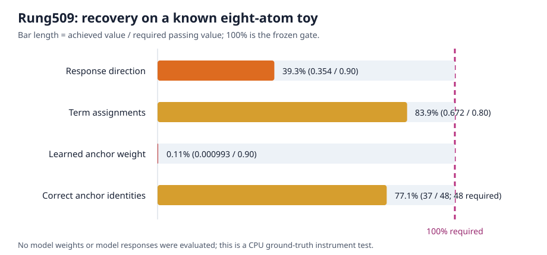

# The hidden-group fit failed before touching the model; the replacement tests downstream interchange directly

**Updated:** 2026-09-02 22:44 UTC

## Goal

The project goal is a smaller transparent tensor program whose pieces say what information is read, what operation is
performed, what is written, and which later computations use it. The pieces must predict unseen and shifted data,
work when combined, and support selective removal, substitution, or editing without damaging unrelated behavior.
Lower rank, fewer stored numbers, or lower reconstruction error does not establish any of those claims by itself.

## What rung509 was trying to do

MLP10 takes its normalized1152-dimensional input, applies two learned linear maps of size4608, multiplies their
coordinates, and maps the4608 products back to the1152-dimensional residual stream:

`output = Down(Left(input) * Right(input)) + bias`.

We can split the input exactly into22 earlier writes: the embedding, attention0--10, and MLP0--9. Expanding the
multiplication gives253 exact unordered source-pair terms. Rung509 proposed eight candidate groups. Each group had:

- a pattern over the22 sources read by `Left`;
- a pattern over the22 sources read by `Right`; and
- one34-number downstream causal response: four copy-task effects plus30 circuit-family effects.

The eight assignments divided every exact term between the groups. Crucially, reconstruction was only meant to
propose candidates; held-out finite removal and joint-removal tests would still have been required.

## Why the original fit was unsafe

Before collecting any new model response, we generated data from eight known groups and asked the fitting procedure
to recover them. All six fits agreed strongly with one another—minimum response cosine`.990` and assignment
cosine`.99996`—yet only two of the eight recovered response vectors matched the eight vectors used to generate the
data. Stable training had recovered a repeatable convention, not the ground truth.

This matters because gauge freedom is not only a theoretical concern here. If multiple hidden coordinate systems
produce the same predictions, agreement between restarts cannot tell us which system corresponds to a real circuit.

## The convex-hull repair and its result

The repair used the principled part of an archetypal sparse autoencoder: instead of allowing an arbitrary response
vector, each candidate response had to be a convex combination of observed response rows. A convex combination uses
nonnegative weights that sum to one. We additionally required one distinct observed row to carry at least90% of each
candidate. This makes a proposed variable point to a concrete measured intervention rather than float freely in
response space.

We then constructed an especially favorable exact toy:

- eight factorized Left/Right groups;
- eight distinct observed anchor rows;
- each anchor row was99.7657% assigned to its intended group; and
- the true response directions were mutually orthogonal, so they were easy to distinguish geometrically.

Six independently seeded2,000-step fits still failed the frozen recovery gate:

- worst response cosine: `.3536`, required at least`.90`;
- worst assignment cosine: `.6715`, required at least`.80`;
- smallest largest-anchor weight: `.000993`, required at least`.90`; and
- correct matched anchor identities: `37/48`, required`48/48`.

The graph expresses each result as a percentage of its required value. For anchor identities,100% means all eight
atoms in all six fits. The anchor-weight bar is nearly invisible because the worst fitted atom placed only about0.1%
of its weight on any one observation, versus the required90%.

This is an **instrument failure**, not a result about MLP10. The checkpoint was never loaded, model forward passes
were zero, and the intended rung509 model result and tensor bundle do not exist. The source now refuses model
execution when this test fails. Per the prewritten rule, we will not rescue it by selecting a favorable seed, changing
the number of groups, or tuning penalties.

## What rung510 does differently

Rung510 removes the hidden dictionary. Its objects are the directly measured interventions

`node = (one of four equality-score implementations, one of253 exact MLP10 terms)`.

There are1,012 such nodes. Two nodes become candidates for the same downstream variable only if a single scale
learned on one document half predicts their relative finite effects on the other half. The computation is ordinary
least squares on their32 discovery-circuit response vectors:

`beta = dot(response_v, response_u) / dot(response_v, response_v)`.

The frozen `beta` must predict both circuit effects and the four task effects. Every passing pair is kept; no nearest
neighbor or top-k selection is allowed. Zero pairs is a valid null, and more than16 is also non-identifying rather
than permission to keep the best16.

Next, the same node pair and scale must predict:

1. documents752:1000, which were not used to propose the pair; and
2. the other30 circuit families, which were also not used in discovery.

This uses all62 circuit families:32 for discovery and30 for confirmation.

Finally, similarity of loss-effect vectors is not enough. For nodes `u=(action a, term p)` and
`v=(action b, term q)`, we compute their exact MLP10 output changes. In the actual `a` model background we replace
the removal of `p` with the scaled output change from `q` under background `b`; then we perform the reverse
substitution. Layers11--17 are run normally after both edits. A pair is equivalent only if both physical
substitutions reproduce the held-out task and circuit effects of the native removals.

That is the interaction-determined basis in operational form: two internal pieces count as one variable only when
the downstream model actually treats their changes as interchangeable. Different source pairs can be merged, native
MLP boundaries are not privileged, and a failed swap tells us to find the first later consumer that distinguishes
them. The maximum cost is128,588 forward passes and zero backward passes, but the run stops at63,116 or126,232 if an
earlier gate fails.

## Current status

Rung510 is preregistered, its all-pairs detector and physical-substitution collector are implemented, and15 focused
tests plus the repository fast suite, static gate, preflight, syntax check, input hashes, all62 circuit partitions,
and no-model dry runs pass. The next action is the managed no-outcome CUDA smoke. Only a complete smoke pass may open
the frozen science run.
