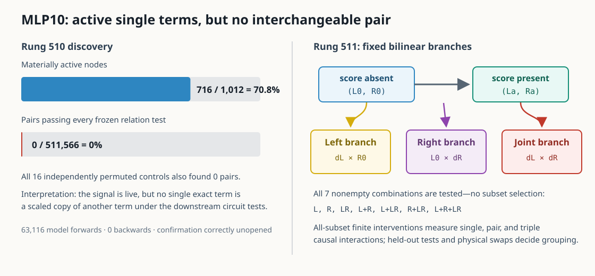

# MLP10 interaction update — 2026-09-02 23:26 UTC

## Goal

The project goal is still to replace the model with a smaller transparent tensor program whose pieces predict new
and out-of-distribution text, compose when installed together, and can be removed, swapped, or edited without
damaging unrelated computations. For circuit interpretation specifically, we want to identify what information a
piece reads, what operation it performs, what it writes, and which later computations use it. A native attention head
or MLP is only a starting boundary; pieces may need to be split within a module or grouped across modules.

This update concerns MLP10. It does not claim parameter compression. It asks which parts of MLP10 are the same causal
variable according to the rest of the model.

## What rung 510 actually computed

The normalized input to MLP10 has1,152 numbers. MLP10 maps it to4,608 left factors and4,608 right factors, multiplies
matching factors, and maps the4,608 products back to a1,152-number residual-stream write.

We can express the MLP10 input as22 earlier writes: the embedding, attention outputs0--10, and MLP outputs0--9. By
expanding the bilinear multiplication, MLP10's output becomes253 exact unordered source-pair terms. Examples are
`embedding × attention0`, `attention7 × attention8`, and `MLP9 × MLP9`.

The model also has four already-calibrated ways to supply the same equality-related attention score:

- `N`: the native L8H4 score;
- `P`: the L5H5 score supplied to L8H4;
- `Z7`: the correctly sign-adjusted L7H3 score; and
- `Z8`: the correctly sign-adjusted L8H3 score.

For each of those four score implementations and each of253 exact terms, rung510 removed that term's score-induced
change from MLP10 and recomputed the real layers11--17. That gives `4 × 253 = 1,012` observed intervention nodes.

Each node was represented by its finite change in cross-entropy loss on four copy-task conditions and32 known circuit
families. A circuit coordinate is the removal effect on that circuit's member tokens minus the effect on matched
control tokens. This subtraction asks whether an intervention preferentially changes the circuit, rather than merely
making common tokens harder.

For every unordered pair of nodes—511,566 pairs—we fit one signed scale on the first document half. A pair passed only
if that one scale predicted both task and circuit effects in the second half, in both directions. The script retained
every passer; it did not choose the best pair. One to16 passers would have opened new documents, the other30 circuit
families, and then a physical swap of the exact MLP10 output changes.

## Result: a clean pairwise null

The measurement worked, but no pair passed.

- Instrument A passed. Native replay was exact; all62 direct and63,054 analytical calls occurred; all62,744 term
  patches were applied; factor reconstruction error was`4.69e-14`; the253-term partition error was`4.79e-14`; and
  the final deployed score-change closure error was`4.80e-16`.
- 716 of1,012 nodes—70.8%—were materially active. The null is therefore not caused by every individual term being
  too small.
- 0 of511,566 pairs passed every frozen relation test.
- All16 independently permuted circuit-coordinate controls also returned0 pairs. The detector was strict for both
  chance data and the real model.
- The run stopped at the registered boundary after63,116 model forwards and0 backwards. The30 held-out circuit
  families, confirmation outcomes, and physical substitutions stayed unopened.

The narrow conclusion is important: at this scale, no single exact MLP10 term is a scaled copy of another term under
the downstream task and circuit measurements. This does **not** mean MLP10 has no structure. A meaningful variable
may be a signed sum of many exact terms, or different later consumers may distinguish terms differently.

## Why the next decomposition is different

Rung511 follows the registered signed-sum route, but it does not fit another sparse dictionary. Its three basic parts
come directly from the bilinear equation.

Let `z0` be MLP10's input when the equality score is absent and `za` its input when one of the four score
implementations is present. Define

`L0 = Left(z0)`, `R0 = Right(z0)`, `La = Left(za)`, and `Ra = Right(za)`.

Ignoring the common output bias, the score-induced MLP10 change is

`Down[La*Ra - L0*R0]`.

Algebraically this is exactly

`Down[(La-L0)*R0] + Down[L0*(Ra-R0)] + Down[(La-L0)*(Ra-R0)]`.

In ordinary words:

- `L`: what changes because the left input changes while the right input is held at its score-absent value;
- `R`: what changes because the right input changes while the left input is held fixed; and
- `LR`: the extra effect that appears only when both sides change together.

The implementation evaluates the four corners of the actual BF16 MLP—`(L0,R0)`, `(La,R0)`, `(L0,Ra)`, and
`(La,Ra)`—so the three deployed branch vectors sum back to the real MLP10 write change. It separately reports how
much BF16 arithmetic differs from the ideal float32 identity; floating-point rounding is an error audit, not the
proposed interpretation.

## How rung 511 measures causal interactions

There are only seven nonempty combinations of the three branches:

`L`, `R`, `LR`, `L+R`, `L+LR`, `R+LR`, and `L+R+LR`.

All seven are fixed in advance and all are physically removed. From those all-subset interventions, we calculate the
finite interaction. For two branches, for example,

`interaction(L,R) = effect(remove L and R) - effect(remove L) - effect(remove R)`.

This is the part that single-component activation patching assigns ambiguously because each branch's effect depends
on the state of the other branch. With three branches, the same inclusion-exclusion calculation also gives the
three-way interaction that cannot be explained by any singleton or pair.

For each fixed branch combination, rung511 tests all six pairs of score implementations: `7 × 6 = 42` relations.
It uses the same32 discovery circuit families, then freezes every action, subset, and scale before opening the other30
circuit families and new documents. Every held-out passer is physically substituted in both directions through the
real layers11--17.

A two-branch combination counts as an interpretable distributed computation only if:

1. it predicts held-out circuit and task effects;
2. the exact output combination can be substituted across score implementations;
3. its joint causal effect is either approximately additive or has a repeatable interaction term; and
4. removing it changes copy behavior at least three times more than unrelated positions.

The complete `L+R+LR` combination is a necessary whole-change control, but it cannot by itself establish that MLP10
has been meaningfully split.

## Current state

Rung510's result and13.2MB sufficient-statistics bundle are complete and hash-checked. The MLP10 dossier has also
been consolidated so the known MLP11 question-mark reader and earlier MLP10 results are checked before new work.

Rung511 is preregistered. Its implementation, six CPU tests, no-model dry run, static gate, and preflight audit pass.
The next step is a managed one-batch GPU smoke test covering all28 action/subset removals and both directions of one
physical branch substitution. If that exactness test passes, the frozen science run costs2,108 forwards at the first
stopping point and at most9,796 forwards if all42 relations reach physical substitution.

The most important possible outcomes are:

- a stable two-branch combination would be the first causal MLP10 unit that is distributed across exact terms and
  portable across upstream implementations of the same equality score;
- singleton-only portability would be useful but would not establish a distributed decomposition; or
- zero stable branch combinations would redirect us to consumer-specific measurements, starting with the already
  known MLP11 question-form interface rather than another global rank or dictionary search.
