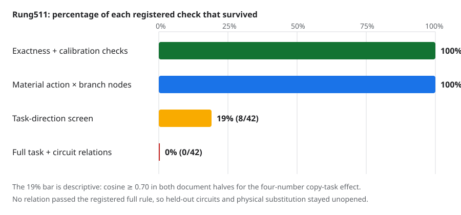

# Update at 2026-09-02 23:40 UTC: exact MLP10 branches are live, but not global circuit variables

## Goal

We are trying to replace the model with a smaller transparent tensor program whose parts have computational meanings,
predict held-out and out-of-distribution behavior, combine predictably, and can be removed or edited without damaging
unrelated behaviors. A smaller rank or fewer stored numbers is not enough. Here the specific question is whether we
can split MLP10 into parts that downstream layers treat as reusable variables.

## What rung511 computed

MLP10 is bilinear. At each token it maps its1152-number input `z` to

`MLP10(z) = Down[(Left z) * (Right z)] + bias`,

where `Left z` and `Right z` each contain4,608 numbers, matching entries are multiplied, and `Down` maps the4,608
products back to a1152-number residual-stream write.

We compared a score-absent input `(L0,R0)` with each of four fixed score-present inputs `(La,Ra)`. Four actual MLP10
corner evaluations define three branches:

- `L = Down(La*R0) - Down(L0*R0)`: change entering through the Left input while Right stays absent;
- `R = Down(L0*Ra) - Down(L0*R0)`: change entering through the Right input while Left stays absent;
- `LR = [MLP10 present - MLP10 absent] - L - R`: the remaining joint Left-by-Right change.

This makes `L + R + LR` exactly equal to the deployed MLP10 write change, including the model's actual bfloat16
rounding. We physically removed each of the seven nonempty subsets (`L`, `R`, `LR`, `L+R`, `L+LR`, `R+LR`, and all
three) and recomputed layers11--17. For each subset, the six pairs among the four score implementations give42 fixed
comparisons. Nothing was ranked or selected after seeing the result.

## One failed instrument, then the valid run

The first run used the wrong loss array as the score-absent calibration baseline. It therefore made the native score
effect exactly zero by construction. That run is preserved as invalid; its branch identities were exact, but none of
its scientific comparisons is evidence. A hash-pinned addendum changed only the baseline assignment and added a smoke
test requiring the native calibration to reproduce itself exactly.

The corrected run passed the instrument:

-2,108 full model forwards,0 backwards, and53.41 seconds;
-1,736/1,736 requested branch removals and310/310 captures;
-0 native replay error and0 corner-replay error;
-relative squared error`1.35e-20` for `L+R+LR` versus the deployed total change;
-all28 action-by-subset nodes had measurable task and circuit effects.

The valid result is still a strong null. Zero of42 cross-action relations passed the registered combination of
copy-task prediction and32 known-circuit effects. All16 circuit-coordinate permutation controls also found zero.
Because discovery found no candidate, the second documents,30 different circuit families, composition tests, and
physical branch substitutions remained unopened.

The yellow bar needs a precise qualification. Eight of42 comparisons had copy-task direction cosine at least`.70`
in both document halves when considered alone. None passed the full circuit rule. This suggests that the aggregate
32-circuit readout, rather than absence of any task-level regularity, is the immediate point of failure.

## What this means

The exact `L`, `R`, and `LR` split is a correct description of how the MLP10 output changes. It is not yet an
interpretable circuit split: the same named branch does not have one proportional effect across the four score
implementations when observed through the present global circuit battery.

This result rules out a specific claim, not all structure in MLP10. A downstream layer may collapse different MLP10
vectors into the same locally meaningful quantity. Conversely, one broad branch may contain several pieces used by
different consumers. Both cases would be hidden by asking whether the whole layers11--17 suffix sees two branches as
globally interchangeable.

## Next experiment: observe real consumers

The next rung keeps the exact branch interventions fixed and changes only where their effects are measured. It will
record their finite changes at attention11 and MLP11: attention scores, value/output writes, MLP11 input, MLP11
bilinear output, and the already-established two-dimensional question-mark form. That form is a fixed semantic
readout: two input directions with eigenvalues about`+144.86` and`-73.85` contribute a quadratic scalar to the
question-mark output direction.

The test asks whether two score implementations that disagree in the global32-circuit vector nevertheless induce
the same response at a particular real consumer. Any local match must predict fresh documents and then survive a
direct consumer-level substitution. Merely finding similar activation vectors will remain a screen. This advances
within-module splitting, cross-module grouping, held-out prediction, and selective manipulation; it adds no
compression credit by itself.

Primary receipt: `mlp10_score_change_three_branch_factorial_rung511_results.json`, SHA256
`39a6afc592ceea8ed3f79d2928333eb70442ca63f5d147f61635649e57fca6d4`; sufficient-statistics bundle SHA256
`16a70cb757ba97a6bc72b1b5bf2a35eaae4b7c5538b474254cad4beabb377a6e`.
