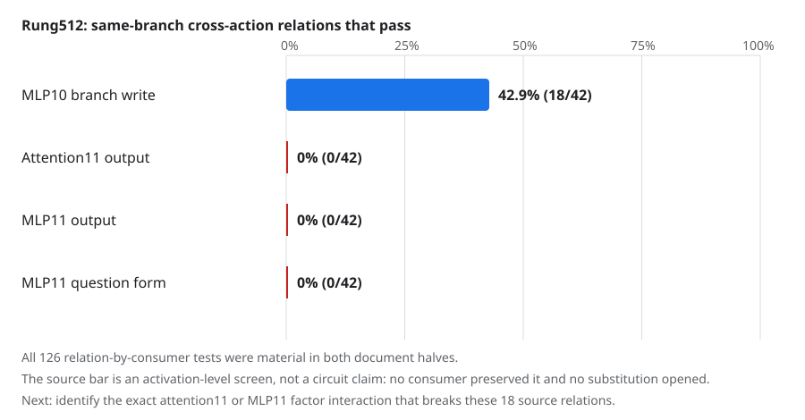

# Update at 2026-09-03 00:05 UTC: attention11 separates the apparent MLP10 branch equivalences

## Goal and motivation

We want circuit units that have a clear computation, predict held-out and out-of-distribution behavior, combine with
other units predictably, and can be removed or swapped without damaging unrelated behavior. Rank reduction or
activation similarity alone does not meet that goal.

Rung511 found no globally portable `L`, `R`, or joint MLP10 branch across four implementations of the equality score.
However,8/42 branch comparisons pointed in similar copy-task directions. Rung512 therefore kept the branches fixed
and asked a narrower causal question: does a real downstream consumer treat any two branch effects as the same
variable even though the broad32-circuit summary does not?

## The computation

For each score action and each of the seven exact MLP10 branch subsets, we ran two model states:

- the intact score action; and
- the same action with that exact MLP10 branch output removed.

For a downstream computation `g`, its finite response is

`Delta_g = g(intact) - g(branch removed)`.

We measured the complete1152-number output of attention11, the complete1152-number output of MLP11, and MLP11's
fixed question-mark quadratic scalar. We compared all six action pairs for each of seven branch subsets:42 relations
at each of three consumers,126 tests total. One scale was fit on documents500:624 and had to predict documents624:748.
All response coordinates at copy-task positions were used; no relation was ranked.

The question scalar was reconstructed from the original checkpoint weights. Its two fixed input directions have
eigenvalues`+144.86406` and`-73.84644`, matching the archived result within`0.000041`. The two discovery halves also
contained40 and57 actual question-token examples, used as a separate semantic check.

## Precision repair before science

The first one-batch smoke failed before retaining any relation outcome. It revealed that the bfloat16 execution model
had downcast the float32 weights used by the archived question form, slightly shifting its eigenvalues. It also found
that the patch verifier compared a float32 request with the installed bfloat16 value before applying the expected
rounding. A frozen addendum rebuilt the question basis from the checkpoint's stored float32 tensors and compared the
installed patch at its actual dtype. The repaired smoke passed. No science threshold, data split, or intervention
changed.

## Result

The valid run used2,108 full forwards,0 backwards, and54.10 seconds. Every exactness, calibration, call-count,
capture-count, and patch-count check passed. All126 consumer tests had measurable responses in both document halves.

The result is a clean strong null:

-18/42 branch relations are proportional at the MLP10 output itself;
-0/42 pass after attention11;
-0/42 pass after MLP11; and
-0/42 pass in the question-mark form.

This is not a threshold accident caused by dead effects. For the closest full-branch relation, native versus the
negated-layer8 implementation, attention11's cosine is`.815/.822` in the two halves but its worst directional
relative residual is`.710/.635`; the registered requirements were cosine at least`.85` and residual at most`.55`.
MLP11 is similar at`.803/.825` cosine and`.741/.637` residual. The question-form response is weaker and does not
repeat reliably on actual question-token examples.

## Interpretation

The surprising direction is important. We expected a downstream consumer might merge different MLP10 vectors into
one useful variable. Instead,18 source-level similarities exist and attention11 separates every one of them. Those18
are therefore not circuits: they are similarities in the residual write that fail as soon as the next nonlinear
computation uses them.

This explains why lowering the cosine threshold would be unhelpful. The model is using differences that a coarse
MLP10-output comparison calls small. We need to identify which interaction inside attention11 makes those differences
causally important.

## Next direction: exact interaction terms inside the consumer

Attention11 is a tensor contraction of five factors: `Q`, `K`, `Q2`, `K2`, and value. Its unnormalized attention
output is schematically

`Output = W_O[((Q K^T) * (Q2 K2^T)) V]`.

Between the branch-present and branch-removed runs, multilinearity expands this change into31 fixed nonempty
combinations of changed versus baseline factors. This is an exact interaction basis, not a learned low-rank basis.
MLP11 similarly splits into Left-only, Right-only, and joint Left-by-Right changes.

The next experiment will use the fixed18 source-equivalent pairs and test every exact factor interaction without
ranking. It asks which term breaks the apparent equivalence on the first document split, predicts that on new
documents, and then physically removes or substitutes the term. Only held-out causal success can turn one of these
algebraic pieces into a circuit unit.

Primary result SHA256:`118d28d4d3b106df6b9d20d165a955ace2bfc07ee35b07e9ea748ecb9d6d877e`;
sufficient-statistics bundle SHA256:`504b7d8e892009cfe2c88462f99db53132108adb6b13b21521b0bb3dbf350113`.
