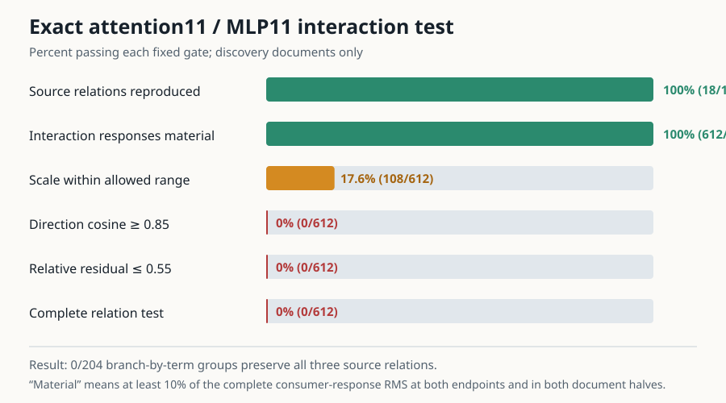

# Update at 2026-09-03 00:24 UTC: exact attention and MLP interaction terms do not supply a shared circuit variable

## The goal

We are trying to replace native head and MLP boundaries with circuit units that say what information is read, what
operation is performed, what is written, and which later computations use it. A useful unit must predict unseen data,
compose with other units, and support selective removal or substitution. Lower rank, lower reconstruction error, or a
similar activation direction is not enough.

Rung512 found18 cases where two implementations of the equality score produced proportional MLP10 branch writes,
but attention11 separated every one. Rung513 asked whether this separation came from one particular part of the exact
attention11 or MLP11 computation.

## What was computed

Attention11 computes two query-key scores and multiplies them before applying them to the value vectors:

`attention11 output = output projection[((Q K^T)/128) * ((Q2 K2^T)/128) * V]`.

Here `Q` and `Q2` are two query vectors at the current token, `K` and `K2` are the corresponding key vectors at earlier
tokens, and `V` is the value vector whose information is moved. The multiplication by `V` means summing the weighted
earlier-token values, not elementwise multiplication of all five arrays.

For each exact MLP10 branch removal, we had a branch-present and branch-removed value for each of these five factors.
We evaluated all`2^5 = 32` ways of choosing present or removed values. Inclusion-exclusion on this32-corner table then
gives31 exact nonempty interaction terms. For example, the `Q` term is the change caused by Q while all other factors
remain at their branch-removed values; the `Q,K` term is the extra joint change not explained by the Q-only and K-only
changes. Adding all31 terms exactly reconstructs the complete attention11 response, apart from measured numerical
roundoff.

MLP11 is bilinear: it computes a Left projection and a Right projection, multiplies them coordinate by coordinate,
and projects the product back to the1152-dimensional residual stream. Its four present/removed corners give three
exact terms: Left-only, Right-only, and their joint interaction.

We tested31 attention terms plus3 MLP terms for six fixed MLP10 branch subsets. For every branch-by-term pair we tested
the same three source relations: native versus zero-7, native versus zero-8, and positive-control versus zero-7. That
is`6 * 34 * 3 = 612` fixed relation tests and204 possible shared groups. There was no ranking or best-term selection.

## Instrument result

The instrument passed. The run used2,108 full-model forwards,47,616 local attention corner evaluations,5,952 local
MLP corner evaluations,0 backwards, and78.7 seconds. It reproduced all18 input source relations. Both endpoint corners
replayed the real attention output exactly. The largest attention inclusion-exclusion error was
`4.66e-19` relative squared error, and its RMS numerical remainder was only`6.83e-10` of the complete response. The
MLP three-term identity closed to`1.47e-19` relative squared error. Every one of1,736 MLP10 branch edits was nonzero.

The earlier no-outcome GPU smoke also passed. It included a new semantic calibration check: the native action recovered
exactly100% of its own copy effect, so the calibration baseline was not accidentally replaced by the native run itself.

## Scientific result

This is a valid strong null under the registered gates:

- all612 term responses were large enough to test;
-108/612, or17.6%, had a fitted scale within the allowed range;
-0/612 passed the direction-cosine requirement in both document halves;
-0/612 passed the relative-residual requirement in both halves;
-therefore0/204 branch-by-term groups preserved all three source relations.

The best individual comparison was the Q-only attention response for the full `L+R+joint` MLP10 change, native versus
zero-8. Its weaker-half cosine was`.813`, below the fixed`.85` requirement, and its worst relative residual was`.715`,
above the fixed`.55` limit. Even this was one relation, whereas a circuit candidate had to pass all three.

This failure is not caused by inactive terms. In fact, every exact term exceeded10% of the complete response RMS. That
can happen because the individual inclusion-exclusion terms are large and cancel one another. For attention11, the
median sum of the absolute signed mismatch contributions was`2.47` even though their signed sum is exactly`1.00`.
The number above one measures cancellation; it is not a percentage of model behavior.

## What the mismatch attribution says—and does not say

As a descriptive attribution, divide every higher-order term equally among the factors it contains. Across the18
source relations and both document halves, the average shares of the difference that attention11 detects are:

- Q:39.2%;
- value:23.4%;
- Q2:20.8%;
- K:11.1%;
- K2:5.5%.

For MLP11, the same equal-sharing convention assigns approximately50.0% to its Left side and50.0% to its Right side;
the pure Left-by-Right interaction accounts for only0.37% of the mismatch. These numbers say where the complete
branch equivalence is broken under one exact accounting rule. They do not identify a circuit: the Q-only response
itself failed the cross-action test, and no attribution share was physically removed or substituted.

## Interpretation

The native attention head is still not the right assumed unit, but neither is any one of its31 exact factor-interaction
terms. Attention11 distinguishes the apparently similar MLP10 writes through a distributed combination, weighted most
heavily toward the current-token query side and then the value and second-query sides. MLP11 mainly propagates the
difference through both bilinear input sides rather than creating it in its joint product.

This rules out another simple vocabulary: whole modules failed in rung512, and now every single exact internal
interaction failed in rung513. It does not rule out a small signed sum of interactions, a factor-level allocation such
as an exact Shapley split, or a nonlinear downstream readout.

## Next experiment

The registered next route is a multi-term test, not rank reduction. The next collection should retain the joint Gram
matrix between the34 exact terms so that sums of terms can be evaluated without another arbitrary coordinate system.
Two object classes deserve prospective comparison:

1. fixed factor allocations that divide every higher-order interaction among its participating factors and exactly
   sum to the consumer response; and
2. sparse signed sums of the fixed interaction terms, selected independently on two document splits and required to
   recover a planted sparse ground-truth program before any model result is accepted.

Any selected sum must then predict untouched documents and pass real term removal and bidirectional substitution on
the held-out circuits. A sparse sum that merely fits activation geometry remains a probe, not an interpreted circuit.

Result SHA256: `043dd563baa5ffe5bda57c7774dc76e4727add3b4351699cb997ecfd563179d5`.
Sufficient-statistics bundle SHA256: `06118d18594c4b167a3f3d46a2aa282969f6b061835f83a3b3d62b5ca72b8d8a`.
